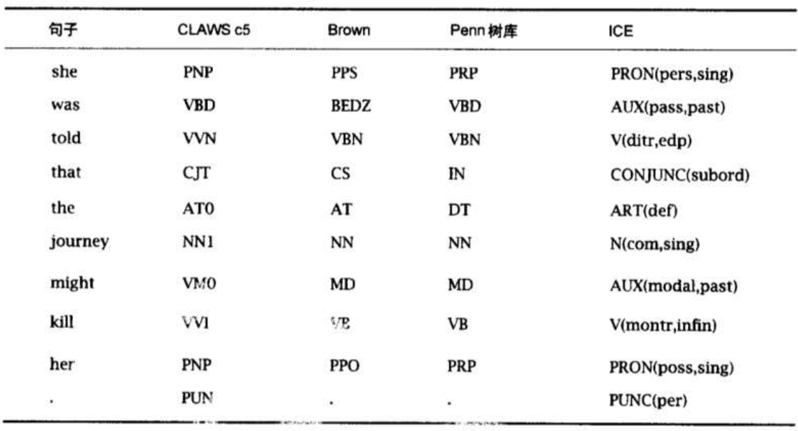
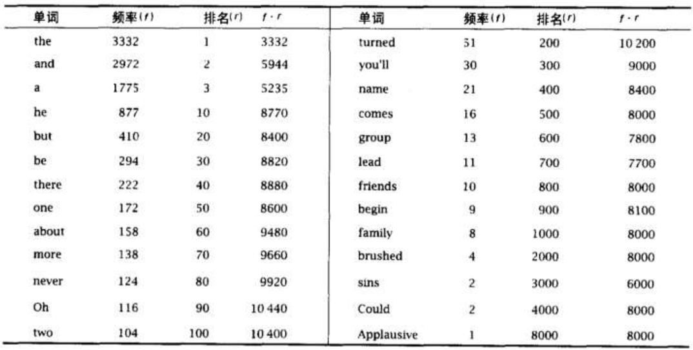
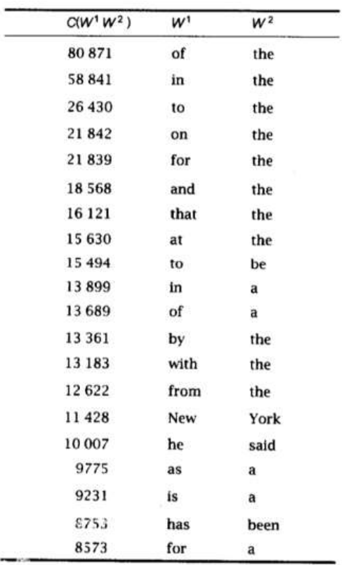
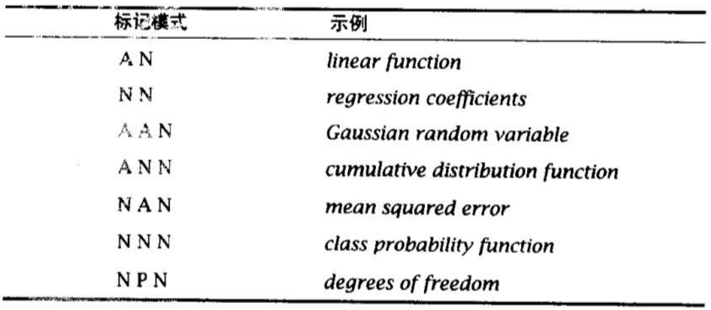
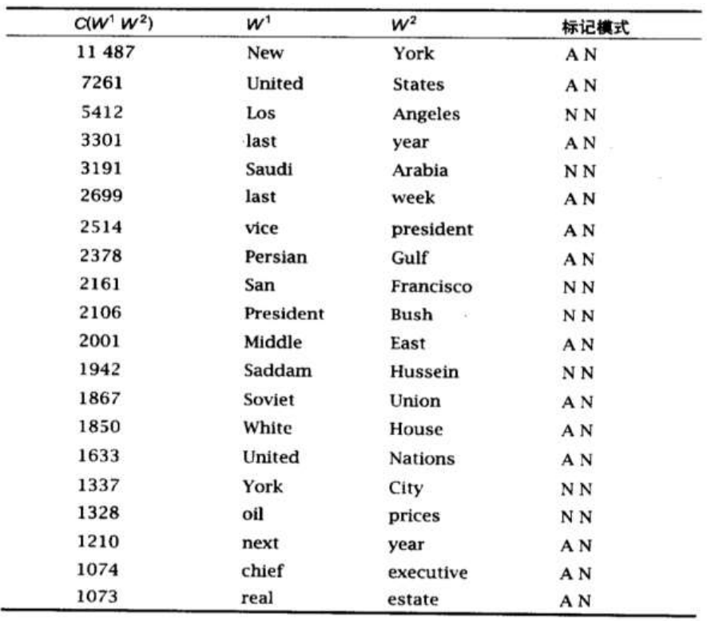
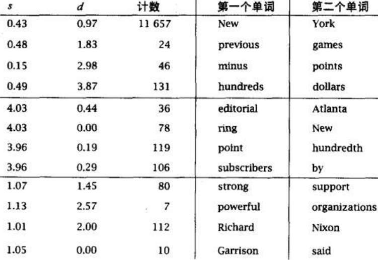

# 统计自然语言处理 | 笔记1-语料库及其统计分析

从数据角度来看，自然语言是用于表达事物、动作、思想、状态的一个系统，目前世界现存语言大约6909种，有2000多种语言有书面文字，而语料库就是从时间、空间上对自然语言的采样。

## 什么是语料库？

### 概念

语料库（corpus base）一词在语言学上意指大量的文本，通常经过整理，具有既定格式与标记。语料库语言学（corpus linguistics）就是基于语料库进行语言学研究的一门学问。

### 语料库的类型

1. 平衡语料库与平行语料库。平衡语料库着重考虑语料的代表性与平衡性，即综合考虑语料的科学领域分布、 地域分布、时间分布和语体分布等。平行语料库是指两种或多种语言之间的平行采样和加工，例如，机器翻译中的双语对齐语料库。
2. 共时语料库与历时语料库。
3. 通用语料库与专用语料库。抽样时仔细从各个方面考虑了平衡问题的平衡语料库称为通用语料库，为了某种专门的目的，只采集某一特定领域、特定地区、特定时间、特定类型的语料构成的语料库就是专用语料库。

## 语料库的加工

### 文本处理

- 垃圾格式处理。过滤杂质（文档页眉和分隔符、排版代码表和图）
- 大小写。
- 标记化。将文本切分为词的组合
- 句点。有的句点表示句子结尾，有些表示缩写如etc.
- 单撇号。如 I'll 或 isn't，可以认为是两个词的缩写（切分），I will 和 is
  not，也可以认为是一个词（不切分）
- 连字符。连字符有三种可能都需要考虑：
  - 为排版美观，把词语分开，中间插入连字符以改进半片的对齐。这种情况可以找到一行中最后的连字符，丢弃它
  - E-mail, co-operate, so-called 中的连字符为称为词汇连字符，通常被插入到小构词要素之前或之后，有时充当分裂原音序列的分隔符
  - 用来帮助区分正确的词组，如 once-quiet
- 相同形式表示不同的词语。同形异义词，如 saw 作为名词是锯子，但 saw 也是动词 see 的过去式
- 词法。词干化(stemming)，但有时会有副作用，如某人输入了business，词干化将返回所有包含 busy 的文档，这不是一个好结果
- 句子边界问题。

### 格式标注

通用标记语言(Standard Generalized Markup Language, SGML)，是超文本格式的最高层次标准，是可以定义标记语言的元语言

### 数据标注

数据标注包括语法标注，如 Brown 标注集，按几种不同的标注集对 "she was told that the journey might kill her." 标注如下：

## 统计分析

### Zipf法则

一个词的频率 $f$ 和它的词频排序（降序）位置 $r$ 之积为常数。Zipf 法则在《汤姆索亚历险记》语料库的实验如下表：

为了得到更加接近词汇经验分布的结果，Mandelbrot 得出了下面的更一般的排列和出现次数的关系：
$$
f=P(\gamma+\rho)^{-B}
$$
其中$P$, $B$ 和 $\rho$ 是文本的参数，总体衡量了文本中词汇使用的广度。如果设置参数$B=1,\rho=0$，Mandelbrot 公式就简化为 Zipf 法则

### 搭配抽取

搭配抽取就是找出一个词周围最常见的词是什么

**频率方法**：

如果两个词在一起出现很多次，它们很有可能是搭配，所以直接建立 bi-gram 频次词典，找到频率最高的即可。但是这样做的结果并不理想，如下图：

于是考虑通过一个词性过滤器过滤候选短语，Justeson 和 Katz 词性过滤器如下表，A 代表形容词，P 代表前置词，N 代表名词

过滤后的结构如下：

**均值和方差方法**：

考虑动词 knock 和它的最频繁出现的搭配之一 door：

- she knocked on his door
- they knocked at the door
- 100 women knocked on Donaldson's door
- a man knocked on the metal front door

在 knocked 和 door 之间出现的词是变化的，并且两个词之间的距离也不是固定的，可以通过两个词之间距离的方差来衡量两次是否搭配。如果在所有的情况下样本的偏移量是相同的，那么方差为零，如果偏移量是随机分布的（即两者偶然同现），那么方差将会较大。实验结果

