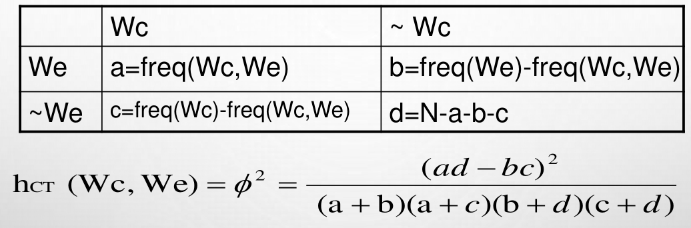

# 统计自然语言处理 | 笔记2-双语词典获取与句子对齐

本节要解决这样一个问题：给定上千对中文论文摘要和它的英文翻译，我们如何提取出一个中英双语学术写作词典？

## 基于共现的双语词典自动获取

基本思想是：如果汉语词出现在某个双语句对中，其译文也必定在这个句对中。

### 性能指标

我们有很多指标来衡量两词的相关性，令$freq(W_c,W_e)$为汉语词$W_c$和英语词$W_e$出现在同一个句对的频数：

- Dice 系数：用于度量两个集合的相似性，$\text{Dice(A,B)}=\frac{2|\text{A}\cap \text{B}|}{\text{|A|}+\text{|B|}}$
  - 在这里计算公式为：$\text{h}_{\text{DICE}}(W_C,W_e)=\frac{2\times freq(W_c,W_e)}{freq(W_c)+freq(W_e)}$

- 点对互信息：衡量相似度，$pmi=\text{log}\frac{p(x,y)}{p(x)p(y)}$
  - 在这里计算公式为：$\text{h}_{\text{MI}}(W_C,W_e)=\text{log}\frac{freq(W_c,W_e)}{freq(W_c)\times freq(W_e)}$
- 联列表：
- LLR(Log Likelihood Ratio)：计算两个事件相似度。$S=2\times (\text{H}_m-\text{H}_c-\text{H}_r)$，其中$\text{H}_m$表示上述矩阵的矩阵熵，$\text{H}_c$和$\text{H}_r$分别表示每行和每列相加得到的信息熵。
  - 在本例中，定义$\text{logL(p,n,k)}=k\text{log}(p)+(n-k)\text{log}(1-p)$，$p_1=a/(a+b)$，$p_2=c/(c+d)$，$p=(a+c)/(a+b+c+d)$，则$S=2\times(\text{logL}(p_1,a,a+b)+\text{logL}(p_2,c,c+d)-\text{logL}(p,a,a+b)-\text{logL}(p,c,c+d))$

### 评价方式

1. 