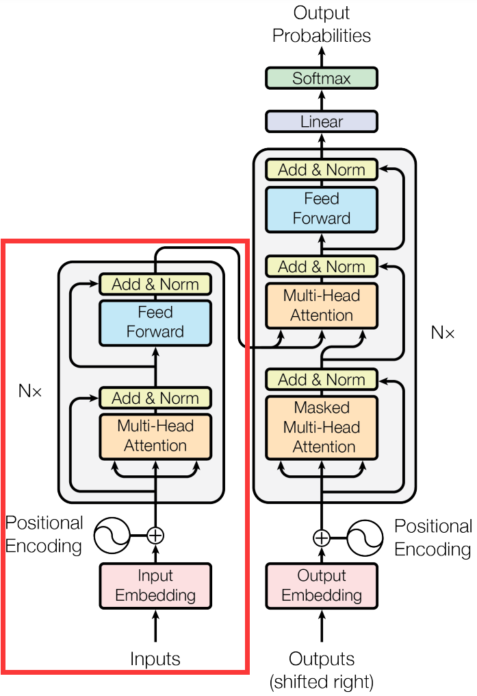
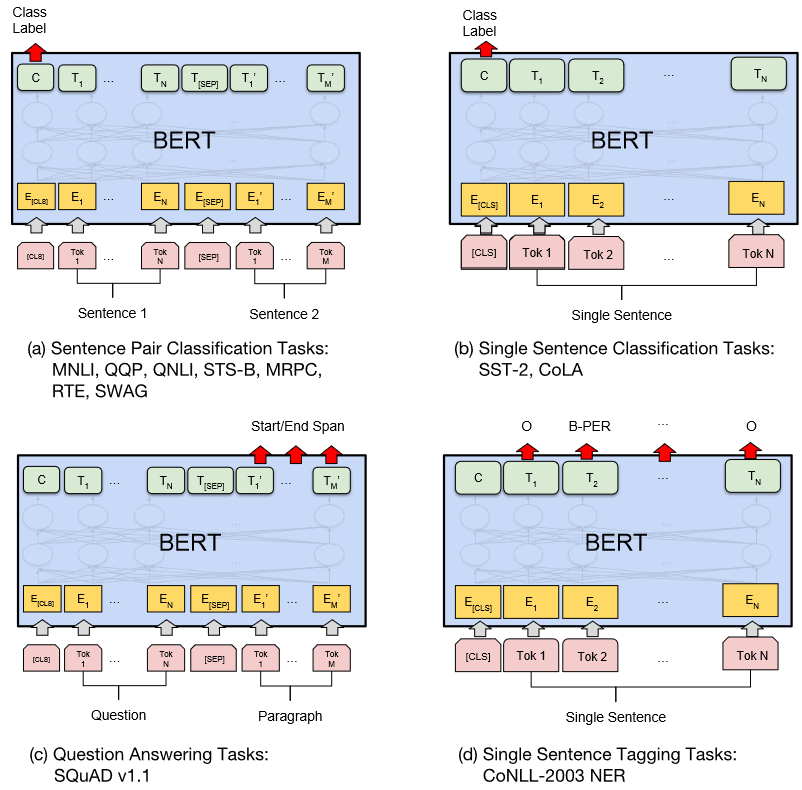

# BERT 原理与代码解析

论文：[BERT: Pre-training of Deep Bidirectional Transformers for Language Understanding](https://arxiv.org/abs/1810.04805)

模型由输入层（Embedding），编码层（Transformer-Encoder）和输出层三部分组成。

## 模型结构

### 输入层


- Token Embedding：词向量，第一个 Token 是 [CLS]，作为整个句子的表征，可以用来做分类任务
- Segment Embedding：用来区分两种句子
- Position Embedding：与 transformer 的 position encoding 不同，这里的 Position Embedding 是自己学习的

<!--truncate-->

### 编码层

BERT 仅仅使用 transformer 的 encoder，



## 预训练

### Task 1#: Masked LM

首先，使用 [MASK] 随机 mask 掉 15% 的 token，但是在是预测中，模型时遇不到 [MASK] 的，所以为了避免影响模型，当选定一个待 mask 的词时，使用如下策略：

1. 80% 的概率将其替换为[MASK]
2. 10% 的概率将其随机替换为其它 token
3. 10% 的概率不改变它

做 MLM 训练时，就是将 mask 掉的 token 的最后一层隐藏层向量输入一个线性层，映射到整个词表，即得到了每个词的概率，损失函数用交叉熵。

核心代码如下：

```python
class BertLMPredictionHead(nn.Module):
    def __init__(self, config):
        super().__init__()
        self.transform = BertPredictionHeadTransform(config)

        # The output weights are the same as the input embeddings, but there is
        # an output-only bias for each token.
        self.decoder = nn.Linear(config.hidden_size, config.vocab_size, bias=False)

        self.bias = nn.Parameter(torch.zeros(config.vocab_size))

        # Need a link between the two variables so that the bias is correctly resized with `resize_token_embeddings`
        self.decoder.bias = self.bias

    def forward(self, hidden_states):
        hidden_states = self.transform(hidden_states)
        hidden_states = self.decoder(hidden_states)
        return hidden_states
```

### Task 2#: Next Sentence Prediction

因为涉及到 QA 和 NLI 之类的任务，增加了第二个预训练任务，目的是让模型理解两个句子之间的联系。训练的输入是句子 A 和 B，B 有一半的几率是A的下一句，输入这两个句子，模型预测 B 是不是 A 的下一句。

这就是一个二分类任务，使用 [CLS] 输入到一个线性层，然后做 softmax 即可。

## 微调

