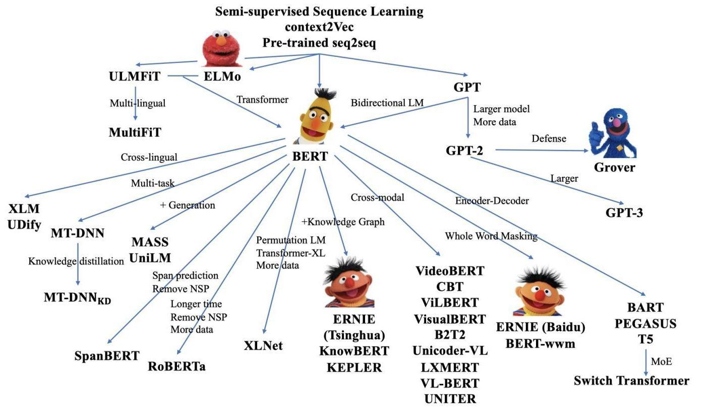
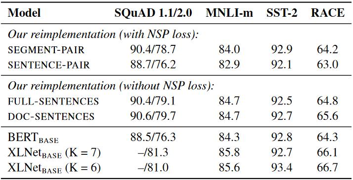

# BERT 家族大全解——RoBERTa, DeBERTa

<!--truncate-->

本文将对 BERT 及其变种模型进行全面的介绍和分析，包括 RoBERTa、DeBERTa、BART 等，希望能够为读者提供一个清晰的概览和参考。

## BERT

见：[BERT 原理与代码解析](/blog/2022/11/04/bert-code)

## RoBERTa

论文：[RoBERTa: A Robustly Optimized BERT Pretraining Approach (arxiv.org)](https://arxiv.org/abs/1907.11692)

改进点：

- 修改了超参数：将 adam 的 $\beta_2$ 参数从 0.999 改为 0.98
- 加入了混合精度
- 加大batch size：从 BERT 的 256 改为 2K 甚至 8K，训练步数从 1M 降到 500K
- 在更长的序列上训练，修改输入格式：FULL-SENTENCES + 移除 NSP 任务
- 动态掩码机制

### 动态掩码

BERT 在预训练时对数据进行 mask，一旦处理好便不会再变，这便是**静态掩码**。RoBERTa 所谓的动态掩码就是每次输入时都随机进行 mask，这样，在大量数据不断输入的过程中，模型会逐渐适应不同的掩码策略，学习不同的语言表征。

### 移除NSP任务

作者对比了四种输入模式：

- SEGMENT-PAIR+NSP：BERT 使用的方法，每个输入有一对段落，段落之间用 [SEP] 分割，并且计算 NSP 损失
- SENTENCE-PAIR+NSP：将 segment 替换为 sentence
- FULL-SENTENCES：如果输入的最大长度为512，那么就是尽量选择 512 长度的连续句子。如果跨 document了，就在中间加上一个特殊分隔符，不使用 NSP 损失
- DOC-SENTENCES：和 FULL-SENTENCES 一样，只是不能跨文档

实验结果：

## DeBERTa：具有解码增强和注意力解耦的 BERT

## 参考

- [万字长文带你纵览 BERT 家族 - 知乎 (zhihu.com)](https://zhuanlan.zhihu.com/p/145119424)

