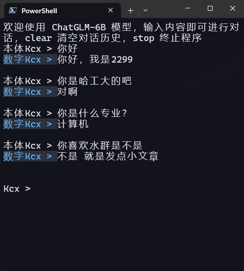

# 我用 2 万条聊天记录，创造了我的数字生命

**本文仍在持续更新中！**

最近有个奇奇怪怪的想法：如果用我的所有社交软件的聊天记录来训练像 ChatGPT 这样的大语言模型，那么它能不能学会我的说话风格，甚至拥有我的记忆呢？

说干就干，我从我的 QQ 导出所有聊天记录，并构造出了两万条对话数据，使用 P-Tune v2 微调清华大学开源的 [ChatGLM-6B](https://github.com/THUDM/ChatGLM-6B) 模型，创造了我的数字生命！

项目已开源：[kcxain/CloneLLM: Clone Yourself by Fine-tuning a Large Language Model | 用大语言模型创造你的数字生命！ (github.com)](https://github.com/kcxain/CloneLLM)

<!--truncate-->

## 一、数据集构造

- 预处理数据：使用 QQ 聊天时，用户倾向于将一整段语义完整的消息分成多条发出。为解决这个问题，该阶段会把同一用户连续发出的所有消息合并为一条。
- 构造对话数据集：对于你发出的每条消息，将这条消息设置为多轮对话的最后一条 response，该消息之前的消息作为 promt，无论是私聊还是群聊都取前若干轮作为对话历史（TODO：群聊是否有更好的处理方式？）

最后构造的对话数据集示例如下：

```json
{
    "prompt": "是状态图的九个公式 吧 不是九个状态图吧",
    "response": "能手写吗",
    "history": [
        ["问一下子", "哪来的九张状态转移图啊 就那一张 后面的都是结果"],
        ["哎呀给我看看嘛 你什么时候穿正装", "你再把PPT发给我"],
        ["我猜的还是很接近滴嘛", "刚剪完头"],
        ["23 激情猜价", "猪肘是另外现切的 9块 剩下的10.5"],
        ["左上角是什么", "猪脚 猜猜这总共多少钱"],
        ["你说嘞", "我咋知道捏"]
    ]
}
{
    "prompt": "下周三之前",
    "response": "论文的这个公式错了 你去群里说一下 说这个论文中这个公式打错了 应该是",
    "history": [
        ["是状态图的九个公式 吧 不是九个状态图吧", "能手写吗"],
        ["问一下子", "哪来的九张状态转移图啊 就那一张 后面的都是结果"],
        ["哎呀给我看看嘛 你什么时候穿正装", "你再把PPT发给我"],
        ["我猜的还是很接近滴嘛", "刚剪完头"],
        ["23 激情猜价", "猪肘是另外现切的 9块 剩下的10.5"],
        ["左上角是什么", "猪脚 猜猜这总共多少钱"]
    ]
}
```

## 二、微调策略

### 1. P-tuning v2

论文链接：[P-Tuning v2: Prompt Tuning Can Be Comparable to Finetuning Universally Across Scales and Tasks](https://arxiv.org/abs/2110.07602) 


简单来说，就是在模型所有层添加可训练的 Prompts 作为 Prefix，训练时冻结原始预训练模型参数，只训练 Prefix 部分。

### 2. LoRA 微调

TODO

### 3. 全参数微调

TODO

### 4. 微调参数集成

见 [UniPELT: A Unified Framework for Parameter-Efficient Language Model Tuning](https://arxiv.org/abs/2110.07577)

TODO

## 三、结果分析

目前结果还很差劲：



- 回复长度的问题。由于 QQ 对话数据集的问题，每条回复都非常短
- 回复质量问题。很多回复答非所问，应该是 QQ 群对话的数据的污染
- 记忆问题。模型并没有很好记住我的信息，怀疑是 P-tuning 微调的缺陷
