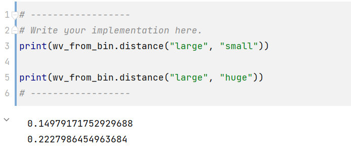

# A1: Exploring Word Vectors

## 实验概览

第一次实验非常简单，就是对 Word Vector 有一个初步的认识，引起我们探索的欲望。其实没什么好写的，权当记录一下学习过程

## Part 1：基于计数的词向量

就是一个朴素的想法："You shall know a word by the company it keeps"，使用共现矩阵来求得词向量(Co-Occurrence)，思路就是取窗口大小$n$，统计每一个单词上下文窗口中其它单词出现的次数

得到共现矩阵后，该矩阵的行（或列）提供了可以看作一种的词向量，但这种向量通常较大（维数为语料库中词的数目）。因此，我们的下一步应该进行降维操作

使用奇异值分解（SVD）方法，这是一种广义 PCA（主成分分析），以选择主要特征，如图所示：


综上，基于计数的词向量计算流程如下：

- 根据语料库得到共现矩阵
- 对共线矩阵进行奇异值分解降维

当语料库太过庞大时，对共现矩阵进行 SVD 是非常耗费时空的，利用共现矩阵比较稀疏的特点，一般选择**截断 SVD**

### 任务1：获取单词表

要求从语料库中提取出单词列表，利用 Python 的 set 即可，非常简单

```python
def distinct_words(corpus):
    """ Determine a list of distinct words for the corpus.
        Params:
            corpus (list of list of strings): corpus of documents
        Return:
            corpus_words (list of strings): sorted list of distinct words across the corpus
            n_corpus_words (integer): number of distinct words across the corpus
    """
    corpus_words = []
    n_corpus_words = -1
  
    # ------------------
    # Write your implementation here.
    corpus_words = sorted(list(set([j for i in corpus for j in set(i)])))
    n_corpus_words = len(corpus_words)

    # ------------------

    return corpus_words, n_corpus_words
```

### 任务2：计算共现矩阵

要求计算出共现矩阵，遍历即可，注意索引细节

```python
def compute_co_occurrence_matrix(corpus, window_size=4):
    """ Compute co-occurrence matrix for the given corpus and window_size (default of 4).
  
        Note: Each word in a document should be at the center of a window. Words near edges will have a smaller
              number of co-occurring words.
  
              For example, if we take the document "<START> All that glitters is not gold <END>" with window size of 4,
              "All" will co-occur with "<START>", "that", "glitters", "is", and "not".
  
        Params:
            corpus (list of list of strings): corpus of documents
            window_size (int): size of context window
        Return:
            M (a symmetric numpy matrix of shape (number of unique words in the corpus , number of unique words in the corpus)): 
                Co-occurence matrix of word counts. 
                The ordering of the words in the rows/columns should be the same as the ordering of the words given by the distinct_words function.
            word2ind (dict): dictionary that maps word to index (i.e. row/column number) for matrix M.
    """
    words, n_words = distinct_words(corpus)
    M = None
    word2ind = {}  
  
    # ------------------
    # Write your implementation here.
    word2ind = {w : i for i, w in enumerate(words)}
    M = np.zeros((n_words, n_words))
    for s in corpus:
        index = [word2ind[i] for i in s]
        for i, wid in enumerate(index):
            left = max(i - window_size, 0)
            right = min(i + window_size, len(s))
            for j in index[left:i] + index[i + 1:right + 1]:
                M[wid][j] += 1
    # ------------------
    return M, word2ind
```

### 任务3：降维

利用截断 SVD 得到 k 维的词向量矩阵

这里直接调 Scikit-Learn 的库[TruncatedSVD](http://scikit-learn.org/stable/modules/generated/sklearn.decomposition.TruncatedSVD.html)，注意结果要转置一下

```python
def reduce_to_k_dim(M, k=2):
    """ Reduce a co-occurence count matrix of dimensionality (num_corpus_words, num_corpus_words)
        to a matrix of dimensionality (num_corpus_words, k) using the following SVD function from Scikit-Learn:
            - http://scikit-learn.org/stable/modules/generated/sklearn.decomposition.TruncatedSVD.html
  
        Params:
            M (numpy matrix of shape (number of unique words in the corpus , number of unique words in the corpus)): co-occurence matrix of word counts
            k (int): embedding size of each word after dimension reduction
        Return:
            M_reduced (numpy matrix of shape (number of corpus words, k)): matrix of k-dimensioal word embeddings.
                    In terms of the SVD from math class, this actually returns U * S
    """  
    n_iters = 10     # Use this parameter in your call to `TruncatedSVD`
    M_reduced = None
    print("Running Truncated SVD over %i words..." % (M.shape[0]))
  
    # ------------------
    # Write your implementation here.
    svd = TruncatedSVD(n_components=k, n_iter=n_iters)
    M_reduced=svd.fit_transform(M)


    # ------------------
    print("Done.")
    return M_reduced
```

### 任务4：实现画出词向量

如果取 k = 2，那么就得到二维词向量，就能在二维坐标中画出来了

```python
def plot_embeddings(M_reduced, word2ind, words):
    """ Plot in a scatterplot the embeddings of the words specified in the list "words".
        NOTE: do not plot all the words listed in M_reduced / word2ind.
        Include a label next to each point.
  
        Params:
            M_reduced (numpy matrix of shape (number of unique words in the corpus , 2)): matrix of 2-dimensioal word embeddings
            word2ind (dict): dictionary that maps word to indices for matrix M
            words (list of strings): words whose embeddings we want to visualize
    """
    # ------------------
    # Write your implementation here.
    for w in words:
        index = word2ind[w]

        x = M_reduced[index][0]
        y = M_reduced[index][1]

        plt.scatter(x,y)
        plt.text(x, y, w)
    plt.show()

    # ------------------
```

## Part2：基于词向量的预测

此次作业需要自己代码的部分已经结束了，第二部分只是看看基于计数的词向量能有什么用

开头我们提到了，这种基于上下文计数的词向量的基本思想，那么显然两个相似的词，它们的上下文也应该差不多，那么词向量也会很相似

如何评价词向量的相似程度呢，可以使用两向量间的夹角来刻画：


取其余弦值：

$$
s = \frac{p \cdot q}{||p|| ||q||}, \textrm{ where } s \in [-1, 1]
$$

该值越大则说明两向量夹角越小，则越相似

该部分内容就是利用这个相似性来求得同义词，反义词等，就不在文章中写了

需要注意的是，这种相似性其实并不能求得同义词，它更多的表现的是相同词性的词的词向量相似，比如"large" 和 "small" 这一对词虽然是反义词，但是根据我们的直觉，它们的上下文其实应该是差不多的，故词向量也会非常相近，事实证明确实如此：


