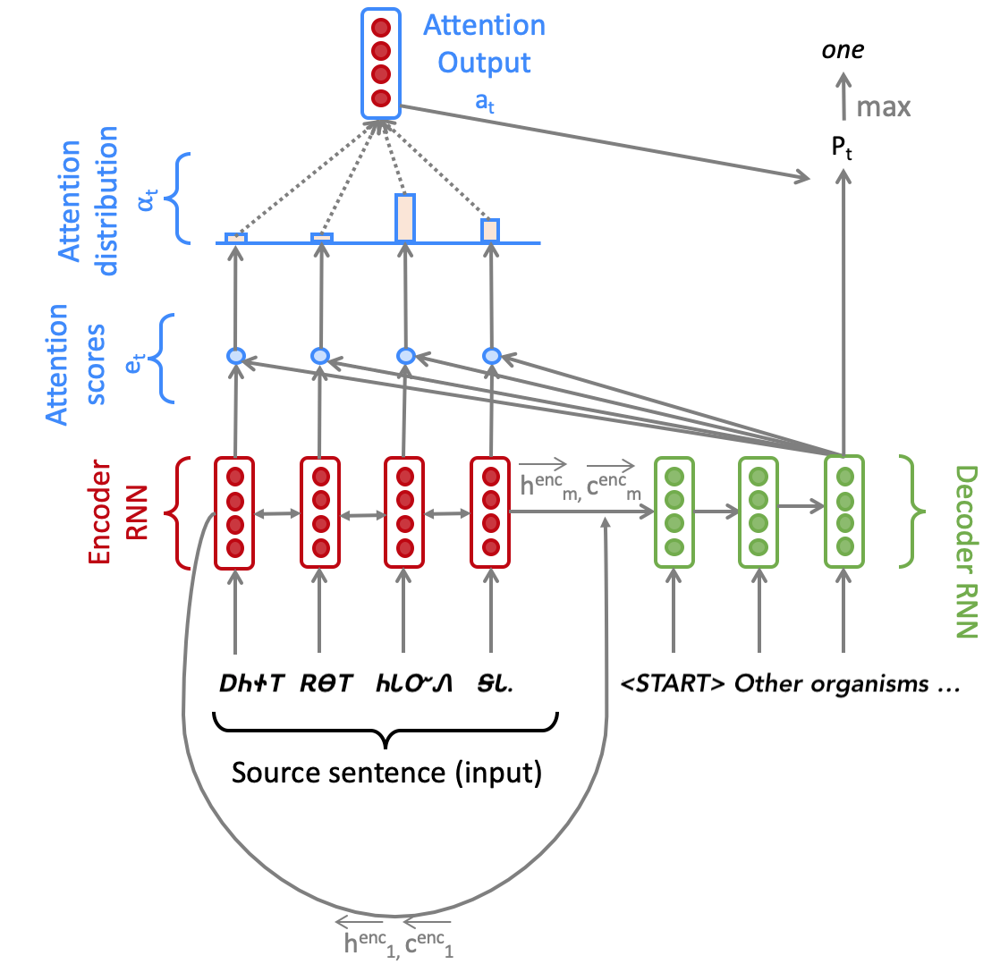
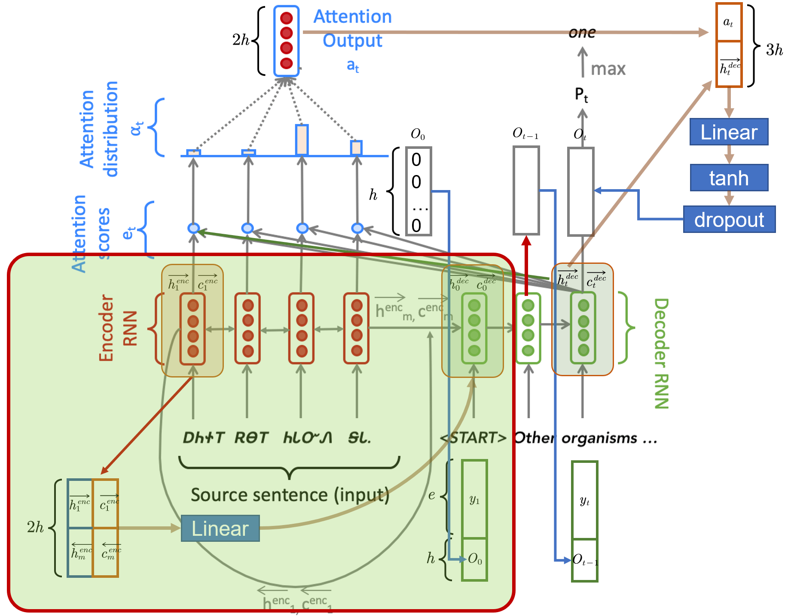
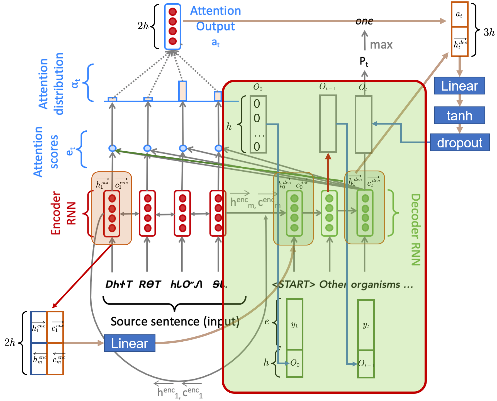
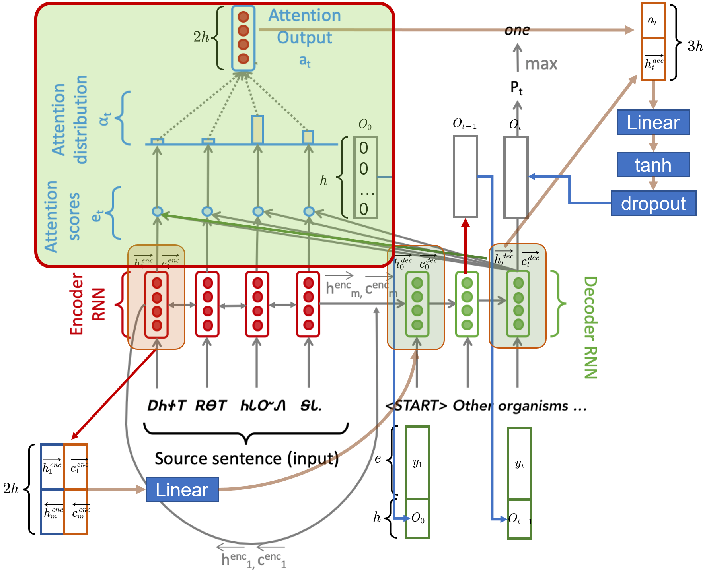
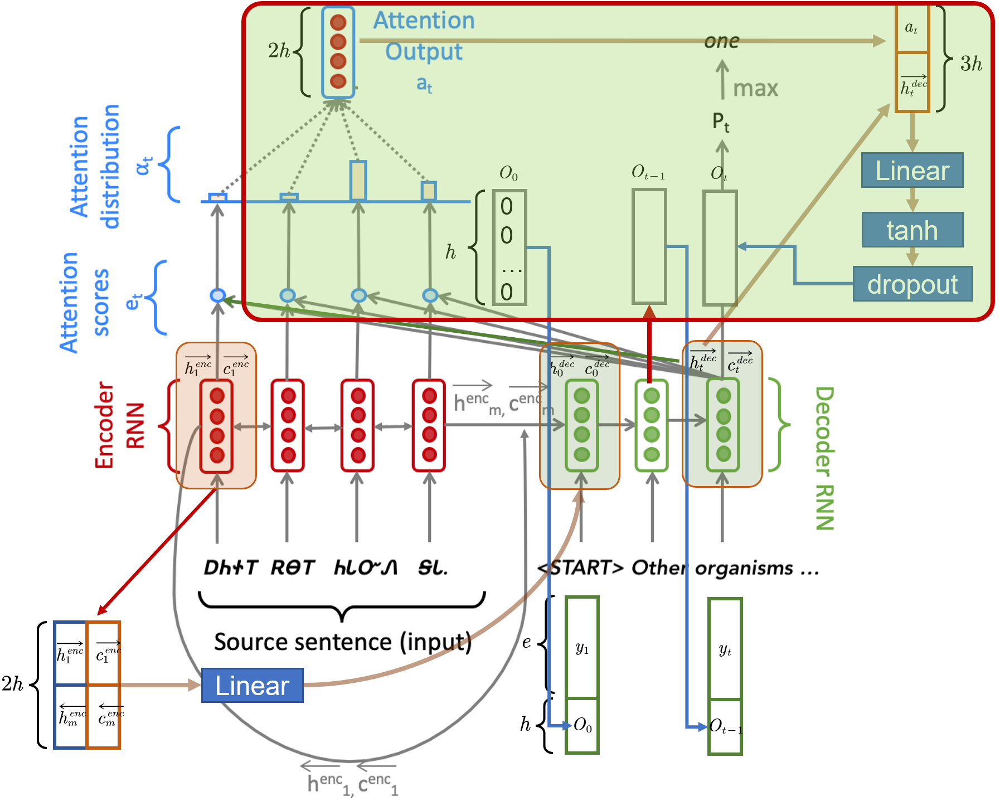
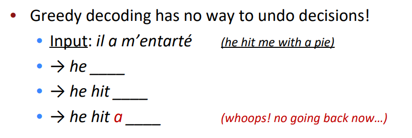
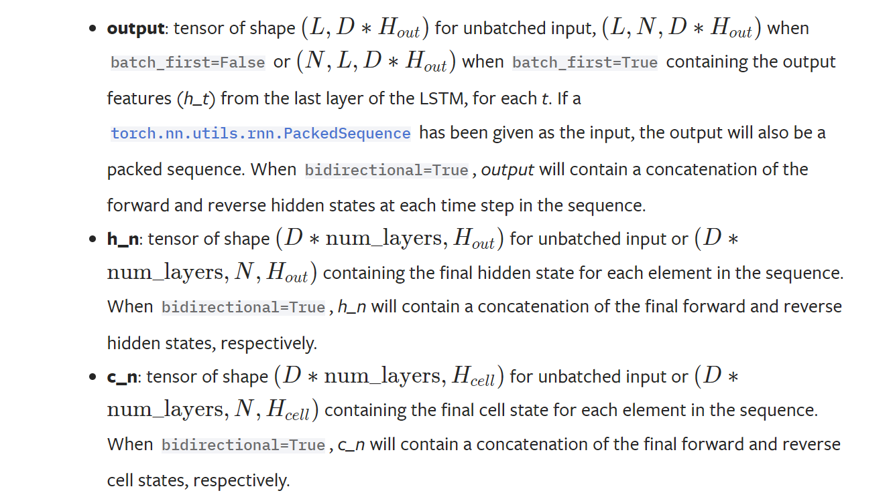
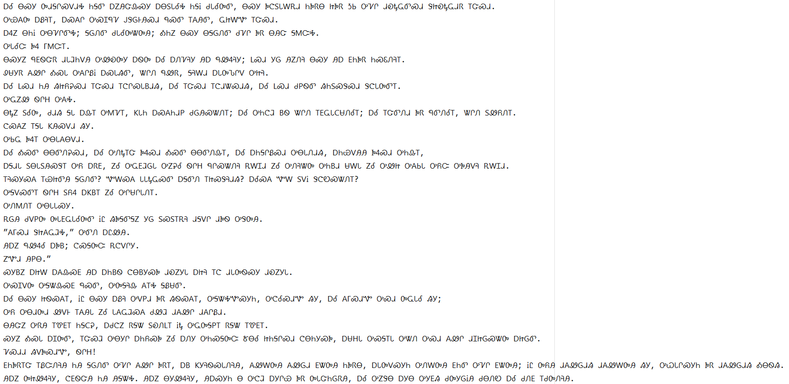

# A4: NMT with RNNs

本次作业是实现一个机器翻译模型 NMT with RNNs，该模型是一个典型的 Encoder-Decoder 架构，它的架构图如下：



为了便于理解和编写代码，我在原图基础上补充了一些细节：


# 模型架构

下面对每个模块进行单独说明

## Encoder

该部分对应图中圈出区域：



对于源语言的一个句子，先得到它的词嵌入矩阵：$\mathrm{x}_{1}, \ldots, \mathrm{x}_{m}\left(\mathrm{x}_{i} \in \mathbb{R}^{e \times 1}\right) $, 其中 $m$ 是句长 $e$ 是词向量的大小。

接下来将矩阵放入一个双向 LSTM 中，由于是双向 LSTM，所以每一个 hidden state 和 cell state 都由正向和反向两个方向拼接而成：

$$
\begin{array}{rlr}
\mathrm{h}_{i}^{\text {enc }} & =\left[\overleftarrow{\mathrm{h}_{i}^{\text {enc }}} ; \overrightarrow{\mathrm{h}_{i}^{\text {enc }}}\right] \text { where } \mathrm{h}_{i}^{\text {enc }} \in \mathbb{R}^{2 h \times 1}, \overleftarrow{\mathrm{h}_{i}^{\text {enc }}}, \overrightarrow{\mathrm{h}_{i}^{\text {enc }}} \in \mathbb{R}^{h \times 1} & 1 \leq i \leq m \\
\mathrm{c}_{i}^{\text {enc }} & =\left[\overleftarrow{\mathrm{c}_{i}^{\text {enc }}} ; \overline{\mathrm{c}_{i}^{\text {enc }}}\right] \text { where } \mathrm{c}_{i}^{\text {enc }} \in \mathbb{R}^{2 h \times 1}, \overleftarrow{\mathrm{c}_{i}^{\text {enc }}}, \overrightarrow{\mathrm{c}_{i}^{\text {enc }}} \in \mathbb{R}^{h \times 1} & 1 \leq i \leq m
\end{array}
$$

由此加入一个 Linear 层初始化 decoder 的第一个 hidden state 和 cell state：

$$
\begin{aligned}
\mathrm{h}_{0}^{\text {dec }} &=\mathrm{W}_{h}\left[\overleftarrow{\mathrm{h}_{1}^{e n c}} ; \overrightarrow{\mathrm{h}_{m}^{\text {enc }}}\right] \text { where } \mathrm{h}_{0}^{\text {dec }} \in \mathbb{R}^{h \times 1}, \mathrm{W}_{h} \in \mathbb{R}^{h \times 2 h} \\
\mathrm{c}_{0}^{\text {dec }} &=\mathrm{W}_{c}\left[\overleftarrow{\mathrm{c}_{1}^{\text {enc }}} ; \overrightarrow{\mathrm{c}_{m}^{\text {enc }}}\right] \text { where } \mathrm{c}_{0}^{\text {dec }} \in \mathbb{R}^{h \times 1}, \mathrm{W}_{c} \in \mathbb{R}^{h \times 2 h}
\end{aligned}
$$

## Decoder



当 Decoder 的参数初始化后，我就需要输入目标语言了，在第 $t$ 步，我们将第 $t$ 个单词词向量与前一步的输出 $\mathrm{o}_{t-1} \in \mathbb{R}^{h \times 1}$ 拼接起来作为输入 $\overline{\mathrm{y}_{t}} \in \mathbb{R}^{(e+h) \times 1}$，其中 $\mathrm{o}_{0}$ 我们设置为全 0，那么就可得到 hidden states 和 cell states：

$$
\mathrm{h}_{t}^{\mathrm{dec}}, \mathrm{c}_{t}^{\mathrm{dec}}=\operatorname{Decoder}\left(\overline{\mathrm{y}_{t}}, \mathrm{h}_{t-1}^{\mathrm{dec}}, \mathrm{c}_{t-1}^{\mathrm{dec}}\right) \text { where } \mathrm{h}_{t}^{\mathrm{dec}} \in \mathbb{R}^{h \times 1}, \mathrm{c}_{t}^{\mathrm{dec}} \in \mathbb{R}^{h \times 1}
$$

## Attention



接下来，使用 $\mathrm{h}_{t}^{\text {dec }}$ 与 $\mathrm{h}_{1}^{\text {enc }}, \ldots, \mathrm{h}_{m}^{\text {enc }}$ 做 multiplicative attention，将 $\mathrm{h}_{i}^{\text {enc }} $ 融合得到 $\mathrm{a}_{t}$

$$
\begin{array}{cl}
\mathrm{e}_{t, i}=\left(\mathrm{h}_{t}^{\mathrm{dec}}\right)^{T} \mathrm{W}_{\mathrm{attProj}} \mathrm{h}_{i}^{\text {enc }} \text { where } \mathrm{e}_{t} \in \mathbb{R}^{m \times 1}, \mathrm{W}_{\text {attProj }} \in \mathbb{R}^{h \times 2 h} \quad 1 \leq i \leq m \\
\alpha_{t}=\operatorname{softmax}\left(\mathrm{e}_{t}\right) \text { where } \alpha_{t} \in \mathbb{R}^{m \times 1} \\
\mathrm{a}_{t}=\sum_{i=1}^{m} \alpha_{t, i} \mathrm{h}_{i}^{\text {enc }} \text { where } \mathrm{a}_{t} \in \mathbb{R}^{2 h \times 1} &
\end{array}
$$

## 计算输出



接下来将 $\mathrm{a}_{t}$ 和 $\mathrm{h}_{t}$ 拼接，放入一个 Linear 层、然后 tanh 和 dropout 得到 $\mathrm{o}_{t}$

$$
\begin{gathered}
\mathrm{u}_{t}=\left[\mathrm{a}_{t} ; \mathrm{h}_{t}^{\text {dec }}\right] \text { where } \mathrm{u}_{t} \in \mathbb{R}^{3 h \times 1} \\
\mathrm{v}_{t}=\mathrm{W}_{u} \mathrm{u}_{t} \text { where } \mathrm{v}_{t} \in \mathbb{R}^{h \times 1}, \mathrm{W}_{u} \in \mathbb{R}^{h \times 3 h} \\
\mathrm{o}_{t}=\operatorname{dropout}\left(\tanh \left(\mathrm{v}_{t}\right)\right) \text { where } \mathrm{o}_{t} \in \mathbb{R}^{h \times 1}
\end{gathered}
$$

接下来即可得到词概率向量：

$$
\mathrm{P}_{t}=\operatorname{softmax}\left(\mathrm{W}_{\text {vocab }} \mathrm{o}_{t}\right) \text { where } \mathrm{P}_{t} \in \mathbb{R}^{V_{t} \times 1}, \mathrm{W}_{\text {vocab }} \in \mathbb{R}^{V_{t} \times h}
$$

损失函数设置为$\mathrm{P}_{t}$ 和 $\mathrm{g}_{t}$ 的交叉熵，其中 $\mathrm{g}_{t}$ 是第 $t$ 步单词的 one-hot 向量：

$$
J_{t}(\theta)=\operatorname{CrossEntropy}\left(\mathrm{P}_{t}, \mathrm{g}_{t}\right)
$$

# 搜索策略

得到概率向量后，怎么选择当前词呢，这是一个策略问题

## Greedy decoding

得到概率向量后，一个很自然的想法就是每步选取概率最大的词作为输出即可。但是这种做法并不妥，它一旦选错一个词，那么后续生成的内容很有可能也会出错，比如下面的例子：



按尝时来讲，当输出 "he hit" 后，下一步输出的概率最大的词很有可能是 "a"，但是一旦选中 "a"，后续的翻译就不好进行了。

## Exhaustive search decoding

想法是最大化下面这个值：


那么就需要计算所有可能的 y 序列，设词汇表大小为 $V$，对于 decoder 进行的每一步，我们都要计算 $V$ 中情况，总事件复杂度为 $O(V^t)$。这太慢了！

## Beam search decoding

将前两种方法折中，我们就得到了一种新的方法 beam search，它即计算了多种可能性，时间复杂度也没有过高。

具体做法是每次都选取概率最大的 $k$ 个数进行下一步的计算，那么每一个序列的分数，就是每一个词概率的积：


我们要做的就是寻找分数最高的序列。


注意，最后的分数都是负数。

那么搜索什么时候停止呢？

- 在 greedy decoding 中，我们总是在输出 `<END>` 时停止
- 但是在 beam search 中，不同的序列可能不会同时输出 `<END>`，我们可以设置一个时间节点 $T$，到达时停止，或者在有$n$ 个序列输出`<END>`时停止。

还有一个问题是序列越长的句子，它的概率乘积肯定越小，这是不公平的，解决办法是用序列长度正则化：


# 代码实现

## 代码架构

整个项目有 4 个部分，`utils.py`,`vacab.py`,`model_embeddings.py`和`nmt_model.py`

## `utils.py`

* `pad_sents`将一个 batch 中的句子补齐
* `read_corpus`读入数据集，并且将每个目标语言数据集的句首加上`<s>`，句尾加上`</s>`
* `batch_iter`将句子打乱，生成 batch

## `vacab.py`

这一部分主要是用来构建单词表

```python
class VocabEntry(object):
    def __init__(self, word2id=None): # 将单词和索引对应起来
    def __getitem__(self, word): # 得到对应单词的索引
    def __contains__(self, word):# 查看单词是否存在单词表中
    def __len__(self): #单词表大小
    def id2word(self, wid): # 根据索引找到单词
    def add(self, word): # 将单词添加到单词表末尾
    def words2indices(self, sents): # 将一个句子转换为索引
    def indices2words(self, word_ids): # 将一列索引转换为句子
    def to_input_tensor(self, sents: List[List[str]], device: torch.device) -> torch.Tensor: # 将一个句子转为tensor
    def from_corpus(corpus, size, freq_cutoff=2): # 根据一整个语料库直接构建单词表
    def from_subword_list(subword_list):

class Vocab(object):
    def __init__(self, src_vocab: VocabEntry, tgt_vocab: VocabEntry):   
    def build(src_sents, tgt_sents) -> 'Vocab': # 构建单词表
    def save(self, file_path): # 将单词表存到本地
    def load(file_path): # 从本地读取单词表
```

## `model_embeddings.py`

为词表初始化词向量

## `nmt_model.py`

实现 NMT 模型

```python
class NMT(nn.Module):
    def __init__(self, embed_size, hidden_size, vocab, dropout_rate=0.2):#初始化模型需要的各个层
    def forward(self, source: List[List[str]], target: List[List[str]]) -> torch.Tensor:#前向传播过程，根据源语言句子和目标语言句子，通过encode,decode生成句子的对数概率
    def encode(self, source_padded: torch.Tensor, source_lengths: List[int]) -> Tuple[torch.Tensor, Tuple[torch.Tensor, torch.Tensor]]:#encode模块，后面会讲到
    def decode(self, enc_hiddens: torch.Tensor, enc_masks: torch.Tensor, dec_init_state: Tuple[torch.Tensor, torch.Tensor], target_padded: torch.Tensor) -> torch.Tensor:#decode模块，后面会讲到
    def step(self, Ybar_t: torch.Tensor,dec_state: Tuple[torch.Tensor, torch.Tensor],enc_hiddens: torch.Tensor,enc_hiddens_proj: torch.Tensor,            enc_masks: torch.Tensor) -> Tuple[Tuple, torch.Tensor, torch.Tensor]:#训练时，每一个t时，decode的更新
    def beam_search(self, src_sent: List[str], beam_size: int=5, max_decoding_time_step: int=70) -> List[Hypothesis]:#前面讲到的搜索策略
    def load(model_path: str):#从本地加载模型
    def save(self, path: str):#把模型保存到本地
```

## 初始化词向量实现

为了便于操作，我们需要把每一个 batch 的句子长度对齐，方法是得到 batch 中最长的句子长度，其它句子补上 pad_token

```python
def pad_sents(sents, pad_token):
    """ Pad list of sentences according to the longest sentence in the batch.
        The paddings should be at the end of each sentence.
    @param sents (list[list[str]]): list of sentences, where each sentence
                                    is represented as a list of words
    @param pad_token (str): padding token
    @returns sents_padded (list[list[str]]): list of sentences where sentences shorter
        than the max length sentence are padded out with the pad_token, such that
        each sentences in the batch now has equal length.
    """
    sents_padded = []

    ### YOUR CODE HERE (~6 Lines)
    max_len = max([len(str) for str in sents])
    for str in sents:
        sents_padded.append(str + (max_len - len(str)) * [pad_token])
    ### END YOUR CODE

    return sents_padded
```

然后利用 `torch.nn.Embedding`就可以初始化词向量了：

```python
    def __init__(self, embed_size, vocab):
        """
        Init the Embedding layers.

        @param embed_size (int): Embedding size (dimensionality)
        @param vocab (Vocab): Vocabulary object containing src and tgt languages
                              See vocab.py for documentation.
        """
        super(ModelEmbeddings, self).__init__()
        self.embed_size = embed_size

        # default values
        self.source = None
        self.target = None

        src_pad_token_idx = vocab.src['<pad>']
        tgt_pad_token_idx = vocab.tgt['<pad>']

        ### YOUR CODE HERE (~2 Lines)
        ### TODO - Initialize the following variables:
        ###     self.source (Embedding Layer for source language)
        ###     self.target (Embedding Layer for target langauge)
        ###
        ### Note:
        ###     1. `vocab` object contains two vocabularies:
        ###            `vocab.src` for source
        ###            `vocab.tgt` for target
        ###     2. You can get the length of a specific vocabulary by running:
        ###             `len(vocab.<specific_vocabulary>)`
        ###     3. Remember to include the padding token for the specific vocabulary
        ###        when creating your Embedding.
        ###
        ### Use the following docs to properly initialize these variables:
        ###     Embedding Layer:
        ###         https://pytorch.org/docs/stable/nn.html#torch.nn.Embedding

        self.source = nn.Embedding(len(vocab.src), embed_size, padding_idx=src_pad_token_idx)
        self.target = nn.Embedding(len(vocab.tgt), embed_size, padding_idx=tgt_pad_token_idx)
        ### END YOUR CODE
```

## 初始化模型 layers

根据我们前一部分对模型每一块的分析，把握住每一层输入和输出的维度，这一步很容易就能实现：

```python
    def __init__(self, embed_size, hidden_size, vocab, dropout_rate=0.2):
        """ Init NMT Model.

        @param embed_size (int): Embedding size (dimensionality)
        @param hidden_size (int): Hidden Size, the size of hidden states (dimensionality)
        @param vocab (Vocab): Vocabulary object containing src and tgt languages
                              See vocab.py for documentation.
        @param dropout_rate (float): Dropout probability, for attention
        """
        super(NMT, self).__init__()
        self.model_embeddings = ModelEmbeddings(embed_size, vocab)
        self.hidden_size = hidden_size
        self.dropout_rate = dropout_rate
        self.vocab = vocab

        # default values
        self.encoder = None 
        self.decoder = None
        self.h_projection = None
        self.c_projection = None
        self.att_projection = None
        self.combined_output_projection = None
        self.target_vocab_projection = None
        self.dropout = None
        # For sanity check only, not relevant to implementation
        self.gen_sanity_check = False
        self.counter = 0


        ### YOUR CODE HERE (~8 Lines)
        ### TODO - Initialize the following variables:
        ###     self.encoder (Bidirectional LSTM with bias)
        ###     self.decoder (LSTM Cell with bias)
        ###     self.h_projection (Linear Layer with no bias), called W_{h} in the PDF.
        ###     self.c_projection (Linear Layer with no bias), called W_{c} in the PDF.
        ###     self.att_projection (Linear Layer with no bias), called W_{attProj} in the PDF.
        ###     self.combined_output_projection (Linear Layer with no bias), called W_{u} in the PDF.
        ###     self.target_vocab_projection (Linear Layer with no bias), called W_{vocab} in the PDF.
        ###     self.dropout (Dropout Layer)
        ###
        ### Use the following docs to properly initialize these variables:
        ###     LSTM:
        ###         https://pytorch.org/docs/stable/nn.html#torch.nn.LSTM
        ###     LSTM Cell:
        ###         https://pytorch.org/docs/stable/nn.html#torch.nn.LSTMCell
        ###     Linear Layer:
        ###         https://pytorch.org/docs/stable/nn.html#torch.nn.Linear
        ###     Dropout Layer:
        ###         https://pytorch.org/docs/stable/nn.html#torch.nn.Dropout
        self.encoder = nn.LSTM(input_size=embed_size, hidden_size=hidden_size, bias=True, bidirectional=True)
        # 前一个 h/c 和当前 y
        self.decoder = nn.LSTMCell(input_size=embed_size+hidden_size, hidden_size=hidden_size, bias=True)
        # concat(h_1, h_m)
        self.h_projection = nn.Linear(self.hidden_size*2, self.hidden_size, bias=False)
        # concat(c_1, c_m)
        self.c_projection = nn.Linear(self.hidden_size*2, self.hidden_size, bias=False)
        # h_t dec
        self.att_projection = nn.Linear(self.hidden_size*2, self.hidden_size, bias=False)
        # a_t : h, h_t : 2 h
        self.combined_output_projection = nn.Linear(self.hidden_size*3, self.hidden_size, bias=False)
        # v_t
        self.target_vocab_projection = nn.Linear(self.hidden_size, len(self.vocab.tgt), bias=False)
        self.dropout = nn.Dropout(p=self.dropout_rate, inplace=False)
        ### END YOUR CODE
```

## 实现 encode

代码如下：

这个函数需要返回 Encoder 部分的 state 和初始化 Decoder 的第一个 state

```python
    def encode(self, source_padded: torch.Tensor, source_lengths: List[int]) -> Tuple[torch.Tensor, Tuple[torch.Tensor, torch.Tensor]]:
        """ Apply the encoder to source sentences to obtain encoder hidden states.
            Additionally, take the final states of the encoder and project them to obtain initial states for decoder.

        @param source_padded (Tensor): Tensor of padded source sentences with shape (src_len, b), where
                                        b = batch_size, src_len = maximum source sentence length. Note that 
                                       these have already been sorted in order of longest to shortest sentence.
        @param source_lengths (List[int]): List of actual lengths for each of the source sentences in the batch
        @returns enc_hiddens (Tensor): Tensor of hidden units with shape (b, src_len, h*2), where
                                        b = batch size, src_len = maximum source sentence length, h = hidden size.
        @returns dec_init_state (tuple(Tensor, Tensor)): Tuple of tensors representing the decoder's initial
                                                hidden state and cell.
        """
        enc_hiddens, dec_init_state = None, None

        ### YOUR CODE HERE (~ 8 Lines)
        ### TODO:
        ###     1. Construct Tensor `X` of source sentences with shape (src_len, b, e) using the source model embeddings.
        ###         src_len = maximum source sentence length, b = batch size, e = embedding size. Note
        ###         that there is no initial hidden state or cell for the decoder.
        ###     2. Compute `enc_hiddens`, `last_hidden`, `last_cell` by applying the encoder to `X`.
        ###         - Before you can apply the encoder, you need to apply the `pack_padded_sequence` function to X.
        ###         - After you apply the encoder, you need to apply the `pad_packed_sequence` function to enc_hiddens.
        ###         - Note that the shape of the tensor returned by the encoder is (src_len, b, h*2) and we want to
        ###           return a tensor of shape (b, src_len, h*2) as `enc_hiddens`.
        ###     3. Compute `dec_init_state` = (init_decoder_hidden, init_decoder_cell):
        ###         - `init_decoder_hidden`:
        ###             `last_hidden` is a tensor shape (2, b, h). The first dimension corresponds to forwards and backwards.
        ###             Concatenate the forwards and backwards tensors to obtain a tensor shape (b, 2*h).
        ###             Apply the h_projection layer to this in order to compute init_decoder_hidden.
        ###             This is h_0^{dec} in the PDF. Here b = batch size, h = hidden size
        ###         - `init_decoder_cell`:
        ###             `last_cell` is a tensor shape (2, b, h). The first dimension corresponds to forwards and backwards.
        ###             Concatenate the forwards and backwards tensors to obtain a tensor shape (b, 2*h).
        ###             Apply the c_projection layer to this in order to compute init_decoder_cell.
        ###             This is c_0^{dec} in the PDF. Here b = batch size, h = hidden size
        ###
        ### See the following docs, as you may need to use some of the following functions in your implementation:
        ###     Pack the padded sequence X before passing to the encoder:
        ###         https://pytorch.org/docs/stable/nn.html#torch.nn.utils.rnn.pack_padded_sequence
        ###     Pad the packed sequence, enc_hiddens, returned by the encoder:
        ###         https://pytorch.org/docs/stable/nn.html#torch.nn.utils.rnn.pad_packed_sequence
        ###     Tensor Concatenation:
        ###         https://pytorch.org/docs/stable/torch.html#torch.cat
        ###     Tensor Permute:
        ###         https://pytorch.org/docs/stable/tensors.html#torch.Tensor.permute
        X = self.model_embeddings.source(source_padded)
        X_packed = pack_padded_sequence(X, torch.tensor(source_lengths))
        enc_hiddens, (last_hidden, last_cell) = self.encoder(X_packed)
        enc_hiddens, _ = pad_packed_sequence(enc_hiddens, batch_first=True)
        # last_hidden 包含了正向和反向的 h, (2, b, h)
        init_decoder_hidden = self.h_projection(torch.cat((last_hidden[0], last_hidden[1]), 1))
        init_decoder_cell = self.c_projection(torch.cat((last_cell[0], last_cell[1]), 1))
        dec_init_state = (init_decoder_hidden, init_decoder_cell)
        ### END YOUR CODE

        return enc_hiddens, dec_init_state
```

注意 `torch.nn.LSTM()`的返回值：



当设置为双向 LSTM 时，$D=2$，返回的 $h_n$ 和 $c_n$ 同时包含了每一层正向和反向的 state

这里还使用到了`pack_padded_sequence`和`pad_packed_sequence`操作。下面讲解以下这两步操作的作用。

在代码实现的第一部分，我们将长短不一的句子用 pad_token 补齐，然后在调用 `nn.Embedding`时，将这些位置输入了进去，那么最后产生的词向量在 pad_token 位置的值均为 0。如果在进行 forward 计算时，把 pad_token 也考虑进去，可能会导致 RNN 计算了了很多无用的 pad_token，这样不仅浪费计算资源，最后得到的值可能还会存在误差。所以 `pack_padded_sequence` 的作用就是压缩，将这些填充值去除。

那么显然，`pad_packed_sequence`就是将压缩后的值再恢复原貌，进行后面的计算。

## 实现 decode

首先实现根据当前的 encoder state 和当前的 decoder state 计算新的 decoder state，然后算出 attention scores 最终得到输出 $\mathrm{o}_{t}$

代码如下：

```python
    def step(self, Ybar_t: torch.Tensor,
            dec_state: Tuple[torch.Tensor, torch.Tensor],
            enc_hiddens: torch.Tensor,
            enc_hiddens_proj: torch.Tensor,
            enc_masks: torch.Tensor) -> Tuple[Tuple, torch.Tensor, torch.Tensor]:
        """ Compute one forward step of the LSTM decoder, including the attention computation.

        @param Ybar_t (Tensor): Concatenated Tensor of [Y_t o_prev], with shape (b, e + h). The input for the decoder,
                                where b = batch size, e = embedding size, h = hidden size.
        @param dec_state (tuple(Tensor, Tensor)): Tuple of tensors both with shape (b, h), where b = batch size, h = hidden size.
                First tensor is decoder's prev hidden state, second tensor is decoder's prev cell.
        @param enc_hiddens (Tensor): Encoder hidden states Tensor, with shape (b, src_len, h * 2), where b = batch size,
                                    src_len = maximum source length, h = hidden size.
        @param enc_hiddens_proj (Tensor): Encoder hidden states Tensor, projected from (h * 2) to h. Tensor is with shape (b, src_len, h),
                                    where b = batch size, src_len = maximum source length, h = hidden size.
        @param enc_masks (Tensor): Tensor of sentence masks shape (b, src_len),
                                    where b = batch size, src_len is maximum source length. 

        @returns dec_state (tuple (Tensor, Tensor)): Tuple of tensors both shape (b, h), where b = batch size, h = hidden size.
                First tensor is decoder's new hidden state, second tensor is decoder's new cell.
        @returns combined_output (Tensor): Combined output Tensor at timestep t, shape (b, h), where b = batch size, h = hidden size.
        @returns e_t (Tensor): Tensor of shape (b, src_len). It is attention scores distribution.
                                Note: You will not use this outside of this function.
                                      We are simply returning this value so that we can sanity check
                                      your implementation.
        """

        combined_output = None

        ### YOUR CODE HERE (~3 Lines)
        ### TODO:
        ###     1. Apply the decoder to `Ybar_t` and `dec_state`to obtain the new dec_state.
        ###     2. Split dec_state into its two parts (dec_hidden, dec_cell)
        ###     3. Compute the attention scores e_t, a Tensor shape (b, src_len). 
        ###        Note: b = batch_size, src_len = maximum source length, h = hidden size.
        ###
        ###       Hints:
        ###         - dec_hidden is shape (b, h) and corresponds to h^dec_t in the PDF (batched)
        ###         - enc_hiddens_proj is shape (b, src_len, h) and corresponds to W_{attProj} h^enc (batched).
        ###         - Use batched matrix multiplication (torch.bmm) to compute e_t (be careful about the input/ output shapes!)
        ###         - To get the tensors into the right shapes for bmm, you will need to do some squeezing and unsqueezing.
        ###         - When using the squeeze() function make sure to specify the dimension you want to squeeze
        ###             over. Otherwise, you will remove the batch dimension accidentally, if batch_size = 1.
        ###
        ### Use the following docs to implement this functionality:
        ###     Batch Multiplication:
        ###        https://pytorch.org/docs/stable/torch.html#torch.bmm
        ###     Tensor Unsqueeze:
        ###         https://pytorch.org/docs/stable/torch.html#torch.unsqueeze
        ###     Tensor Squeeze:
        ###         https://pytorch.org/docs/stable/torch.html#torch.squeeze
        (dec_hidden, dec_cell) = self.decoder(Ybar_t, dec_state)
        dec_state = (dec_hidden, dec_cell)
        # enc_hiddens_proj: (b, src_len, h)
        # dec_hidden: (b, h) -> (b, h, 1)
        e_t = torch.bmm(enc_hiddens_proj, dec_hidden.unsqueeze(2)).squeeze(2)
        # (b, src_len)


        ### END YOUR CODE

        # Set e_t to -inf where enc_masks has 1
        if enc_masks is not None:
            e_t.data.masked_fill_(enc_masks.bool(), -float('inf'))

        ### YOUR CODE HERE (~6 Lines)
        ### TODO:
        ###     1. Apply softmax to e_t to yield alpha_t
        ###     2. Use batched matrix multiplication between alpha_t and enc_hiddens to obtain the
        ###         attention output vector, a_t.
        #$$     Hints:
        ###           - alpha_t is shape (b, src_len)
        ###           - enc_hiddens is shape (b, src_len, 2h)
        ###           - a_t should be shape (b, 2h)
        ###           - You will need to do some squeezing and unsqueezing.
        ###     Note: b = batch size, src_len = maximum source length, h = hidden size.
        ###
        ###     3. Concatenate dec_hidden with a_t to compute tensor U_t
        ###     4. Apply the combined output projection layer to U_t to compute tensor V_t
        ###     5. Compute tensor O_t by first applying the Tanh function and then the dropout layer.
        ###
        ### Use the following docs to implement this functionality:
        ###     Softmax:
        ###         https://pytorch.org/docs/stable/nn.functional.html#torch.nn.functional.softmax
        ###     Batch Multiplication:
        ###        https://pytorch.org/docs/stable/torch.html#torch.bmm
        ###     Tensor View:
        ###         https://pytorch.org/docs/stable/tensors.html#torch.Tensor.view
        ###     Tensor Concatenation:
        ###         https://pytorch.org/docs/stable/torch.html#torch.cat
        ###     Tanh:
        ###         https://pytorch.org/docs/stable/torch.html#torch.tanh
        alpha_t = F.softmax(e_t, dim=1)
        # alpha_t : (b, src_len) -> (b, 1, src_len)
        # enc_hiddens: (b, src_len, 2h)
        a_t = torch.bmm(alpha_t.unsqueeze(1), enc_hiddens).squeeze(1)
        U_t = torch.cat((a_t, dec_hidden), dim=1)
        V_t = self.combined_output_projection(U_t)
        O_t = self.dropout(torch.tanh(V_t))

        ### END YOUR CODE

        combined_output = O_t
        return dec_state, combined_output, e_t
```

然后`decode` 从左往右按时序不断调用 `step` 函数，将每一步输出$o_t$保存起来即可：

```python
    def decode(self, enc_hiddens: torch.Tensor, enc_masks: torch.Tensor,
                dec_init_state: Tuple[torch.Tensor, torch.Tensor], target_padded: torch.Tensor) -> torch.Tensor:
        """Compute combined output vectors for a batch.

        @param enc_hiddens (Tensor): Hidden states (b, src_len, h*2), where
                                     b = batch size, src_len = maximum source sentence length, h = hidden size.
        @param enc_masks (Tensor): Tensor of sentence masks (b, src_len), where
                                     b = batch size, src_len = maximum source sentence length.
        @param dec_init_state (tuple(Tensor, Tensor)): Initial state and cell for decoder
        @param target_padded (Tensor): Gold-standard padded target sentences (tgt_len, b), where
                                       tgt_len = maximum target sentence length, b = batch size. 

        @returns combined_outputs (Tensor): combined output tensor  (tgt_len, b,  h), where
                                        tgt_len = maximum target sentence length, b = batch_size,  h = hidden size
        """
        # Chop off the <END> token for max length sentences.
        target_padded = target_padded[:-1]

        # Initialize the decoder state (hidden and cell)
        dec_state = dec_init_state

        # Initialize previous combined output vector o_{t-1} as zero
        batch_size = enc_hiddens.size(0)
        o_prev = torch.zeros(batch_size, self.hidden_size, device=self.device)

        # Initialize a list we will use to collect the combined output o_t on each step
        combined_outputs = []

        ### YOUR CODE HERE (~9 Lines)
        ### TODO:
        ###     1. Apply the attention projection layer to `enc_hiddens` to obtain `enc_hiddens_proj`,
        ###         which should be shape (b, src_len, h),
        ###         where b = batch size, src_len = maximum source length, h = hidden size.
        ###         This is applying W_{attProj} to h^enc, as described in the PDF.
        ###     2. Construct tensor `Y` of target sentences with shape (tgt_len, b, e) using the target model embeddings.
        ###         where tgt_len = maximum target sentence length, b = batch size, e = embedding size.
        ###     3. Use the torch.split function to iterate over the time dimension of Y.
        ###         Within the loop, this will give you Y_t of shape (1, b, e) where b = batch size, e = embedding size.
        ###             - Squeeze Y_t into a tensor of dimension (b, e). 
        ###             - Construct Ybar_t by concatenating Y_t with o_prev on their last dimension
        ###             - Use the step function to compute the the Decoder's next (cell, state) values
        ###               as well as the new combined output o_t.
        ###             - Append o_t to combined_outputs
        ###             - Update o_prev to the new o_t.
        ###     4. Use torch.stack to convert combined_outputs from a list length tgt_len of
        ###         tensors shape (b, h), to a single tensor shape (tgt_len, b, h)
        ###         where tgt_len = maximum target sentence length, b = batch size, h = hidden size.
        ###
        ### Note:
        ###    - When using the squeeze() function make sure to specify the dimension you want to squeeze
        ###      over. Otherwise, you will remove the batch dimension accidentally, if batch_size = 1.
        ###   
        ### You may find some of these functions useful:
        ###     Zeros Tensor:
        ###         https://pytorch.org/docs/stable/torch.html#torch.zeros
        ###     Tensor Splitting (iteration):
        ###         https://pytorch.org/docs/stable/torch.html#torch.split
        ###     Tensor Dimension Squeezing:
        ###         https://pytorch.org/docs/stable/torch.html#torch.squeeze
        ###     Tensor Concatenation:
        ###         https://pytorch.org/docs/stable/torch.html#torch.cat
        ###     Tensor Stacking:
        ###         https://pytorch.org/docs/stable/torch.html#torch.stack
        enc_hiddens_proj = self.att_projection(enc_hiddens)
        Y = self.model_embeddings.target(target_padded)
        Y = torch.split(Y, 1, dim=0)
        for Y_t in Y:
            # Y_t : (1, b, e)
            Y_t = Y_t.squeeze()
            # Y_t : (b, e)
            Ybar_t = torch.cat((Y_t, o_prev), 1)
            dec_state, o_t, e_t = self.step(Ybar_t, dec_state, enc_hiddens, enc_hiddens_proj, enc_masks)
            combined_outputs.append(o_t)
            o_prev = o_t
        combined_outputs = torch.stack(combined_outputs, dim=0)
        ### END YOUR CODE

        return combined_outputs
```

顺着前面讲解的架构写即可，上述两个函数要注意的问题：

- 为了实现对每一个 batch 的矩阵乘法，可以使用`torch.bmm`函数计算
- 代码实现中要注意维度关系，适时使用`torch.squeeze`和`torch.unsqueeze`

## Beam Search

代码及注释如下：

```py
    def beam_search(self, src_sent: List[str], beam_size: int=5, max_decoding_time_step: int=70) -> List[Hypothesis]:
        """ Given a single source sentence, perform beam search, yielding translations in the target language.
        @param src_sent (List[str]): a single source sentence (words)
        @param beam_size (int): beam size
        @param max_decoding_time_step (int): maximum number of time steps to unroll the decoding RNN
        @returns hypotheses (List[Hypothesis]): a list of hypothesis, each hypothesis has two fields:
                value: List[str]: the decoded target sentence, represented as a list of words
                score: float: the log-likelihood of the target sentence
        """
        src_sents_var = self.vocab.src.to_input_tensor([src_sent], self.device)

        src_encodings, dec_init_vec = self.encode(src_sents_var, [len(src_sent)])
        src_encodings_att_linear = self.att_projection(src_encodings)

        h_tm1 = dec_init_vec
        att_tm1 = torch.zeros(1, self.hidden_size, device=self.device)

        eos_id = self.vocab.tgt['</s>']
        # 保存当前层的每个序列
        hypotheses = [['<s>']]
        # 当前层每个序列的分数
        hyp_scores = torch.zeros(len(hypotheses), dtype=torch.float, device=self.device)
        # 终止的序列
        completed_hypotheses = []

        t = 0
        while len(completed_hypotheses) < beam_size and t < max_decoding_time_step:
            t += 1
            # 当前序列数量
            hyp_num = len(hypotheses)
            # 对当前每一个词，都扩展一份enc,方便后续运算
            # src_encodings : (1, src_len, h * 2)->(hyp_num, src_len, h * 2)
            exp_src_encodings = src_encodings.expand(hyp_num,
                                                     src_encodings.size(1),
                                                     src_encodings.size(2))

            exp_src_encodings_att_linear = src_encodings_att_linear.expand(hyp_num,
                                                                           src_encodings_att_linear.size(1),
                                                                           src_encodings_att_linear.size(2))
            # 每个序列的最后一个词合起来进行预测
            y_tm1 = torch.tensor([self.vocab.tgt[hyp[-1]] for hyp in hypotheses], dtype=torch.long, device=self.device)
            y_t_embed = self.model_embeddings.target(y_tm1)

            x = torch.cat([y_t_embed, att_tm1], dim=-1)

            (h_t, cell_t), att_t, _  = self.step(x, h_tm1,
                                                      exp_src_encodings, exp_src_encodings_att_linear, enc_masks=None)

            # log probabilities over target words
            # 得到每个词概率
            log_p_t = F.log_softmax(self.target_vocab_projection(att_t), dim=-1)

            # 待搜索的序列数量
            live_hyp_num = beam_size - len(completed_hypotheses)
            # 对于每一个序列,计算分数
            contiuating_hyp_scores = (hyp_scores.unsqueeze(1).expand_as(log_p_t) + log_p_t).view(-1)
            # 找到 k 个概率最高的序列
            top_cand_hyp_scores, top_cand_hyp_pos = torch.topk(contiuating_hyp_scores, k=live_hyp_num)
            # 序列的索引
            prev_hyp_ids = torch.div(top_cand_hyp_pos, len(self.vocab.tgt), rounding_mode='floor')
            # 当前词
            hyp_word_ids = top_cand_hyp_pos % len(self.vocab.tgt)

            new_hypotheses = []
            live_hyp_ids = []
            new_hyp_scores = []

            for prev_hyp_id, hyp_word_id, cand_new_hyp_score in zip(prev_hyp_ids, hyp_word_ids, top_cand_hyp_scores):
                prev_hyp_id = prev_hyp_id.item()
                hyp_word_id = hyp_word_id.item()
                cand_new_hyp_score = cand_new_hyp_score.item()

                hyp_word = self.vocab.tgt.id2word[hyp_word_id]
                new_hyp_sent = hypotheses[prev_hyp_id] + [hyp_word]
                # 当前序列搜索完成, 加入completed_hypotheses中
                if hyp_word == '</s>':
                    completed_hypotheses.append(Hypothesis(value=new_hyp_sent[1:-1],
                                                           score=cand_new_hyp_score))
                else:
                    new_hypotheses.append(new_hyp_sent)
                    live_hyp_ids.append(prev_hyp_id) # 在序列中添加这个词
                    new_hyp_scores.append(cand_new_hyp_score)

            if len(completed_hypotheses) == beam_size:
                break
            # 更新 state 和 o_prev
            live_hyp_ids = torch.tensor(live_hyp_ids, dtype=torch.long, device=self.device)
            h_tm1 = (h_t[live_hyp_ids], cell_t[live_hyp_ids])
            att_tm1 = att_t[live_hyp_ids]

            hypotheses = new_hypotheses
            hyp_scores = torch.tensor(new_hyp_scores, dtype=torch.float, device=self.device)

        if len(completed_hypotheses) == 0:
            completed_hypotheses.append(Hypothesis(value=hypotheses[0][1:],
                                                   score=hyp_scores[0].item()))

        completed_hypotheses.sort(key=lambda hyp: hyp.score, reverse=True)

        return completed_hypotheses
```

# 训练

此次翻译任务，源语言是印第安人的语言 Cherokee，现在只有 2000 人使用，所以训练数据也很小，只有 20k 的平行语料库：



最后 BLEU 为 13.34


效果还算可以
