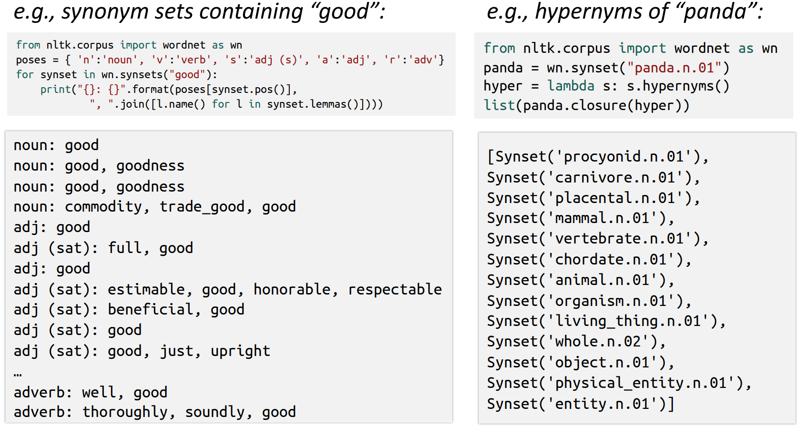
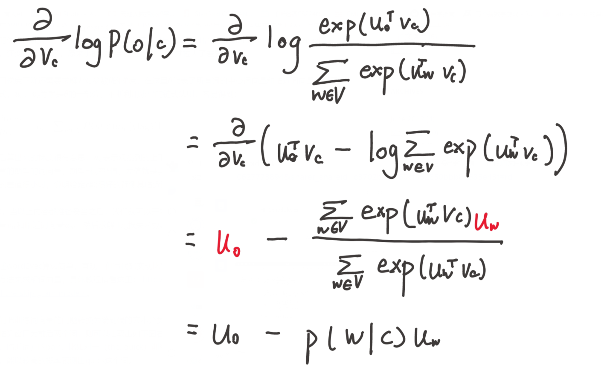
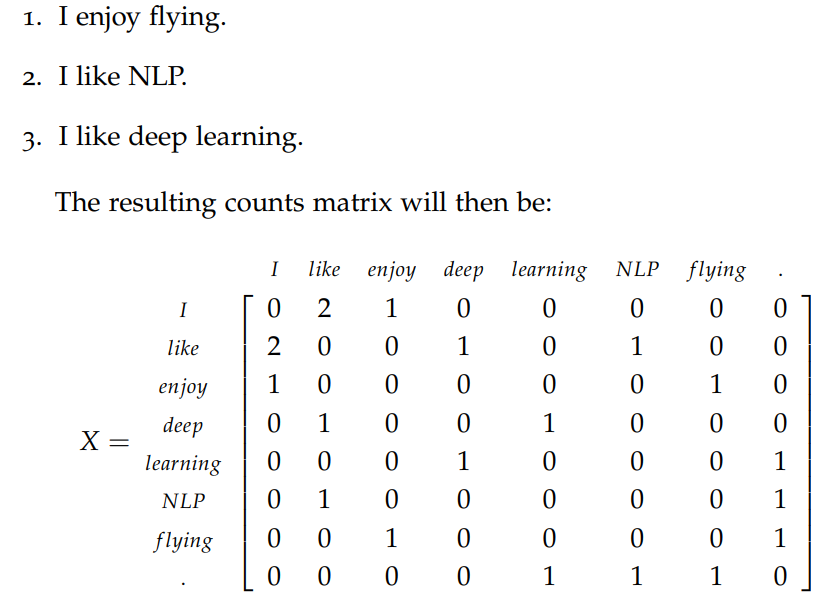
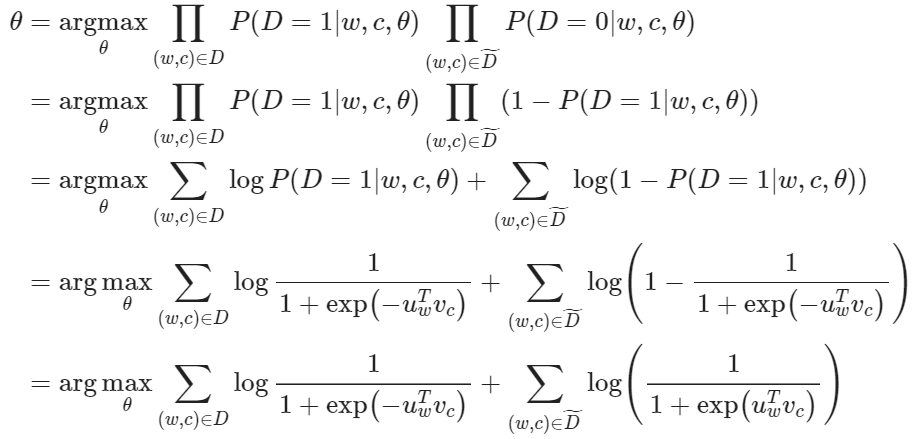

# Note1: Word Vectors

**NLP**(Natural Language Processing) 研究的是如何让计算机理解人类语言，并完成一些与人类语言相关的任务，它研究的部分功能按难度划分如下：

**Easy**

- 拼写检查
- 关键词查询
- 同义词查找

**Medium**

- 文档文档、网站中的解析信息

**Hard**

- 机器翻译
- 语义分析
- 问答系统

**单词**是自然语言的基本结构，本文主要讲解如何让计算机”学单词“

## 词的表示

人类语言是专门为传达意义而构建的系统，表示一个词最普遍的方式是**语言符号**与**语言符号背后意义**之间的转化

比如，当我们看到 "apple" 这个词时，脑海中浮现的一堆各式各样不同种类的苹果或者苹果公司这个品牌，"apple" 这个符号背后的意义便是这些具体的事物
$$
\boxed{signifier(symbol)⇔signified(idea\, or\,thing)}=denotational\,semantics
$$

### WordNet

由此，早期便提出了 WordNet，它主要是建立所有**同义词**和**下义词**(ISA关系)的词库，一个单词的含义就由它的同义词集合和下义词集合来定义

比如：

这种做法存在的问题是很显然的：

- 缺乏细节
  - 例如，“proficient” 作为 "good" 的同义词只在有些上下文中是成立的
- 需要大量主观性很强的工作对词库进行持续更新和调整，比如，在几十年前，"apple" 这个词和 "phone" 没有任何关系

- 无法计算单词间的相似度

### 离散表示

传统 NLP 将单词作为离散的符号，比如用 one-hot 向量来表示不同的单词，将单词总数作为向量的维度，该词在词典中位置对应的值为 1，其它为 0，如：

**缺陷**

一个显然的问题就是所有单词向量都是正交的，没有关于相似性的概念

为解决这个问题，于是就能引入今天的主角 **Word2vec**

### 通过上下文表达

**分布语义**(Distributional semantics) 是现代 NLP 中最成功的概念之一，它认为：一个单词的含义是由经常出现在它附近的单词给出的。

当一个单词 $w$ 出现在文本中时，它的上下文时出现在其附近的一组单词（在一个固定大小的窗口中）

我们用多个 $w$ 的上下文来构造 $w$ 的表示

如何处理这种分布的语言模型呢？就是将上下文的单词视为向量，通过某种方式计算其值，使得词向量中的数字不只是 1 和 0，从而压缩向量的维度，这种将高纬度的词转换为低纬度的词表示的方法也被称为**词嵌入**(word embedding)

## Word2vec

那么用什么方式构造呢？我们的想法是使其与出现在**相似上下文**中的单词向量相似。

**Word2vec**是谷歌提出的一个学习单词向量的**框架**

算法：

- 对于文本中的每一个位置 $t$，我们都有一个中心词 $c$ 和上下文 $o$
- 根据 $c$ 和 $o$ 单词向量的相似性来计算给定 $o$ 时上下文出现 $c$ 的概率或给定 $c$ 时上下文出现 $o$ 的概率
- 由此计算词向量，使这个概率最大

### 损失函数推导

举如下图例，计算 $P(w_{t+j}|w_t)$

对于语料库中的每个位置$t = 1,...,T$，设窗口大小为 $m$，给定中心词 $w_t$

那么我们就可以得到似然函数：
$$
\\ L(\theta)=\prod\limits_{t=1}^T\prod\limits_{-m\leq j\leq m }P(w_{t+j}|w_t;\theta)
$$
目标就是要求该函数取极值时，$\theta$ 的值

为了进行计算，我们需要对这个函数取对数，并加上负号来转化为求极小化问题，于是得到**损失函数**：
$$
\\ J(\theta)=-\frac{1}{T}logL(\theta)=-\frac{1}{T}\sum\limits_{t=1}^T\sum\limits_{-m\leq j\leq m}logP(w_{t+j}|w_t;\theta)
$$
现在要解决的问题：如何表示$P(w_{t+j}|w_t;\theta)$？

首先，对于每一个词 $w$，使用两个向量表示：

- $w$ 是中心词时，则向量为 $v_w$
- $w$ 是上下文时，则向量为 $u_w$

那么对于中心词 $c$ 和上下文 $o$：

用两者向量的点积衡量它们的相似程度，点积越大则越相似。由于概率不能为负，所以将点积取幂，由于概率和要为 1，显然应归一化处理，于是就得到了如下概率表示：
$$
\\ P(o|c) = \frac{exp(u_o^Tv_c)}{\sum\limits_{w\in V}exp(u_w^Tv_c)}
$$
其实也就是点积的 softmax 函数

假设每个向量有 $d$ 维，那么最后计算出来的 $\theta$ 就是一个包含了所有单词的中心词向量和上下文向量的矩阵，它有 $2V$ 行，$d$ 列

首先初始化 $u_w$ 和 $v_w$，然后使用梯度下降法更新

求对 $v_c$ 的偏导：

$u_0$ 表示观察到的上下文词向量，它减去所有预测的上下文词向量，梯度下降法更新即可

## 基于 SVD 的方法 

现在介绍另外一种计算词向量的方法，它基于矩阵的奇异值(SVD)分解。首先遍历所有数据，然后得到计数矩阵 $X$，对 $X$ 进行 SVD 分解得到 $USV^T$，最后用 $U$ 的行作为所有词的词向量

矩阵 $X$ 的获取有两种种方式：

### Word-Document Matrix

这种做法基于一个猜想：相关联的单词在同一个文档中会经常出现。假设文档数目为$M$，则遍历所有文档，当 第 $i$ 个单词出现在第 $j$ 篇文档时，则将矩阵中的 $X_{ij}$ 加 1

这样做生成的矩阵为 $|V|$ 行 $M$ 列，可能非常大，并不是一个好的做法

### Window based Co-occurrence Matrix

逻辑与上一个方法一方，只不过只考虑每个单词是否出现在关联单词周围特定大小窗口中，来生成 $|V|$ 行 $|V|$ 列的矩阵

例如设置窗口大小为 1：

最后，对矩阵 $X$ 进行奇异值分解：

用$\frac{\sum_{i=1}^k\sigma_i}{\sum_{i=1}^{|V|}\sigma_I}$表示第一个 k 维捕获方差量，根据它来得到 k，将 $U$ 矩阵截断，只取前 k 列，在尽可能保证信息量的情况下降低维度

最后就得到 k 维的词向量

基于奇异值的方法也有些问题：

- 矩阵的维度非常大，会可能经常变化（添加新单词或增加语料库）
- 矩阵非常稀疏
- 计算复杂度高

于是又有了一种基于迭代的方法

## 基于迭代的方法 - Word2vec

该方法之所以称为基于迭代的方法，是它不需要在每次新增语料库后都要全部重新计算

首先要建立一个概率模型，假定给定一个 n 个单词的序列的概率为：
$$
\\ P(w_1,w_2,...,w_3)
$$
如果单词出现完全独立，那么：
$$
\\ P(w_1,w_2,...,w_n)=\prod\limits_{i=1}^nP(w_i)
$$
显然，这样考虑是不妥的，下一个单词肯定高度依赖于前面的单词，所以我们让每一个单词的出现依赖于前面相邻单词：
$$
\\ P(w_1,w_2,...,w_n)=\prod\limits_{i=2}^nP(w_i|w_{i-1})
$$
这被称为 **bigram** 模型，很显然，它只考虑了邻近的单词，依旧很简单

有了这个概率模型，接下来介绍两种算法：

- **Continuous Bag of Words Model (CBOW)**，根据中心词周围的上下文来预测该词词向量
- **Skip-Gram Model**，前者相反，根据中心词预测周围上下文的词的概率分布

### CBOW 模型

首先，对于每一个词 $w$，使用两个向量表示：

- $w$ 是中心词时，则向量为 $u_w$（输出向量）
- $w$ 是上下文时，则向量为 $v_w$ （输入向量）

设 $V$ 为输入词矩阵，其第 $i$ 列为 $w_i$ 的输入向量，$U$ 为输出词矩阵，其第 $j$ 行为 $w_i$ 的输入向量

模型步骤如下：

- 假设考虑窗口为 m，那么用每一个词的 one-hot 编码 $x$，作为初始向量，那么对于 $w_c$ 的上下文为：$(x^{c-m},...,x^{c-1},x^{c+1},x^{c+m})$
- 将输入词矩阵与每个词的 one-hot 向量做积，得$(v_{c-m}=Vx^{(c-m)},...,v_{c+m}=Vx^{(c+m)})$，输入词矩阵初始值可以随机取，由于 one-hot 编码是只有对应位置才为 1，所以得到的结果就是输入词矩阵对应词所在的列

CBOW 是要用上下文词预测中心词，所以接下来的问题是要把上下文词向量融合起来表示中心词向量，融合可有很多种办法，原论文中很朴素地采用的是直接相加，于是下一步是：

- 对上述向量求平均值$\hat{v}=\frac{v_{c-m}+...+v_{c+m}}{2m}$
- 此时 $\hat{v}$ 就是计算出的中心词向量，而实际中心词向量为 $U$，所以将两者做点积$z=U\hat{v}$，该值越大则说明两向量越相似，故该向量也成为分数向量
- 使用激活函数处理，将值转换为概率 $\hat{y}=softmax(z)$
- 我们希望生成的概率 $\hat{y}$ 与实际的 one-hot 比较，模型需不断学习矩阵$U$ 和 $V$（因为这里的 one-hot 也可以看作概率，对应单词的概率为 1，其它为 0）

最后，每个单词的 one-hot 与输入词矩阵相乘就得到了词向量

结构如图：

那么如何学习 $U$ 和 $V$ 呢，考虑我们最后得到了概率 $\hat{y}$，并将其与 one-hot 比较，而信息论提供了一个度量两个概率分布的距离的方法，交叉熵 $H(\hat{y},y)$

得损失函数为：
$$
\\ H(\hat{y},y) =-\sum\limits_{j=1}^{|V|}y_ilog(\hat{y_j})
$$
由于 y 为 one-hot 向量，其它部分均为 0，故公式可以写为：
$$
\\ H(\hat{y},y) =-y_ilog(\hat{y_j})
$$
当 $\hat{y}_j$ 越接近 1 时，表示预测越精确，这个值也就越小

从而优化目标函数公式为：
$$
\\ minimize\,J=-logP(w_c|w_{c-m},...,w_{c+m}) = -logP(u_c|\hat{v}) = -h_c^T\hat{v}+log\sum\limits_{j=1}^{|V|}exp(u_j^T\hat{v})
$$
使用梯度下降法更新即可

### Skip-Gram 模型

该模型与前者逻辑一样，只不过步骤刚好相反，前者是根据上下文向量求中心词概率并于 one-hot 比较，而该模型是根据中心词求上下文向量然后与 one-hot 向量比较

过程简要如下：

- 生成中心词的 one-hot 向量 $x$
- 用输入词矩阵乘，$v_c = Vx$
- 生成分数向量 $z=Uv_c$
- 将分数向量转化为概率 $\hat{y} = softmax(z) = \hat{y}_{c-m},...,\hat{y}_{c+m}$
- 比较 $\hat{y}$ 与 one-hot 向量

结构如图：

只不过求目标函数时有些许差异，给定中心词时，假定输出的上下文的词间是独立的
$$
\\ minimize\,J=-logP(w_{c-m},...,w_{c+m}|w_c) = -log\prod\limits_{j=0,j\neq m}^{2m}P(u_{c-m+j|v_c})
$$
同样使用梯度下降法更新 $U$ 和 $V$ 即可

**计算成本优化**

让我们回到目标函数上。注意对$|V|$的求和计算量是非常大的，每次更新的时间复杂度都为$O(|V|)$，这里介绍两种方法来进行训练：

- 负采样(Negative sampling)，通过抽取负样本来定义目标
- Hierarchical softmax，通过一个有效的树结构来计算所有词的概率

### Negative Sampling

思路是不去直接计算，而是去求近似值，在每次训练时，不去遍历整个词汇表，而仅仅是抽取一些负样例

它的基本要求是：对于那些高频词，被选为负样本的概率就应该比较大，反之，对于那些低频词，其被选中的概率就应该比较小，本质上是一个带权采样问题

考虑一对中心词和上下文词 $(w,c)$，用$P(D=1|w,c)$表示其来自语料库，$P(D=0|w,c)$ 表示其不是来自语料库

现在考虑建立新的目标函数，如果两者确实来自语料库，就最大化概率$P(D=1|w,c)$否则最大化概率$P(D=0|w,c)$，采用极大似然估计法

先令：
$$
\\P(D=1|w,c,\theta)=\sigma(v_c^Tv_w)=\frac{1}{1+e^{(-v_c^Tv_w)}}
$$
则：

取对小对数似然：

这个样本使用四分之三次方计算出来的概率进行计算：
$$
\\ P(w_i)=\frac{f(w_i)^{0.75}}{\sum\limits_{j=0}^n(f(w_j))^{0.75}}
$$
四分之三这个参数只是因为实际效果好而试出来的，比如如下计算：

低频词 "Bombastic" 现在被抽样的概率是之前的三倍，而 "is" 只提高了一点点

### Hierarchical Softmax

Hierarchical softmax 使用一个二叉树来表示词表中的所有词。树中的每个叶节点都是一个单词，图的每个节点（根节点和叶节点除外）与模型要学习的向量相关联。单词作为输出单词的概率定义为从根随机游走到该单词所对应的叶节点的概率

这样，我们将对$|V|$个词的概率归一化问题，转化成了对$log(|V|)$个词的概率拟合问题计算复杂度优化为$O(log(|V|))$

先定义几个量：

- $L(w)$为从根节点到叶节点$w$的路径中节点数目
- $n(w,i)$为与向量$v_{n(w,i)}$相关路径上第$i$个节点，则$n(w,1)$为根节点，$n(w,L(w))$为$w$的父节点
- 对每个内部节点，定义它的子节点为$ch(n)$

则：
$$
\\ p(w|w_i)=\prod\limits_{j=1}^{L(w)-1}\sigma([n(w,j+1)=ch(n(w,j))]v_{n(w,j)^T}v_{w_i})
$$
最后计算点积来比较输入向量与内部节点向量的相似度，不是更新每个词的输出向量，而是更新更新二叉树中从根结点到叶结点的路径上的节点的向量

被验证效果最好的构造二叉树的方法时依据单词频率构造 Huffman 树，词频更高的单词就更靠近根节点