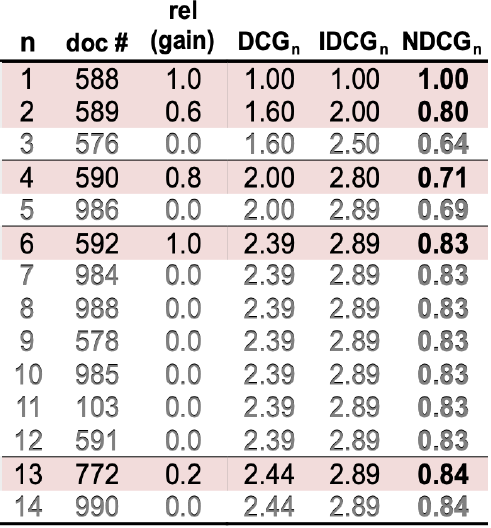
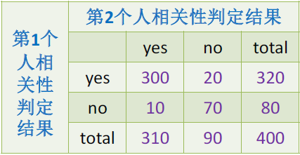

# Note2-评价指标

## 单值概括

先来点比较简单和比较常见的：

- MAP(Mean Average Precision)：对不同召回率点上的准确率进行平均得到 AP，在对所有查询的 AP 求平均得到 MAP

- R-Precision：给定一个查询，排序结果列表中前 R 个位置的准确率
- Pricision@N：前 N 个位置上的准确率
- RR：第一个相关文档出现位置的倒数

### NDCG（归一化折损累计增益）

考虑针对一个查询，很少有文档完全相关或完全不相关，需要引进相关性分数

先一点点来理解 NDCG(Normalized Discounted Cumulative Gain)

- **G**ain：所有项的相关性分数
- **C**umulative **G**rain：表示对前 k 个项的 Gain 进行累加
- **D**iscounted **C**umulative **G**ain：考虑排序因素，使得排名靠前的项增益更高，对靠后的项进行折损，$DCG_k=\sum\limits_{i=1}^k\frac{\text{rel}(i)}{\text{log}_2(i+1)}$
- **I**deal **DCG**：理想化的 DCG，按$\text{rel}(i)$降序排列时算出来的 DCG
- **N**ormalized **DCG**：$NDCG_k=\frac{DCG_k}{IDCG_k}$

举例：

## 一致性检验-Kappa

基于混淆矩阵的 Kappa 系数：
$$
k=\frac{p_o-p_e}{1-p_e}
$$

- $p_o$：对角线元素之和 / 总数。也就是两者分类相同的数目的比率
- $p_e$：$\sum\limits_i$(第$i$行元素之和+第$i$列元素之和)$^2$ / 矩阵总数$^2$

举例：

- $p_o=\frac{300+70}{400}=0.925$
- $p_e=\frac{(80+90)^2+(320+310)^2}{(400+400)^2}=0.665$

所以 Kappa 统计量为：$\kappa=\frac{0.925-0.665}{1-0.665}=0.776$