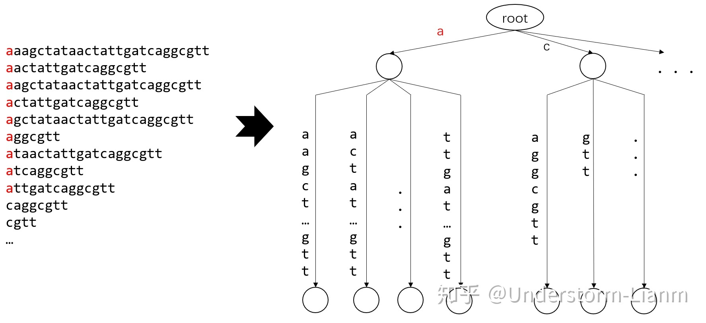
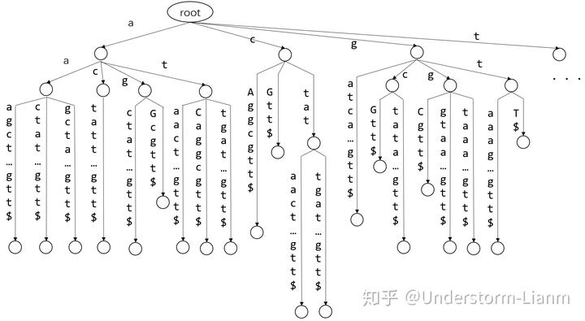

# Note4-索引及检索

## 索引的压缩

### 一些简单的编码

- Unary Code
  - 对于每一个整数 x，x 编码为 (x - 1) 个 1，以 0 结束
- Elias-γ Code
  - 对于一个整数 x(x > 0)，由两部分组成
    - $N=[\text{log}_2x]$，用 N 个 1 来表示
    - $K=x-2^{[\text{log}_2x]}$，K 用二进制编码，长度为 N，中间用 0 分割
  - 需要$1+2[\text{log}_2x]$个二进制位
- Elias-𝛿 Code
  - 与 Elias-γ Code 过程类似，只是将 N+1 按 Elias-γ Code 再一次分解
  - 需要$1+2[\text{log}_2\text{log}_22x]+[\text{log}_2x]$个二进制位

举例：

求数字 9 的个压缩码：

- Unary Code：`11111111 0`
- Elias-γ Code：`111 0 001`
- Elias-𝛿 Code：`11 0 00 001`

### Golomb Code

Golomb编码是一种基于游程编码（run-length encoding，RLE）的无损的数据编码方式，当待压缩的数据符合几何分布（Geometric Distribution）时，Golomb编码取得最优效果。

给定数值$b\, (b=\text{ln}(2)\times \text{Avg})$，$\text{Avg}$为编码数值的平均数

取

- 商：$q=[(x-1)/b]$
- 余数：$r=(x-1)-q*b$
- $c=[\text{log}_2b]$

对$x$编码，将下面两部分连接起来

- 对$q+1$采用 Unary 编码
- 对$r$用$c$或$c+1$位二进制进行编码
  - 如果$r<2^{c-1}$，则使用$c$位二进制位，以 0 开始
  - 否则使用$c+1$个二进制位，第一位为 1，剩余部分为$r-2^{c-1}$二进制编码

举例：给出数字 5 的 Golomb Code，b = 3

- $q=[(5-1)/3]=1$
  - $q+1:10$
- $r=(x-1)-q*b=4-(1*3)=1$，用 2 位编码
- 最终编码为：1010

## 签名文档

签名文档将文本切分成若干个块，每个块中包含$b$个词项，将单词映射到$B$位的位掩码，则文档的签名通过对块中所有词的掩码按位或操作得到。

### 查询

给定一个$q$，产生查询式的签名$S_q$，则匹配条件为$S_q\cup S_b=S_q$

不同词的签名重叠，很可能导致查询到的文本中并不包含待查询词，所以签名文档的最好是用来剔除那些不含查询词项的文档。

## 后缀树与后缀数组

下面内容来源：[数据结构-字符串--后缀树](https://zhuanlan.zhihu.com/p/113120009)

对于参考序列 T=gggtaaagctataactattgatcaggcgtt，其所有后缀子序列为：

```
gggtaaagctataactattgatcaggcgtt
ggtaaagctataactattgatcaggcgtt
gtaaagctataactattgatcaggcgtt
taaagctataactattgatcaggcgtt
aaagctataactattgatcaggcgtt
aagctataactattgatcaggcgtt
agctataactattgatcaggcgtt
gctataactattgatcaggcgtt
ctataactattgatcaggcgtt
tataactattgatcaggcgtt
ataactattgatcaggcgtt
taactattgatcaggcgtt
aactattgatcaggcgtt
actattgatcaggcgtt
ctattgatcaggcgtt
tattgatcaggcgtt
attgatcaggcgtt
ttgatcaggcgtt
tgatcaggcgtt
gatcaggcgtt
atcaggcgtt
tcaggcgtt
caggcgtt
aggcgtt
ggcgtt
gcgtt
cgtt
gtt
tt
t
```

将其按照字母顺序排序：

```
aaagctataactattgatcaggcgtt
aactattgatcaggcgtt
aagctataactattgatcaggcgtt
actattgatcaggcgtt
agctataactattgatcaggcgtt
aggcgtt
ataactattgatcaggcgtt
atcaggcgtt
attgatcaggcgtt
caggcgtt
cgtt
ctataactattgatcaggcgtt
ctattgatcaggcgtt
gatcaggcgtt
gcgtt
gctataactattgatcaggcgtt
ggcgtt
gggtaaagctataactattgatcaggcgtt
ggtaaagctataactattgatcaggcgtt
gtaaagctataactattgatcaggcgtt
gtt
t
taaagctataactattgatcaggcgtt
taactattgatcaggcgtt
tataactattgatcaggcgtt
tattgatcaggcgtt
tcaggcgtt
tgatcaggcgtt
tt
ttgatcaggcgtt
```

这便是后缀数组（suffix array）。此时，若要查询其中的子串，如aagctataacta，则可以利用排序后的后缀子序列，通过二分法进行高效检索。

其搜索长度正比于子串长度n，因此其算法时间复杂度为线性复杂度，即为 $O(n)$，但是这是一种以空间换时间的策略，需要消耗 $\frac{n(n+1)}{2}$个单位存储空间，因此其算法的空间复杂度为平方复杂度，即为$O(n^2)$

但是相对于直接以排序后的所有后缀子串进行存储，其实还有极大的优化空间：局部紧邻的几个后缀子串存在公共前缀，可以让它们共享一个公共前缀子串，以实现数据压缩：



最终得到压缩结果如下：



这便是后缀树（suffix trie tree），因此可以说，后缀树来自于后缀数组，是后缀数组数据压缩的一种表示方式。所以，在后缀树中进行子串的查找与后缀数组类似，都是二分查找法。

## 顺序检索

见下一篇文章：[字符串匹配算法总结](note5)
