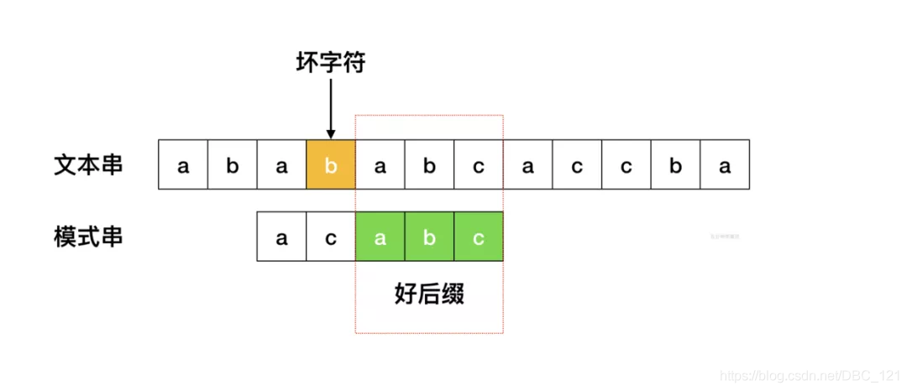

# Note5-字符串匹配算法总结

## Brute Force算法

其实就是暴力搜索

## Horspool算法

预先计算出一个按字母顺序索引的表$d$

- $d[c]$：如果窗口中最后一个字符是$c$，窗口移动多少位置
  - 设模式长度为$m$
  - $d[c]=m$，如果$c$不包含在模式的前$m-1$个字符中
  - $d[c]=$ 模式前$m-1$个字符中最右边的$c$到模式最后一个字符的距离

以下内容来自：[ Horspool 算法-CSDN博客](https://blog.csdn.net/khwkhwkhw/article/details/51288502)

情况1：看第一行，模式中不存在 c（此时c就是字母A），模式的移动长度就是它的全部长度，移到第二行所示的位置。

情况2：看第二行，c（此时 c 就是字符O）正好是模式的最后一个字符，但是从右向左比较时，有字符不匹配，比如此时的 A 和 E 不匹配。而且模式中的其他 m-1 个字符也不包含 c。移动的情况类似情况 1，移动的幅度等于模式的全部长度，移到第三行所示的位置。

情况3：看第一行，模式中存在 c（此时 c 就是字符 L），但是它不是模式的最后一个字符，移动时应该把模式中最右边的 c 和文本中的 c对齐，移到第二行所示的位置。

情况4：看第二行，c（此时 c 就是字符 O）正好是模式的最后一个字符，但是从右向左比较时，有字符不匹配，比如此时的 A 和 E 不匹配。而此时模式中的其他 m-1 个字符包含 c。移动的情况类似情况 3，移动时应该把前 m-1 个字符中最右边的 c 和文本中的 c 对齐，移到第三行所示的位置。

## KMP算法

学过无数遍的东西了，跳过

## Boyer-Moore算法

以下内容来自：[不用找了，学习BM算法，这篇就够了（思路+详注代码）](https://blog.csdn.net/DBC_121/article/details/105569440)

BM算法定义了两个规则：

- 坏字符规则：当文本串中的某个字符跟模式串的某个字符不匹配时，我们称文本串中的这个失配字符为坏字符，此时模式串需要向右移动，移动的位数 = 坏字符在模式串中的位置 - 坏字符在模式串中最右出现的位置。此外，如果坏字符不包含在模式串之中，则最右出现位置为 -1。
- 好后缀规则：当字符失配时，后移位数 = 好后缀在模式串中的位置 - 好后缀在模式串上一次出现的位置，且如果好后缀在模式串中没有再次出现，则为 -1。

### 举例

下面举例说明BM算法。例如，给定文本串`HERE IS A SIMPLE EXAMPLE`，和模式串`EXAMPLE`，现要查找模式串是否在文本串中，如果存在，返回模式串在文本串中的位置。

- 首先，文本串与模式串头部对齐，从尾部开始比较。S 与 E 不匹配。这时，S 就被称为坏字符（bad character），即不匹配的字符，它对应着模式串的第6位。且 S 不包含在模式串`EXAMPLE`之中（相当于最右出现位置是-1），这意味着可以把模式串后移 6-(-1)=7位，从而直接移到 S 的后一位。

  

- 依然从尾部开始比较，发现`P`与`E`不匹配，所以`P`是坏字符。但是，`P`包含在模式串`EXAMPLE`之中。因为`P`这个坏字符对应着模式串的第`6`位（从`0`开始编号），且在模式串中的最右出现位置为`4`，所以，将模式串后移`6-4=2`位，两个P对齐。

  

  

- 依次比较，得到 `MPLE`匹配，称为"好后缀"（good suffix），即所有尾部匹配的字符串。注意，"`MPLE`"、"`PLE`"、"`LE`"、"`E`"都是好后缀。

  

- 发现`I`与`A`不匹配：`I`是坏字符。如果是根据坏字符规则，此时模式串应该后移`2-(-1)=3`位。问题是，有没有更优的移法？

  

  

- 更优的移法是利用好后缀规则：当字符失配时，后移位数 = 好后缀在模式串中的位置 - 好后缀在模式串中上一次出现的位置，且如果好后缀在模式串中没有再次出现，则为-1。所有的好后缀（MPLE、PLE、LE、E）之中，只有E在EXAMPLE的头部出现，所以后移6-0=6位。可以看出，坏字符规则只能移3位，好后缀规则可以移6位。每次后移这两个规则之中的较大值。这两个规则的移动位数，只与模式串有关，与原文本串无关。

  

- 继续从尾部开始比较，P与E不匹配，因此P是坏字符，根据坏字符规则，后移 6 - 4 = 2位。因为是最后一位就失配，尚未获得好后缀。

  