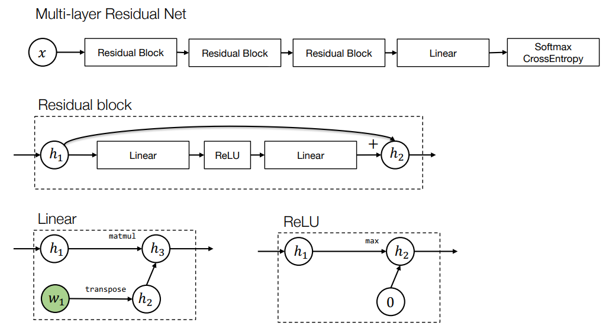
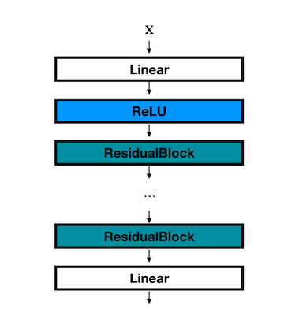
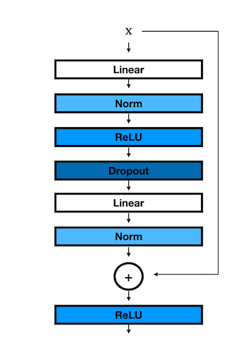

# 贰-构建神经网络库

前面，我们已经实现了计算图自动求导机制。本文就开始真正搭建一个端到端的深度学习开发框架，实现一些必要的深度学习组件。本文对应了 CMU 10-714 dlsys 课程[^1]的 HW2

## 架构与实现

正如在本系列第零篇[^2]提到的，机器学习整个过程本身就是非常模块化的，任何一个机器学习算法都至少由三部分组成：

- The hypothesis class：通过一组参数，特定的结构将输入映射到输出（如一张图片映射到它的类别）的过程
- The loss function：评价上述当前模型参数的参数好坏
- An optimization method：调整当前模型参数，降低损失值的c策略

且这三个部分之间是完全独立的。本文就将根据这三部分抽象出必要的组件并实现它们。下图就是本文要实现的 4 个组件，及它们之间的关系：

- Data loader and preprocessing：实现加载数据集（将数据集划分成不同的 batch 等功能），及数据预处理
- nn.Module：抽象神经网络结构，根据输入得到输出
- Initialization：使用不同的初始化方法初始化 nn.Module 中的模型参数
- Optimizer：接收 nn.Module 传入的模型参数，依据不同的优化方法进行参数更新

### nn.Module

nn.Module 模块能让我们轻易地搭建各式各样的深度学习模型，如下图所示：


这其中的每一个矩形块都可以看作一个小模块（继承自`nn.Module`），每个模块接收输入并得到一个输出，而模块内部可以由一些更小的模块组合或 Tensor 的运算来实现。

我们将这些模块抽象为`nn.Module`：
```python
class Module:
    def __init__(self):
        self.training = True

    def parameters(self) -> List[Tensor]:
        """Return the list of parameters in the module."""
        return _unpack_params(self.__dict__)

    def _children(self) -> List["Module"]:
        return _child_modules(self.__dict__)

    def eval(self):
        self.training = False
        for m in self._children():
            m.training = False

    def train(self):
        self.training = True
        for m in self._children():
            m.training = True

    def __call__(self, *args, **kwargs):
        return self.forward(*args, **kwargs)
```

不同模块中的参数最后组合起来会形成一个巨大的计算图，训练过程就是更新所有模块中的参数的过程。由于模块之间可以任意组合嵌套，且有些类的有些变量需要参与训练，有些变量不需要参与训练，为了抽取出所有模型参数，我们定义一个 `Parameter`类统一表示参数：

```python
class Parameter(Tensor):
    """A special kind of tensor that represents parameters."""
```

训练时，使用`module.parameters()`，就可以得到这个模型所有参数构成的列表。具体实现为利用`__dict__`方法将类的所有属性值对传入`_unpack_params`函数，这个函数将所有 Patameter 类的实例加入列表中：

```python
def _unpack_params(value: object) -> List[Tensor]:
    if isinstance(value, Parameter):
        return [value]
    elif isinstance(value, Module):
        return value.parameters()
    elif isinstance(value, dict):
        params = []
        for k, v in value.items():
            params += _unpack_params(v)
        return params
    elif isinstance(value, (list, tuple)):
        params = []
        for v in value:
            params += _unpack_params(v)
        return params
    else:
        return []
```

此外，损失函数无非是接收 Module 的输出，计算并输出损失值，所以我们可以也将它看作一个 Module。

本部分将实现如下类：

```python
class Linear(Module)
class Flatten(Module)
class ReLU(Module)
class Sequential(Module)
class SoftmaxLoss(Module)
class BatchNorm1d(Module)
class LayerNorm1d(Module)
class Dropout(Module)
class Residual(Module)
```

这里以`BatchNorm1d`为例，讲解具体实现细节。BatchNorm[^4]是一种特征归一化方法，它计算每个 mini-batch 的均值和方差，将其拉回到均值为 0 方差为 1 的标准正态分布，可以加快模型收敛速度，防止过拟合，对学习速率更鲁棒。

BatchNorm训练过程和测试过程是不一样的，训练过程算法如下：


- 首先计算每一个 mini-batch 的均值方差并归一
- 然后对归一化的结果进行一个线性变换，$\gamma$和$\beta$都是可学习参数

而在测试时，对测试集 mini-batch 做归一化是没有意义的，这时的均值和方差用在训练时对每一步均值和方差的滑动平均来代替。即在训练时用下面代码维护一个全局的`running_mean`和`running_var`

```python
self.running_mean = (1 - self.momentum) * self.running_mean + self.momentum * mean.data
self.running_var = (1 - self.momentum) * self.running_var + self.momentum * var.data
```

显然，`running_mean`和`running_var`并不是需要梯度更新的参数，BatchNorm1d 代码如下：

```python
class BatchNorm1d(Module):
    def __init__(self, dim, eps=1e-5, momentum=0.1, device=None, dtype="float32"):
        super().__init__()
        self.dim = dim
        self.eps = eps
        self.momentum = momentum
        # 需要学习的参数都必须为 Parameter 类
        self.weight = Parameter(init.ones(self.dim),requires_grad=True)
        self.bias = Parameter(init.zeros(self.dim),requires_grad=True)
        self.running_mean = init.zeros(self.dim)
        self.running_var = init.ones(self.dim)

    def forward(self, x: Tensor) -> Tensor:
        batch_size = x.shape[0]
        feature_size = x.shape[1]
        # running estimates
        mean = x.sum(axes=(0,)) / batch_size
        x_minus_mean = x - mean.broadcast_to(x.shape)
        var = (x_minus_mean ** 2).sum(axes=(0, )) / batch_size

        if self.training:
            self.running_mean = (1 - self.momentum) * self.running_mean + self.momentum * mean.data
            self.running_var = (1 - self.momentum) * self.running_var + self.momentum * var.data

            x_std = ((var + self.eps) ** 0.5).broadcast_to(x.shape)
            normed = x_minus_mean / x_std
            return normed * self.weight.broadcast_to(x.shape) + self.bias.broadcast_to(x.shape)
        else:
            normed = (x - self.running_mean) / (self.running_var + self.eps) ** 0.5
            return normed * self.weight.broadcast_to(x.shape) + self.bias.broadcast_to(x.shape)
```

完整代码见[CMU-DL-Systems/nn.py at master · Deconx/CMU-DL-Systems (github.com)](https://github.com/Deconx/CMU-DL-Systems/blob/master/hw2/python/needle/nn.py)


### Initialization & Optimizer

这部分就是实现深度学习中一些常见的初始化和优化器，这些算法原理可见我的知乎文章：

https://zhuanlan.zhihu.com/p/582687620

本部分初始化算法实现了 Xavier 初始化和 Kaiming 初始化

优化器需要有两个功能：

- reset_grad：清空参数的梯度
- step：对参数进行更新

定义抽象类如下：

```python
class Optimizer:
    def __init__(self, params):
        self.params = params

    def step(self):
        raise NotImplementedError()

    def reset_grad(self):
        for p in self.params:
            p.grad = None
```

本部分优化器实现了动量法和 Adam 算法

完整代码见[CMU-DL-Systems/init.py at master · Deconx/CMU-DL-Systems (github.com)](https://github.com/Deconx/CMU-DL-Systems/blob/master/hw2/python/needle/init.py)

[CMU-DL-Systems/optim.py at master · Deconx/CMU-DL-Systems (github.com)](https://github.com/Deconx/CMU-DL-Systems/blob/master/hw2/python/needle/optim.py)

### Data loader and preprocessing

首先是预处理部分，实现了 torchvision.tranforms[^3] 中的两个简单函数`RandomFlipHorizontal`和`RandomCrop`，这些都是对图像数据进行数据增强的操作，实现较为简单。

然后实现了一个简单的`DataLoader`类

```python
class DataLoader:
    r"""
    Data loader. Combines a dataset and a sampler, and provides an iterable over
    the given dataset.
    Args:
        dataset (Dataset): dataset from which to load the data.
        batch_size (int, optional): how many samples per batch to load
            (default: ``1``).
        shuffle (bool, optional): set to ``True`` to have the data reshuffled
            at every epoch (default: ``False``).
     """
    dataset: Dataset
    batch_size: Optional[int]

    def __init__(
        self,
        dataset: Dataset,
        batch_size: Optional[int] = 1,
        shuffle: bool = False,
    ):

        self.dataset = dataset
        self.shuffle = shuffle
        self.batch_size = batch_size
        if not self.shuffle:
            self.ordering = np.array_split(np.arange(len(dataset)), 
                                           range(batch_size, len(dataset), batch_size))

    def __iter__(self):
        if self.shuffle:
            order = np.arange(len(self.dataset))
            np.random.shuffle(order)
            self.ordering = np.array_split(order, 
                                           range(self.batch_size, len(self.dataset), self.batch_size))
        self.index = 0
        return self

    def __next__(self):
        if self.index == len(self.ordering):
            raise StopIteration
        samples = [Tensor(x) for x in self.dataset[self.ordering[self.index]]]
        self.index += 1
        return tuple(samples)
```

完整代码见[CMU-DL-Systems/data.py at master · Deconx/CMU-DL-Systems (github.com)](https://github.com/Deconx/CMU-DL-Systems/blob/master/hw2/python/needle/data.py)

## 框架实战

回到本系列第零篇的问题：实现 MNIST 手写数字识别。那时只不过写了两层全连接神经网络，代码就非常杂乱，并且代码可扩展性，可维护性非常差。现在我们已经实现了自动求导机制，深度学习流程的 4 个组件，那么再次实现这个功能将会是什么样的呢？看完下面这个过程，你一定会惊叹于深度学习框架的高效。

### 模型构建

我们构建一个`MLPResNet`，其中`ResidualBlock`可以有若干层：



`ResidualBlock`结构如图：



在没有框架的情况下，实现这样一个模型是一件让人抓狂的事情。而现在有了`nn.Module`模块，构建模型就像搭积木一样！

```python
def ResidualBlock(dim, hidden_dim, norm=nn.BatchNorm1d, drop_prob=0.1):
    modules = nn.Sequential(
        nn.Linear(dim, hidden_dim),
        norm(hidden_dim),
        nn.ReLU(),
        nn.Dropout(drop_prob),
        nn.Linear(hidden_dim, dim),   
        norm(dim)
    )
    return nn.Sequential(
        nn.Residual(modules),
        nn.ReLU()
    )

def MLPResNet(dim, hidden_dim=100, num_blocks=3, num_classes=10, norm=nn.BatchNorm1d, drop_prob=0.1):
    modules = [nn.Linear(dim, hidden_dim), nn.ReLU()]
    for i in range(num_blocks):
        modules.append(ResidualBlock(hidden_dim, hidden_dim//2, norm, drop_prob))
    modules.append(nn.Linear(hidden_dim, num_classes))
    return nn.Sequential(*modules)
```

## 训练

训练过程就更不用说了，`DataLoader`已经为你准备好了每一个 batch 的数据，你只需要选好损失函数和优化器，每一步先调用`Optimizer.reset_grad()`清空梯度，然后`loss.backward()`反向传播，再调用`optimizer.step()`更新参数就完成了训练！

```python
train_loader = ndl.data.DataLoader(train_data, batch_size)
test_loader = ndl.data.DataLoader(test_data, batch_size)
model = MLPResNet(784, hidden_dim=hidden_dim)
opt = optimizer(model.parameters(), lr=lr, weight_decay=weight_decay)

for idx, data in enumerate(train_loader):
    x, y = data
    output = model(x)
    opt.reset_grad()
    loss = loss_func(output, y)
    loss.backward()
    opt.step()
```


## 参考

[^1]: [Deep Learning Systems (dlsyscourse.org)](https://dlsyscourse.org/)
[^2]: [动手写深度学习框架 | 零-从 0 实现 MNIST 手写数字识别 - 知乎 (zhihu.com)](https://zhuanlan.zhihu.com/p/564003337)

[^3]: [Transforming and augmenting images — Torchvision main documentation (pytorch.org)](https://pytorch.org/vision/stable/transforms.html)

[^4]: [Batch Normalization: Accelerating Deep Network Training by Reducing Internal Covariate Shift (arxiv.org)](https://arxiv.org/abs/1502.03167)
