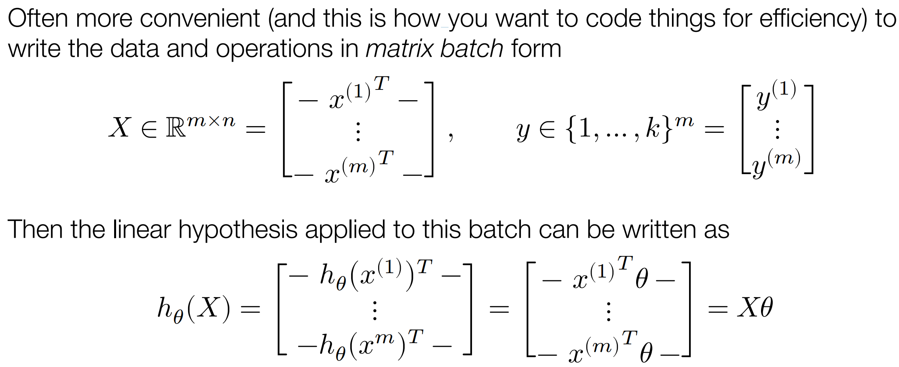
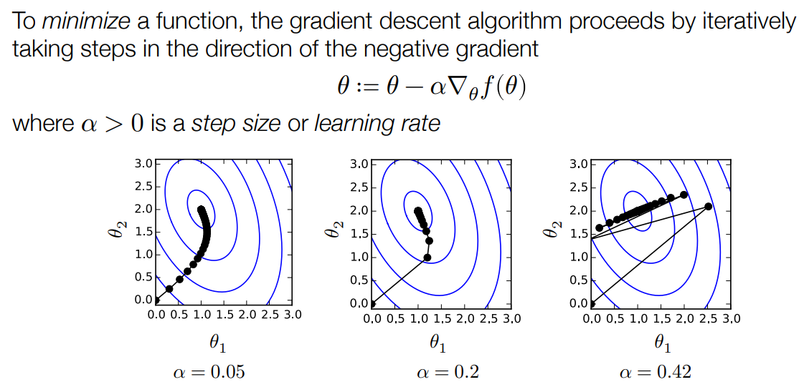
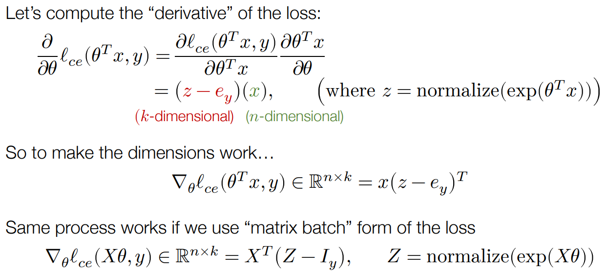
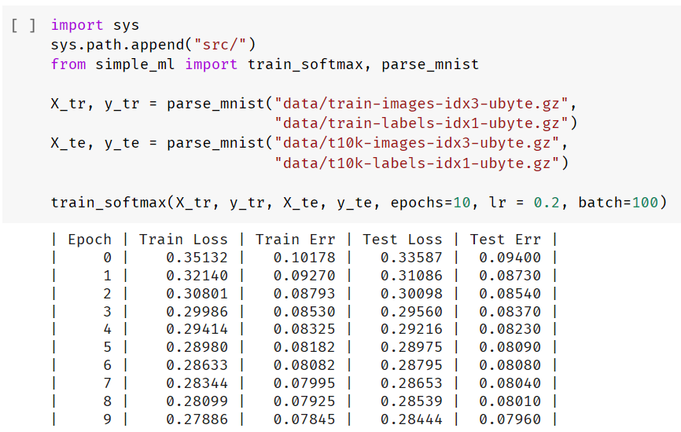

# 零-从0实现MNIST手写数字识别

本学期，CMU 开设了一门新课：**Deep Learning Systems: Algorithm and Implementaion**。根据课程主页的介绍，通过这门课，我们能学到整个深度学习系统开发的技术：从高级的建模设计，到自动微分工具的实现，再到算法的底层实现，最终搭建起自己的深度学习框架。想想就令人兴奋！

更重要的是，这门课程将在线上同步开放，并且为线上的同学开放**校内论坛**和**作业评测系统**。

作为一个计算机系 AI 专业的学生，相比简单的调库调参，库本身的底层实现更令我着迷，毕竟，谁不喜欢造轮子呢？因此，我早早就报名了这门课程，并对其充满了期待。

课程前几天开放了第一个作业，本文就是我对第一个作业及相关知识的总结。

## 算法

对于 AI 人来说，“手写数字识别”的实现就好比初学编程人的“Hello, World!”，因为它是机器学习要解决的最基础的问题——分类问题


如上图所示，我们要做的就是把一堆像素点分到其对应的类别（0-9）中，先定义如下符号：

- 训练数据：$x^{(i)}\in R^n$, $y^{(i)}\in \{1,...,k\}$ for $i=1,..,m$
- 这里$m$指训练数据的数量，$n$指训练数据的特征数，$k$指训练数据的类别/标签
- 比如，在手写数字识别中，$m$就是训练图片的数量，$n$就是每张图片的像素的数量（当然，也可以找其它特征），$k$就是这张图片对应的数字

任何一个机器学习算法都要由三部分组成：

- 模型假设：通过一组参数将输入映射到输出（如一张图片映射到它的类别）
- 损失函数：评价上述选取的参数好坏
- 优化方法：调整参数使损失值最小的方法

### 模型假设

所以，第一步，我要做的就寻找一个函数，把$x$（这一堆像素点）映射到一个$k$维向量：

$$
h:R^n \rightarrow R^k
$$

$h_i(x)$越大，表示$x$在第$i$类的概率越大

这里我们使用最简单的线性函数：$h_{\theta}(x)=\theta^Tx$，由线性代数的基本知识$\theta\in R^{n\times k}$

为了方便表达，对于$m$组训练数据，我们就可以写成如下矩阵的形式：



### 损失函数

最简单的想法，判断预测的出现概率最大的类别是不是真实的类别，如果正确则损失为 0，否则为 1，即：


但是这个函数一个显然的缺点就是不可导，难以用其对参数进行优化。

我们可以先用 Softmax 函数将参数转换为类似于“概率”的形式（值均为正数，且和为 1）：


然后对其取负对数，就得到了本文要使用的损失函数，也称交叉熵损失


由此，我们就明确了要解决的问题：令损失函数最小，即：


### 优化方法

有了损失函数，接下来就要明确用何种优化方法使损失函数最小。本文采用**梯度下降法**

，向函数梯度的反方向迭代搜索就能逐步得到局部最小值，如图：



在实际应用中，常常使用随机梯度下降（Stochastic gradient descent），每次只取训练数据集的一个小批量（batch）进行计算


接下来，就是要对参数$\theta$求梯度：



综上，本文手写数字识别设计的机器学习算法就是要做如下计算得到$\theta$：


## 代码实现

### 解析 MNIST 数据集

由于我们是要“从 0 实现 MNIST 手写数字识别”，因此解析数据集也得亲自实现。可前往[http://yann.lecun.com/exdb/mnist/](http://yann.lecun.com/exdb/mnist/)下载并查看数据集格式。

图片的格式为：

```te
[offset] [type]          [value]          [description]
0000     32 bit integer  0x00000803(2051) magic number
0004     32 bit integer  60000            number of images
0008     32 bit integer  28               number of rows
0012     32 bit integer  28               number of columns
0016     unsigned byte   ??               pixel
0017     unsigned byte   ??               pixel
........
xxxx     unsigned byte   ??               pixel
```

标签的格式为：

```plain
[offset] [type]          [value]          [description]
0000     32 bit integer  0x00000801(2049) magic number (MSB first)
0004     32 bit integer  10000            number of items
0008     unsigned byte   ??               label
0009     unsigned byte   ??               label
........
xxxx     unsigned byte   ??               label
The labels values are 0 to 9.
```

我们可以通过 Python 的`struct`库读取数据流，代码如下：

```python
def parse_mnist(image_filesname, label_filename):
    """ Read an images and labels file in MNIST format.  See this page:
    http://yann.lecun.com/exdb/mnist/ for a description of the file format.

    Args:
        image_filename (str): name of gzipped images file in MNIST format
        label_filename (str): name of gzipped labels file in MNIST format

    Returns:
        Tuple (X,y):
            X (numpy.ndarray[np.float32]): 2D numpy array containing the loaded
                data.  The dimensionality of the data should be
                (num_examples x input_dim) where 'input_dim' is the full
                dimension of the data, e.g., since MNIST images are 28x28, it
                will be 784.  Values should be of type np.float32, and the data
                should be normalized to have a minimum value of 0.0 and a
                maximum value of 1.0.

            y (numpy.ndarray[dypte=np.uint8]): 1D numpy array containing the
                labels of the examples.  Values should be of type np.uint8 and
                for MNIST will contain the values 0-9.
    """
    #### BEGIN YOUR CODE
    f = gzip.open(image_filesname)
    data = f.read()
    f.close()
    h = struct.unpack_from('>IIII', data, 0)
    offset = struct.calcsize('>IIII')
    imgNum = h[1]
    rows = h[2]
    columns = h[3]
    pixelString = '>' + str(imgNum * rows * columns) + 'B'
    pixels = struct.unpack_from(pixelString, data, offset)
    X = np.reshape(pixels, [imgNum, rows * columns]).astype('float32')
    X_max = np.max(X, axis=1, keepdims=True)
    X_min = np.min(X, axis=1, keepdims=True)
  
    X_normalized = ((X - X_min) / (X_max - X_min))
  
  
    f = gzip.open(label_filename)
    data = f.read()
    f.close()
    h = struct.unpack_from('>II', data, 0)
    offset = struct.calcsize('>II')
    num = h[1]
    labelString = '>' + str(num) + 'B'
    labels = struct.unpack_from(labelString, data, offset)
    y = np.reshape(labels, [num]).astype('uint8')
  
    return (X_normalized,y)
    #### END YOUR CODE
```

### 实现损失函数

根据上面的推导，函数为：

$$
\ell_{\mathrm{softmax}}(z, y) = \log\sum_{i=1}^k \exp z_i - z_y.
$$

所以可以先不实现 Softmax 函数，代码：

```python
def softmax_loss(Z, y):
    """ Return softmax loss.  Note that for the purposes of this assignment,
    you don't need to worry about "nicely" scaling the numerical properties
    of the log-sum-exp computation, but can just compute this directly.

    Args:
        Z (np.ndarray[np.float32]): 2D numpy array of shape
            (batch_size, num_classes), containing the logit predictions for
            each class.
        y (np.ndarray[np.int8]): 1D numpy array of shape (batch_size, )
            containing the true label of each example.

    Returns:
        Average softmax loss over the sample.
    """
    #### BEGIN YOUR CODE
    m = Z.shape[0]
    Z1 = np.log(np.sum(np.exp(Z), axis=1)).T
    Z2 = Z[np.arange(0, m), y]
    return np.mean(Z1-Z2)
  
    #### END YOUR CODE
```

### 实现 Softmax 回归

由前面的推导，梯度如下：

$$
\begin{aligned}
\nabla_\Theta \ell_{\mathrm{softmax}}(X \Theta, y) = \frac{1}{m} X^T (Z - I_y)
\end{aligned}
$$

其中，$Z = normalize(\exp(X \Theta)) \quad \text{(normalization applied rowwise)}$，$I_y \in \mathbb{R}^{m \times k}$表示通过标签$y$得到的独热向量

首先实现 Softmax 函数：

```python
def softmax(x):
    """Compute the softmax function for each row of the input x.
    It is crucial that this function is optimized for speed because
    it will be used frequently in later code. 

    Arguments:
    x -- A D dimensional vector or N x D dimensional numpy matrix.
    Return:
    x -- You are allowed to modify x in-place
    """
    orig_shape = x.shape

    if len(x.shape) > 1:
        # Matrix
        tmp = np.max(x, axis=1)
        x -= tmp.reshape((x.shape[0], 1)) # 防止溢出
        x = np.exp(x)
        tmp = np.sum(x, axis=1)
        x /= tmp.reshape((x.shape[0], 1))
    else:
        # Vector
        tmp = np.max(x)
        x -= tmp
        x = np.exp(x)
        tmp = np.sum(x)
        x /= tmp

    assert x.shape == orig_shape
    return x
```

代码：

```python
def softmax_regression_epoch(X, y, theta, lr = 0.1, batch=100):
    """ Run a single epoch of SGD for softmax regression on the data, using
    the step size lr and specified batch size.  This function should modify the
    theta matrix in place, and you should iterate through batches in X _without_
    randomizing the order.

    Args:
        X (np.ndarray[np.float32]): 2D input array of size
            (num_examples x input_dim).
        y (np.ndarray[np.uint8]): 1D class label array of size (num_examples,)
        theta (np.ndarrray[np.float32]): 2D array of softmax regression
            parameter, of shape (input_dim, num_classes)
        lr (float): step size (learning rate) for SGD
        batch (int): size of SGD minibatch

    Returns:
        None
    """
    #### BEGIN YOUR CODE
    k = theta.shape[1]
    m = X.shape[0]
  
    for i in range(0, m, batch):
      X_batch = X[i:i+batch]
      y_batch = y[i:i+batch]

      y_pre = np.dot(X_batch, theta) # bxk
      # y_e = np.exp(y_pre) # bxk

      # Z = y_e / np.sum(y_e, axis=1).reshape(-1, 1) # bxk
      Z = softmax(y_pre)
      I = np.eye(k)[y_batch]  # bxk
      g = np.dot(X_batch.T, Z - I) / batch # dxb bxk -> dxk
  
      theta[:,:] = theta[:,:] - lr * g


    #### END YOUR CODE
```

### 训练

由此，我们就搭建了手写数字识别机器学习模型的全部三部分，接下来就可以训练了：



错误率只有 7.96%，还是很不错的

## 扩展

### 搭建两层神经网络

接下来，让我们用两层简单的神经网络梯度下降来实现手写数字识别。

对于 $x \in \mathbb{R}^n$，考虑：

$$
\begin{equation}
z = W_2^T \mathrm{ReLU}(W_1^T x)
\end{equation}
$$

其中， $W_1 \in \mathbb{R}^{n \times d}$ and $W_2 \in \mathbb{R}^{d \times k}$表示网络的权重 (其中有一层为 $d$ 维的隐藏层)， $z \in \mathbb{R}^k$ 表示网络的输出。我们继续使用交叉熵损失，那么损失函数就为：

$$
\begin{equation}
minimize_{W_1, W_2} \;\; \frac{1}{m} \sum_{i=1}^m \ell_{\mathrm{softmax}}(W_2^T \mathrm{ReLU}(W_1^T x^{(i)}), y^{(i)}).
\end{equation}
$$

对于训练数据的一个批量 $X \in \mathbb{R}^{m \times n}$，也可以写成：

$$
\begin{equation}
minimize_{W_1, W_2} \;\; \ell_{\mathrm{softmax}}(\mathrm{ReLU}(X W_1) W_2, y).
\end{equation}
$$

利用链式求导法则，可以求得两个权重矩阵对参数的梯度，先令

$$
\begin{equation}
\begin{split}
Z_1 \in \mathbb{R}^{m \times d} & = \mathrm{ReLU}(X W_1) \\
G_2 \in \mathbb{R}^{m \times k} & = normalize(\exp(Z_1 W_2)) - I_y \\
G_1 \in \mathbb{R}^{m \times d} & = \mathrm{1}\{Z_1 > 0\} \circ (G_2 W_2^T)
\end{split}
\end{equation}
$$

$\mathrm{1}\{Z_1 > 0\}$ 表示一个与$Z_1$相同形状的矩阵，在$Z_1$对应元素为正的位置值为 1，否则为 0。$\circ$ 表示对应元素相乘。 那么梯度就为：

$$
\begin{equation}
\begin{split}
\nabla_{W_1} \ell_{\mathrm{softmax}}(\mathrm{ReLU}(X W_1) W_2, y) & = \frac{1}{m} X^T G_1  \\
\nabla_{W_2} \ell_{\mathrm{softmax}}(\mathrm{ReLU}(X W_1) W_2, y) & = \frac{1}{m} Z_1^T G_2.  \\
\end{split}
\end{equation}
$$

由此，写出代码：

```python
def nn_epoch(X, y, W1, W2, lr = 0.1, batch=100):
    """ Run a single epoch of SGD for a two-layer neural network defined by the
    weights W1 and W2 (with no bias terms):
        logits = ReLU(X * W1) * W1
    The function should use the step size lr, and the specified batch size (and
    again, without randomizing the order of X).  It should modify the
    W1 and W2 matrices in place.

    Args:
        X (np.ndarray[np.float32]): 2D input array of size
            (num_examples x input_dim).
        y (np.ndarray[np.uint8]): 1D class label array of size (num_examples,)
        W1 (np.ndarrray[np.float32]): 2D array of first layer weights, of shape
            (input_dim, hidden_dim)
        W2 (np.ndarrray[np.float32]): 2D array of second layer weights, of shape
            (hidden_dim, num_classes)
        lr (float): step size (learning rate) for SGD
        batch (int): size of SGD minibatch

    Returns:
        None
    """
    #### BEGIN YOUR CODE
    m = X.shape[0]
    k = W2.shape[1]
    for i in range(0, m, batch):
      X_batch = X[i:i+batch]
      y_batch = y[i:i+batch]

      Z1 = np.maximum(0, np.dot(X_batch, W1)) # b x hd

      y_pre = np.dot(Z1, W2) # b x k
      # y_e = np.exp(y_pre) # b x k
      # Z = y_e / np.sum(y_e, axis=1).reshape(-1, 1)
      Z = softmax(y_pre)
      I = np.eye(k)[y_batch] # b x k
      G2 = Z - I # b x k

      G1 = (np.float32(Z1>0)) * (np.dot(G2, W2.T)) # b x hd

      W1[:,:] = W1[:,:] - lr * (np.dot(X_batch.T, G1)) / batch
      W2[:,:] = W2[:,:] - lr * (np.dot(Z1.T, G2)) / batch
    #### END YOUR CODE
```

接下来，让我们训练这个网络吧！


我们仅用不到 20 行代码写出来的模型，它的识别错误率竟然低至 1.85%，简直 Amazing!

### 用 C++实现 Softmax 回归

本次作业的最后一部分是用 C++ 重写前面的 Softmax 回归（毕竟 Python 版本还是使用了 numpy 库，谈不上从 0 实现），再用 Python 调用进行训练

我们利用 Pybind11 库将写好的 C++ 接口暴露给 Python 调用

```cpp
PYBIND11_MODULE(simple_ml_ext, m) {
    m.def("softmax_regression_epoch_cpp", 
        [](py::array_t<float, py::array::c_style> X, 
           py::array_t<unsigned char, py::array::c_style> y, 
           py::array_t<float, py::array::c_style> theta,
           float lr,
           int batch) {
        softmax_regression_epoch_cpp(
            static_cast<const float*>(X.request().ptr),
            static_cast<const unsigned char*>(y.request().ptr),
            static_cast<float*>(theta.request().ptr),
            X.request().shape[0],
            X.request().shape[1],
            theta.request().shape[1],
            lr,
            batch
           );
    },
    py::arg("X"), py::arg("y"), py::arg("theta"), 
    py::arg("lr"), py::arg("batch"));
}
```

在本次作业中，我们不考虑运行效率，只要能实现功能即可，实现 Softmax 回归代码如下：

```cpp
float* matrix_dot(const float *X, const float *Y, size_t X_start, size_t X_end,
                  size_t k, size_t n)
{
    float *C = new float[(X_end - X_start) * n];
    for (size_t i = X_start; i < X_end; i++)
    {
        for (size_t j = 0; j < n; j++)
        {
            float c = 0;
            for (size_t z = 0; z < k; z++)
            {
                c += X[i * k + z] * Y[z * n + j];
            }
            C[(i - X_start) * n + j] = c;
        }
    }
    return C;
}


void matrix_softmax(float *X, size_t m, size_t n) {
    float *_sum = new float[m * 1];
  
    for(size_t i = 0; i < m; i++) {
        float cur_sum = 0;
        for(size_t j = 0; j < n; j++) {
            X[i * n + j] = exp(X[i * n + j]);
            cur_sum += X[i * n + j];
        }
        _sum[i] = cur_sum;
    }
    for(size_t i = 0; i < m; i++) {
        for(size_t j = 0; j < n; j++) {
            X[i * n + j] /= _sum[i];
        }
    }
    delete _sum;
}

float* matrix_eye(const unsigned char *y, size_t y_start, size_t y_end, size_t k) 
{
    float *I = new float[(y_end - y_start) * k];
    for(size_t i = y_start; i < y_end; i++) {
        for(size_t j = 0; j < k; j++) {
            if(j==y[i]) I[(i - y_start) * k + j] = 1;
            else I[(i - y_start) * k + j] = 0;
        }
    }
    return I;
}

float* matrix_transpose(const float *X, size_t X_start, size_t X_end, size_t n) {
    size_t m = X_end - X_start;
    float *XT = new float[n * m];
    for(size_t i = X_start; i < X_end; i++) {
        for(size_t j = 0; j < n; j++) {
            XT[j * m + i - X_start] = X[i * n + j];
        }
    }
    return XT;
}

void matrix_subtraction(float *X, float *Y, size_t m, size_t n) 
{
    for(size_t i = 0; i < m; i++) {
        for(size_t j = 0; j < n; j++) {
            X[i * n + j] -= Y[i * n + j]; 
        }
    }
}

void matrix_mul(float *X, float t, size_t m, size_t n) 
{
    for(size_t i = 0; i < m; i++) {
        for(size_t j = 0; j < n; j++) {
            X[i * n + j] *= t;
        }
    }
}
void softmax_regression_epoch_cpp(const float *X, const unsigned char *y,
								  float *theta, size_t m, size_t n, size_t k,
								  float lr, size_t batch)
{
    /**
     * A C++ version of the softmax regression epoch code.  This should run a
     * single epoch over the data defined by X and y (and sizes m,n,k), and
     * modify theta in place.  Your function will probably want to allocate
     * (and then delete) some helper arrays to store the logits and gradients.
     *
     * Args:
     *     X (const float *): pointer to X data, of size m*n, stored in row
     *          major (C) format
     *     y (const unsigned char *): pointer to y data, of size m
     *     theta (foat *): pointer to theta data, of size n*k, stored in row
     *          major (C) format
     *     m (size_t): number of exmaples
     *     n (size_t): input dimension
     *     k (size_t): number of classes
     *     lr (float): learning rate / SGD step size
     *     batch (int): SGD minibatch size
     *
     * Returns:
     *     (None)
     */

    /// BEGIN YOUR CODE
      for(size_t i = 0; i < m; i += batch) {
          // X_batch : batch x n
          // thata : n x k
          // Z = X_batch \dot theta batch x k
          float *Z = matrix_dot(X, theta, i, i + batch, n, k);
          matrix_softmax(Z, batch, k);
          float *I = matrix_eye(y, i, i+batch, k);
          float *XT = matrix_transpose(X, i, i + batch, n);
          matrix_subtraction(Z, I, batch, k);
          float *g = matrix_dot(XT, Z, 0, n, batch, k);
    
          matrix_mul(g, (float)lr/(float)batch, n, k);
          matrix_subtraction(theta, g, n, k);
    }
    /// END YOUR CODE
}
```

接下来开始训练！


结果和 Python 版本相同，但是运行速度却慢了很多。

这是因为 numpy 库底层就是用 C 甚至 Fortran 实现的，它利用了很多数值计算的特性进行优化，性能几乎已经达到了极致

希望通过后续课程的学习，我也能实现自己的高效率矩阵库
