# Note2-语法分析

词法分析是以字符为单位，通过正则语言构造出一串 token 序列；而语法分析是以 token 为单位，通过上下文无关文法构造语法分析树。

## 自顶向下分析

自从向下即从文法开始符号$S$推导出词串$w$的过程，如：

走一遍过程，可以看出，自顶向下分析的核心是两个问题：

- 替换当前句型中的哪个非终结符
- 用该非终结符的哪个候选式进行替换

本小节的核心就是解决这两个问题。对于第一个问题，我们采用最左推导方式，即总是选择每个句型的最左非终结符进行替换。

为了解决第二个问题，我们先要对上下文无关文法进行三种改造。

### 消除二义性

二义性是指$L(G)$中存在一个具有两个或两个以上最左（或最右）推导的句子，则在对$w$进行自顶向下的语法分析时，语法分析程序无法确定采用$w$的哪个最左推导。例如：

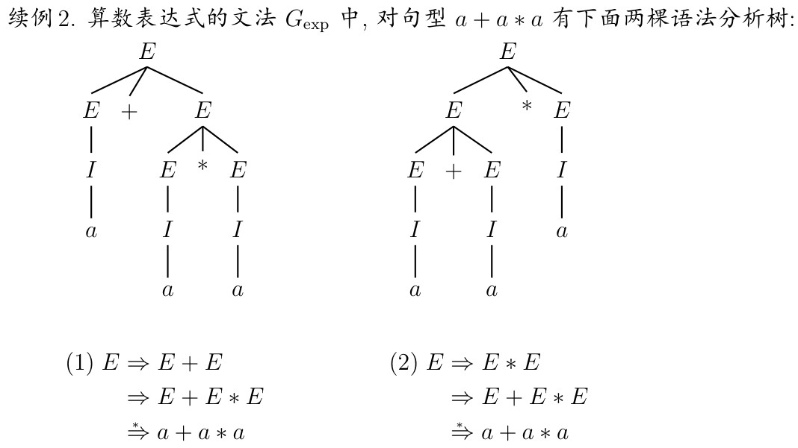

在第一步推导时，无论是选择$E\Rightarrow E+E$还是选择$E\Rightarrow E*E$，最后都能推导出句子$a+a*a$。解决办法是改造文法，引入新语法变量，细化表示范畴。在上述的例子中，我们可以认为的引入新语法变量来表示运算优先级，从而消除二义性：

### 消除直接左递归

左递归可以分为两种：

- 直接左递归。含有$A\rightarrow A\alpha$形式产生式的文法
- 间接左递归。含有$A\rightarrow B\alpha,B\rightarrow A\beta$形式产生式的文法

它会引起什么问题呢？

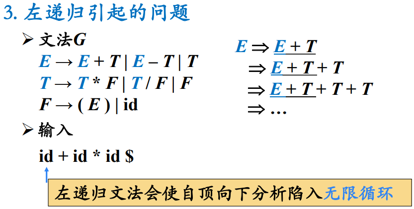

于是，就需要消除左递归：

### 提取左公因子

如果一个非终结符的多个候选存在共同前缀，很容易造成回溯现象：

算法如下：

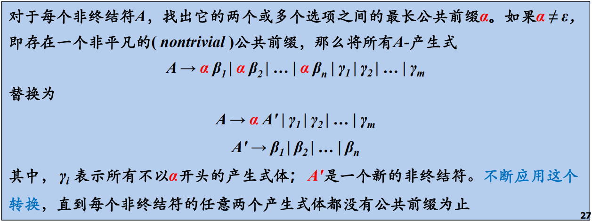

这是自顶向下语法分析的通用形式，也成为递归下降分析：

- 由一组过程组成，每个过程对应文法的一个非终结符

- 从文法开始符号$S$对应的过程开始，其中递归调用文法中其它非终结符对应的过程。如果$S$对应的过程体恰好扫描了整个输入串，则成功完成语法分析

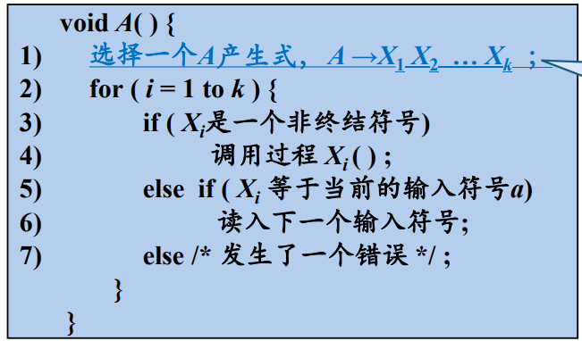

这个过程是很有可能需要回溯的，效率较低。于是就有了预测分析技术，它通过在输入中看$k$个符号来确定产生式，不需要回溯。即通过向前看$k$个符号就可唯一确定产生式的文法称为$LL(k)$文法。

## $LL(1)$文法

即仅通过当前句型的最左非终结符$A$和当前输入符号$a$就能唯一确定产生式。

先介绍两种简单的$LL(1)$文法：

- $S\_$文法。要求每个产生式的右部都以终结符开始，且同一非终结符的各个候选式的首终结符都不同，右部不能包含$\varepsilon$产生式。
- $q\_$文法。每个产生式的右部或为$\varepsilon$，或以终结符开始，具有相同左部的产生式又不相交的 SELECT 集

如何判断任意一个文法是不是$LL(1)$文法呢？我们首先定义三种集合。

### FIRST 集

给定一个文法符号串$\alpha$， $\alpha$的串首终结符集$FIRST(\alpha)$被 定义为可以从$\alpha$推导出的所有串首终结符（串首第一个符号，且是终结符）构成的集合。 如果$\alpha \Rightarrow^* \varepsilon$，那么$\varepsilon$也在$FIRST(\alpha)$中

算法：

### FOLLOW 集

可能在某个句型中紧跟在$A$后边的终结符$a$的集合
$$
FOLLOW(A)=\{a|S\Rightarrow^*aAa\beta,a\in V_T,\alpha,\beta\in(V_T \cup V_N)^* \}
$$
这个集合主要是用来判断是否使用$\varepsilon$产生式，如果当前输入符号$a$与$A$的产生式均不匹配，则可以根据$a$是否能出现在$A$的后面来决定是否使用产生式$A\rightarrow\varepsilon$

算法：

### SELECT 集

产生式$A\rightarrow \beta$的可选集是指可以选用该产生式进行推导时对应的输入符号的集合，记为$SELECT( A\rightarrow \beta )$

例如：

- $SELECT( A\rightarrow \alpha \beta ) = \{ a \}$
- $SELECT( A\rightarrow \epsilon ) = FOLLOW(A)$

可以用 FOLLOW 集来计算 SELECT 集

- 如果$\varepsilon  \notin FIRST(\alpha)$，则$SELECT( A\rightarrow \alpha ) = FIRST(\alpha)$
- 如果$\varepsilon  \in FIRST(\alpha)$，则$SELECT( A\rightarrow \alpha ) = FIRST(\alpha)-\{\varepsilon \}\cup FOLLOW(A)$

### 判定条件

文法$G$是$LL(1)$的，当且仅当$G$的任意两个具有相同左部的产生式$A\rightarrow \alpha | \beta$ 满足条件：
$$
SELECT ( A \rightarrow \alpha ) \cap SELECT( A \rightarrow \beta ) = \Phi
$$
等价条件：

- $FIRST (\alpha)∩FIRST (\beta) = \Phi$ （$\alpha$和$\beta$至多有一个能推导出$\varepsilon$）
- 如果$β\Rightarrow^* \varepsilon$，则$FIRST (\alpha)\cup FOLLOW(A) =\Phi$

### 构建预测分析表

构造算法：

如果文法$G$是$LL(1)$文法，则任何表项都不包含两条以上的产生式

### 递归的预测分析

递归的预测分析法是指：在递归下降分析中，根据预测分析表进行产生式的选择。

### 非递归的预测分析

即用下推自动机来模拟，上下文无关文法和下推自动机是等价的。具体过程：

举例：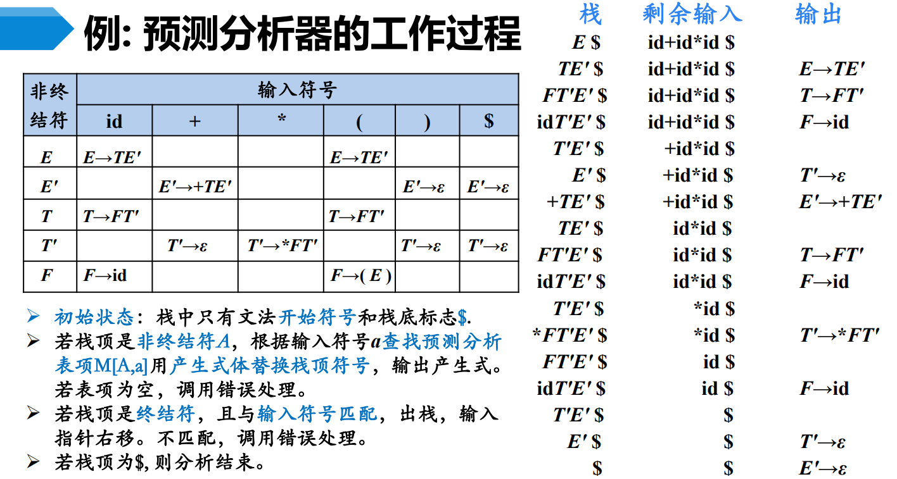

## 预测分析法总结

### 基本步骤

综上，预测分析法的实现步骤为：

1. 改造文法：消除二义性、消除左递归、提取左公因子 
2. 判断是否$LL(1)$文法：具有相同左部的产生式的 SELECT 集互不相交。
   1. 求每个非终结符的 FIRST 集和 FOLLOW 集
   2. 求每个候选式的 FIRST 集
   3. 求具有相同左部产生式的 SELECT 集 
3. 若是$LL(1)$文法，构造预测析表，实现预测分析器。 
4. 若不是$LL(1)$文法, 说明文法的复杂性超过预测分析法的分析能力。
   - 如果能处理冲突表项，依然可以采用预测分析法。
   - 无法处理冲突，采用自底向上分析方法。

### 错误处理

两种情况下可以检测到语法错误

- 栈顶的终结符和当前输入符号不匹配
- 栈顶非终结符$A$与当前输入符号$a$在预测分析表对应项中的信息为空

Panic Mode 策略：

- 如果终结符在栈顶而不能匹配，弹出此终结符
- 如果$M[A,a]$为空，则忽略输入中的一些符号，直至遇到同步符号(synchronizing token)。
  - 可以把$FOLLOW(A)$中符号设置为同步符号，遇到$FOLLOW(A)$中的符号，将$A$弹出（放弃对$A$的推导分析），继续分析。
  - 可以把$FIRST(A)$中的符号设置为同步符号，遇到$FIRTST(A)$中的符号时，继续分析。
  - 可以把较高层构造的开始符号设置为较低层构造对应非终结符的同步符号，遇到这些符号时，将$A$弹出，继续分析。

## 自底向上分析

从分析树的底部（叶节点）向顶部（根节点）方向构造分析树，可以看成是将输入串$w$归约为文法开始符号$S$的过程。

### 移入-规约分析

通用框架是移入-规约分析：

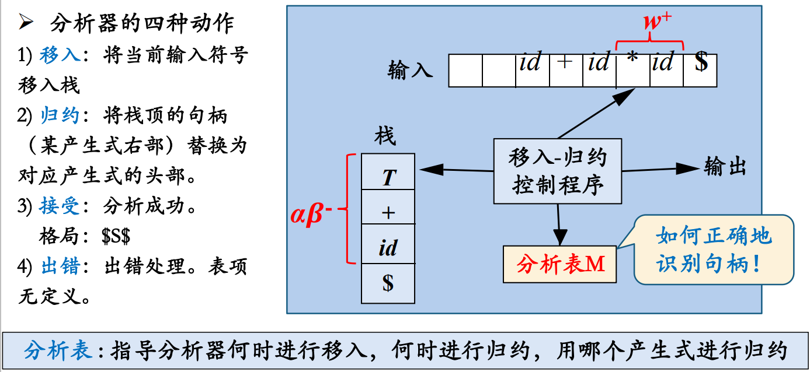

## LR分析法概述

与$LL(k)$类似，$LR(k)$表示决定是否规约时，需要向前查看$k$个输入符号。LR分析表的结构如图：

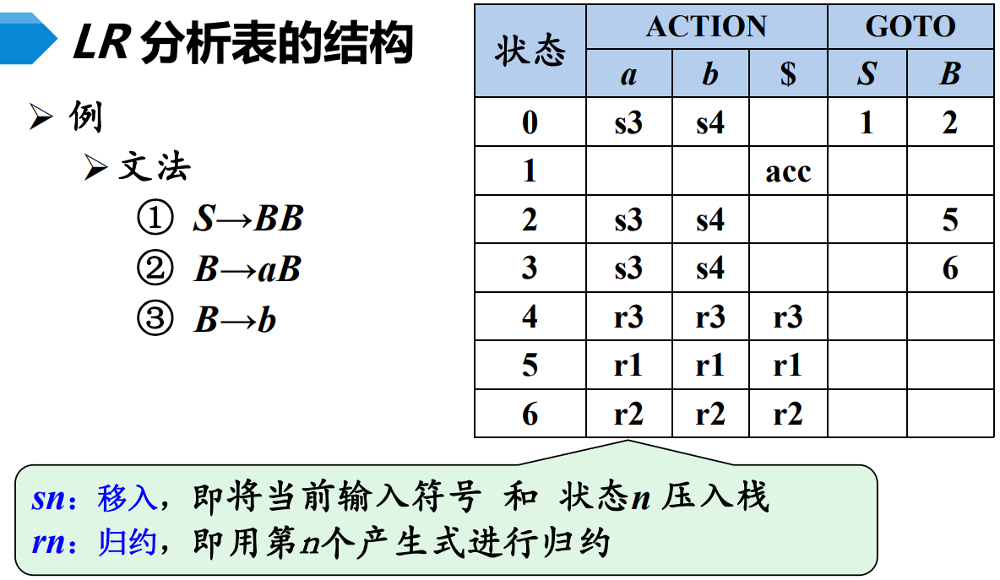

### 工作过程

给定分析表，进行规约的过程如下：

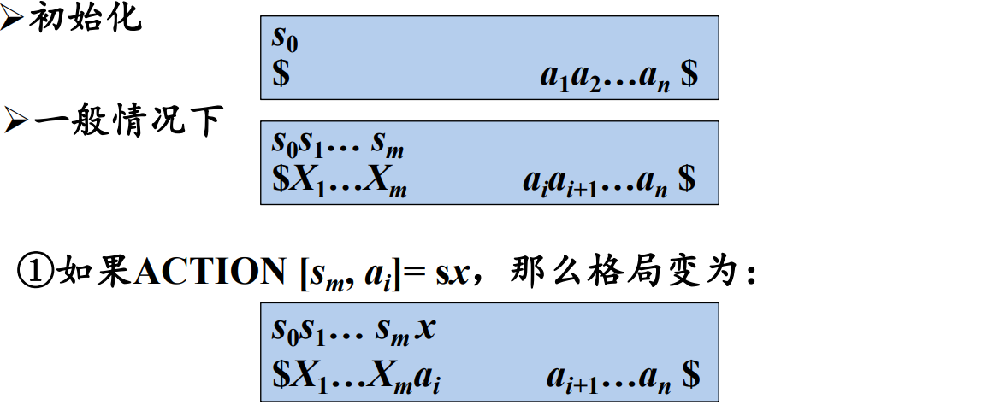

那么如何求分析表呢？

## $LR(0)$分析

$LR(0)$表示执行归约动作时不需要查看输入符号。

### 增广文法

如果$G$是一个以$S$为开始符号的文法，则$G$的增广文法$G'$就是在$G$中加上新开始符号$S'$和产生式$S'\rightarrow S$而得到的文法

:::note

引入这个新的开始产生式的目的是使得文法开始符号仅出现在一个产生式的左边，从而使得分析器只有一个接受状态

:::

### 项目集

自底向上分析的关键问题就是如何正确识别句柄。句柄是逐步形成的，我们用“项目”表示句柄识别的进展程度，右部某位置标有圆点的产生式称为相应文法的一个$LR(0)$项目，如：

定义**后继项目**：同属于一个产生式的项目，但圆点的位置只相差一个符号，如$A\rightarrow\alpha \cdot X\beta$的后继项目为$A\rightarrow\alpha X \cdot \beta$

可以把等价的项目组成一个项目集$I$，称为项目集闭包，每个项目集闭包对应着自动机的一个状态。

举例如下：

### 构造算法

项目集$I$定义如下：
$$
CLOSURE(I)= I\cup \{B \rightarrow \cdot γ | \exists A \rightarrow \alpha \cdot B\beta\in CLOSURE(I),B\rightarrow \gamma\in P\}
$$
算法：

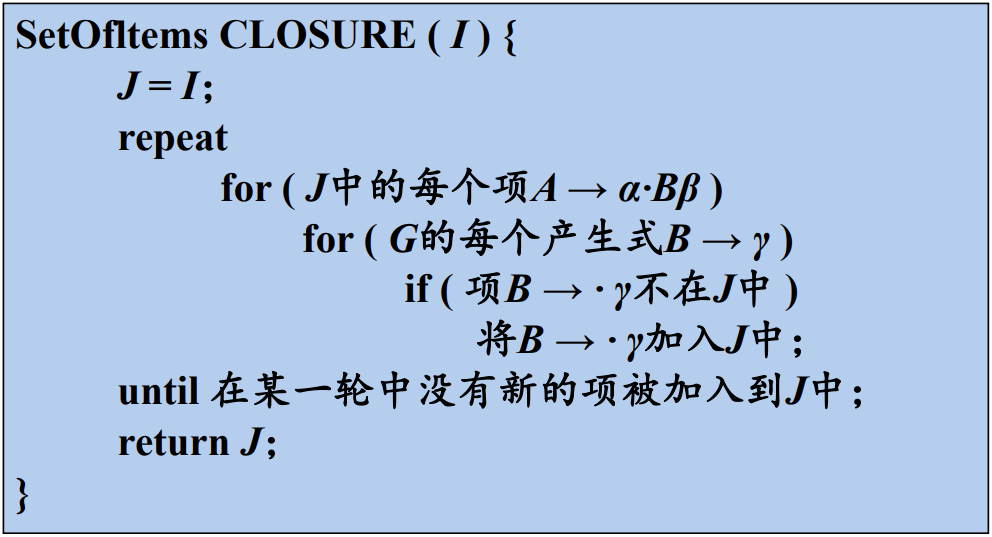

GOTO 函数：返回项目集$I$对应于文法符号$X$的后继项目集闭包
$$
GOTO( I, X )=CLOSURE(\{A\rightarrow \alpha X\cdot β | \forall A\rightarrow \alpha \cdot Xβ\in I \})
$$
算法：

构造状态集：

### $LR(0)$分析中的冲突

如图红色部分，当输入为 * 时，既可以移入也可以规约，这便是$LR(0)$文法的局限性。

## SLR分析

设有$m$个移进项目$A_m\rightarrow \alpha_m\cdot a_m\beta_m$，$n$个归约项目$B_n\rightarrow \gamma_n\cdot$
如果集合$\{a_1, a_2, …, a_m\}$和$FOLLOW(B_1)$， $FOLLOW(B_2)$，…，$FOLLOW(B_n)$两两不相交
则可以根据下一个输入符号决定动作，即

- 若$a\in\{a_1,a_2,\cdots,a_m\}$，则移进$a$
- 若$a\in FOLLOW(B_i)$，则用$B_i\rightarrow \gamma_i$归约
- 此外，报错

举例：

### SLR分析中的冲突

如果$a\in FOLLOW(B_i)$并且$a\in\{a_1,a_2,\cdots,a_m\}$，那么仍然会产生冲突，举例：

这便是 SLR 分析的局限性

## $LR(1)$分析

SLR 只是简单地考察下一个输入符号$b$是否属于与归约项目$A→\alpha$相关联的$FOLLOW(A)$，但$b\in FOLLOW(A)$只是归约$\alpha$的一个必要条件，而非充分条件。

事实上，在特定位置，$A$的后继符集合是$FOLLOW(A)$的子集，$LR(1)$分析便考虑了这点。

### 规范$LR(1)$项目

将形式为$[A\rightarrow \alpha\cdot\beta,a]$的项称为$LR(1)$项，其中$A\rightarrow\alpha \beta$是一个产生式，$a$是一个终结符，它表示在当前状态下，$A$后面要求紧跟的终结符，称为该项的**展望符**

继承与等价的定义：

### 举例

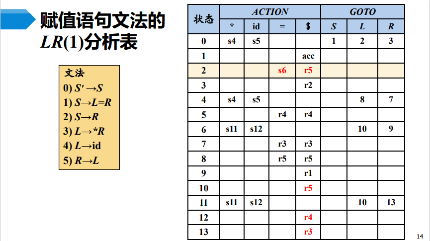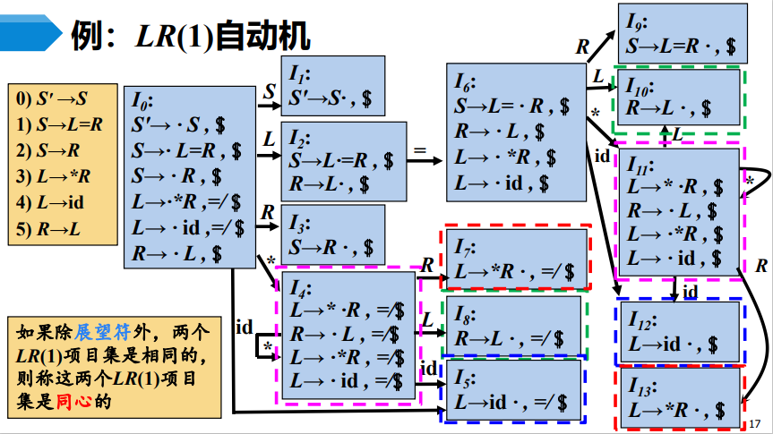

### 缺陷

缺陷在于有很多状态是同心的，导致状态太多，并不实用。还可以进一步优化，即 LALR 分析法。

## LALR分析

方法是寻找具有相同核心的$LR(1)$项集，并将这些项集合并为一个项集。 合并同心项目集后，虽然不产生冲突，但会推迟错误的发现。

## LR分析中的错误处理

当 LR 分析器在查询语法分析动作表并发现一个报错条目时，就检测到了一个语法错误

### 恐慌模式

1. 从栈顶向下扫描，直到发现某个状态$s_i$，它有一个对应于某个非终结符$A$的$GOTO$目标，可以认为从这个$A$推导出的串中包含错误
2. 丢弃 0 个或多个输入符号，直到发现一个可能合法地跟在$A$之后的符号$a$为止
3. 将$s_{i+1}$ = $GOTO(s_i,A)$压入栈中，继续进行正常的语法分析

### 短语层次

检查 LR 分析表中的每一个报错条目，并根据语言的使用方法来决定程序员所犯的何种错误最有可能引起这个语法错误，举例：

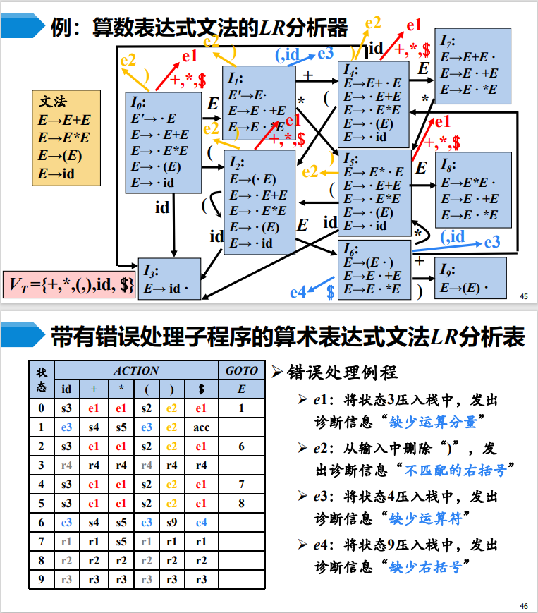
