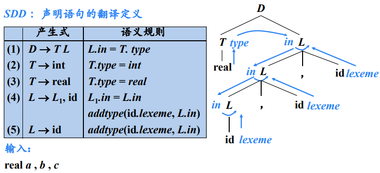
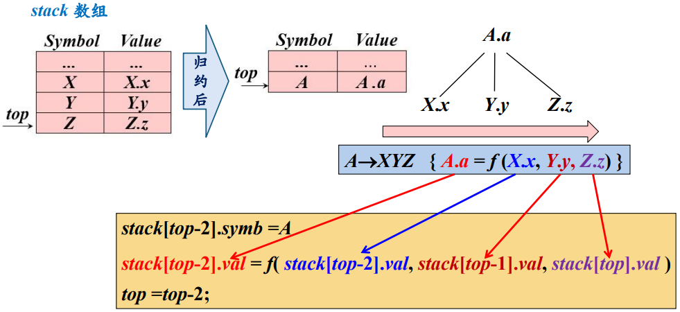
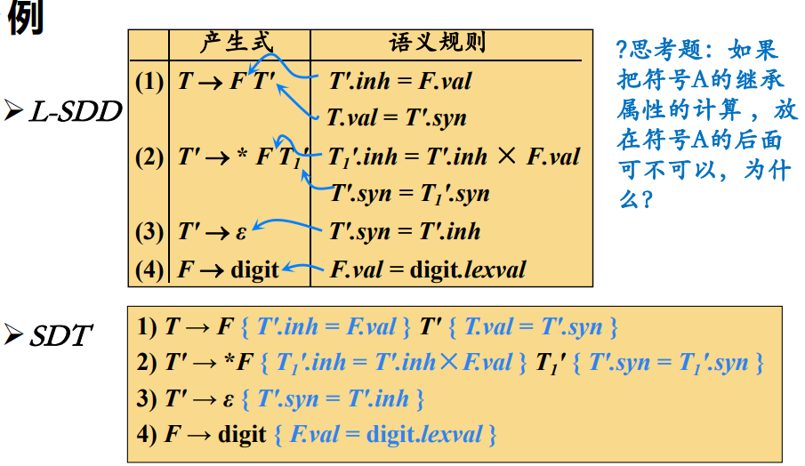
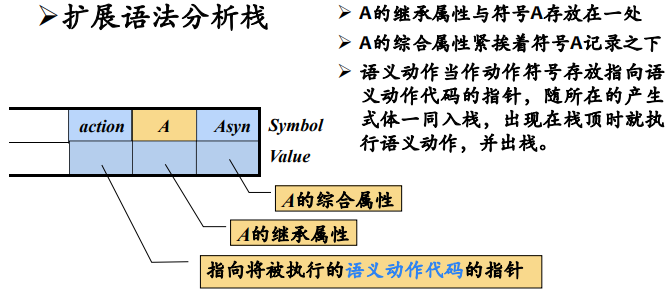
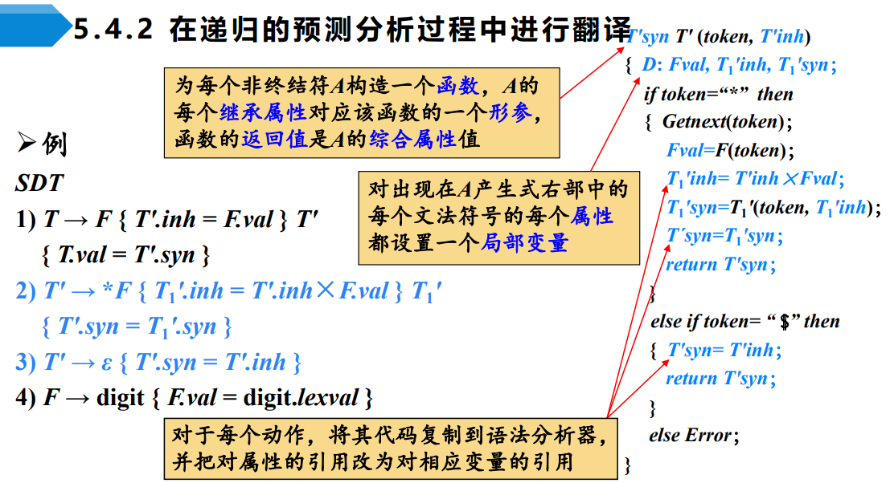
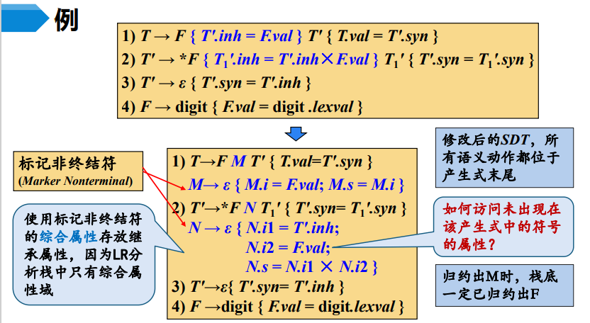

# Note3-语法制导翻译

所谓语义分析，就是根据程序的代码的上下文相关信息进行静态语义一致性和完整性的检查，如：

- 标识符未定义就使用
- 标识符重复定义
- 操作数与运算符类型不匹配
- 函数调用时实参与形参的数目或类型不匹配
- 普通变量当作函数调用

在实际操作中，常常将语义分析和中间代码生成一起进行，我们称之为**语义翻译**。而语法制导翻译又在语法分析的同时进行语义翻译，是一种面向文法的翻译技术。

## 语法制导定义SDD

SDD 是对 CFG 的推广，主要是为文法符号设置一组语义属性，根据产生式按照特定的语义规则计算语义属性的值。

### 综合属性

综合属性就是依赖于子结点的属性。比如：


终结符也有综合属性，它的属性是词法分析器提供的词法值。

### 继承属性

继承属性就是依赖于父结点或兄弟结点的属性。比如：


终结符没有继承属性。

### 依赖图

语义规则建立了属性之间的依赖关系，在对语法分析树节点的一个属性求值之前，必须首先求出这个属性值所依赖的所有属性值。

为了便于表示这种依赖关系，我们需要建立**依赖图**。对于某输入串的分析树中每个结点的每个属性 a 都对应着依赖图中的一个结点，如果属性 X.a 的值依赖于属性 Y.b 的值，则依赖图中有一条从 Y.b 的结点指向 X.a 的结点的有向边。举例：



最后作一个拓扑排序进行求值即可。

很显然，如果一个 SDD 只有综合属性（整个图是一个森林），那么一定有一个自底向上的顺序进行求值（森林不会有环），这种 SDD 也称为 **S-属性定义**。

而如果既有综合属性又有继承属性，那么依赖图中很可能有环，难以确定求值顺序。解决办法是人为规定一种依赖顺序，比如固定每个子结点的继承属性最多只能依赖于它左边的兄弟结点的属性。于是就有了 L-属性定义。

### L-属性定义

一个 SDD 是 L-属性定义，当且仅当它的每个属性要 么是一个综合属性，要么是满足如下条件的继承属 性：假设存在一个产生式$A\rightarrow X_1X_2…X_n$，其右部符号$X_i(1\leq i\leq n)$的**继承属性**仅依赖于下列属性：

- A 的继承属性
- 产生式中$X_i$左边的符号$X_1, X_2,\cdots,X_{i-1}$的属性
- $X_i$本身的属性，但$X_i$的全部属性不能在依赖图中形成环路

举例：


## 语法制导翻译方案SDT

SDT 是在产生式右部中嵌入了语义动作的 CFG，可以看作是 SDD 的具体实施方案。

### 将S-SDD转换为SDT

非常简单，将每个语义动作都放在产生式最后即可。如果一个S-SDD的文法是一个LR文法，那么它的SDT可以直接在LR语法分析过程中实现。举例：


具体实现：



### 将L-SDD转换为SDT

规则：

- 将计算某个非终结符号 A 的**继承属性**的动作插入到产生式右部中紧靠在 A 前面
- 将计算一个产生式左部符号的**综合属性**的动作放置在这个产生式右部的最右端

举例：



如果一个 L-SSD 的基本文法可以使用 LL 分析技术，那么它的 SDT 可以在 LL 或 LR 语法分析过程中实现。

## 非递归的预测分析过程中进行翻译

由于一个终结符的继承属性是在其出现之前计算，而综合属性是在最后计算，所以我们需要在栈中分别存放，结构如图：



### 举例详解

设有如下 SDT 和动作：


设输入为：3 * 5

每次将符号记录入栈时，都要将符号的综合属性记录先入栈，初始时，栈中内容为：


然后使用第一条产生式进行替换栈顶，格局为：


再用第四条产生式替换栈顶，格局为：


此时 digit 匹配成功，要将 digit 出栈，由 a6，接下来要使用 digit 的综合属性，所以把 digit 的综合属性复制给 a6

接下来执行 a6 对应的代码，a6 的任务是用 digit 的综合属性计算 F 的综合属性。由产生式 4，在 a6 进栈之前，我们把 F 弹出栈，而保留了 F 的综合记录 Fsyn 仍然在栈中，因此 F 的综合记录 Fsyn 就在 a6 之下，执行如下代码来实现 a6 的语义动作：

```c
stack[top-1].val=stack[top].digit_val
```

执行完毕后，将动作记录 a6 出栈，接下来再将 F 的综合记录 Fsyn 出栈，而根据产生式 1，F 后面的 a1 将使用 F 的综合属性来计算 T' 的继承属性，所以在 Fsyn 出栈之前，要先将其 val 复制到 a1 中。

此时，栈的格局为：


然后执行 a1 的语义动作，把 a1 出栈。

当前指针指向 *，因此将栈顶的 T' 用第 2 个产生式替换，而第 2 个产生式语义动作 a3 要使用 T' 的 inh 来计算，所以要将这个字段复制给 a3，那么如何确定 a3 的位置呢？

当 T' 出栈后，a4 将处于栈顶，那么 a3 便是 top+3 的位置，此时，栈的格局为：


栈顶匹配成功，弹出栈顶，并将指针指向 5，然后用第 4 条产生式替换，然后就是与之前相同的动作，匹配成功，弹出 digit，备份 digit 的综合属性，计算 F 的综合属性，当 Fsyn 出栈时，又将其值备份给 a3，此时 a3 便有了两个字段：


a3 出栈时，执行 a3 的语义动作，便计算出了$T_1'$的继承属性值，出栈后，要使用第 3 条产生式替换栈顶，而 a5 用到了$T'.inh$，于是要将该继承属性值备份到 a5 中，栈的格局为：


然后执行 a5 的语义动作，后面的过程前面均已涉及到，在此便不再赘述。最后，成功计算出了 T 的综合属性值：


## 在递归的预测分析过程中进行语义翻译

基本思路就是为每个非终结符 A 构造一个函数，A 的每个继承属性对应该函数的一个形参，函数的返回值是 A 的综合属性值。对出现在 A 产生式中的每个文法符号的每个属性都设置一个局部变量。非终结符 A 的代码根据当前的输入决定使用哪个产生式。举例：



## L-属性定义的自底向上翻译

S-属性定义的 SDTL-属性定义的 SDT，所有语义动作都放在产生式右部的末尾，可以在归约的时候执行。而 L-属性的语义动作会嵌入产生式右部中，要想实现自底向上翻译需要对文法进行修改。具体思路就是额外设置一些非终结符替换这些语义动作，举例：



标记非终结符 M 右部的语义动作规则为：

- 将原来动作需要的任何属性作为 M 的继承属性进行复制
- 按照原来动作计算各个属性，但是将计算得到的这些属性作为 M 的综合属性