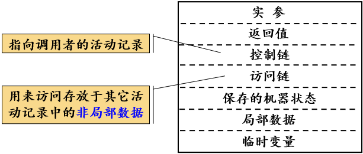
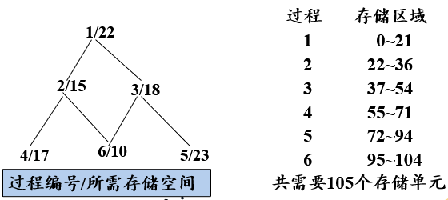
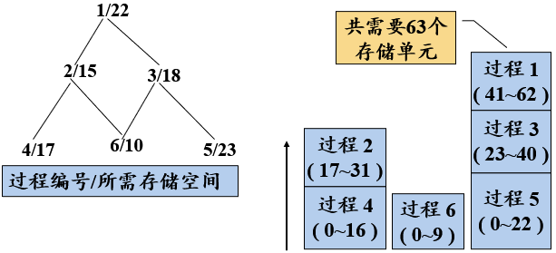
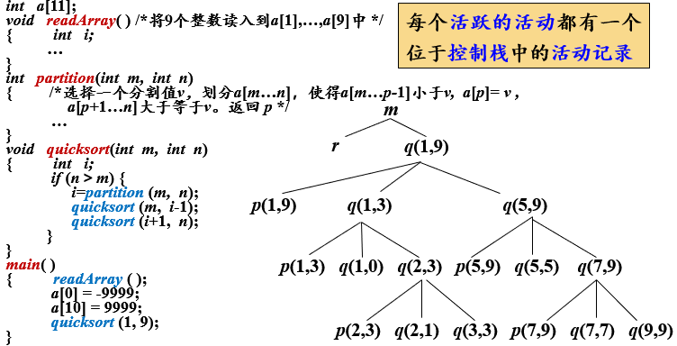
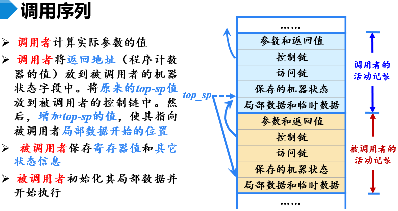

# Note5-运行存储分配

编译器在工作过程中，必须为源程序中出现的一些数据对象分配运行时的存储空间。

对于那些在编译时刻就可以确定大小的数据对象，可以在编译时刻就为它们分配存储空间，这样的分配策略称为静态存储分配。

反之，如果不能在编译时完全确定数据对象的大小，就要采用动态存储分配的策略。即在编译时仅产生各种必要的信息，而在运行时刻，再动态地分配数据对象的存储空间。

### 存储组织

运行时内存可以划分为：

编译器通常以**过程**（使用函数、方法）为单位分配存储空间，过程体的每次执行称为该过程的一个**活动**。过程每执行一次，就为它分配一块连续存储区，用来管理过程一次执行所需的信息，这块连续存储去称为**活动记录**。

### 静态存储分配

适合静态存储分配的语言必须满足以下条件：

- 数组上下界必须是常数
- 不允许过程的递归调用，不然就无法确定一个过程有多少活动同时处于活跃状态
- 不允许动态建立数据实体

### 顺序分配法

顺序分配法按照过程出现的先后顺序逐段分配存储空间。各过程的活动记录占用互不相交的存储空间。

举例：

这种做法是对内存空间的使用不够经济合理，比如上例中的 4、5、6 间不存在调用关系，完全可以共享存储区域。

### 层次分配法

因为不允许递归调用，所以过程调用中不会存在环。因此，可以找到无相互调用关系的并列过程，尽量使其局部数据共享存储空间。

## 栈式存储分配

当一个过程被调用时，该过程的活动记录被压入栈，当过程结束时，该活动记录被弹出栈。

### 活动树

用来描述程序运行期间控制进入和离开各个活动的情况的树，树中每个结点对应于一个活动。每个子结点必须在其右兄弟结点的活动开始之前结束

举例：

### 设计活动记录的原则

### 调用序列和返回序列

调用序列：实现过程调用。为一个活动记录在栈中分配空间，并在此记录的字段中填写信息。

返回序列：恢复机器状态，使得调用过程能够在调用结束之后继续执行。

## 非局部数据的访问

静态作用域规则：只要过程 b 的声明嵌套在过程 a 的声明中，过程 b 就可以访问过程 a 中声明的对象

可以在相互嵌套的过程的活动记录之间建立一种称为**访问链**的指针，使得内嵌的过程可以访问外层过程中声明的对象。

就是把活动的访问链指向上一层活动

假设嵌套深度为$n_x$的过程$x$调用嵌套深度为$n_y$的过程$y(x\rightarrow y)$

- $n_x < n_y$，则$y$一定是直接在$x$中定义的，$n_y=n_x+1$，在$y$的访问链中放置一个指向$x$的活动记录的指针
- $n_x=n_y$，外围过程是同一个，可以把调用者的访问链直接复制给被调用者的访问链
- $n_x>n_y$，则过程$x$必然是嵌套在某个过程（就是这两个调用过程的公共过程）$z$，$z$定义了$y$，从$x$的活动记录开始，沿着访问链经过$n_x-n_y+1$步，就可以找到离栈顶最近的$z$的活动记录。$y$的访问链必须指向$z$的这个活动记录

## 符号表

