# Note6-代码优化

## 流图

### 基本块

先定义**基本块**的概念，基本块是满足下列条件的最大的连续三地址指令序列：

- 控制流只能从基本块的第一个指令进入该块。即，没有跳转到基本块中间或末尾指令的转移指令
- 除了基本块的最后一个指令，控制流在离开基本块之前不会跳转或停机

说白了基本块就是一堆原子指令，要么全都执行，要么全都不执行

如何划分指令序列中的基本块呢？划分基本块即确定哪些指令是首指令：

- 指令序列的第一个三地址指令是首指令
- 所有转移指令的目标指令是首指令
- 转移指令之后的指令是首指令

### 什么是流图

流图的结点就是一些基本块，它们按照可能的执行顺序连接起来。举例：

## 优化方法概览

常用的优化方法包括：

- 删除公共子表达式
  - 如果表达式 x op y 先前已被计算过，并且从先前的计算到现在，x op y 中变量的值没有改变，则 x op y 称为公共子表达式
- 删除无用代码
  - 复制传播
    - 常用的公共子表达式消除算法和其他一些优化算法会引入复制语句（形如 x=y 的赋值语句）
    - 我们尽量使用 y 来替换 x，这样 x=y 很可能就是无用代码，我们就能将其删除
- 常量合并
  - 如果在编译时刻推导出一个表达式的值是常量，就可以使用该常量替换这个表达式。该技术称为常量合并
  - 
- 代码移动
  - 对于一些无论循环执行多少次都得到相同结果的表达式，在循环之前就怼它们求值
- 强度削弱
  - 用较快的操作替换较慢的操作
  - 
- 删除归纳变量
  - 归纳变量是指每次循环迭代中进行一次简单的增量运算的变量
  - 如果有一组归纳变量的值变化保持步调一致，常常可以将这组变量删除为只剩一个

## 基本块的优化

也叫局部优化。首先将一个基本块转换为一个 DAG，例如：

- 基本块中的每个语句 s 都对应一个内部结点 N
  - 结点N的标号是 s 中的运算符；结点N同时关联一个定值变量表，表示 s 是在此基本块内最晚对表中变量进行定值的语句
  - N 的子结点是基本块中在 s 之前、最后一个对 s 所使用的运算分量进行定值的语句对应的结点。如果 s 的某个运算分量在基本块内没有在 s 之前被定值，则这个运算分量的子结点就是叶结点（其定值变量表中的变量加上下脚标 0）
  - 在为语句 x=y+z 构造结点 N 的时候，如果 x 已经在某结点 M 的定值变量表中，则从 M 的定值变量表中删除变量 x，比如，要把图中的 $b_0$ 删除

### 赋值指令的表示

举例：

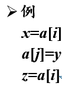

按照往常逻辑，a[i] 是公共子表达式。但是，这里的 j 是可以等于 i 的，那么 a[i] 就不是公共子表达式。所以我们要解决的问题就是如何防止系统产生这样的误判。

构造如下 DAG：

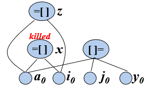

- 对于形如 a[j]=y 的三地址指令，创建一个运算符为 "[]=" 的结点，这个节点有 3 个子结点，分别表示 a、j 和 y
- 该结点没有定值变量表
- 该结点的创建将注销所有已经建立的、其值依赖于 a 的结点
- 一个被注销的结点不能再获得任何新的定制变量

### 从 DAG 到基本块的的重组

举例：给定一个基本块，构造出 DAG

- 首先，删除没有附加活跃变量的根节点

  

- 常量合并，后面可以把 B 用 3 代替

- 删除公共子表达式，最后只剩这四条语句：

  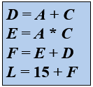

## 数据流分析

数据流分析是一组用于获取程序执行路径上的数据流信息的技术

### 数据流的分析模式

- 语句的数据流模式
  - $IN[s]$：语句 s 之前的数据流值
  - $OUT[s]$：语句 s 之后的数据流值
  - $f_s$：语句 s 的传递函数
    - 前向数据流，$OUT[s]=f_s(IN[s])$
    - 逆向数据流，$IN[s]=f_s(OUT[s])$
  - 控制流约束
    - 设基本块$B$由语句$s_1,s_2,\cdots,s_n$组成，则$IN[s_{i+1}]=OUT[s_i]$
- 基本块的数据流模式
  - 和语句的数据流模式没什么区别，就从以语句为单位变成以基本块为单位

### 到达定值分析

变量 x 的定值是将一个值赋给 x 的语句

如果同一条路径上有多个对变量 x 的定制，则将前面的定值注销。举例

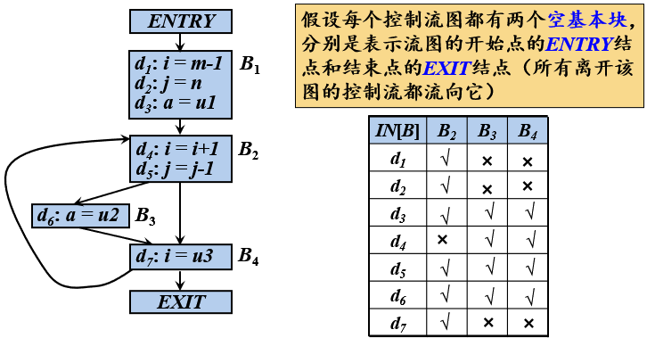

这个分析可以解决：

- 循环不变计算的检测
  - 如果循环中含有赋值 x=y+z，而 y 和 z 所有可能的定值都在循环外面，那么 y+z 就是循环不变计算
- 常量合并
  - 如果对变量 x 的某次使用只有一个定值可以达到，并且该定值把一个常量赋给 x，则把 x 替换为该常量
- 判定变量 x 在 p 点是否未经定值就被引用
  - 在流图的吐口点对每个变量 x 引入一个**哑定值**。如果 x 的哑定值到达了 p，则在定值之前被引用

## 到达定值的数据流方程

### 传递函数

举例：

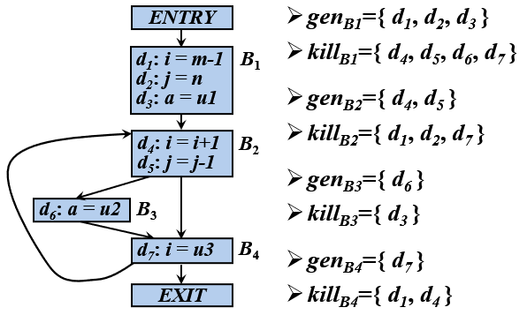

定义$IN[B]$为到达流图中基本块$B$的入口处的定值的集合，$OUT[B]$为到达流图中基本块$B$的出口处的定值的集合

### 数据流方程

- $OUT[ENRTY]=\Phi$
- $OUT[B]=f_B(IN[B])=gen_B\cup (IN[B]-kill_B)(B\ne ENTRY)$
- $IN[B]=\cup_{p}OUT[P](B\ne ENTRY)$

迭代算法：

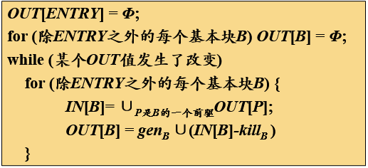

用位向量表示各个基本块的集合，举例：

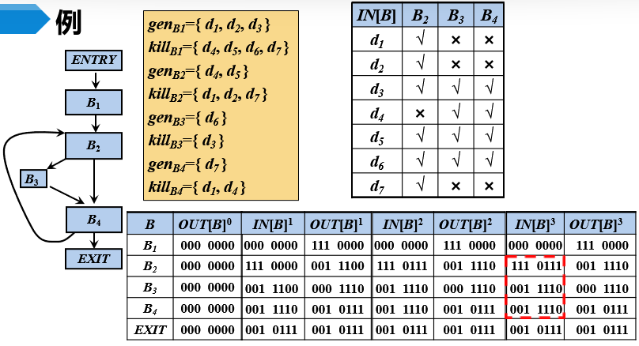

### 引用-定值链

是一个列表，对变量的每一次引用，到达该引用的所有定制都在该列表中

## 活跃变量分析

在 p 点，如果会引用变量 x 在 p 点的值，则称变量 x 在 p 点是活跃的

举例，注意活跃变量是逆向确定的

作用：

- 删除无用赋值
  - 如果 x 在点 p 的定值在基本块内所有后继点都不被引用，且 x 在基本块出口之后又是不活跃的，那么 x 在点 p 的定值就是无用的
- 为基本块分配寄存器
  - 如果所有寄存器都被占用，并且还需要申请一个寄存器，则应该考虑使用已经存放了死亡值的寄存器，因为这个值不需要保存到内存

### 传递函数

- $IN[B]=f_B(OUT[B])=use_B\cup (OUT[B]-def_B)$

  - $use_B$：在基本块$B$中引用，但是引用前在$B$中没有被定值的变量的集合
  - $def_B$：在基本块$B$中定值，但是定值前在$B$中没有被引用的变量的集合

- 举例：

  

### 逆向流方程

- $IN[EXIT]=\Phi$
- $IN[B]=f_B(OUT[B])=use_B\cup(OUT[B]-def_B)(B\ne EXIT)$
- $OUT[B]=\cup_s IN[S](B\ne EXIT)$

举例：

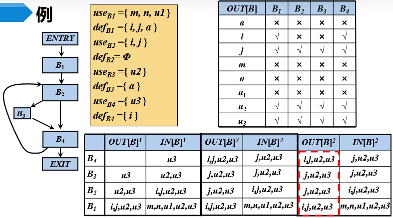

### 定值-引用链

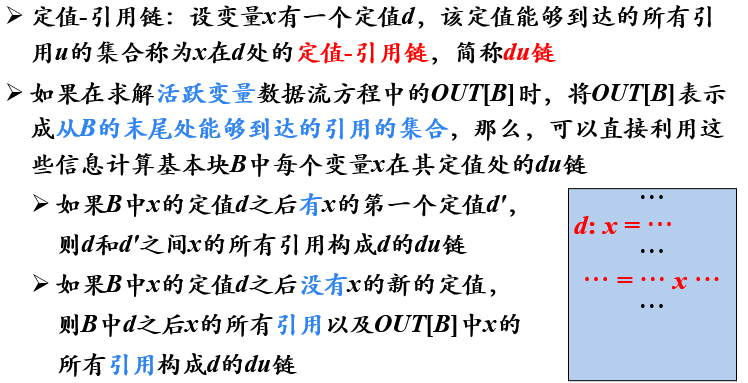

## 可用表达式分析

在流图的点 p 上，如果 x op y 已经在之前被计算过，则不需要重新计算

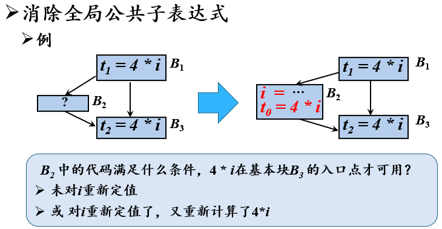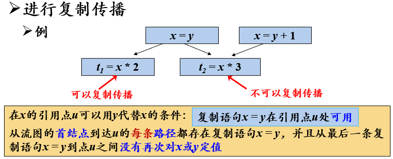

### 可用表达式

如果基本块 B 对 x 或 y 进行了定值，且以后没有重新计算 x op y，则称 B 杀死了表达式 x op y。如果基本块 B 对 x op y 进行计算，并且之后没有重新定值 x 或 y，则称 B 生成表达式 x op y

### 传递函数

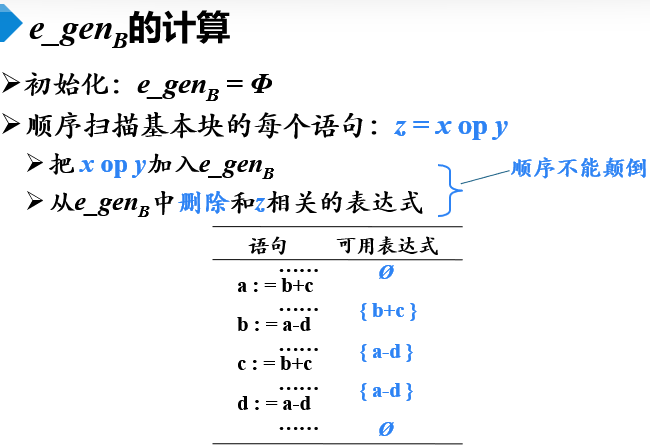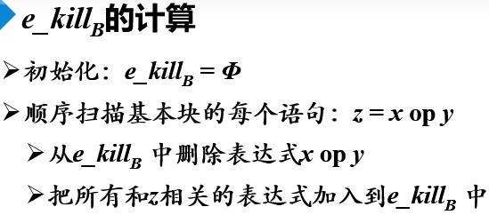

### 数据流方程

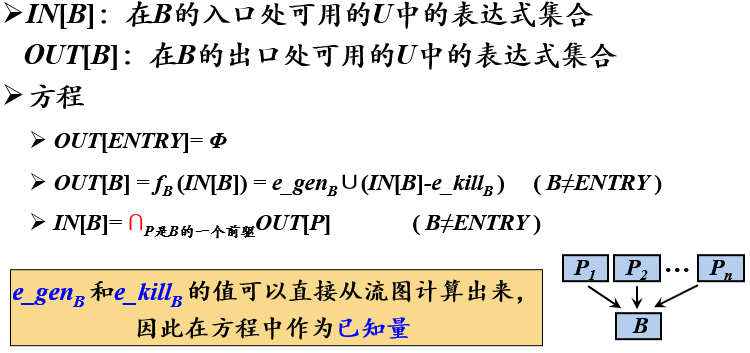

## 流图中的循环

### 支配结点

- 支配结点
  - 如果从流图的入口结点到结点 n 的每条路径都经过结点 d，则称结点 d **支配**结点 n，记为 d dom n
  - 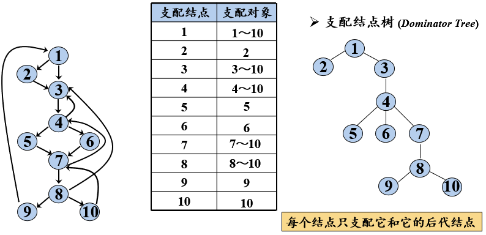
  - 数据流方程
    - $OUT[ENTRY]=\{ENTRY\}$
    - $OUT[B]=f(IN[B])=IN[B]\cup\{B\}(B\ne ENTRY)$
    - $IN[B]=\cap_pOUT[P](B\ne ENTRY)$
  - 
  - 如果存在从结点 n 到 d 的有向边$n\rightarrow d$，且 d dom n，那么这条边称为回边

### 自然循环

自然循环是一种适合于优化的循环

- 满足

  - 有唯一的入口结点，称为首结点

  - 循环中至少有一条返回首结点的回边，否则就无法构成循环

- 性质

  - 如果两个自然循环的首结点不同，则这两个循环要么互不相交，要么一个完全包含在另一个里面

如何识别呢？

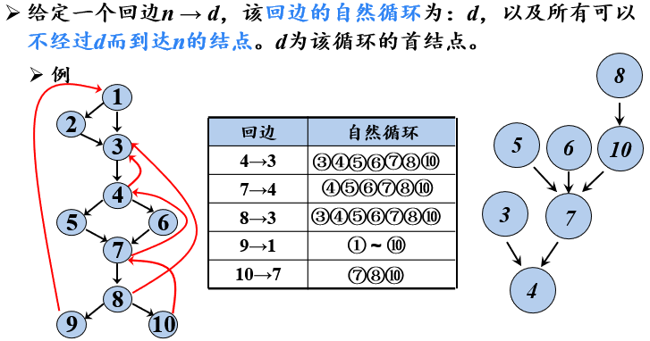

## 全局优化

### 删除全局公共子表达式

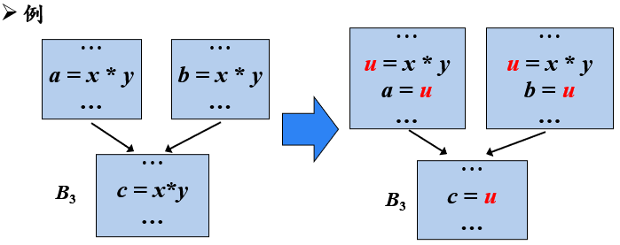

算法：

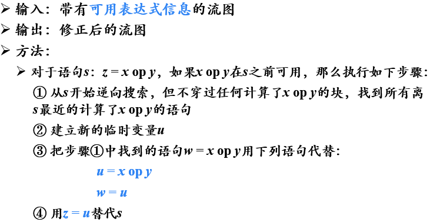

### 删除复制语句

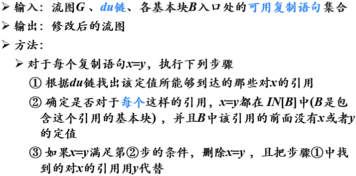

### 循环不变计算检测

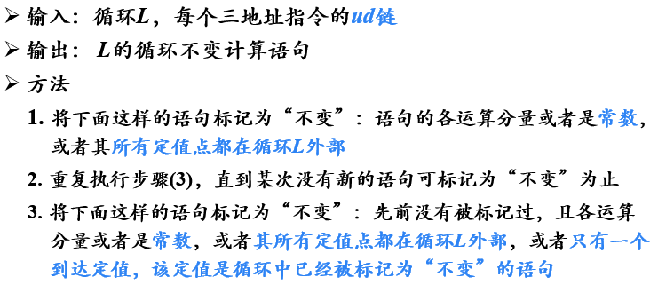

### 作用于归纳变量的强度削弱

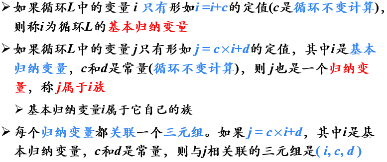

检测算法：

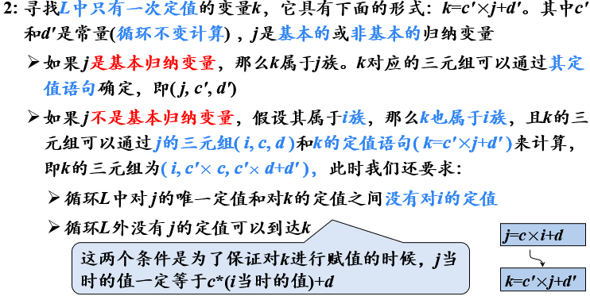

### 归纳变量的删除

对于在强度削弱算法中引入的复制语句 j=t，如果在归纳变量 j 的所有引用点都可以用对 t 的引用代替对 j 的引用，并且 j 在循环的出口处不活跃，则可以删除复制语句 j=t
