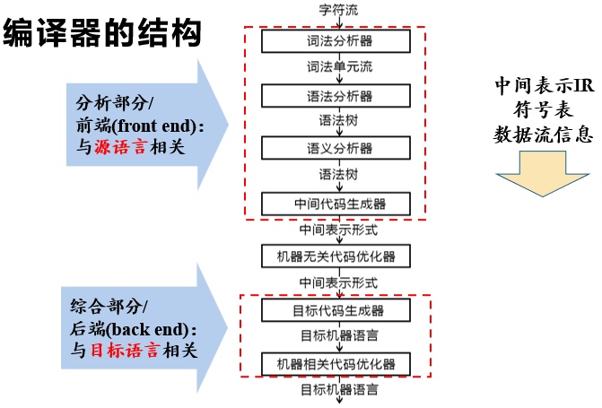
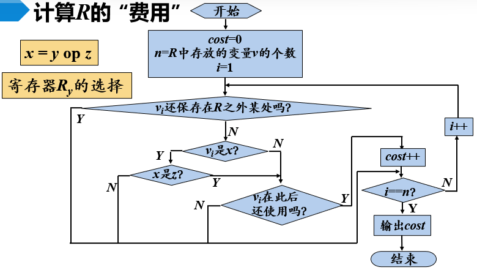
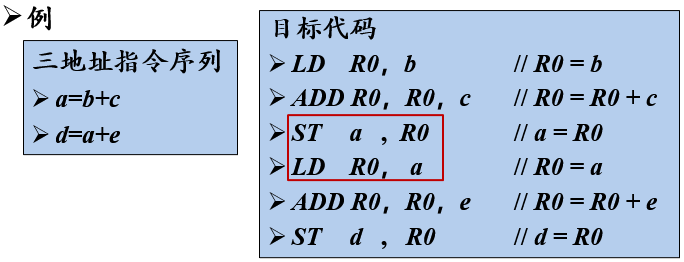
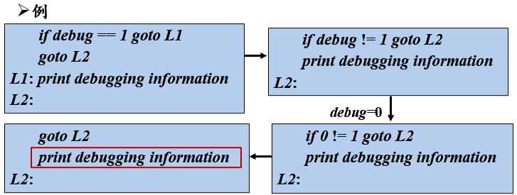

# Note7-代码生成

终于来到了最后一部分，就是根据中间代码生成目标代码

代码生成器的主要任务：

- 指令选择
- 寄存器分配和指派
- 指令排序

## 寄存器的选择

对于每个形如 x=y op z 的三地址指令 I，执行如下动作

- 调用函数 getreg(I)，为 x, y, z 选择寄存器
- 如果 Ry 存放的不是 y，则生成指令 LD Ry, y
- 生成目标指令 OP Rx, Ry, Rz

### 寄存器描述符和地址描述符

- 寄存器描述符
  - 记录每个寄存器当前存放的是哪些变量的值
- 地址描述符
  - 记录运行时每个名字的当前值存放在哪些位置
  - 该位置可能是寄存器、栈单元、内存地址

### 基本块的收尾处理

对于一个在基本块的出口处可能活跃的变量 x，如果它的地址描述符表明它的值没有存放在 x 的内存位置上，则生成指令 ST x, R

### 管理寄存器和地址描述符

当代码生成算法生成加载、保存其他指令时，必须同时更新寄存去和地址描述符

- LD R, x
  - 修改 R 的寄存器描述符，使之只包含 x
  - 修改 x 的地址描述符，把 R 作为新增位置加入到 x 的位置集合中
  - 从任何不同于 x 的地址描述符中删除 R
- OP Rx, Ry, Rz
  - 修改 Rx 的寄存器描述符，使之只包含 x
  - 从任何不同于 Rx 的寄存器描述符中删除 x（因为 x 的值更新了）
  - 修改 x 的地址描述符，把 Rx 作为新增位置加入到 x 的位置集合中
  - 从任何不同于 x 的地址描述符中删除 Rx
- ST x, R
  - 修改 x 的地址描述符，使之包含自己的内存位置
- 对于复制语句 x=y，如果需要生成加载指令 LD Ry, y
  - 修改 Ry 的寄存器描述符，使之只包含 y
  - 修改 y 的地址描述符，把 Ry 作为新增位置加入到 y 的位置集合中
  - 从任何不同于 y 的地址描述符中删除 Ry
  - 修改 Ry 的寄存器描述符，使之也包含 x
  - 修改 x 的地址描述符，使之只包含 Ry

### getReg 函数设计

如何计算费用呢？

## 窥孔优化

**窥孔**是指程序上的一个小的滑动窗口。窥孔优化是指在优化时，检查目标指令的一个滑动窗口，并且只要有可能就在这个窗口内使用更快更短的指令来替换指令序列。

### 冗余指令删除

- 消除冗余的加载和保存指令

  

- 消除不可达代码

  

### 控制流优化

### 代数优化

消除窥孔中类似于 x=x+0 或 x=x*1 的运算指令

### 强度削弱

比如用移位进行乘除法

### 使用特殊指令

比如用 INC 指令替代加1操作