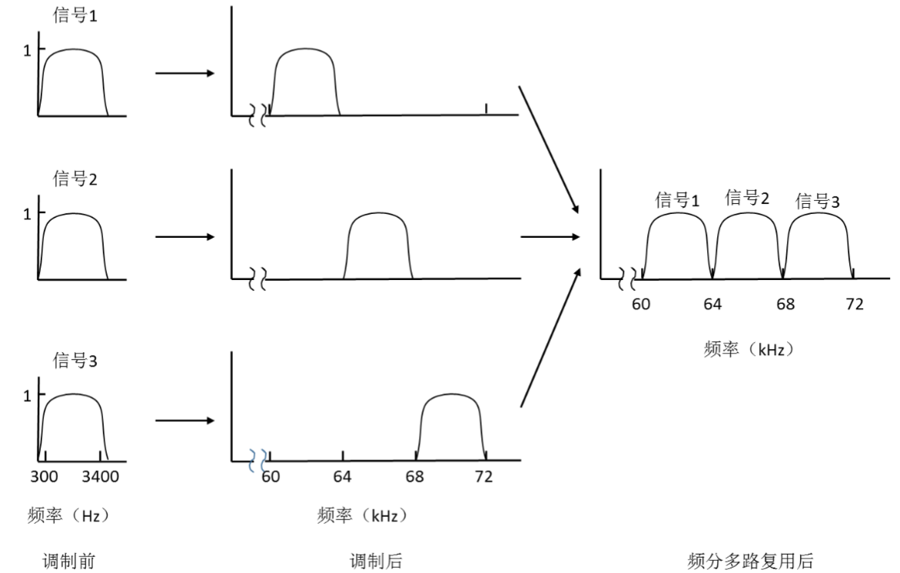
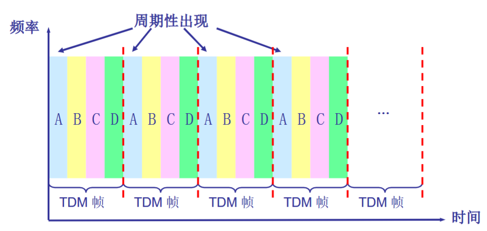
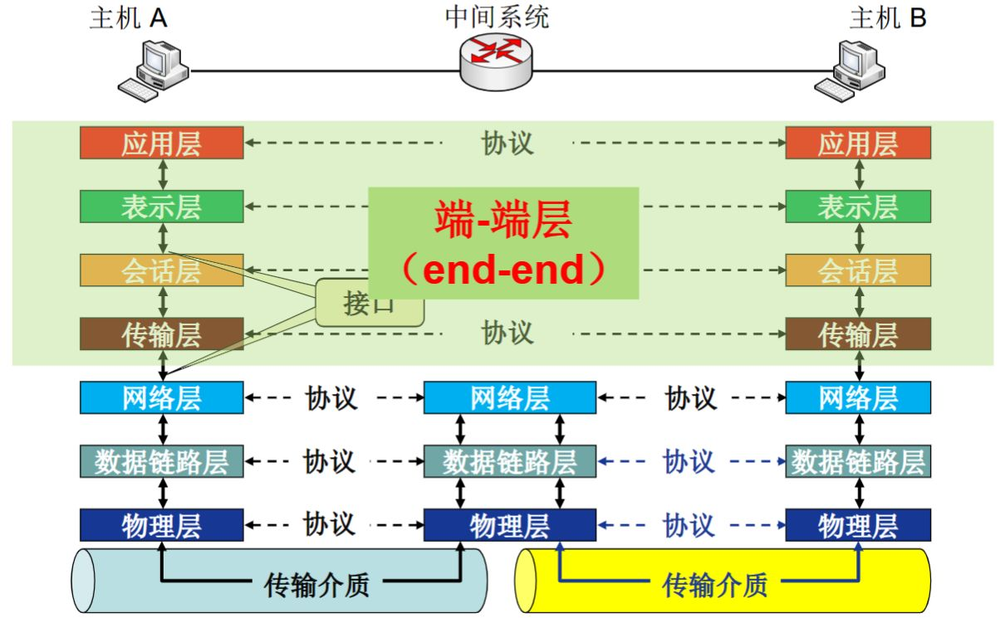
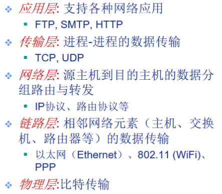
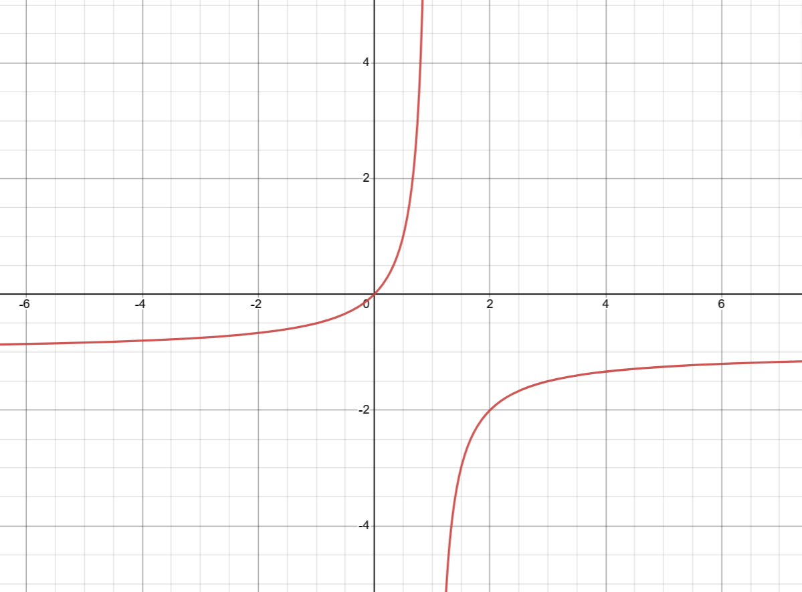

# 笔记1-绪论

## 前言

本专栏持续更新书籍 [*Computer Networking A Top-Down Approach*](https://eclass.teicrete.gr/modules/document/file.php/TP326/%CE%98%CE%B5%CF%89%CF%81%CE%AF%CE%B1(Lectures)/Computer_Networking_A_Top-Down_Approach.pdf)（计算机网络-自顶向下方法）课后习题解答，此外，哈工大开设的[计算机网络_中国大学MOOC(慕课)](https://www.icourse163.org/course/HIT-154005)课程将此书作为交代， 本专栏一并更新 MOOC 中的相关习题解答。

*Computer Networking A Top-Down Approach* 课后习题分为Review Questions（复习题）和 Problems（习题）两种。有些题目过于开放，所以我只挑选部分题来做。为保证答案的正确性和全面性，我参考了此书的官方解答和[中科大计算机网络课程](https://www.bilibili.com/video/BV1JV411t7ow)。

## 知识点

#### 电路交换网络中的多路复用技术有哪些？
- 频分复用(FDM)
各用户占用不同的带宽资源（这里的带宽指频率带宽），用户在分配到一定的频带后，在通信过程中自始至终都占用这个频带。

- 时分复用(TDM)
将时间划分为一段段等长的**时分复用帧**，每个用户在每个帧中占用固定序号的时隙

<!--ID: 1672905927535-->

#### 分组时延怎么计算？
$d_{nodal}=d_{proc}+d_{queue}+d_{trans}+d_{prop}$
- $d_{proc}$：结点处理延时
	- 差错检测
	- 确定输出链路
- $d_{queue}$：排队延时
	- 等待输出链路可用
	- 依赖于路由器的拥塞程度
- $d_{trans}$：传输延时
	- $R$=链路带宽
	- $L$=分组长度
	- $L/R$
- $d_{prop}$：传播延时
	- $d=$物理链路长度
	- $s=$信号传播速度
	- $d/s$
	<!--ID: 1672888764345-->

#### 流量强度
令$R=链路带宽，L=分组长度，a=平均分组到达速率$
则流量强度为$La/R$
$La$ 表示比特到达队列的平均速率，$R$ 表示为队列中推出比特的速率
<!--ID: 1672889275817-->

#### 时延带宽积
时延带宽积=传播时延$\times$ 信道带宽 = $d_{prop} \times R$

以比特为单位的链路长度
<!--ID: 1672889577800-->

#### 吞吐量
发送端与接收端之间传送数据的速率
取决于**瓶颈链路**
<!--ID: 1672890218611-->

### OSI参考模型
OSI参考模型自上而下分为应用层、表示层、会话层、传输层、网络层、数据链路层、物理层7个层次。
其中，应用层、表示层、会话层、传输层为**端到端**层  
实现**路由功能**的是网络层

## 课后习题

> R1. “主机”和“端系统”之间有什么不同？列举几种不同类型的端系统。Web服务器是一种端系统吗？

没有不同。PC、邮件服务器、Web服务器等等都是端系统。

> R11. 假定在发送主机和接收主机间只有一台分组交换机。发送主机和交换机间以及交换机和接收主机间的传输速率分别是$R_1$和$R_2$。假设该交换机使用存储转发分组交换方式，发送一个长度为L的分组的端到端总时延是什么？（忽略排队时延、传播时延和处理时延。）

只用求传输延时即可，$L/R_1+L/R_2$

> R12. 与分组交换网络相比，电路交换网络有哪些优点？在电路交换网络中，TDM 比 FDM有哪些优点？

电路交换为端到端预留了带宽资源，在一定范围内性能和延迟时能得到保障的，而分组交换网络无法做到，它的端到端时延是可变和不可预测的。FDM需要复杂的模拟硬件来将数字信号加载到不同的载波之上，复杂度要更高。

> R13. 假定用户共享一条 2Mbps 链路。同时假定当每个用户传输时连续以 1Mbps 传输，但每个用户仅传输 20% 的时间。
> 1. 当使用电路交换时，能够支持多少用户？
> 2. 作为该题的遗留问题，假定使用分组交换。为什么如果两个或更少的用户同时传输的话，在链路前面基本上没有排队时延？为什么如果3个用户同时传输的话，将有排队时延？
> 3. 求出某指定用户正在传输的概率。
> 4. 假定现在有3个用户。求出在任何给定的时间，所有3个用户在同时传输的概率。求出队列增长的时间比率。

1. 2Mbps/1Mbps=2
2. 显然
3. 0.2
4. $(0.2)^3=0.008$

> R18. 一个长度为 1000 字节的分组经距离为 2500km 的链路传播，传播速率为 2.5×10^8m/s 并且传输速率为 2Mbps，它需要用多长时间？更为一般地，一个长度为 L 的分组经距离为 d 的链路传播，传播速率为 s 并且传输速率为 Rbps，它需要用多长时间？该时延与传输速率相关吗？

$d/s$，传播时延与传输速率无关。

> R19. 假定主机A要向主机B发送一个大文件。从主机A到主机B的路径上有3段链路，其速率分别为R1=500kbps、R2=2Mbps，R3=1Mbps。
> 1. 假定该网络中没有其他流量，该文件传送的吞吐量是多少？
> 2. 假定该文件为4MB。传输该文件到主机B大致需要多长时间？
> 3. R2减小到100kbps会怎么样？

1. $min\{R_1, R_2, R_3\}=500kbps$
2. $t=4MB/500kbps=64s$
3. 瓶颈链路改变了。$t=4MB/100kbps$

> R23. 因特网协议栈中的5个层次有哪些？在这些层次中，每层的主要任务是什么？

> R25. 路由器处理因特网协议栈中的哪些层次？链路层交换机处理的是哪些层次？主机处理的是哪些层次？

路由器：物理层、链路层、网络层  
交换机：链路层、网络层  
主机：所有五层

> P2. 式$d_{端到端}=N\frac{L}{R}$，给出了经传输速率为 R 的 N 段链路发送长度 L 的一个分组的端到端时延。对于经过 N 段链路连续地发送 P 个这样的分组，一般化地表示出这个公式。

第1个分组到达接收方总共用了$N\frac{L}{R}$时间，这之后，每隔$L/R$时间会到达一个分组，共$(P-1)$个分组。公式为：$t=N\frac{L}{R}+(P-1)\frac{L}{R}=(N+P-1)\frac{L}{R}$

> P3. 考虑一个应用程序以稳定的速率传输数据（例如，发送方每 k 个时间单元产生一个 N 比特的数据单元，其中 k 较小且固定）。另外，当这个应用程序启动时，它将连续运行相当长的一段时间。回答下列问题，简要论证你的回答：
> 1. 是分组交换网还是电路交换网更为适合这种应用？为什么？
> 2. 假定使用了分组交换网，并且该网中的所有流量都来自如上所述的这种应用程序。此外，假定该应用程序数据传输速率的总和小于每条链路的各自容量。需要某种形式的拥塞控制吗？为什么？

1. 电路交换⽹，因为该应⽤以稳定速率，持续⻓时间运⾏，因此可以为其分配一个合适的带宽。
2. 传输速率总和⼩于链路容量，不会有拥塞。

> P6. （传播时延与传输时延大小关系的影响）考虑两台主机 A 和 B 由一条速率为 R bps 的链路相连。假定这两台主机相隔 m 米，沿该链路的传播速率为 s m/s。主机 A 向主机 B 发送长度为 L 比特的分组。
> 1. 用 m 和 s 来表示传播时延$d_{prop}$。
> 2. 用 L 和 R 来确定该分组的传输时间 $d_{trans}$。
> 3. 忽略处理和排队时延，得出端到端时延的表达式。
> 4. 假定主机 A 在时刻$t=0$ 开始传输该分组。在时刻$t=d_{trans}$，该分组的最后一个比特在什么地方？
> 5. 假定$d_{prop}$大于$d_{trans}$。在时刻$t=d_{trans}$，该分组的第一个比特在何处？
> 6. 假定$d_{prop}$小于$d_{trans}$。在时刻$t=d_{trans}$，该分组的第一个比特在何处？
> 7. 假定 $s=2.5 \times 10^8, L=120$比特，$R=56kbps$。求出使$d_{prop}$等于$t=d_{trans}$的距离 m。

1. $d_{prop}=m/s$
2. $d_{trans}=L/R$
3. $d_{nodal}=m/s+L/R$
4. 最后一个比特刚刚离开发送方
5. 还没到达接收方
6. 已到达接收方
7. 由$m/s=L/R$，得$m=536km$

> P14. （流量强度对总时延的影响）考虑某路由器缓存中的排队时延。令$I$表示流量强度；即$I=La/R$。假定排队时延的形式为$IL/R(1-I)$，其中$I<1$。  
> 1. 写出总时延公式，即排队时延加上传输时延。  
> 2. 以$L/R$为函数画出总时延的图。

1. $d = \frac{IL}{R(1-I)}+\frac{L}{R}=\frac{1}{1-I}\frac{L}{R}$
2. $d=\frac{x}{1-ax}$

当传输延时趋近于$\frac{1}{a}$，即流量强度趋近于1时，总时延趋近于无穷大。

> P25. 假定两台主机 A 和 B 相隔 20000 km，由一条直接的 R=2 Mbps 的链路相连。假定跨越该链路的传播速率是 2.5×10^8 m/s
> 1. 计算带宽-时延积$R\cdot d_{prop}$。
> 2. 考虑从主机 A 到主机 B 发送一个 800000 比特的文件。假定该文件作为一个大的报文连续发送。在任何给定的时间，在链路上具有的比特数量最大值是多少？
> 3. 给出带宽-时延积的一种解释。
> 4. 在该链路上一个比特的宽度（以米计）是多少？它比一个足球场更长吗？
> 5. 根据传播速率 s、带宽 R 和链路 m 的长度，推导出一个比特宽度的一般表示式。

1. $R\cdot d/s = 1.6\times 10^5 \text{bits}$
2. $1.6\times 10^5 \text{bits}$
3. 带宽延迟积可以看成链路上最多能容纳多少比特
4. $t=1/R=5\times 10^{-7}s$，$t \times s=125\text{m}$
5. $s/R$

## MOOC 习题
>如图所示网络。A在 t=0 时刻开始向C发送一个 2Mbits 的文件；B在 t=0.1+e 秒（e为无限趋近于 0 的小正实数）向 D 发送一个 1Mbits 的文件。忽略传播延迟和结点处理延迟。
>
>
>请回答下列问题：
>1) 如果图中网络采用存储-转发方式的报文交换，则 A 将 2Mbits 的文件交付给 C 需要多长时间？B 将 1Mbits 的文件交付给 D 需要多长时间？
>2) 如果图中网络采用存储-转发方式的分组交换，分组长度为等长的 1kbits，且忽略分组头开销以及报文的拆装开销，则 A 将 2Mbits 的文件交付给 C 需要大约多长时间？B 将 1Mbits 的文件交付给 D 需要大约多长时间？
>3) 报文交换与分组交换相比，哪种交换方式更公平？（即传输数据量小用时少，传输数据量大用时长）

1. A先发报文所以A的报文在路由器的队列中排在B的报文前面。
A交付2Mbits报文需要时间为：2/10+2/20+2/10=0.5s=500ms。
B的文件在0.2s稍后一点的时间传输到路由器，故需等待A传输完毕，等待时间为2/20=100ms，故总时间为：1/10+2/20（排队时间）+1/20+1/10=350ms
2. 采取分组交换时，路由器之间的线路同时承担传送A和B的分组，则各占一半带宽，为10 Mb/s。
从t=0s到t=0.1s，A发送了1000个分组，用时0.1s，从t=0.1s时刻起与B共享连接路由器的链路，平均各共享到带宽10Mbps，A再用时：1/10+2×1000/10000000=0.1002s交付剩余的1000个分组，故A向C交付2Mbits文件大约需要(0.1+0.1002)s≈0.2s。
B向D交付1Mbits文件需要时间大约为：1/10+2×1000/10000000=0.1002s≈0.1s。
3. 显然，分组交换更公平