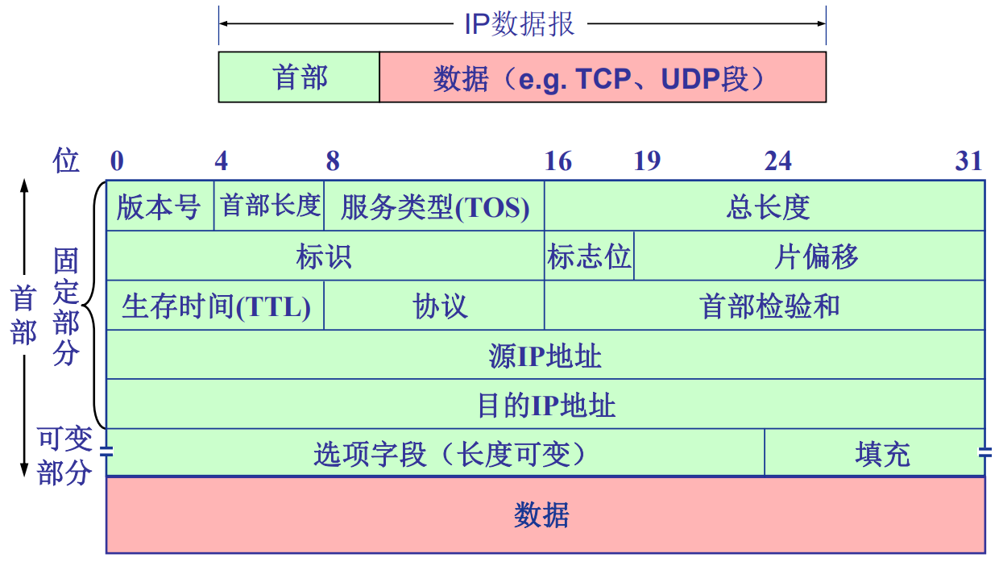
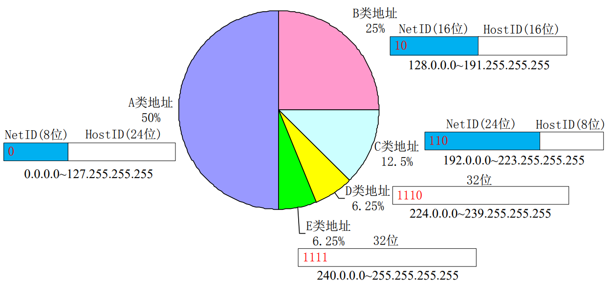
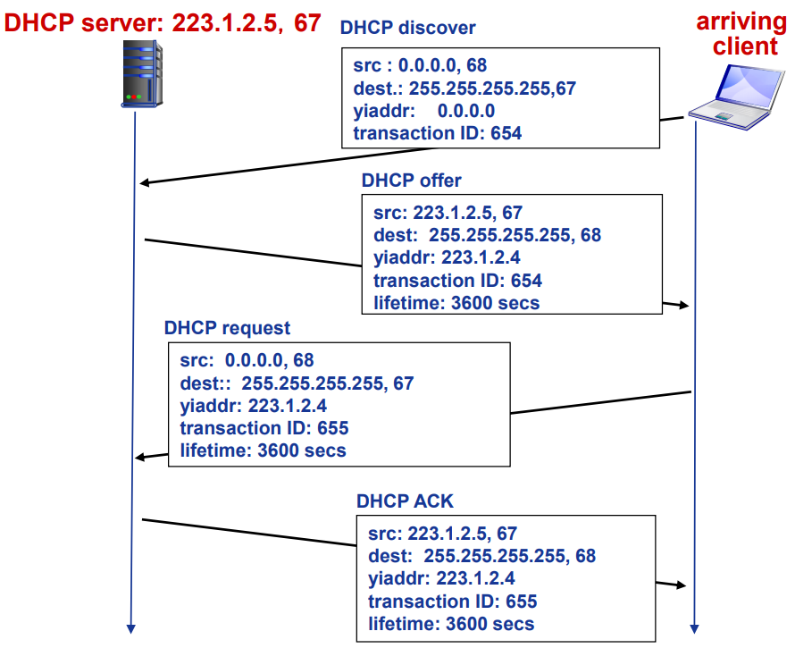
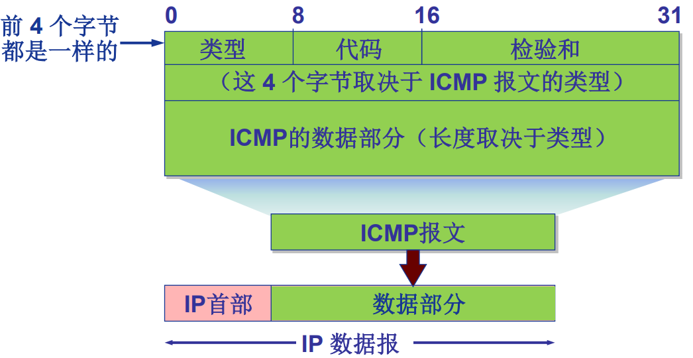
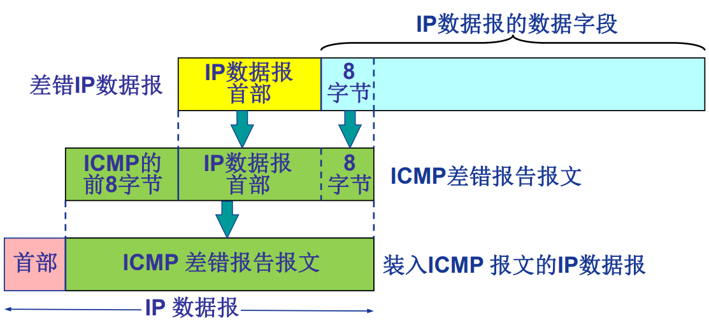

# 笔记4-网络层：数据平面

## 知识点

#### 网络层有哪些功能？

- 转发：分组从一个路由器的一个输入链路转发到一个输出链路上
- 路由选择：确定网络范围内，分组从源到目的采取的端到端路径
<!--ID: 1673505659378-->

#### IPv4数据报格式及各字段功能？

- 首部长度。IP分组首部长度，**以4字节为单位**
- 总长度。IP分组的总字节数（首部+数据），占 16 位，最大 65535B
- 标识。计数器，每产生一个数据报就加 1，并赋值给标识字段，作为该IP分组的标识
- 标志位。非最后一片的 MF=1，最后一片或未分片的 MF=0，DF=0 表示允许分片
- 片偏移。一个IP分组分片在原分组中的相对位置，**以8字节为单位**。如果未分片，该字段为0
- TTL。IP分组在网络中可以通过的路由器数，TTL=0，则路由器丢弃
- 协议。知识封装的是哪个协议的数据包
- 首部校验和。对**IP分组首部**的差错检测，算法与UDP校验和算法一样。逐跳计算，逐跳检验
- 选项字段。携带安全、源选路径、时间戳和路由记录等内容。实际上很少被使用
- 填充。保证首部长度是 4 字节的倍数
<!--ID: 1673505659385-->

#### 简述IP分片过程？

假设原IP分组总长度为 L，待转发链路的MTU为 M，若 L>M，且DF=0，则需要分片。分片时每个分片的标识复制原IP分组的标识。通常分片时，除最后一个分片，其他分片均分为MTU允许的最大分片。一个最大分片可封装的数据应该是8的倍数。
因此，一个最大分片可封装的数据为：$d=\lfloor \frac{M-20}{8} \rfloor \times 8$，需要的总片数为$n=\lceil \frac{L-20}{d} \rceil$，每片的片偏移字段为$F_i=\frac{d}{8}\times (i-1)$，最后一片的总长度字段大小为$L-(n-1)d$
<!--ID: 1673505659392-->

#### 什么是IP子网？

- IP地址具有相同网络号的设备接口
- 不跨越路由器及以上层网络设备可以彼此物理联通的接口
<!--ID: 1673505659399-->

#### IP地址有类地址划分是怎么样的？

<!--ID: 1673510366382-->

#### 网络层转发分组的过程？
每个路由器维护一个转发表，转发表的每一项都是二元组（目的网络(CIDR编制)，下一跳地址），路由器判断目的 IP 应该属于哪个子网，转发到对应的接口。匹配时采用最长匹配原则。
<!--ID: 1673510366396-->

#### DHCP协议是什么？它的基本工作原理？
DHCP(Dynamic Host Configuration Protocol)，动态主机配置协议。这是一个**应用层**协议，基于 UDP，端口号67。需要 IP 地址的主机在启动时向 DHCP 服务器广播发送**发现报文**，DHCP 服务器收到后先在数据库中查找该计算机的配置信息，若找到，则返回找到的信息，若找不到，则从服务器的 IP 地址池中取一个地址分配给该计算机。
<!--ID: 1673510366403-->

#### 什么是NAT？它的作用及实现？
网络地址转换(NAT)是指通过将专用网络地址转换为公用地址，从而对外隐藏内部管理的IP地址。它使得整个专用网络只需要一个全球IP地址就可以与因特网连通，由于专用网本地IP地址是可重用的，所以NAT大大节省了IP地址的消耗。同时，它隐藏了内部网络结构，从而降低了内部网络收到攻击的风险。
实现：
- 替换：利用（NAT IP地址，新端口号）替换每个外出IP数据报的（源IP地址，源端口号）
- 记录：将每对（NAT IP地址，新端口号）与（源IP地址，源端口号）的替换信息存储到NAT转换表中
- 替换：根据NAT转换表，利用（源IP地址，源端口号）替换进入内网IP数据包的（目的IP地址，目的端口号），即（NAT IP地址，新端口号）
<!--ID: 1673511144883-->

#### ICMP协议是什么？它的作用及分类？
ICMP(Internet Control Message Protocol)，因特网控制报文协议。让主机或路由器报告差错和异常情况。ICMP报文作为IP层数据报的数据，加上数据报首部，组成IP数据报发送出去。ICMP报文有两类。
差错报告报文5种：
- 终点不可达。
- 源抑制。当路由器或主机由于拥塞而丢弃数据报时，就向源发送源抑制报文，使源将发送速率放慢
- 超时。当路由器收到TTL为零的数据报时，则丢弃并向源发送时间超过报文。
- 参数问题。当数据报的首部有字段值不正确时，丢弃并向源发送参数问题报文。
- 重定向。路由器把改变路由报文发送给主机，让主机知道下次应将数据报发送给另外的路由器。
网络探询报文2种：
- 回声请求和应答报文。主机探测某个目的主机是否可达，比如 ping。
- 时间戳请求与应答报文。
几种不发送ICMP差错报告的特殊情况：
- 对ICMP差错报告报文不在发送ICMP差错报告报文
- 对非第一个IP数据报分片不发送
- 对所有多播IP数据报均不发送ICMP差错报告报文
- 对具有特殊地址（如127.0.0.0或0.0.0.0）的IP数据报不再发送ICMP差错报告报文
<!--ID: 1673512386882-->

#### ICMP差错报告报文是什么样的？

<!--ID: 1673515159627-->

#### IPv6数据报是什么样的？相比IPv4改变了什么？

- 增加的
	- 优先级(priority)。标识数据报的优先级
	- 流标签(flow Label)。标识同一“流”中的数据报
	- 下一个首部(next header)。标识下一个选项首部或上层协议首部（如TCP首部）
- 移出的
	- 校验和(checksum)。彻底移除，以减少每跳处理时间
	- 选项(options)。允许，但是从基本首部移出，定义多个选项首部，通过“下一个首部”字段指示
- 对于ICMPv6报文
	- 附加了一些报文类型，如 Packet Too Big（因为路由器不对IPv6分片）
	- 多播组管理功能
	<!--ID: 1673515159637-->

## MOOC习题
> 如图所示网络。
> 请回答下列问题：
> 1. 主机在配置IP地址时，其正确的子网掩码和默认网关分别是多少？
> 2. 若路由器R在向互联网转发一个由主机192.168.1.5发送、ID=12345、length=500B、DF=1的IP分组时，则该IP分组首部的哪些字段会被修改？如何修改？
> 3. 若主机192.168.1.10向互联网ID=6789、length=1500B、DF=0的IP分组时，路由器需要将该IP分组分为几片（每片尽可能封装为最大片）？给出分片结果，包括每片的ID、DF、MF、length、offset的取值。

1. 子网掩码即前28位均为1，为：255.255.255.240。默认网关为192.168.1.1
2. TTL会减一，源IP地址会修改为130.11.22.3，CheckSum字段重新计算
3. 按公式计算即可。$M=512B$，所以一个分片最大可封装数据$d=488B$，所以有分片数量$n=4$，分片结果略，注意offset以8字节为单位。

