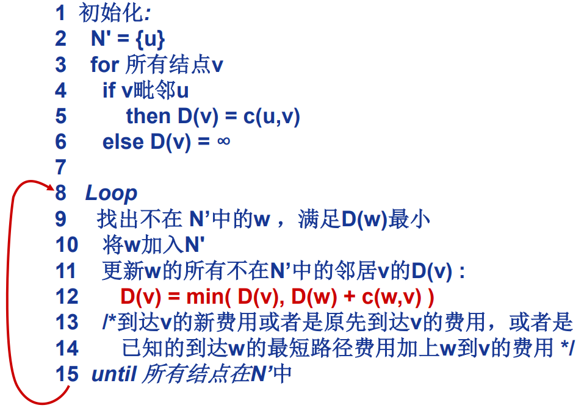
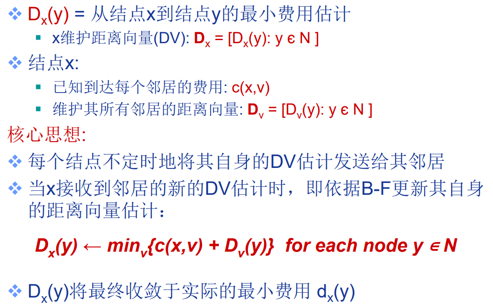
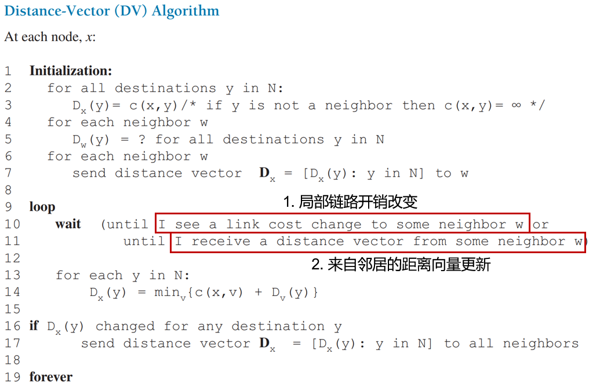
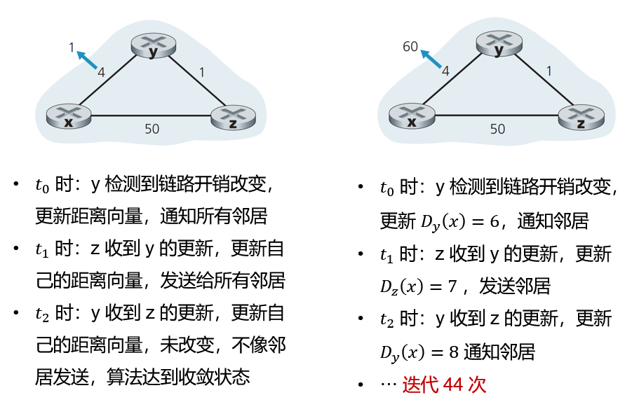

# 笔记5-网络层：控制平面

## 知识点

#### 静态路由与动态路由的区别？
动态路由选择可随网络的通信量或拓扑变化而自适应地调整，而静态路由选择则需要手工去调整相关的路由信息。
<!--ID: 1673531969072-->

#### 链路状态路由算法的原理？
所有结点都掌握整个网络的拓扑和链路费用（通过链路状态广播），使用Dijkstra算法求出每个结点的单源最短路径。
<!--ID: 1673531969083-->

#### 链路状态路由算法可能存在什么问题？
存在震荡(oscillations)可能：
<!--ID: 1673531969091-->

#### 距离向量路由算法的原理？
这是一个分布式算法，每个结点只需要维护其到邻居的链路费用，以及邻居到目的的费用（距离向量）。然后用Bellman-Ford方程更新。具体算法：
<!--ID: 1673531969100-->

#### 距离向量算法可能存在什么问题，如何解决？
无穷计数问题：解决办法：
<!--ID: 1673531969108-->

#### 什么是层次路由？
整个因特网划分为许多较小的**自治系统**(AS)，同一AS内的路由器运行相同的路由协议，跨越AS的路由器称为**网关路由器**。一个AS内部所使用的路由选择协议称为**内部网关协议**(IGP)，如 RIP，OSPF，IGRP；AS间所使用的路由选择协议称为**外部网关协议**(EGP)，如 BGP。
<!--ID: 1673533863103-->

#### RIP协议及其原理？
是**域内**路由选择协议，运行在**应用层**（基于UDP），使用**距离向量算法**。
- 距离度量：跳步数，每条链路1个跳步
- 每隔30秒，邻居之间交换一次距离向量，称为通告
- 每次通告：最多25个目的子网
- 解决无穷计数问题：最大跳数为15，当距离=16时认为无法到达
<!--ID: 1673533863112-->

#### OSPF协议及其相比RIP协议的优点？
是**域内**路由选择协议，使用基于IP数据报传输，使用**链路状态路由算法**。
优点：
- 安全：所有OSPF报文可以被认证（预防恶意入侵）
- 允许使用多条相同费用的路径
- 对于每条链路，可以针对不同的TOS设置多个不同的费用度量
- OSPF支持对大规模AS进一步分层
<!--ID: 1673533863120-->

#### 什么是BGP协议？
是域间路由选择协议，运行在**应用层**（基于TCP），BGP为每个AS提供了一种手段：
- eBGP：从邻居AS获取子网可达性信息
- iBGP：向所有AS内部路由器传播子网可达性信息
- 基于可达性信息与策略，确定到达其他网络的路径（不一定最优）
从而求出到达一个子网需要经过哪些AS
<!--ID: 1673534113572-->

## 课后习题

> R4. 比较和对照链路状态和距离向量这两种路由选择算法。

链路状态算法：使用关于网络的完整全局知识计算源和目标之间的最低成本路径。
距离向量算法：最短路径的计算以迭代的分布式方式执行。节点只知道它应转发数据包的邻居，以便沿最低成本路径到达给定目的地，以及从自身到目的地的该路径的成本。

## MOOC习题

> 某网络拓扑如图所示，其中路由器内网接口、DHCP服务器、WWW服务器与主机1均采用静态IP地址配置，相关地址信息见图中标注；主机2～主机N通过DHCP服务器动态获取IP地址等配置信息。请回答下列问题。
> 1. DHCP服务器可为主机2～主机N动态分配IP地址的最大范围是什么？主机2使用DHCP协议获取IP地址的过程中，发送的封装DHCP Discover报文的IP分组的源IP地址和目的IP地址分别是什么？
> 2. 主机2在通过DHCP服务器获取IP地址的同时还可以获取哪些IP地址配置所必须的信息？
> 3. 若主机1的子网掩码和默认网关分别配置为255.255.255.0和111.123.15.2，则该主机是否能访问WWW服务器？是否能访问Internet？请说明理由。

1. DHCP服务器可为主机2～主机N动态分配IP地址的最大范围为111.123.15.5 ~ 111.123.15.254。源IP地址 0.0.0.0 目的IP地址 255.255.255.255
2. IP地址的lifetime，见下图：
3. 主机1的默认网关配置错了，所以不能访问Internet，能访问在同一子网的WWW服务器。

> 如图所示网络拓扑，所有路由器均采用距离向量路由算法计算到达两个子网的路由（注：到达子网的路由度量采用跳步数）。
> 请回答下列问题：
> 1. 若所有路由器均已收敛，请给出R1的路由表，要求包括到达图中所有子网的路由，且路由表中的路由项尽可能少。
> 2. 在所有路由器均已收敛的状态下，R3突然检测到子网192.168.1.128/26不可到达，若接下来R2和R3同时向R1交换距离向量，则R1更新后的路由表是什么？更新后的R1距离向量是什么？

R1的初始收敛后的路由表：

| 目的网络         | 接口 |
| ---------------- | ---- |
| 192.168.1.0/24   | S1   |
| 192.168.1.192/26 | E0   |
| 192.168.2.0/23   | S0   |
R3突然检测到子网192.168.1.128/26不可到达会向R1交换距离向量，此时R1计算距离后，会选择对于目的网络为192.168.1.128/26的从S0转发，所以路由表更新为

| 目的网络         | 接口 |
| ---------------- | ---- |
| 192.168.1.0/25   | S1   |
| 192.168.1.192/26 | E0   |
| 192.168.2.0/23   | S0   |
| 192.168.1.128/26 | S0   |
R1的距离向量：

|192.168.1.0/25  | 2 |
|----------------|---|
|192.168.1.128/26| 3 |
|192.168.1.192/26| 1 |
| 192.168.2.0/23 | 2 |

