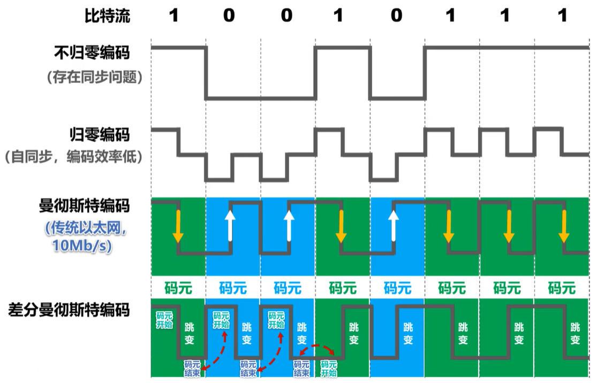
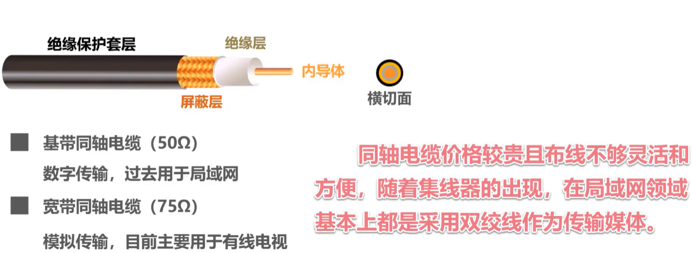
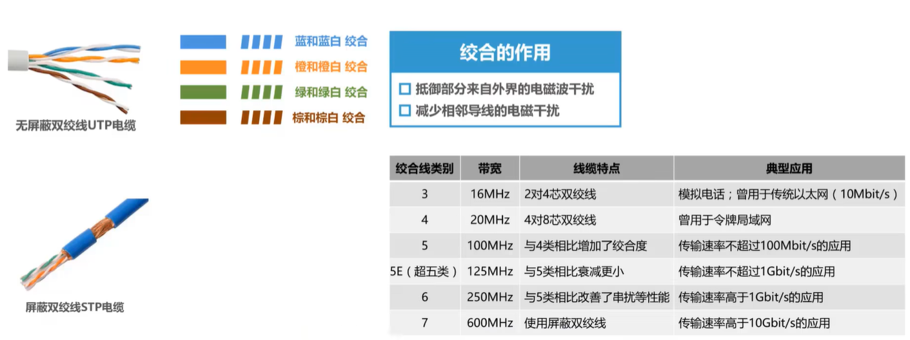
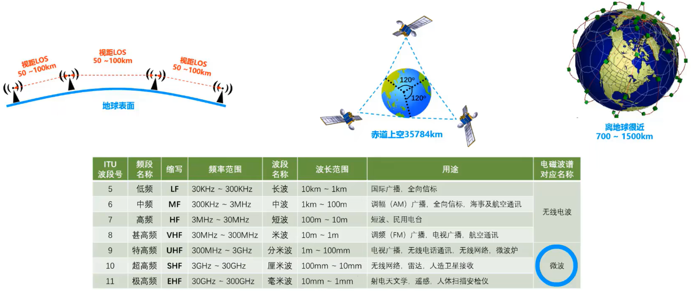

# 笔记7-物理层

### 知识点

#### 数据、信号、码元、信道

数据：传送信息的实体
信号：数据在传输过程中的电磁或电气表现形式
码元：用一个固定时长的信号波形表示一个 k 进制的数字，时长称为**码元宽度**
信道：信号的传输媒介
<!--ID: 1673603609458-->

#### 速率、波特
波特率：单位时间传输的码元个数
比特率：单位时间传输的二进制码元个数
若一个码元携带 $n$ 比特信息量，则比特率为波特率的 $n$ 倍
<!--ID: 1673603609465-->

#### 三种通信方式
- 单工通信：仅需一条信道，单方向。
- 半双工：双方都可发送接收，但不能同时，需两条信道。
- 全双工：可以两边同时发送和接收，需两条信道。
<!--ID: 1673603609471-->

#### 奈奎斯特定理
理想低通（无噪声、带宽有限）的信道中，令 W 为信道带宽，V 为码元状态数，则为避免码间干扰，码元传输速率上限为 2W 波特，极限数据传输速率为$2W\text{log}_2V$。理想带通信道的最高码元传输速率为 W 波特
<!--ID: 1673603609477-->

#### 香农定理
给出了带宽受限且由高斯白噪声干扰的信道的极限数据传输速率，当用此速率传输时，可以做到不产生误差，为$W\text{log}_2(1+S/N)$
W 为信道带宽，S 为信道所传信号的平均功率，N 为信道内部的高斯噪声功率，信噪比为$10\text{log}_{10}(S/N)$
<!--ID: 1673603609483-->

#### 数字数据编码为数字信号的方式
- 归零编码(RZ)：一个码元前半段代表数据，后半段归零。含同步信息。
- 非归零编码(NRZ)：不用归零，一个周期可以全部用来传输数据。不含同步信息。
- 反向非归零编码(NRZI)。用信号的翻转代表0，保持不变代表1。（USB2.0使用）含同步信息。
- 曼彻斯特编码：一个码元前一半高后一半低表示1，前一般低后一半高则表示0。（**以太网**使用）含同步信息。
- 差分曼彻斯特：下一个为1，下一的前半和这一后半相同，反之不同。抗干扰性好。含同步信息。
- 4B/5B 编码：将所有 4 比特的数据用 5 比特编码。

<!--ID: 1673603609489-->

#### 数字数据调制为模拟信号的方式
- 幅移键控(ASK)。改变振幅表示1和0。抗干扰能力差。
- 频移键控(FSK)。改变频率表示1和0。容易实现，抗干扰能力强。
- 相移键控(PSK)。改变相位表示1和0。
- 正交振幅调制(QAM)。
<!--ID: 1673603609495-->

#### 导引型传输媒体
- 同轴电缆
- 双绞线
- 光纤
<!--ID: 1673603609500-->

#### 非导引型传输媒体
- 无线电波
- 微波
<!--ID: 1673603609506-->

## 参考资料
- [计算机网络微课堂（有字幕无背景音乐版）](https://www.bilibili.com/video/BV1c4411d7jb?p=15&vd_source=c69ef468b26d2ba5407c20118eeee19c)
- 王道2024《计算机网络考研复习指导》
- [计算机网络个人_笔记_：第二章-_物理层_](https://zhuanlan.zhihu.com/p/561979200)