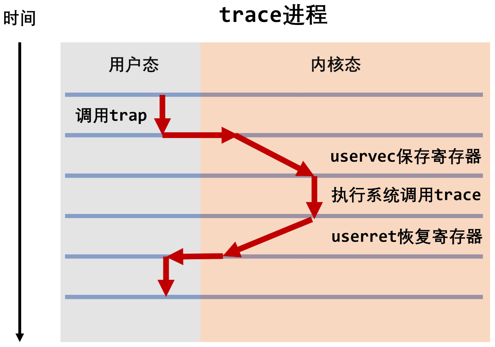
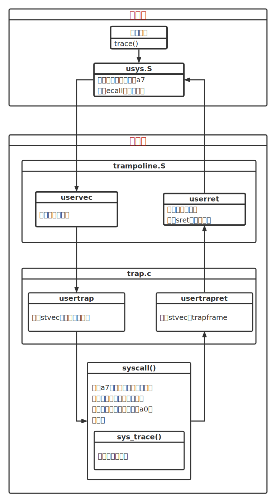

# Lab2: System calls 深入解析

## 实验概览

Syscall 实验就要对内核动刀了，虽然还是很浅层，但对理解 xv6 的系统调用机制很有帮助。

本实验有两个任务：

- 实现系统调用：`trace`。它的功能就是追踪系统调用的执行，接受一个表示待追踪系统调用的集合，每当其中的系统调用被某个进程执行时，打印该进程的 PID，被执行的系统调用的名字，以及它的返回值。

- 实现系统调用：`sysinfo`。它的作用是维护`struct sysinfo`，这个结构体保存了当前系统空闲内存的字节数和进程的数量。


## System call tracing

待追踪系统调用的集合用一个`int`型的掩码`mask`来表示，具体来说，就是该掩码的第几位为 1，就表示第几个系统调用要被追踪。系统调用号如下：

```c
// System call numbers
##define SYS_fork    1
##define SYS_exit    2
##define SYS_wait    3
##define SYS_pipe    4
##define SYS_read    5
##define SYS_kill    6
##define SYS_exec    7
##define SYS_fstat   8
##define SYS_chdir   9
##define SYS_dup    10
##define SYS_getpid 11
##define SYS_sbrk   12
##define SYS_sleep  13
##define SYS_uptime 14
##define SYS_open   15
##define SYS_write  16
##define SYS_mknod  17
##define SYS_unlink 18
##define SYS_link   19
##define SYS_mkdir  20
##define SYS_close  21
```

比如，设置参数`mask=2`，则`fork`要被追踪；设置参数`mask=0xffffffff`，则所有系统调用都要被追踪。

`trace`用法示例：

```c
trace 32 grep hello README
```

该命令表示最终运行`grep`程序，并且设置`mask=32`追踪运行`grep`过程中的系统调用。`trace`用户态程序的代码如下：

```c
int
main(int argc, char *argv[])
{
  int i;
  char *nargv[MAXARG];

  if(argc < 3 || (argv[1][0] < '0' || argv[1][0] > '9')){
    fprintf(2, "Usage: %s mask command\n", argv[0]);
    exit(1);
  }

  if (trace(atoi(argv[1])) < 0) {			//执行系统调用trace, 参数为mask
    fprintf(2, "%s: trace failed\n", argv[0]);
    exit(1);
  }
  
  for(i = 2; i < argc && i < MAXARG; i++){
    nargv[i-2] = argv[i];					//设置原本要执行的命令的参数
  }
  exec(nargv[0], nargv);					//执行原本要执行的命令
  exit(0);
}
```

接下来按照实验指导的 Hints 一步步往下做就可以了，我只讲解部分重点内容

###### 进程状态修改

xv6 为每个进程维护了表示进程当前状态的结构体`struct proc`。包括进程的 PID，父进程、文件描述符等信息，为了确定当前进程调用的哪些系统调用需要被追踪，我在该结构体设置了`int mask`来保存待追踪系统调用集合

```c
// Per-process state
struct proc {
  struct spinlock lock;

  // p->lock must be held when using these:
  enum procstate state;        // Process state
  void *chan;                  // If non-zero, sleeping on chan
  int killed;                  // If non-zero, have been killed
  int xstate;                  // Exit status to be returned to parent's wait
  int pid;                     // Process ID

  // wait_lock must be held when using this:
  struct proc *parent;         // Parent process

  // these are private to the process, so p->lock need not be held.
  uint64 kstack;               // Virtual address of kernel stack
  uint64 sz;                   // Size of process memory (bytes)
  pagetable_t pagetable;       // User page table
  struct trapframe *trapframe; // data page for trampoline.S
  struct context context;      // swtch() here to run process
  struct file *ofile[NOFILE];  // Open files
  struct inode *cwd;           // Current directory
  char name[16];               // Process name (debugging)
    
  int mask;                    // Trace mask
};
```

###### 内核态`trace`编写

内核态`trace`编写思路很简单，分两步进行：

- 获取`trace`的参数，即待追踪系统调用集合`mask`，它保存在当前进程的`a0`寄存器中，使用`argint`函数获取
- 修改当前进程状态

代码如下：

```c
uint64
sys_trace(void)
{
  int mask;

  if(argint(0, &mask) < 0)
    return -1;
  myproc()->mask = mask;
  return 0;
}
```

###### 子进程继承`mask`

当要追踪的进程使用`fork`创建子进程时，我们显然也应追踪该子进程的系统调用，因此要在`proc.c`中修改`fork`函数，把父进程的`mask`复制给子进程，代码如下：

```c
// Create a new process, copying the parent.
// Sets up child kernel stack to return as if from fork() system call.
int
fork(void)
{
  int i, pid;
  struct proc *np;
  struct proc *p = myproc();

  // Allocate process.
  if((np = allocproc()) == 0){
    return -1;
  }

  // Copy user memory from parent to child.
  if(uvmcopy(p->pagetable, np->pagetable, p->sz) < 0){
    freeproc(np);
    release(&np->lock);
    return -1;
  }
  np->sz = p->sz;
  // copy trace mask
  np->mask = p->mask;

  // copy saved user registers.
  *(np->trapframe) = *(p->trapframe);

  // Cause fork to return 0 in the child.
  np->trapframe->a0 = 0;

  // increment reference counts on open file descriptors.
  for(i = 0; i < NOFILE; i++)
    if(p->ofile[i])
      np->ofile[i] = filedup(p->ofile[i]);
  np->cwd = idup(p->cwd);

  safestrcpy(np->name, p->name, sizeof(p->name));

  pid = np->pid;

  release(&np->lock);

  acquire(&wait_lock);
  np->parent = p;
  release(&wait_lock);

  acquire(&np->lock);
  np->state = RUNNABLE;
  release(&np->lock);

  return pid;
}
```

###### `trace`输出

实验要求打印系统调用的相关信息：当前进程 PID、系统调用名、系统调用返回值

直接在`syscall`函数中修改即可

`syscall`原始代码：

```c
void
syscall(void)
{
  int num;
  struct proc *p = myproc();
 
  num = p->trapframe->a7;	//获取系统调用号
  if(num > 0 && num < NELEM(syscalls) && syscalls[num]) { //判断有无对应的系统调用号
    /* a0: the return of syscalls */
    p->trapframe->a0 = syscalls[num]();	//在函数指针数组中索引到相应函数执行，把调用返回值保存到a0中
  } else {
    printf("%d %s: unknown sys call %d\n",
            p->pid, p->name, num);
    p->trapframe->a0 = -1;
  }
}
```

该函数的逻辑在注释中写得很清楚了。要想打印系统调用的相关信息，只需要在得到`num`以后，判断其是否在当前进程的`mask`中，根据`mask`的掩码特性，使用与运算就能轻松实现这个过程：

```c
(1 << num) & p->mask
```

完整代码如下：

```c
void
syscall(void)
{
  int num;
  struct proc *p = myproc();
  char* syscall_name[22] = {"fork", "exit", "wait", "pipe",
                            "read", "kill", "exec", "fstat", 
                            "chdir", "dup", "getpid", "sbrk", 
                            "sleep", "uptime", "open", "write", 
                            "mknod", "unlink", "link", "mkdir", 
                            "close", "trace"};
  num = p->trapframe->a7;
  if(num > 0 && num < NELEM(syscalls) && syscalls[num]) {
    /* a0: the return of syscalls */
    p->trapframe->a0 = syscalls[num]();
    if((1 << num) & p->mask){
      printf("%d: syscall %s -> %d\n", p->pid, syscall_name[num-1], p->trapframe->a0);
    }
  } else {
    printf("%d %s: unknown sys call %d\n",
            p->pid, p->name, num);
    p->trapframe->a0 = -1;
  }
}
```

## Sysinfo

`struct sysinfo`结构体如下：

```c
struct sysinfo {
  uint64 freemem;   // amount of free memory (bytes)
  uint64 nproc;     // number of process
};
```

为了维护这个结构体，需要获得当前系统空闲内存的字节数和进程的数量

###### 空闲内存页

内核中的`kalloc.c`管理物理内存，它使用链表维护空闲页，链表结点定义如下：

```c
struct run {
  struct run *next;
};

struct {
  struct spinlock lock;
  struct run *freelist;
} kmem;
```

将空闲页添加入链表的函数：

```c
void
kfree(void *pa)
{
  struct run *r;

  if(((uint64)pa % PGSIZE) != 0 || (char*)pa < end || (uint64)pa >= PHYSTOP)
    panic("kfree");

  // Fill with junk to catch dangling refs.
  memset(pa, 1, PGSIZE);

  r = (struct run*)pa;		//空闲页头部8个字节

  acquire(&kmem.lock);
  r->next = kmem.freelist;
  kmem.freelist = r;
  release(&kmem.lock);
}
```

通过该函数，我们可以学到空闲页链表的工作原理：

- 每个空闲页的大小设置为`PGSIZE`
- 将空闲页的头部 8 个字节作为指针指向下一个空闲页

因此，只需要遍历`freelist`，得到总空闲页数量，再用空闲页数量乘每个空闲页的大小即可得到空闲内存的大小，代码：

```c
uint64
freemem()
{
  struct run *r;
  uint64 mem = 0;
  r = kmem.freelist;
  while(r){
    r = r->next;
    mem++;
  }
  return mem*PGSIZE;
}
```

###### 进程状态

前面说到了表明每个进程状态的结构体`struct proc`，这个结构体中有一个字段

```c
enum procstate state;        // Process state
```

它用来表示当前进程的运行状态：

```c
enum procstate { UNUSED, USED, SLEEPING, RUNNABLE, RUNNING, ZOMBIE };
```

我们需要得到进程状态为`UNUSED`的进程数量

在`proc.c`中，有一个结构体数组来维护当前所有进程：

```c
struct proc proc[NPROC]; //NPROC=64，最大进程数量
```

因此只需遍历这个结构体数组并计数即可，代码：

```c
// collect the number of process
uint64
procnum(void)
{
  int num = 0;
  for(int i = 0; i < NPROC; i++){
    if(proc[i].state != UNUSED){
      num++;
    }
  }
  return num;
}
```

###### 设置`sysinfo`

调用上述两个函数设置结构体，并将其复制到用户空间，在`sysproc.c`中添加：

```c
uint64
sys_sysinfo(void)
{
  uint64 addr;
  if(argaddr(0, &addr) < 0)
    return -1;
  
  struct sysinfo info;
  info.freemem = freemem();		//空闲内存
  info.nproc = procnum();		//UNUSED线程数

  struct proc *p = myproc();  
  if(copyout(p->pagetable, addr, (char *)&info, sizeof(info)) < 0)
      return -1;
  return 0;
}
```

## 测试

测试截图：


满分通过！

## 系统调用过程

做到这里，本实验就结束了，但我依旧意犹未尽，从 Shell 创建子进程运行`trace`开始，到执行用户态中的`trace`程序，再到执行内核态中的`trace`系统调用，这整个过程究竟是怎么样的呢？

接下来我将详细阐述

###### `ecall`跳转

用户态通过`ecall`指令进入内核态，`ecall`的调用在`usys.S`中：

```c
## generated by usys.pl - do not edit
##include "kernel/syscall.h"
.global fork
fork:
 li a7, SYS_fork
 ecall
 ret
.global exit
exit:
 li a7, SYS_exit
 ecall
 ret
.global wait


...     
     
.global update
uptime:
 li a7, SYS_uptime
 ecall
 ret
.global trace
trace:
 li a7, SYS_trace
 ecall
 ret
.global sysinfo
sysinfo:
 li a7, SYS_sysinfo
 ecall
 ret
```

- 用户态的`trace`执行系统调用时，会把参数保存在`a0`寄存器中
- 随后在`usys.S`中将相应的系统调用号保存到`a7`寄存器中
- 最后，执行`ecall`进入内核态的`trampoline.S`

用户态程序通过执行系统调用陷入内核态称为用户态陷阱

陷阱对进程是透明的：当执行完处理程序后，被打断的进程要能够恢复之前的状态。这就要求进程在陷入内核态时，内核保存用户寄存器的信息，并在执行完处理程序后再将它们进行恢复

而`trampoline.S`就用来实现这个任务：

`uservec`保存用户寄存器、`userret`恢复用户寄存器。流程如下：



###### `uservec`保存用户寄存器

在进入`uservec`函数时，所有的 32 个寄存器都是被中断代码所享有的，而`uservec`需要使用寄存器来执行指令，因此，RISC-V 提供了`sscratch`寄存器，通过`csrrw a0, sscratch, a0`指令，保存`a0`，之后就可以使用`a0`寄存器了。

然后，函数保存所有用户寄存器到`trapframe`结构体中，该结构体的地址在进入用户模式之前，被保存在`sscratch`寄存器中，因此经过之前的`csrrw`操作后，就被保存在`a0`中，通过`a0`寻址就能实现保存用户寄存器：

```c
## save the user registers in TRAPFRAME
        sd ra, 40(a0)
        sd sp, 48(a0)
        sd gp, 56(a0)
        sd tp, 64(a0)
        sd t0, 72(a0)
        sd t1, 80(a0)
        
            ...
            
        sd t3, 256(a0)
        sd t4, 264(a0)
        sd t5, 272(a0)
        sd t6, 280(a0)
```

当创建进程时，内核会申请一个页面保存`trapframe`，该页面就位于`TRAMPOLINE`下方，进程的`p->trapframe`也指向该页面。

最后，函数从`trapframe`中取出内核栈地址、`hartid`、`usertrap`的地址、内核页表地址，切换页表，跳转到`usertrap`函数。

###### 陷阱处理

`uservec`保存用户寄存器后，会进入`trap.c`陷阱处理程序。它首先调用`usertrap`函数将`stvec`设置为`kernelvec`的地址，然后判断陷阱类型，如果是系统调用，就将`pc`指向`ecall`的下一条指令，随后交给`syscall`函数处理

```c
//
// handle an interrupt, exception, or system call from user space.
// called from trampoline.S
//
void
usertrap(void)
{
  int which_dev = 0;

  if((r_sstatus() & SSTATUS_SPP) != 0)
    panic("usertrap: not from user mode");

  // send interrupts and exceptions to kerneltrap(),
  // since we're now in the kernel.
  w_stvec((uint64)kernelvec);

  struct proc *p = myproc();
  
  // save user program counter.
  p->trapframe->epc = r_sepc();
  
  if(r_scause() == 8){
    // system call

    if(p->killed)
      exit(-1);

    // sepc points to the ecall instruction,
    // but we want to return to the next instruction.
    p->trapframe->epc += 4;

    // an interrupt will change sstatus &c registers,
    // so don't enable until done with those registers.
    intr_on();

    syscall();
  } else if((which_dev = devintr()) != 0){
    // ok
  } else {
    printf("usertrap(): unexpected scause %p pid=%d\n", r_scause(), p->pid);
    printf("            sepc=%p stval=%p\n", r_sepc(), r_stval());
    p->killed = 1;
  }

  if(p->killed)
    exit(-1);

  // give up the CPU if this is a timer interrupt.
  if(which_dev == 2)
    yield();

  usertrapret();
}
```

接下来的过程就很熟悉了，`syscall.c`中有一个系统调用的函数指针数组，它通过系统调用号执行相应的系统调用。

执行完毕后返回陷阱处理程序，接下来调用`usertrapret`函数

`usertrapret`函数将`stvec`设置为`uservec`的地址，之后设置`trapframe`，然后恢复`sepc`寄存器

最后，调用`userret`函数

###### `userret`恢复用户寄存器

`userret`函数进行与`uservec`相反的步骤，将页表和寄存器进行恢复：

```c
## restore all but a0 from TRAPFRAME
        ld ra, 40(a0)
        ld sp, 48(a0)
        ld gp, 56(a0)
        ld tp, 64(a0)
        ld t0, 72(a0)
        ld t1, 80(a0)
        
            ...
        
        
        ld t3, 256(a0)
        ld t4, 264(a0)
        ld t5, 272(a0)
        ld t6, 280(a0)
```

最后，通过`sret`指令回到用户态，至此，`trace`系统调用就执行结束了

###### 流程图

全过程调用流程图如下：



## 总结

- 操作系统不愧是程序员的三大浪漫之一，简单的系统调用陷阱处理过程就如此优美，简直让人着迷！
- 本实验耗时 2 天，约 6 小时
