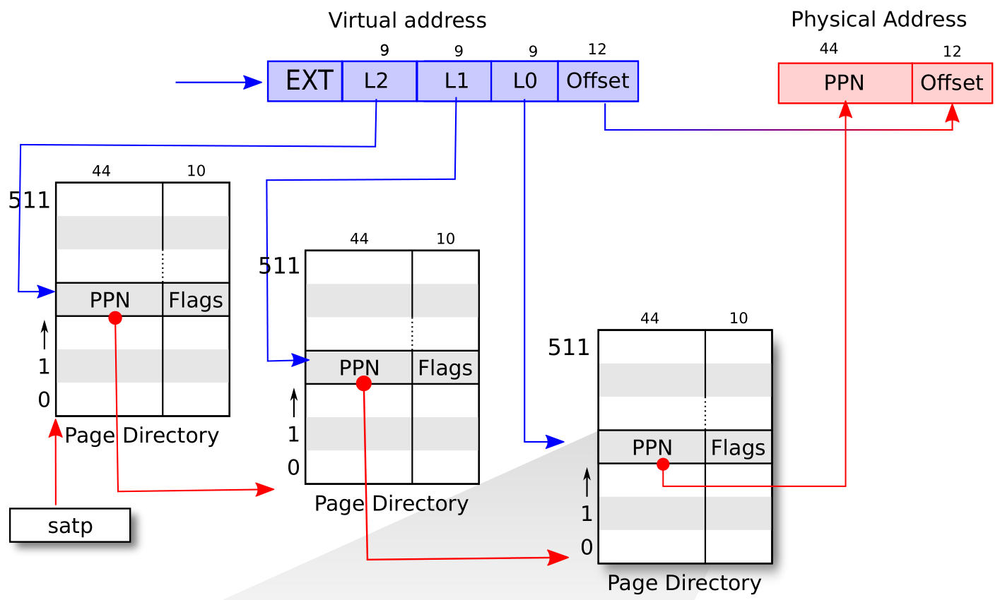
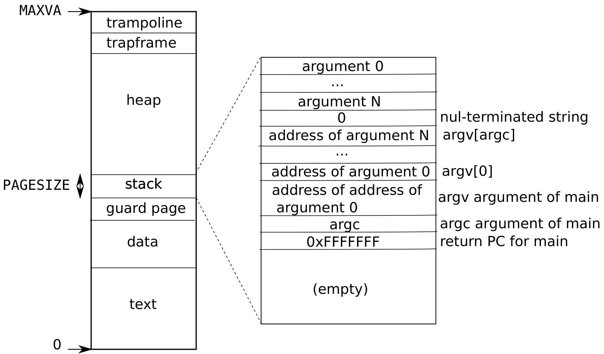
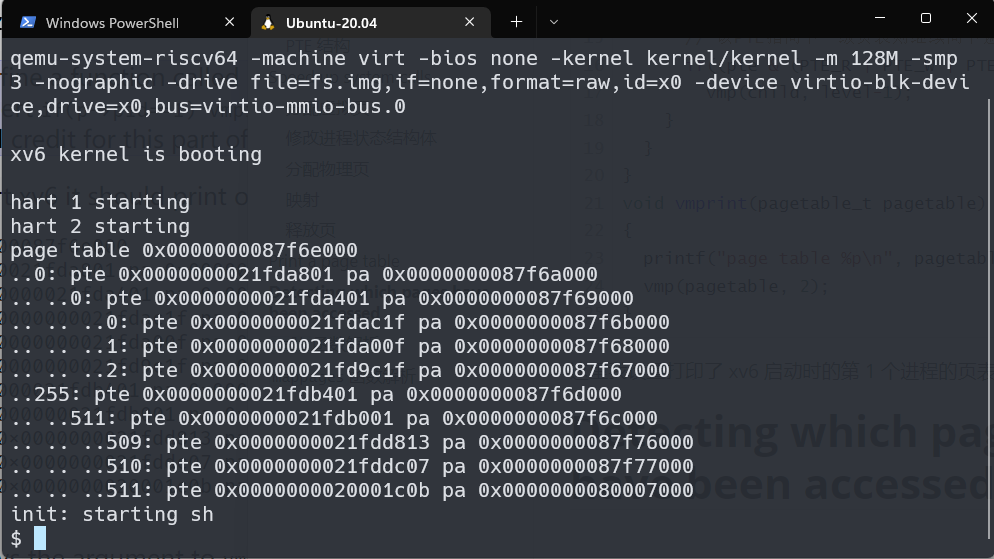
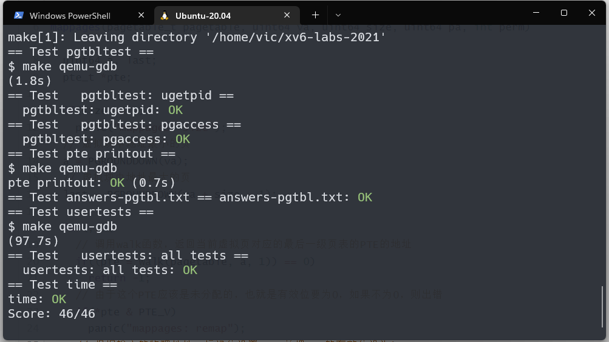

# Lab3: Page tables 深入解析

## 实验概览

本实验均为关于页表的操作，分为三部分：

- 通过用户页表为每个进程映射一个虚拟页来加速某些系统调用
- 设计函数，打印整个 3 级页表中的内容
- 设计系统调用，查明哪些页被读写过

## 虚拟内存

虚拟内存是一个伟大的抽象，它能将操作系统中的每一个进程隔离开。在实验开始前，我先简要总结一下 xv6 的页表系统：

###### 虚拟地址

虚拟内存和物理内存都被分为大小相等的页，它们总是按页被访问的。而页表就是将虚拟页映射到物理页的数据结构。xv6 采用 3 级页表，组织如下：



- 虚拟地址被分为两部分，12 位的`Offset`为最终物理地址对应物理页中的页面偏移
- 由于这是 3 级页表结构，上面的 36 位被分为 3 个 9 位，分别用来索引每一级页表中的页表条目
- 注意，第 3 级页表的基地址由内核维护的`satp`寄存器给出

接下来分析页表条目 PTE 的结构

###### PTE 结构

xv6 的 PTE 结构如下：


- 最低 10 位是一些标记位，指明是否有效、读写权限、执行权限、是否只能内核访问等
- 中间 44 位为 PPN，第 3 级和第 2 级的 PPN 指向下一级页表，最后一级的 PPN 指向对应物理地址的物理页
- 最高 10 位为保留位，置零即可

## 源码分析

页表的原理并不复杂，但是实现起来就需要很多技巧了，在实验开始前，我先对内存映射的部分函数进行分析：

###### `walk`函数解析

`walk`函数写得很漂亮，它模拟了 MMU 的作用：根据传入的虚拟地址和第 3 级页表的基地址（由`satp`寄存器给出），返回对应第 1 级页表 PTE 的地址

我们可以把每一级页表看作一个大数组，数组的元素为 PTE，每一级页表有 512 个 PTE

第 3 级页表的首地址由`satp`寄存器给出，剩余页表的首地址都由上一级页表中的 PTE 给出

而 PTE 作为每一级页表的元素，又由虚拟地址中 VPN 对应的 9 位页表偏移来索引（因为 $512=2^9$）

由此，给出一系列便于操作的宏：

```c
// 得到各标记位:
##define PTE_V (1L << 0) // valid
##define PTE_R (1L << 1) // Readable
##define PTE_W (1L << 2) // Writable
##define PTE_X (1L << 3) // Executable
##define PTE_U (1L << 4) // 1 -> user can access

// 变换PA, 使得其PPN与PTE中的PPN对应
##define PA2PTE(pa) ((((uint64)pa) >> 12) << 10)

// 变换PTE, 使得其PPN与PA中的PPN对应
##define PTE2PA(pte) (((pte) >> 10) << 12)

// 得到PTE的最低10位(标记位)
##define PTE_FLAGS(pte) ((pte) & 0x3FF)

// 指示每一级页表的页表偏移为9位
##define PXMASK          0x1FF // 9 bits
// 根据页表的级数(0, 1, 2)，取对应VPN的偏移
##define PXSHIFT(level)  (PGSHIFT+(9*(level)))

//得到相应级数页表的页表偏移
##define PX(level, va) ((((uint64) (va)) >> PXSHIFT(level)) & PXMASK)
```

 有了这些宏，就能让我们的`walk`函数变的非常优美！代码及注释：

```c
// Return the address of the PTE in page table pagetable
// that corresponds to virtual address va.  If alloc!=0,
// create any required page-table pages.
//
// The risc-v Sv39 scheme has three levels of page-table
// pages. A page-table page contains 512 64-bit PTEs.
// A 64-bit virtual address is split into five fields:
//   39..63 -- must be zero.
//   30..38 -- 9 bits of level-2 index.
//   21..29 -- 9 bits of level-1 index.
//   12..20 -- 9 bits of level-0 index.
//    0..11 -- 12 bits of byte offset within the page.
pte_t *
walk(pagetable_t pagetable, uint64 va, int alloc)
{
  if(va >= MAXVA)
    panic("walk");
	
  for(int level = 2; level > 0; level--) { // 三级页表遍历
    // PX(level, va)根据当前级数和虚拟地址得到页表偏移, 进而定位到PTE
    pte_t *pte = &pagetable[PX(level, va)];
      
    // 该PTE是否有效
    if(*pte & PTE_V) {
      // 由上一级的PTE得到下一级页表的首地址
      pagetable = (pagetable_t)PTE2PA(*pte);
    } else {
      if(!alloc || (pagetable = (pde_t*)kalloc()) == 0)
        return 0;
      memset(pagetable, 0, PGSIZE);
      *pte = PA2PTE(pagetable) | PTE_V;
    }
  }
  // 返回对应第一级页表中PTE的地址
  return &pagetable[PX(0, va)];
}
```

###### `mappages`函数解析

`mappages`修改第 1 级页表中的 PTE，从而完成从虚拟页到物理页的映射，它接受 5 个参数：

```c
int mappages(pagetable_t pagetable, uint64 va, uint64 size, uint64 pa, int perm);
//pagetable: 第3级页表的地址
//va: 虚拟块首地址
//size: 虚拟块的大小
//pa: 物理块的首地址
//perm: PTE的标记位
```

首先设计一个宏：

```c
##define PGROUNDDOWN(a) (((a)) & ~(PGSIZE-1))
```

这个宏可以把虚拟地址的低 12 位清空，只保留 VPN 的部分

`mappages`代码及注释：

```c
// Create PTEs for virtual addresses starting at va that refer to
// physical addresses starting at pa. va and size might not
// be page-aligned. Returns 0 on success, -1 if walk() couldn't
// allocate a needed page-table page.
int
mappages(pagetable_t pagetable, uint64 va, uint64 size, uint64 pa, int perm)
{
  uint64 a, last;
  pte_t *pte;

  if(size == 0)
    panic("mappages: size");
  // 虚拟块中地址最小的页
  a = PGROUNDDOWN(va);
  // 虚拟块中地址最大的页
  last = PGROUNDDOWN(va + size - 1);
  
  for(;;){
    // 调用walk函数，返回当前虚拟页对应的最后一级页表的PTE的地址
    if((pte = walk(pagetable, a, 1)) == 0)
      return -1;
    // 由于这个PTE应该是未分配的，也就是有效位要为0，如果不为0，则出错
    if(*pte & PTE_V)
      panic("mappages: remap");
    // 根据输入的物理地址、标记位设置PTE,并把PTE的有效位设为1
    *pte = PA2PTE(pa) | perm | PTE_V;
    // 直到为虚拟页的每一块都映射后才结束
    if(a == last)
      break;
    // 下一页虚拟地址
    a += PGSIZE;
    // 下一页物理地址
    pa += PGSIZE;
  }
  return 0;
}
```

## Speed up system calls

当用户态的进程执行某些系统调用时会涉及到从用户态到内核态的转换。操作系统可以通过在用户态和内核态之间共享某些数据来避免在执行这些系统调用时跨越内核，从而加速系统调用

本部分就是要加速`getpid`的系统调用，思路是为每个进程都设置一个虚拟页并通过页表映射到物理页，并在物理页中存放当前进程的`pid`，这样在调用`getpid`时只需读该页的内容即可

###### 分配虚拟页

首先要确定存放`pid`的页在用户空间的位置，每个进程原始的用户空间如图：



我们设置一个新的页`usyscall`，它位于`trapframe`的下面：


该页虚拟地址，以及存放的结构体的定义如下：

```c
// User memory layout.
// Address zero first:
//   text
//   original data and bss
//   fixed-size stack
//   expandable heap
//   ...
//   USYSCALL (shared with kernel)
//   TRAPFRAME (p->trapframe, used by the trampoline)
//   TRAMPOLINE (the same page as in the kernel)
##define TRAPFRAME (TRAMPOLINE - PGSIZE)
##define USYSCALL (TRAPFRAME - PGSIZE)
struct usyscall {
  int pid;  // Process ID
};
```

###### 修改进程状态结构体

为每一个进程都设置一个虚拟页，显然需要在表示进程状态的结构体中保存这个虚拟页的地址，修改为：

```c
// Per-process state
struct proc {
  ...
  struct trapframe *trapframe; // data page for trampoline.S
  struct usyscall *usyscall;   // speed up the systerm call getpid()
  ...
};
```

###### 分配物理页

模仿`trapframe`页的设置，在`proc.c`中为`usyscall`分配物理页，并且将当前进程的`pid`保存在其中：

```c
// Per-process state
struct proc {
  struct spinlock lock;

  // p->lock must be held when using these:
  enum procstate state;        // Process state
  void *chan;                  // If non-zero, sleeping on chan
  int killed;                  // If non-zero, have been killed
  int xstate;                  // Exit status to be returned to parent's wait
  int pid;                     // Process ID

  // wait_lock must be held when using this:
  struct proc *parent;         // Parent process

  // these are private to the process, so p->lock need not be held.
  uint64 kstack;               // Virtual address of kernel stack
  uint64 sz;                   // Size of process memory (bytes)
  pagetable_t pagetable;       // User page table
  struct trapframe *trapframe; // data page for trampoline.S
  struct usyscall *usyscall;   // speed up the systerm call getpid()
  struct context context;      // swtch() here to run process
  struct file *ofile[NOFILE];  // Open files
  struct inode *cwd;           // Current directory
  char name[16];               // Process name (debugging)
};
```

###### 映射

接下来要把用户空间的虚拟页映射到分配的物理页，利用`mappages`函数修改页表，实现映射：

```c
// Create a user page table for a given process,
// with no user memory, but with trampoline pages.
pagetable_t
proc_pagetable(struct proc *p)
{
  ...
  // map the usyscall
  // used in the user space
  if(mappages(pagetable, USYSCALL, PGSIZE,
              (uint64)(p->usyscall), PTE_R | PTE_U) < 0){
    uvmunmap(pagetable, TRAMPOLINE, 1, 0);
    uvmunmap(pagetable, TRAPFRAME, 1, 0);
    uvmfree(pagetable, 0);
    return 0;
  }
  return pagetable;
}
```

###### 释放页

进程结束后释放对应物理页：

```c
// free a proc structure and the data hanging from it,
// including user pages.
// p->lock must be held.
static void
freeproc(struct proc *p)
{
  if(p->trapframe)
    kfree((void*)p->trapframe);
  p->trapframe = 0;
  if(p->usyscall)
    kfree((void*)p->usyscall);
  p->usyscall = 0;
  if(p->pagetable)
    proc_freepagetable(p->pagetable, p->sz);
  p->pagetable = 0;
  p->sz = 0;
  p->pid = 0;
  p->parent = 0;
  p->name[0] = 0;
  p->chan = 0;
  p->killed = 0;
  p->xstate = 0;
  p->state = UNUSED;
}
```

释放页表：

```c
// Free a process's page table, and free the
// physical memory it refers to.
void
proc_freepagetable(pagetable_t pagetable, uint64 sz)
{
  uvmunmap(pagetable, TRAMPOLINE, 1, 0);
  uvmunmap(pagetable, TRAPFRAME, 1, 0);
  uvmunmap(pagetable, USYSCALL, 1, 0);
  uvmfree(pagetable, sz);
}
```

## Print a page table

这部分不难，就是设计一个函数能够打印某个进程对应的页表中的内容，打印格式如下：

```c
page table 0x0000000087f6e000
 ..0: pte 0x0000000021fda801 pa 0x0000000087f6a000
 .. ..0: pte 0x0000000021fda401 pa 0x0000000087f69000
 .. .. ..0: pte 0x0000000021fdac1f pa 0x0000000087f6b000
 .. .. ..1: pte 0x0000000021fda00f pa 0x0000000087f68000
 .. .. ..2: pte 0x0000000021fd9c1f pa 0x0000000087f67000
 ..255: pte 0x0000000021fdb401 pa 0x0000000087f6d000
 .. ..511: pte 0x0000000021fdb001 pa 0x0000000087f6c000
 .. .. ..509: pte 0x0000000021fdd813 pa 0x0000000087f76000
 .. .. ..510: pte 0x0000000021fddc07 pa 0x0000000087f77000
 .. .. ..511: pte 0x0000000020001c0b pa 0x0000000080007000
```

- 第一行为第 3 级页表地址
- 后面的行呈现树状结构，`..`开头的表示 3 级页表条目，后面的`.. ..`开头的表示上面 3 级页表条目索引到的 2 级页表中的**有效**的条目，以此类推

 思路：这个问题说白了就是遍历一个三层树状结构，显然应选择深度优先遍历

代码：

```c
void vmp(pagetable_t pagetable, int level)
{
   // 遍历该级页表的所有条目
   for(int i = 0; i < 512; i++){
    pte_t pte = pagetable[i];
    // 如果该条目有效则打印
    if(pte & PTE_V){
      pagetable_t child = (pagetable_t)PTE2PA(pte);

      if(level == 2) printf("..");
      if(level == 1) printf(".. ..");
      if(level == 0) printf(".. .. ..");
      printf("%d: pte %p pa %p\n", i, pte, child);
        
      // 该PTE指向下一级页表则继续向下遍历
      if((pte & (PTE_R | PTE_W | PTE_X)) == 0)
        vmp(child, level-1);
    }
  }
}
void vmprint(pagetable_t pagetable)
{
  printf("page table %p\n", pagetable);
  vmp(pagetable, 2);
}
```

- 注意当前 PTE 是否在第 3、第 2 级页表的判断条件：
  - 对于指向下一级页表的 PTE 来说，它的标记位的`R`(可读)、`W`(可写)、`X`(可执行)均为 0

这里我设置了打印 xv6 启动时的第 1 个进程的页表，可以看看效果：



## Detecting which pages have been accessed

这部分是实现一个系统调用`pgaccess()`，它能表明哪些页面被访问（读或写）过，这个系统调用需要 3 个参数：

- 用户虚拟空间的起始地址
- 虚拟页的数量
- 待设置的掩码

说白了，这个系统调用就是完成一件事：

遍历输入参数表示的所有虚拟页在第 1 级页表中的 PTE，查看 PTE 的标记位 PTE_A，如果 PTE_A 为 1，则将掩码对应的位置 1，然后将该 PTE 的 PTE_A 位清空

代码：

```c
int
sys_pgaccess(void)
{
  // lab pgtbl: your code here.
  // 得到3个参数
  uint64 addr; // 虚拟页起始地址
  int num;	   // 待检测虚拟页个数
  uint64 mask; // 待写入用户空间的buf
	
  // 得到3个参数
  if(argaddr(0, &addr) < 0)
    return -1;
  if(argint(1, &num) < 0)
    return -1;
  if(argaddr(2, &mask) < 0)
    return -1;
  // mask只有64位，所有待检测页最大个数为64
  int limit = 64;
  if(num > limit)
    return -1;
  pagetable_t pagetable = myproc()->pagetable;

  uint64 bufmask = 0;
  // 遍历所有页
  for(int i = 0; i < num; i++){
    uint64 va = addr + i*PGSIZE;
    pte_t *pte = walk(pagetable, va, 0); // 得到PTE
    if(*pte & PTE_A){
      bufmask |= (1 << i); // 设置PTE
      *pte &= ~PTE_A;	   // 清空PTE_A
    }
  }
  // 写回用户空间
  copyout(pagetable, mask, (char *)&bufmask, sizeof(bufmask));
  return 0;
}
```

## 测试

测试结果如下：



满分通过！

## 总结

- 对于刚刚结束 ICS 期末考试，饱受 Intel Core i7 四级页表折磨的我来说，理解这部分内容还是相当轻松的
- xv6 关于内存分配与映射的一些代码写得真的太漂亮了！简洁优雅却又逻辑清晰，这是我该学习的地方！
- 本实验耗时 3 天，约 7 小时

