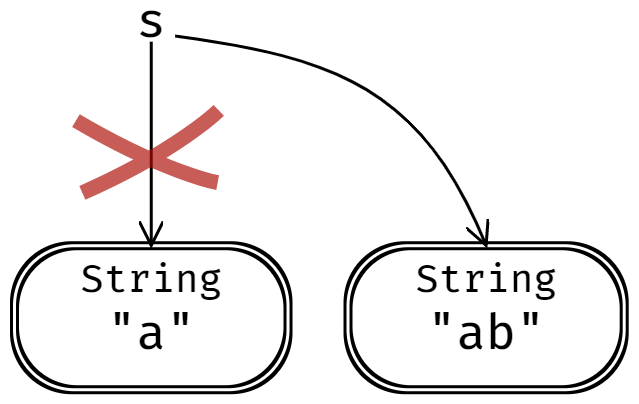
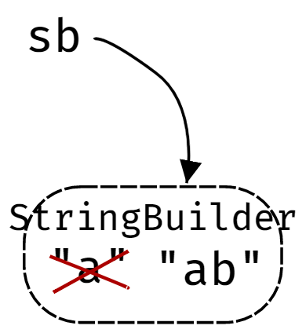
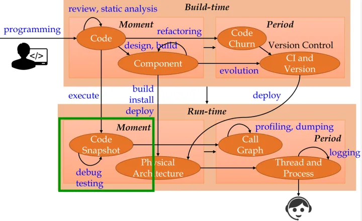
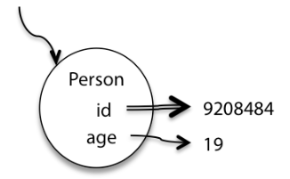
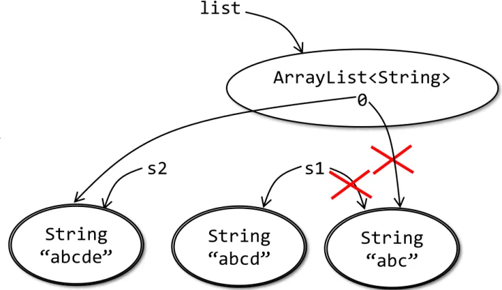
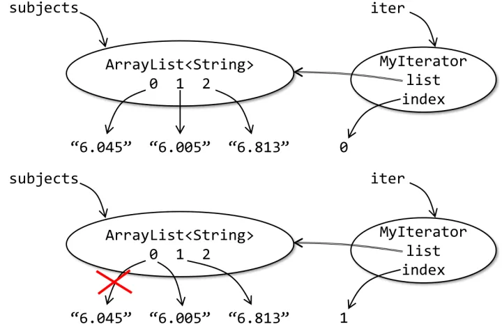
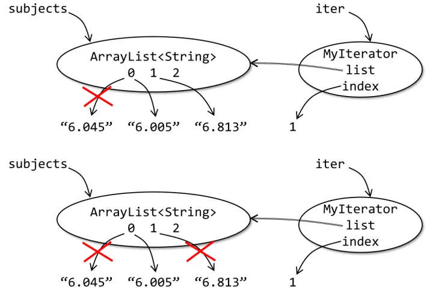
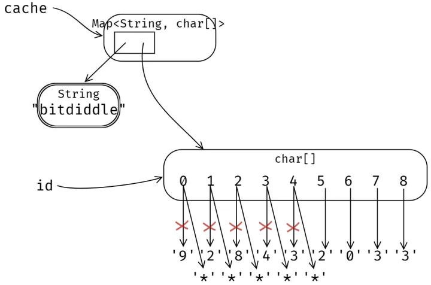

# 笔记1-不可变(immutable)设计原则

我们先从 Java 的数据类型与类型检查说起

# 数据类型

## 数据类型是什么？

数据类型是一组**值**以及可以对其执行的**操作**，比如：

```java
- boolean: Truth value(true or false)
- int: Integer(0, 1, -47)
- double: Real number(3.14, 1.0, -2.1)
- String: Text("Hello", "example")
```

而变量就是用特定数据类型定义、可存储满足类型约束的值

## Java中的数据类型

Java 的数据类型分为**基本数据类型**和**对象数据类型**

两者组成及区别如下表所示：


# 类型检查

既然有了不同数据类型的区分，那么对不同数据类型的变量赋值就要遵照相应的规则，否则就会报错

Java 中的变量在不同数据类型的转换分为两种：隐式转换、显式（强制）转换。比如下面就是几个简单直观的例子：

```java
int a = 2;					// a = 2
double a = 2;				// a = 2.0 (Implict)
int a = (int)18.7			// a = 18
double a = (double)2/3;		// a = 0.6666...

int a = 18.7;				// ERROR
String a = 1;				// ERROR
double a = 2/3;				// a = 0.0
```

接下来，我将详细阐述各种类型转换的规则：

## 隐式类型转换

Java 中的简单数据类型由低级到高级可以分为：

```java
byte=short=char < int < long < float < double
```

低级变量可以直接隐式转换为高级变量：

```java
byte b = 1;		
int i = b;		// i = 1
long l = b;		// l = 1
float f = b;	// f = 1.0
double d = b;	// d = 1.0
```

将 char 型向更高级类型转换时，会转换为对应 ASCII 码，例如：

```java
char c = 'a';
int  i = c;		// i = 97
```

## 强制类型转换

将高级类型转换为低级类型时，需要强制类型转换。强制类型转换有副作用，可能带来溢出或精度损失等

```java
long l = 2147483648L;
int i = (int)l;			// i = -2147483648,向上溢出

double d = 2.70141215;	// d = 2.70141215
float f = (float) d;	// f = 2.7014122,精度损失
```

## 静态检查与动态检查

当类型不匹配时，编译器通过静态检查检查出错误

Java 是一种静态类型语言，所有变量的类型在编译时已知，因此编译器可以推导表达式类型，可在编译阶段发现错误，避免了将错误
带入到运行阶段，提高程序正确性/健壮性

而动态类型只能在运行阶段进行类型检查

静态检查：

- 语法错误
- 类型/函数名错误：比如`Math.sine(2)`
- 参数数目错误：比如`Math.sin(30, 20)`
- 参数类型错误：比如`Math.sin("30")`
- 返回值类型错误

动态检查：

- 非法的参数值：比如`x/y when y = 0`
- 非法的返回值
- 越界
- 空指针

说白了，**静态检查就是关于类型的检查，不考虑值；而动态检查就是关于值的检查**

举一些例子：

静态错误（参数类型错误）：

```java
/*
Type mismatch:
cannot convert
from int to
boolean
*/
int n = 5;
if(n) {
    n = n + 1;
}
```

动态错误（非法的参数值）：

```java
/*
Exception in
thread "main"
java.lang.Arith
meticException:
/ by zero
*/
int sum = 0;
int n = 0;
int average = sum/n;
```

# Mutability & Immutability

前两部分我们理清了类型的相关概念，接下来阐述对应类型的变量的概念

改变一个变量和改变一个变量的值，二者有何区别？

- 改变一个变量是指将该变量指向一个存储空间
- 改变一个变量的值是指将该变量当前指向的存储空间中写入一个新的值

由此，就能引出这一节的概念区分：

**可变(mutable)**：类的实例中的引用或基本类型变量值可以被改变

**不可变(immutable)**：类的实例中的引用或基本类型变量值不可被改变，使用**final**实现：

```java
final int n = 5;
final Person a = new Person("Ross");
```

`final`关键字有如下作用：

- `final`类无法派生子类
- `final`变量无法改变值/引用
- `final`方法无法被子类重写

比如，`String`就是 immutable

```java
String s = "a";
s += b;
```



而`StringBuilder`是 mutable

```java
StringBuilder sb = new StringBuilder("a");
sb.append("b");
```



根据上面的两个例子，immutable type的缺点很明显：

- 对immutable type的频繁修改会产生大量的临时拷贝，需要垃圾回收

因此，在对字符串包装类`String`进行大量修改时，IDEA会推荐我们使用`StringBuilder`


根据上述分析，mutable type 的性能要更好，那么immutable type有什么用呢？

考虑如下例子：

设计一个求数组绝对值和的函数：

```java
/**
 * @return the sum of the numbers in the list
 */
public static int sum(List<Integer> list) {
    int sum = 0;
    for (int x : list) {
        sum += x;
    }
    return sum;
}
/**
 * @return the sum of the absolute values of the numbers in the list
 */
public static int sumAbsolute(List<Integer> list) {
    // let's reuse sum(), because DRY, so first we take absolute values
    for (int i = 0; i < list.size(); ++i) {
        list.set(i, Math.abs(list.get(i)));
    }
    return sum(list);
}
```

最后结果是对的，但是在求解过程中，传入的初始数组内容也会被修改！

为了规避这种风险，有一个解决策略称为**防御式拷贝**：

当对象需要暴露给外界时，使用其构造方法等手段将其拷贝，确保外界无法获取该对象及其内部各对象的引用。

不可变类型就不需要防御式拷贝，但是它的性能更差。因而，选择可变类型还是不可变类型需要综合考虑。

还有更复杂的例子，为了方便我们的分析，先引入工具：snapshot diagram

# Snapshot diagram

snapshot diagram用于描述一个程序在运行时某一时刻的内部状态，包括栈和堆。即一个程序设计过程中的图中标绿的部分：



它的作用为：

- 便于设计者之间的交流
- 刻画各类变量随时间变化
- 解释思路

## 画法规定

- **基本类型变量**：一个箭头指向该变量的值。

  

- **引用类型变量**：一个箭头指向一个椭圆，椭圆内部包含类名。若想显示更多信息，可在椭圆内写入字段名，并添加箭头以确定其值。

  

- **可变值**：当变量值变化时，在原来的箭头（值）上打叉并画新的箭头（值）。

  

- **不可变值(final)**：使用双线箭头表示。

  

## 举例

考虑如下代码：

```java
String s1 = new String("abc");
List<String> list = new ArrayList<String>();
list.add(s1);

s1 = s1.concat("d");
String s2 = s1.concat("e");

list.set(0, s2);
```

画图如下：



# 为什么不使用可变类型？

再次回到我们的问题

下面我先以**迭代**一个可变对象为例，阐述mutable type的风险

## 举例：迭代

迭代器是一个对象，它会遍历一个聚合类型的对象，并逐个返回其中的元素。当在 Java 中使用`for(... : ...)`这样的语句遍历元素的循环时，其实就隐式地使用了迭代器。例如：

```java
List<String> lst = ...;
for (String str : lst) {
    System.out.println(str);
}
```

会被编译器理解为下面这样：

```Java
List<String> lst = ...;
Iterator<String> iter = lst.iterator();
while (iter.hasNext()) {
    String str = iter.next();
    System.out.println(str);
}
```

迭代器有两个方法：

- `next()` 返回对象的下一个元素
- `hasNext()` 判断迭代器是否已经遍历到对象的结尾

注意到`next()` 是一个会修改迭代器的方法（**mutator** method），它不仅会返回一个元素，**而且会改变内部状态**，使得下一次使用它的时候会返回下一个元素。

### `MyIterator`

为了更好理解迭代器的工作原理，我们可以手写一个迭代`List<String>`的迭代器：

```java
/**
 * A MyIterator is a mutable object that iterates over
 * the elements of a List<String>, from first to last.
 * This is just an example to show how an iterator works.
 * In practice, you should use the List's own iterator
 * object, returned by its iterator() method.
 */
public class MyIterator {

    private final List<String> list;
    private int index;
    // list[index] is the next element that will be returned
    //   by next()
    // index == list.size() means no more elements to return

    /**
     * Make an iterator.
     * @param list list to iterate over
     */
    public MyIterator(List<String> list) {
        this.list = list;
        this.index = 0;
    }

    /**
     * Test whether the iterator has more elements to return.
     * @return true if next() will return another element,
     *         false if all elements have been returned
     */
    public boolean hasNext() {
        return index < list.size();
    }

    /**
     * Get the next element of the list.
     * Requires: hasNext() returns true.
     * Modifies: this iterator to advance it to the element 
     *           following the returned element.
     * @return next element of the list
     */
    public String next() {
        final String element = list.get(index);
        ++index;
        return element;
    }
}
```

### 可变性对迭代器的影响

考虑如下例子：

假设有一个 MIT 的课程代号列表，例如`["6.031", "8.03", "9.00"]` ，我们想要设计一个 `dropCourse6` 方法，它会将列表中所有以“6.”开头的代号删除，规约如下：

```Java
/**
 * Drop all subjects that are from Course 6. 
 * Modifies subjects list by removing subjects that start with "6."
 * 
 * @param subjects list of MIT subject numbers
 */
public static void dropCourse6(ArrayList<String> subjects)
```

利用迭代器，很容易就能写出代码：

```java
public static void dropCourse6(ArrayList<String> subjects) {
    MyIterator iter = new MyIterator(subjects);
    while (iter.hasNext()) {
        String subject = iter.next();
        if (subject.startsWith("6.")) {
            subjects.remove(subject);
        }
    }
}
```

接下来测试运行一下：`dropCourse6(["6.045", "6.005", "6.813"])`

我们期望的结果肯定是全部被删除，但是真实输出却是：`["6.005"]`

这是为什么呢？我们可以用刚才学到的工具：snapshot 分析原因

### 快照图分析

- 首先，迭代器的`index=0`，判断第一个元素以`"6."`开头，于是把它删除

  

- 此时，`"6.005"`在`ArrayList<String>`中的索引会变成 0，`"6.813"`的索引会变成 1。而迭代器中的`index=1`

  

因此，在下一轮迭代删除时，删除的是原来的第 3 个元素，而不是第 2 个，程序出错了！

### 为什么出错？

这里造成错误的原因并不是迭代器，而是`ArrayList`，`ArrayList`是一个可变类型，而我们在使用迭代器迭代的过程中却将其修改了，这必然会带来错误。

针对本问题，当然也有解决办法，就是使用迭代器的`remove()`方法，这样迭代器就能自动调整迭代索引

```java
Iterator iter = subjects.iterator();
while (iter.hasNext()) {
    String subject = iter.next();
    if (subject.startsWith("6.")) {
        iter.remove();
    }
}
```

但是，这个解决方案并不完美，假设又另一个迭代器并行地对同一一个列表迭代并修改，那么迭代器就无法知道迭代对象发生了哪些变化。

因此，对一个可变类型使用迭代器总是有风险的！

## 降低代码的可改动性

举例：

下面这个方法在 MIT 的数据库中查找并返回用户的 9 位数ID：

```java
/**
 * @param username username of person to look up
 * @return the 9-digit MIT identifier for username.
 * @throws NoSuchUserException if nobody with username is in MIT's database
 */
public static char[] getMitId(String username) throws NoSuchUserException {        
    // ... look up username in MIT's database and return the 9-digit ID
}
```

假设有一个使用者：

```java
char[] id = getMitId("bitdiddle");
System.out.println(id);
```

**现在使用者和实现者都打算做一些改变：** 使用者觉得要照顾用户的隐私，所以他只输出后四位ID：

```java
char[] id = getMitId("bitdiddle");
for (int i = 0; i < 5; ++i) {
    id[i] = '*';
}
System.out.println(id);
```

而实现者担心查找的性能，所以它引入了一个缓存记录已经被查找过的用户：

```java
private static Map<String, char[]> cache = new HashMap<String, char[]>();

public static char[] getMitId(String username) throws NoSuchUserException {        
    // see if it's in the cache already
    if (cache.containsKey(username)) {
        return cache.get(username);
    }

    // ... look up username in MIT's database ...

    // store it in the cache for future lookups
    cache.put(username, id);
    return id;
}
```

这两个改变导致了一个隐秘的bug，当使用者查找 `"bitdiddle"` 并得到一个字符数组后，实现者也缓存的是这个数组，他们两个实际上索引的是同一个数组（别名）。这意味着用户用来保护隐私的代码会修改掉实现者的缓存，所以未来调用 `getMitId("bitdiddle")` 并不会返回一个九位数，例如 “928432033” ，而是修改后的 “*****2033”，如图：



# 使用不可变类型

由前面的分析，可变类型的风险非常大，既然不可变类型避开了许多风险，我们就列出几个Java API中常用的不可变类型：

- 所有的原始类型及其包装都是不可变的。例如使用[`BigInteger`](http://docs.oracle.com/javase/8/docs/api/?java/math/BigInteger.html)和 [`BigDecimal`](http://docs.oracle.com/javase/8/docs/api/?java/math/BigDecimal.html) 进行大整数运算。

- 不使用可变类型 `Date` ，而是使用 [`java.time`](http://docs.oracle.com/javase/8/docs/api/index.html?java/time/package-summary.html) 中的不可变类型。

- Java中常见的聚合类 — `List`, `Set`, `Map` — 都是可变的：`ArrayList`, `HashMap`等等。但是 [`Collections`](http://docs.oracle.com/javase/8/docs/api/?java/util/Collections.html) 类中提供了可以获得不可修改版本（unmodifiable views）的方法：

  - [`Collections.unmodifiableList`](https://docs.oracle.com/javase/8/docs/api/java/util/Collections.html#unmodifiableList-java.util.List-)
  - [`Collections.unmodifiableSet`](https://docs.oracle.com/javase/8/docs/api/java/util/Collections.html#unmodifiableSet-java.util.Set-)
  - [`Collections.unmodifiableMap`](https://docs.oracle.com/javase/8/docs/api/java/util/Collections.html#unmodifiableMap-java.util.Map-)

  可以将这些不可修改版本当做是对 list / set / map 做了一下包装。如果一个使用者索引的是包装之后的对象，那么 `add`, `remove`, `put`这些修改就会触发 [`Unsupported­Operation­Exception`](http://docs.oracle.com/javase/8/docs/api/?java/lang/UnsupportedOperationException.html)异常。

  当我们要向程序另一部分传入可变对象前，可以先用上述方法将其包装。要注意的是，**这仅仅是一层包装，如果不小心让别人或自己使用了底层可变对象的索引，这些看起来不可变对象还是会发生变化！**

- `Collections` 也提供了获取不可变空聚合类型对象的方法，例如[`Collections.emptyList`](https://docs.oracle.com/javase/8/docs/api/java/util/Collections.html#emptyList--)

# 总结

本文引入了一个重要的设计原则：尽量使用不可变对象和不可变引用

- Safe from bugs. 不可变对象不会因为别名的使用导致bug，而不可变引用永远指向同一个对象，也会减少bug的发生
- Easy to understand. 因为不可变对象和引用总是意味着不变的东西，所以它们对于读者来说会更易懂——不用一边读代码一边考虑这个时候对象或索引发生了哪些改动

- Ready for change. 如果一个对象或者引用不会在运行时发生改变，那么在修改程序时，与这些对象或引用有关的代码就不需要重新设计了

