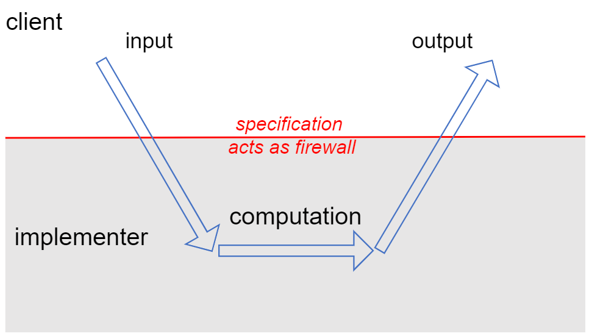
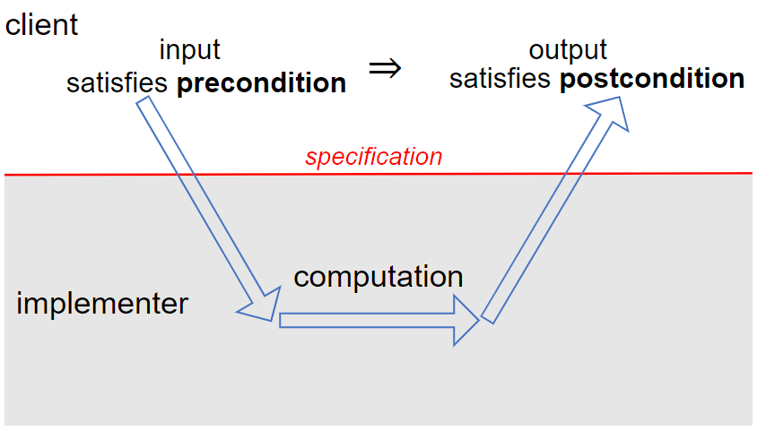
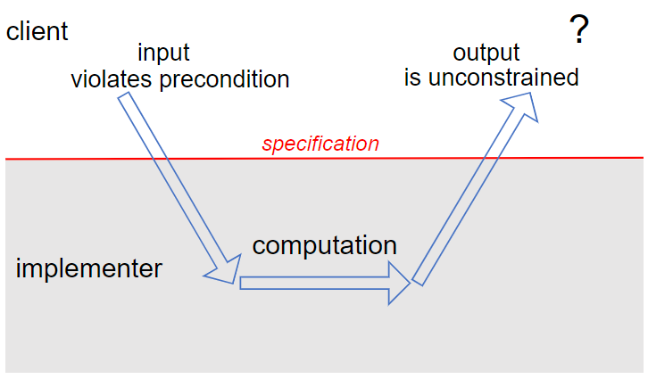
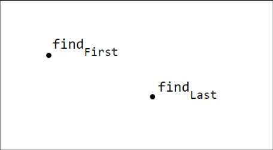
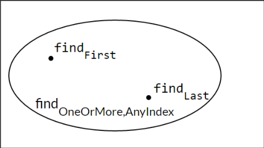
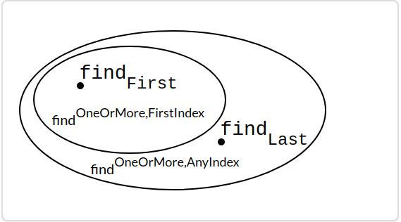
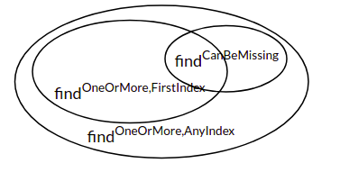

# Note2-设计规约(specification)

上一节，我们讲了编程语言中**数据类型**、**变量**、**值**的概念，尤其详细分析了这三者可变与不可变设计的区别，并导出**不可变设计原则**

这一节，我们转向分析编程语言中的**方法**以及其对应的**操作**，并探究如何定义它们——**规约(specification)**

## 方法(method)

Java 中的方法用于封装一段特定的逻辑功能

方法的主要要素有：

- 权限修饰符 
- 方法名
- 参数列表
- 返回值

**方法**是程序的**积木**，可以被独立开发、测试、复用。但是使用**方法**的客户端，无需了解方法内部具体如何工作——**抽象**

但是方法到底实现了什么样的操作，它的参数是什么？返回值是什么？

显然需要一些规则来设定

## 为什么要使用规约

### 对于使用者

- 规约使得使用者不必去阅读源码
- 规约可以看作实现者与使用者之间的契约，使用者对方法的使用要依赖于规约

以 Java API 文档中`BigInteger`中`add`方法的规约为例：

```java
public BigInteger add(BigInteger val)

Returns a BigInteger whose value is (this + val).

Parameters: 
val - value to be added to this BigInteger.

Returns: 
this + val
```

Java 8 中对应的源码为：

```java
if (val.signum == 0)
    return this;
if (signum == 0)
    return val;
if (val.signum == signum)
    return new BigInteger(add(mag, val.mag), signum);

int cmp = compareMagnitude(val);
if (cmp == 0)
    return ZERO;
int[] resultMag = (cmp > 0 ? subtract(mag, val.mag)
                   : subtract(val.mag, mag));
resultMag = trustedStripLeadingZeroInts(resultMag);

return new BigInteger(resultMag, cmp == signum ? 1 : -1);
```

可以看到，通过阅读`BigInteger.add`的规约，使用者可以直接了解如何使用`BigInteger.add`，以及它的行为属性。而如果看源码的话，就不得不看`BigInteger`的构造体、`compareMagnitude`、`subtract`以及`trustedStripLeadingZeroInts`的实现

### 对于实现者

- 没有规约就无法分派任务，无法写程序，即使写出来也不知道对错
- 没有规约，不同开发者的理解可能不同，整个项目容易出现错误，出现的bug也难以定位
- 精确的规约，有助于不同的实现者区分责任

另外

- 规约给了实现者更改实现策略而不告诉使用者的自由
- 规约可以提高编码效率，它可以限定一些特殊的输入，这样实现者就可以省略一些检查和边界处理，代码可以运行地更快

规约扮演着**防火墙**的角色，如图：



规约就好像一道防火墙，将使用者和实现者隔离开。使用者不必知道方法是如何运行的，而实现者也无需考虑这个方法会如何被使用

这种隔离造成了**解耦(decoupling)**：使用者自己的代码和实现者的代码可以独立发生改动，只要双方都遵循规约

## 行为等价性(Behavioral equivalence)

考虑如下方法：

```java
static int find(int[] arr, int val) {
    for (int i = 0; i < arr.length; i++) {
        if (arr[i] == val) return i;
    }
    return -1;
}
```

这个方法用来在整数数组中查找某个数的索引。

对于我们使用者来说，可以看到该方法时从数组开头开始查找的，对于某些大型数组来说速度会非常慢，那么可不可以改进一下，从数组的两头同时查找呢？于是写出如下代码：

```java
static int find(int[] arr, int val) {
    for (int i = 0, j = arr.length-1; i <= j; i++, j--) {
        if (arr[i] == val) return i;
        if (arr[j] == val) return j;
    }
    return -1;
}
```

这两个方法的行为显然不同，但是对于使用者来说，它们是不是等价的呢？考虑如下规约：

```java
static int find(int[] arr, int val)
	requires: val occurs exactly once in arr
	effects: returns index i such that arr[i] = val
```

对于这个规约来说，这两个方法显然都符合，故它们等价

总之：

- 单纯地看实现代码，并不足以判定不同的方法实现是否行为等价
- 需要根据代码的规约来判定

## 规约的结构

一个规约需要含有以下两条：

- 前置条件：对使用者的约束，在使用方法时必须满足的条件，关键词是`requires`
- 后置条件：对实现者的约束，方法结束时必须满足的条件，关键词是`effects`
- 异常行为：如果违反了前置条件，方法会做什么？

前置条件确保了调用方法所处的状态，例如：

- 限定参数 (e.g. `x >= 0` to say that an `int` parameter x must actually be a nonnegative `int`)
- 限定参数间的相互作用 (e.g. `val` occurs exactly once in `arr`)



后置条件包括 Java 可以静态检查的部分，返回值的类型以及异常检查，这些都写在`effects`关键词后面，包括：

- 返回值与输入的关系
- 在何时抛出什么异常
- 对象是否可变

前置条件和后置条件是一个逻辑蕴涵的关系：

- 如果前置条件满足，则后置条件一定满足
- 如果前置条件不满足，则方法的行为不受后置条件的约束，可能引发任何行为，包括永不返回、抛出异常、返回任意结果等



## Java中的规约

有些语言将前置条件和后置条件作为语言的基本部分，运行时，编译器可以自动检查表达式，以强制执行归于

Java 的静态类型声明是前置条件和后置条件的一部分，编译器会自动检查和强制执行这一部分，但是其它条件就需要在方法之前的注释中进行描述，只能靠人工遵守

Java 对方法前有关规约的注释的约定叫做 Javadoc，其中参数由`@param`子句描述，结果由`@return`子句描述，因为，应该将前置条件放入`@param`，后置条件放入`@return`。

像这样的规约：

```java
static int find(int[] arr, int val)
	requires: val occurs exactly once in arr
	effects: returns index i such that arr[i] = val
```

在 Java 中是这样的：

```java
/**
 * Find a value in an array.
 * @param arr array to search, requires that val occurs exactly once
 *            in arr
 * @param val value to search for
 * @return index i such that arr[i] = val
 */
static int find(int[] arr, int val)
```

## 规约怎么写？

一个规约应该说明方法的参数和返回值，但是它不应该提及局部变量或者私有的内部方法或数据，这些内部的实现都应该在规约中对读者隐瞒


举例：

1. 改变参数的方法规约：

   

   

2. 不改变参数的方法规约：

   

**注意**：除非在后置条件里声明过，否则方法内部不应该改变输入参数

## 测试与规约

### 黑盒测试

黑盒测试是指仅仅依赖于规约构建的测试，不考虑实现。

例如，测试方法`find`，它的规约如下：

```java
static int find(int[] arr, int val)
- requires:
  val occurs in arr
- effects:
  returns index i such that arr[i] = val
```

这个规约明确了前置条件：`val`必须在`arr`中存在

而它的后置条件很弱：如果`arr`中有多个`val`，并不知道会返回哪一个索引

比如，如下的测试就不是一个好的测试：

```java
int[] array = new int[] { 7, 7, 7 };
assertEquals(0, find(array, 7));  // bad test case: violates the spec
```

## 设计规约

### 规约的强弱

假设我们现在想要改变一个方法，并且这个方法已经被广泛使用了，那么我们怎么个确定修改后的新的规约可以安全地替换原来的规约呢？

定义：规约`S2`不弱于`S1`仅当

- `S2`的前置条件弱于或等价于`S1`的
- `S2`的后置条件弱于或等价于`S1`的

如果`S2`强于`S1`，那么任何`S2`的实现方法都可以拿来实现`S1`，并且在程序中可以安全地用`S2`的模块替换`S1`的模块

说白了，就是一种思想：可以弱化前置条件（减少使用者的限制），也可以强化后置条件

例如，对于`find`的规约：

```java
static int findExactlyOne(int[] a, int val)
- requires:
  val occurs exactly once in a
- effects:
  returns index i such that a[i] = val
```

可以弱化它的前置条件，替换为：

```java
static int findOneOrMore,AnyIndex(int[] a, int val)
- requires:
  val occurs at least once in a
- effects:
  returns index i such that a[i] = val
```

可以继续强化它的后置条件，替换为：

```java
static int findOneOrMore,FirstIndex(int[] a, int val)
- requires:
  val occurs at least once in a
- effects:
  returns lowest index i such that a[i] = val
```

而假设替换为如下的规约：

```java
static int findCanBeMissing(int[] a, int val)
- requires:
  nothing
- effects:
  returns index i such that a[i] = val, or -1 if no such i
```

如果将它与`findOneOrMore`和`FirstIndex`比较，它的前置条件更弱，但是它的后置条件也更弱，所以它们是无法比较强弱的

### 图示化规约

将全部方法作为一个集合，我们可以把上面提到的`findFirst`和`findLast`画出来，用点来表示实际的方法：



而一个规约会在这个集合中画出一个范围，这个范围内的素有方法都满足规约要求，而在范围之外的不满足规约要求



规约划定了区域：

- 实现者可以自由地在这个区域选择任意一点（即改变实现方案），而不必担心这种改变会影响使用者
- 使用者只需要选取某一个区域，而不必在意到底是区域中哪一个点（具体实现方法）

那么如何用图示描述两个规约的强弱呢？

- 先从加强**后置条件**考虑，如果`S2`的后置条件强于`S1`的后置条件，那么`S2`就是强于`S1`的。而强化后置条件最实现者来说，意味着更小的自由度，所以之前在该规约确定的范围内的一些方法可能就会在范围外了
- 再考虑**弱化前置**条件，如果弱化了强制条件，那么实现者就需要处理更多的可能的输入，那么也会使之前在该规约确定的范围内的一些方法剔除出去

简而言之，更强的规约表达为更小的区域



而对于两个无法比较强弱的规约，它们的范围既有可能重叠也有可能不重叠，无法比较。

比如上面提到的规约`CanBeMissing`

```java
static int findCanBeMissing(int[] a, int val)
- requires:
  nothing
- effects:
  returns index i such that a[i] = val, or -1 if no such i
```

它就无法和规约`OneOrMore,FirstIndex`比较



### 设计原则

一个好的规约应该简洁清楚、结构明确、易于理解。下面有一些原则：

1. 规约应内聚(coherent)

   规约描述的功能应单一、简单、易于理解，考虑如下规约：

   ```java
   static int sumFind(int[] a, int[] b, int val)
   effects:
   
   returns the sum of all indices in arrays a and b at which val appears
   ```

   这个设计并不合理，因为它将两个毫不相干的事情放在一起完成（在两个数组里面查找并将下标相加）

   好的设计应将这个方法分成两个方法：一个在数组中查找下标，另一个将两数相加然后输出结果

   分成两个不同的方法不仅会更易于理解，也会提高方法的可复用性

2. 结果应清晰

   考虑下面的规约，它将一个值放在一个`map`中：

   ```java
   static V put(Map<K,V> map, K key, V val)
   - requires:
     val may be null, and map may contain null values
   - effects:
     inserts (key, val) into the mapping, overriding any existing mapping for key, and returns old value for key, unless none, in which case it returns null
   ```

   注意到前置条件并没有规定`key`对应的值不能是`null`。但是后置条件将`null`作为一个特殊条件来返回。这意味着如果返回值是`null`，那么使用者就不能判断到底是`key`对应的值是`null`还是`key`以前就不存在。因此，这不是一个好的设计，它会产生歧义

3. 后置条件应足够强

   规约当然需要保证对于满足前置条件的调用，它会满足要求，但是这里主要说的是对一些前置条件之外的特殊情况的处理

   例如，对一个错误的输入，抛出异常并且允许任意的更改是毫无意义的。因为使用者无法确定模块在抛出异常前对对象做了哪些更改，例如下面的规约：

   ```java
   static void addAll(List<T> list1, List<T> list2)
   effects:
   
   adds the elements of list2 to list1, unless it encounters a null element, at which point it throws a NullPointerException
   ```

   如果异常 `NullPointerException` 被抛出，使用者就得想方设法找到是`list2`中的哪一个`null`元素导致了异常的发生以及`list1`又被做了哪些改变。

4. 前置条件应足够弱

   思考下面的规约，这个方法尝试打开一个文件：

   ```java
   static File open(String filename)
   effects:
   
   opens a file named filename
   ```

   这个规约设计的很不好

   - 它缺少很多重要的细节：文件打开后是用来都还是写？文件已经存在了还是这个方法来创建
   - 因为前置条件太弱，所以这个规约太强了

   太强的规约对于使用者来说非常舒服，但对于开发者来说，大大增加了实现的难度

5. 应使用抽象数据类型(abstract types)

   在规约中使用抽象数据类型会给使用者和实现者更多的自由。在 Java 中，通常使用接口如 `Map` 或 `Reader` 而不是具体的实现类如 `HashMap` 或 `FileReader` 。考虑下面的规约

   ```java
   static ArrayList<T> reverse(ArrayList<T> list)
   effects:
   
   returns a new list which is the reversal of list, i.e. newList[i] = list[n-i-1] for all 0 ≤ i < n, where n = list.size()
   ```

   这个规格说明强制使用者传入一个 `ArrayList` ，并且强制实现者返回一个 `ArrayList` ，而`List`实现方法有很多种。从描述上看，对应模块的行为应该不会依赖于 `ArrayList`的实现特性，所以这里最好写成更抽象的数据类型`List` 

6. 考虑是否使用前置条件

   使用者并不喜欢太强的前置条件，所以是否使用前置条件的衡量标准在于检查参数合法性的代价有多大

   例如，我们想用二分查找的办法实现`find` ，我们会要求这个数组是已经排序过的了。如果强制要求模块检查这个数组是否已经排好序，这个带来的复杂度的增加相对于我们要实现的目标是承受不起的

   关于是否使用前置条件是一个工程上的判断。关键点在于检查参数耗费的资源量以及这个模块被使用的范围。当这个方法是类的私有方法(private)时，我们可以设置前置条件，仔细检查所有的调用是否合理。但是如果这个方法是公开的，并且会被其他的开发者使用，那么使用前置条件就不那么合理

## 总结

本文从为什么需要规约以及如何设计规约进行了细致的讨论，并且举了大量反例来说明有些规约为什么不好，下面还是从三方面考虑规约的好处：

- Safe from bugs. 如果没有规约，即使是最小的更改都有可能使得整个程序崩溃，改动起来也是很麻烦的。一个结构良好、逻辑明确的规约会最小化使用者和实现者之间的误解，并帮助我们进行静态检查、测试、代码评审等等
- Easy to understand. 一个好的规约会让使用者不必去阅读源码也能正确安全地使用
- Ready for change. 一个合理的较弱的规约会给实现者一定的自由，而一个较强的规约会给实现者一定的自由。我们也可以通过加强规约来轻易地改动模块

