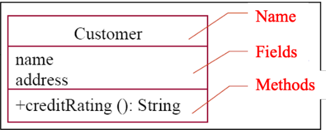
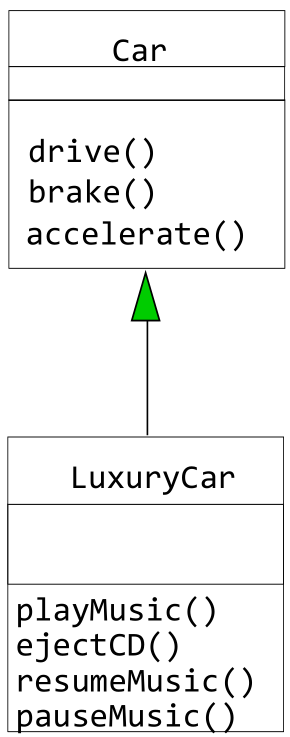
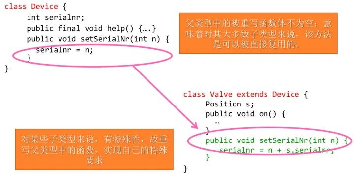
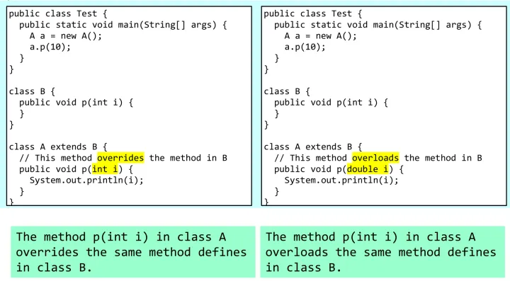
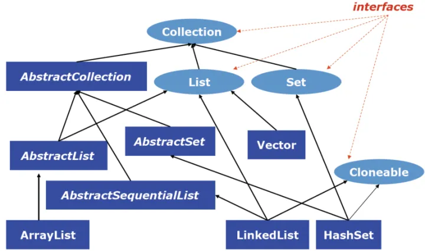
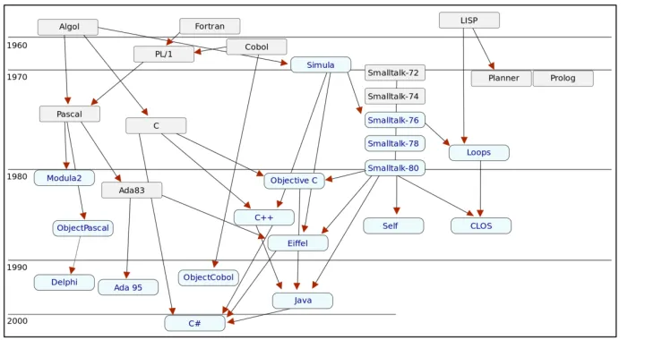

# Note4-面向对象编程(OOP)

在前一章，我们学习了抽象数据类型(ADT)理论，这一章，我们学习 ADT 的具体实现技术：OOP

## 类与对象

### 什么是对象？

对象都有两个特征：**状态**(states)和**行为**(behaviors)

我们可以从真实世界中的对象来理解这两个特征：

- 一条狗是一个对象，它有状态：名字、颜色、品种；也有行为：吠，抓，摇尾巴
- 一个自行车有状态：当前挡位、当前速度；也有行为：改变挡位、改变方向

而在 Java 中

- 状态就是对象中的**成员变量**(fields)
- 行为就是对象中的**方法**(methods)

### 什么是类？

类是一个模板，它描述一类对象的行为和状态

每个对象都有一个类，而类不仅定义了**类型**还定义了该类型的**实现**

- 类型：描述了对象在哪里可以使用
- 实现：描述了对象有哪些操作



粗略来说，类的方法是一种 API(Application Programming Interface)

## 静态(static)和实例(instance)变量/方法

Java 用 static 关键词修饰类成员变量/方法(class variable/methods)，这些变量或方法只与类有关，使用它们无需实例化对象

而与之相对的是实例变量/方法，使用它们必须先实例化对象

例如，`Date`类中的`toString`是实例方法，调用它必须先创建对象：

```java
class DateApp {
	public static void main(String args[]) {
		Date today = new Date();
		System.out.println(today);
	}
}
```

而`Math.min`是静态方法，可以直接用类名调用：

```java
class Another {
	public static void main(String[] args) {
		int result;
		result = Math.min(10, 20);
		System.out.println(result);
		System.out.println(Math.max(100, 200));
	}
}
```

两者底层实现的大致区别如下图：


## 接口(interface)与枚举(enumerations)

### 什么是接口？

Java 中的`interface`是一种表示**抽象数据类型**的办法

接口中是一连串的**方法标识**，但是没有方法体（定义）。如果想要写一个类来实现接口，我们可以给类加上`implements`关键字来实现接口，并且在类内部提供接口中方法的定义

这样定义和实现 ADT 有两个好处：

- 接口只为使用者提供契约(contract)，使用者只需要读懂这个接口即可使用该 ADT，不需要依赖ADT特定的实现/表示，因为实例化的变量不能放在接口中（具体实现被分离在实现类中）

- 它允许了一种抽象类型能够有多种实现/表示，即一个接口可以有多个实现类。而如果直接将类作为 ADT，我们就很难改变它的内部表示

Java 的**静态检查**会发现没有实现接口的错误，例如，如果程序员忘记实现接口中的某一个方法或者返回了一个错误的类型，编译器就会在编译期报错

### 小练习

考虑下面的接口与实现类，它有哪些错误？

```java
/** Represents an immutable set of elements of type E. */
public interface Set<E> {
	/** make an empty set */
	public Set();
	/** @return true if this set contains e as a member */
	public boolean contains(E e);
	/** @return a set which is the union of this and that */
	public ArraySet<E> union(Set<E> that);
}
/** Implementation of Set<E>. */
public class ArraySet<E> implements Set<E> {
	/** make an empty set */
	public ArraySet() { ... }
	/** @return a set which is the union of this and that */
	public ArraySet<E> union(Set<E> that) { ... }
	/** add e to this set */
	public void add(E e) { ... }
}
```

答案如图：


### 静态工厂方法

我们再来看一看 `MyString` 这个例子，使用接口来定义这个ADT，以便创建多种实现类：

```java
/** MyString represents an immutable sequence of characters. */
public interface MyString { 

    // We'll skip this creator operation for now
    // /** @param b a boolean value
    //  *  @return string representation of b, either "true" or "false" */
    // public static MyString valueOf(boolean b) { ... }

    /** @return number of characters in this string */
    public int length();

    /** @param i character position (requires 0 <= i < string length)
     *  @return character at position i */
    public char charAt(int i);

    /** Get the substring between start (inclusive) and end (exclusive).
     *  @param start starting index
     *  @param end ending index.  Requires 0 <= start <= end <= string length.
     *  @return string consisting of charAt(start)...charAt(end-1) */
    public MyString substring(int start, int end);
}
```

现在我们先跳过 `valueOf` 这个方法，用我们在上一章中学习到的知识去实现这个接口

下面是我们的第一种实现类：

```java
public class SimpleMyString implements MyString {

    private char[] a;

    /** Create a string representation of b, either "true" or "false".
     *  @param b a boolean value */
    public SimpleMyString(boolean b) {
        a = b ? new char[] { 't', 'r', 'u', 'e' } 
              : new char[] { 'f', 'a', 'l', 's', 'e' };
    }

    // private constructor, used internally by producer operations
    private SimpleMyString(char[] a) {
        this.a = a;
    }

    @Override public int length() { return a.length; }

    @Override public char charAt(int i) { return a[i]; }

    @Override public MyString substring(int start, int end) {
        char[] subArray = new char[end - start];
        System.arraycopy(this.a, start, subArray, 0, end - start);
        return new SimpleMyString(subArray);
    }
}
```

而下面是我们优化过的第 2 种实现类：

```java
public class FastMyString implements MyString {

    private char[] a;
    private int start;
    private int end;

    /** Create a string representation of b, either "true" or "false".
     *  @param b a boolean value */
    public FastMyString(boolean b) {
        a = b ? new char[] { 't', 'r', 'u', 'e' } 
              : new char[] { 'f', 'a', 'l', 's', 'e' };
        start = 0;
        end = a.length;
    }

    // private constructor, used internally by producer operations.
    private FastMyString(char[] a, int start, int end) {
        this.a = a;
        this.start = start;
        this.end = end;
    }

    @Override public int length() { return end - start; }

    @Override public char charAt(int i) { return a[start + i]; }

    @Override public MyString substring(int start, int end) {
        return new FastMyString(this.a, this.start + start, this.end + end);
    }
}
```

- 注意到 [`@Override`](https://docs.oracle.com/javase/tutorial/java/annotations/predefined.html)的使用，这个词是通知编译器这个方法必须和其父类中的某个方法的标识完全一样。但是由于实现接口时编译器会自动检查我们的实现方法是否遵循了接口中的方法标识，这里的 `@Override` 更多是一种注释的作用，它告诉读者这里的方法是为了实现某个接口，读者应该去阅读这个接口中的规格说明。同时，如果没有对实现类的规约强化，这里就不需要再写一遍规约了
- 另外注意到我们添加了一个私有的构造方法，它是为 `substring(..)` 这样的生产器服务的，它的参数是表示域

那么如何用这个ADT呢？下面是一个例子：

```java
MyString s = new FastMyString(true);
System.out.println("The first character is: " + s.charAt(0));
```

这样的使用似乎有些不对劲：

- 它打破了抽象边界，接口定义中不能包含构造方法，那也就更不可能包含构造方法的规约了，必须通过调用实现类的构造方法来获取接口类型的对象，那么使用者就需要知道该接口的某个具体实现类的名字

幸运的是，Java 8 以后允许为接口定义静态方法，所以我们可以在接口`MyString`中通过静态的**工厂方法**来实现构造器`valueOf`：

```java
public interface MyString { 
    /** @param b a boolean value
     *  @return string representation of b, either "true" or "false" */
    public static MyString valueOf(boolean b) {
        return new FastMyString(true);
    }
    // ...
```

现在使用者就可以在不破坏抽象的前提下使用 ADT 了：

```java
MyString s = MyString.valueOf(true);
System.out.println("The first character is: " + s.charAt(0));
```

将实现完全隐藏起来是一种妥协，因为有时候使用者会希望有对具体实现类的选择权利

这也是为什么 Java 库中的`ArrayList`和`LinkedList`暴露给了用户，因为这两个实现在 `get()` 和 `insert()`这样的操作中会有性能上的差别

### 枚举

有时候一个 ADT 的值域是一个很小的有限集，例如：

- 一年中的月份: January, February, …
- 一周中的天数: Monday, Tuesday, …
- 方向: north, south, east, west
- 画线时的[line caps](https://www.w3.org/TR/svg-strokes/#LineCaps) : butt, round, square

这样的类型往往会被用来组成更复杂的类型（例如`DateTime`或者`Latitude`），或者作为一个参数使用（例如`drawline`）。

当值域很小且有限时，将所有的值定义为被命名的常量是很有意义的，这就是**枚举**(**enumeration**)

Java 使用`enum`关键词：

```java
public enum Month { JANUARY, FEBRUARY, MARCH, ..., DECEMBER };
```

这个`enum`定义类型名`Month`，这和使用`class`以及`interface`定义类型名时是一样的

这种思想被称为枚举，顾名思义就是显式地列出了一个集合中的所有元素，并且 Java 为每个元素都分配了数字作为代表它们的值

一个`enum`声明和一个`class`一样，可以为这个 ADT 定义额外的操作，并且还定义成员变量

如下例子定义了一个有成员变量、观察器、生产器的枚举类型：

```java
public enum Month {
    // the values of the enumeration, written as calls to the private constructor below
    JANUARY(31),
    FEBRUARY(28),
    MARCH(31),
    APRIL(30),
    MAY(31),
    JUNE(30),
    JULY(31),
    AUGUST(31),
    SEPTEMBER(30),
    OCTOBER(31),
    NOVEMBER(30),
    DECEMBER(31);

    // rep
    private final int daysInMonth;

    // enums also have an automatic, invisible rep field:
    //   private final int ordinal;
    // which takes on values 0, 1, ... for each value in the enumeration.

    // rep invariant:
    //   daysInMonth is the number of days in this month in a non-leap year
    // abstraction function:
    //   AF(ordinal,daysInMonth) = the (ordinal+1)th month of the Gregorian calendar
    // safety from rep exposure:
    //   all fields are private, final, and have immutable types

    // Make a Month value. Not visible to clients, only used to initialize the
    // constants above.
    private Month(int daysInMonth) {
        this.daysInMonth = daysInMonth;
    }

    /**
     * @param isLeapYear true iff the year under consideration is a leap year
     * @return number of days in this month in a normal year (if !isLeapYear) 
     *                                           or leap year (if isLeapYear)
     */
    public int getDaysInMonth(boolean isLeapYear) {
        if (this == FEBRUARY && isLeapYear) {
            return daysInMonth+1;
        } else {
            return daysInMonth;
        }
    }

    /**
     * @return first month of the semester after this month
     */
    public Month nextSemester() {
        switch (this) {
            case JANUARY:
                return FEBRUARY;
            case FEBRUARY:   // cases with no break or return
            case MARCH:      // fall through to the next case
            case APRIL:
            case MAY:
                return JUNE;
            case JUNE:
            case JULY:
            case AUGUST:
                return SEPTEMBER;
            case SEPTEMBER:
            case OCTOBER:
            case NOVEMBER:
            case DECEMBER:
                return JANUARY;
            default:
                throw new RuntimeException("can't get here");
        }
    }
}
```

所有的`enum`类型也都有一些**内置**(automatically-provided)操作，这些操作在[`Enum`](https://docs.oracle.com/javase/8/docs/api/java/lang/Enum.html)中定义：

- `ordinal()` : 某个值在枚举类型中的索引值， 例如`JANUARY.ordinal()` 返回 0
- `compareTo()` : 基于两个值的索引值来比较两个值
- `name()` : 返回字符串形式表示的当前枚举类型值，例如， `JANUARY.name()` 返回`"JANUARY"`

## 子类型(Subtypes)

我们之前说过类型就是值的集合。Java 中的 [`List`](http://docs.oracle.com/javase/8/docs/api/?java/util/List.html) 类型是通过接口定义的，我们说，一个子类型就是父类型的子集，正如 `ArrayList` 和 `LinkedList`是`List`的子类型一样

要注意：

“B是A的子类型”就意味着“每一个B都是A”，换句话说，“每一个B都满足了A的规约”

**这也意味着B的规约不弱于A的规约**

## 封装(encapsulation)

所谓封装就是信息隐藏

信息隐藏的作用：

- **解耦**(decouples)不同的的类，让它们可以被单独地开发、测试、优化、使用
- 加速系统的设计，不同的类可以同时进行开发
- 减轻维护负担，可以更快地理解和调试类，而无需担心损害其他模块
- 实现有效的性能调整，被大量使用的类可以单独优化
- 提高软件复用性

为了限制使用者访问非接口成员，实现信息隐藏，Java 有一套权限修饰符：

- `private`
- `protected`
- `public`

三者修饰的成员变量或方法在不同位置的访问权限如下表：

|  作用域   | 当前类 | 同一包内 | 子孙类（不同包） | 其它包 |
| :-------: | :----: | :------: | :--------------: | :----: |
|  public   |  Yes   |   Yes    |       Yes        |  Yes   |
| protected |  Yes   |   Yes    |       Yes        |   No   |
|  default  |  Yes   |   Yes    |        No        |   No   |
|  private  |  Yes   |    No    |        No        |   No   |

信息隐藏遵循以下 3 点原则：

- 细心地设计 API
- 对于不提供给使用者的成员均使用`private`修饰

## 继承(inheritance)与重写(override)

### 什么是继承？

继承就是子类继承父类的特征和行为，使得子类对象（实例）具有父类的实例域和方法，或子类从父类继承方法，使得子类具有父类相同的行为

继承是为了提高代码的复用性，例如下图


### 严格继承(strict inheritance)

严格继承就是子类只能添加新方法，无法重写超类中的方法

在 Java 中，如果一个方法不想被重写，可以用关键词`final`修饰

例如，设置`Car`类：

```java
public class Car {
	public final void drive() {…}
	public final void brake() {…}
	public final void accelerate() {…}
}
```

`LuxuryCar`继承该类：

```java
public class LuxuryCar extends Car {
	public void playMusic() {…}
	public void ejectCD() {…}
	public void resumeMusic() {…}
	public void pauseMusic() {…}
}
```

则对应类图为：



### 重写

重写是一种语言特性，它允许子类对继承的方法进行特殊地重新实现

重写的方法必须有相同地方法名、参数、返回类型，例如：




子类可以利用`super()`来复用父类中对应方法的功能，例如：

```java
class Thought {
	public void message() {
		System.out.println("Thought.");
	}
}
public class Advice extends Thought {
	@Override	// @Override annotation in Java 5 is optional but helpful.
	public void message() {
		System.out.println("Advice.");
		super.message(); // Invoke parent's version of method.
	}
}
Thought parking = new Thought();
parking.message(); // Prints "Thought."

Thought dates = new Advice();
dates.message(); // Prints “Advice. \n Thought."
```

### 抽象类

抽象方法：用关键词`abstract`修饰，它指只有定义没有实现的方法

抽象类：

- 抽象类不能实例化对象
- 继承某个抽象类的子类在实例化时，所有父类中的方法必须已经实现

举例：


写到这里，大家可能会觉得抽象类与**接口**很像，事实上，接口可以看作一个只有抽象方法的抽象类

从抽象程度上，实现类、抽象类、接口有如下关系：

```java
Concrete class -> Abstract class -> Interface
```

## 多态

多态有三种类型：

- 特殊多态(Ad hoc polymorphism)：一个方法可以有多个同名的实现（方法重载）
- 参数化多态(Parametric polymorphism)：一个类型名字可以代表多个类型（泛型编程）
- 子类型多态(Subtyping polymorphism)：一个变量名字可以代表多个类的实例

接下来逐一分析

### 方法重载

重载的作用就是方便使用者调用，使用者可以用不同的参数列表，调用同样的方法

当使用者某个方法时，编译器根据参数列表匹配具体执行哪个方法，重载方法有以下特点：

- **必须**有不用的参数列表
- 可以改变返回值类型
- 可以有不同的权限修饰符
- 可以有不同的异常处理
- 可以在同一个类内重载，也可以在子类中重载

重载也可以发生在父类与子类之间，比如下面的代码：

```java
class Animal {
	public void eat()
	{
        System.out.println("I'm an animal. I like eating everything!");
    }
}
class Horse extends Animal {
	public void eat(String food)
	{
    	System.out.println("I'm a horse. I like eating "+ food);
    }
	public void eat()
	{
        System.out.println ("I'm a horse. I like eating grass！");
     }
}
```

不同类型的方法调用结果如下表：

| Method Invocation Code                            | Result                                                       |
| ------------------------------------------------- | ------------------------------------------------------------ |
| Animal a = new Animal();<br/>a.eat();             | I'm an animal. I like eating everything!                     |
| Horse h = new Horse();<br/>h.eat();               | I'm a horse. I like eating grass!                            |
| Animal ah = new Horse();<br/>ah.eat();            | I'm a horse. I like eating grass!<br/>Polymorphism works- the actual object type(Horse), not the reference<br/>type(Animal), is used to determine which eat() is called. |
| Horse he = new Horse();<br/>he.eat("Apples!");    | I'm a horse. I like eating Apples!<br/>The overloaded eat(String s) method in Horse is invoked. |
| Animal a2 = new Animal();<br/>a2.eat("Carrots");  | Compiler error! Animal class doesn’t have an eat() method that takes a<br/>String |
| Animal ah2 = new Horse();<br/>ah2.eat("Carrots"); | Compiler error! Compiler still looks only at the reference, and sees that<br/>Animal doesn’t have an eat() method that takes a String. |

尤其注意这两者的区别：

```java
Animal ah = new Horse();
ah.eat();

Animal ah2 = new Horse();
ah2.eat("Carrots");
```

### 重写(overriding)与重载(overloading)

举例：



- 重写时，父类和子类中的方法具有相同的签名
- 如果签名不相同，则为重载
- 子类重载了父类的方法后，子类仍然继承了被重载的方法

具体区别如下表：

|            | 重载(Overloading)                      | 重写(Overriding)                                 |
| ---------- | -------------------------------------- | ------------------------------------------------ |
| 参数列表   | 必须改变                               | 必须相同                                         |
| 返回值类型 | 可以改变                               | 不能改变                                         |
| 异常       | 可以改变                               | 可以减少，不能增加                               |
| 权限修饰符 | 可以改变                               | 限制只能变得更松（比如`private`改为`default`）   |
| 调用       | 引用类型决定，在编译时发生（静态检查） | 对象类型决定调用哪一个，在运行时发生（动态检查） |

### 泛型(generics)

参数多态性是指方法针对多种类型时具有同样的行为（这里的多种类型应具有通用结构），此时可使用统一的类型变量表达多种类型

这种变量类型我们称为**泛型**

在运行时根据具体指定类型确定具体类型(编译成 class 文件时，会用指定类型替换类型变量擦除)

在 Java 中，使用`<>`来声明类型变量，例如：

```java
public interface List<E>
public class Entry<KeyType, ValueType>
List<Integer> ints = new ArrayList<Integer>();
```

使用泛型变量的三种形式为：

- 泛型类
- 泛型接口
- 泛型方法

**类**中如果声明一个或多个泛型变量，则为**泛型类**，这些类型变量称为类的类型参数

例如：

```java
public class Pair<E> {
	private final E first, second;
	public Pair(E first, E second) {
		this.first = first;
		this.second = second;
	}
	public E first() { return first; }
	public E second() { return second; }
}
```

使用者使用：

```java
Pair<String> p = new Pair<>("Hello", "world");
String result = p.first();
```

**接口**中如果声明一个或多个泛型变量，则为**泛型接口**

假设我们想实现泛型接口`Set<E>`，有两种办法：

1. 用非泛型的实现类实现：

   

2. 用泛型的实现类实现：

   

泛型类和泛型接口，是在实例化类的时候指明泛型的具体类型

而**泛型方法**是在调用方法的时候指明泛型的具体类型

举个例子，下面是一个泛型类

```java
class GenericTest<T>{
	//下面的T同所在类的类型变量一致，show1不是泛型方法
	public void show1(T t){
		System.out.println(t.toString());
	}
	//下面的E是新的类型变量，只适用于此方法，show2是泛型方法
	public <E> void show2(E t){
		System.out.println(t.toString());
	}
	//下面的T是新的类型变量，同类的类型变量无关（即使名字一样）
	//show3是泛型方法
	public <T> void show3(T t){
		System.out.println(t.toString());
	}
}
```

调用结果如下：

```java
public static void main(String[] args){
	GenericTest<String> genericTest = new GenericTest<>();
	genericTest.show1("genericTest!"); //succeed, "genericTest!"
	genericTest.show1(Integer.valueOf("1")); //compile error
	genericTest.show2(Integer.valueOf("1")); //succeed, 1
	genericTest.show2(person); //succeed, maybe name of person
	genericTest.show3(Integer.valueOf("1")); //succeed, 1
	genericTest.show3(person); //succeed, maybe name of person
}
```

Java 的泛型还有一些特性，如通配符等，留在后面的章节讲

接下来是**子类型多态**

在 Java 中，一个类只有一个父类，但可以实现多个接口：



子类型多态让不同类型的对象可以统一的处理而无需区分

## OOP 的历史



## 总结

本章讲解了 OOP 这一重要技术，并逐一讲解了其三大特性：封装、继承、多态。尤其结合 Java 语言讲解了各种特性的具体实现及作用

