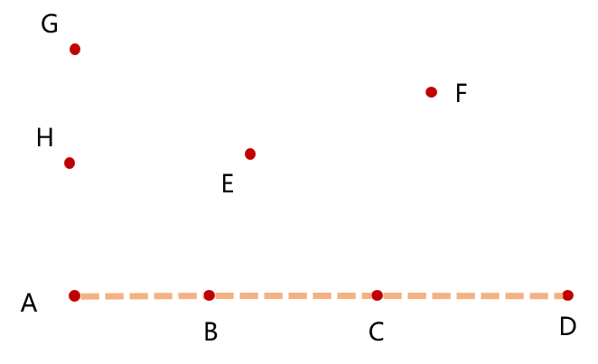
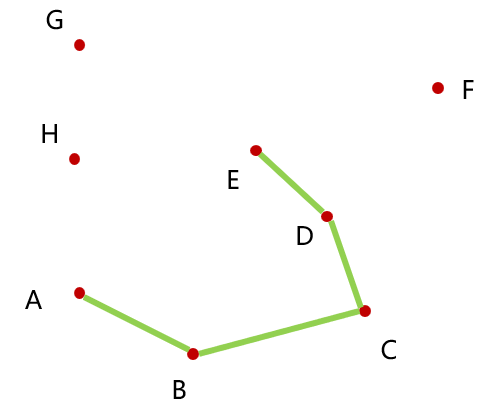
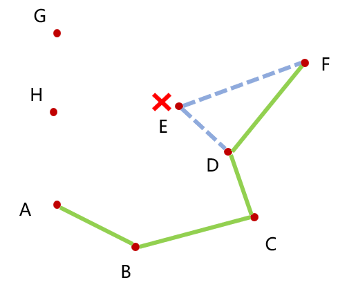
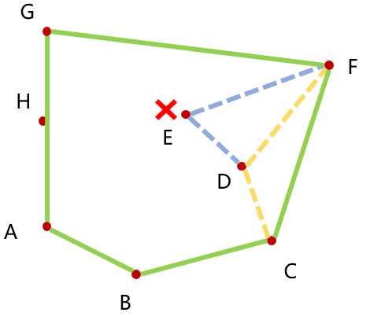
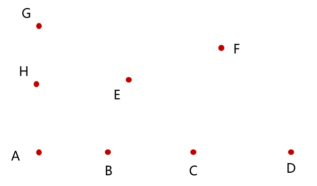
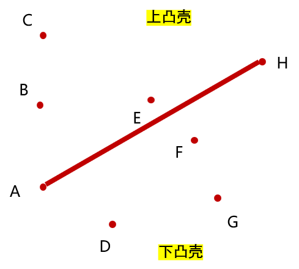
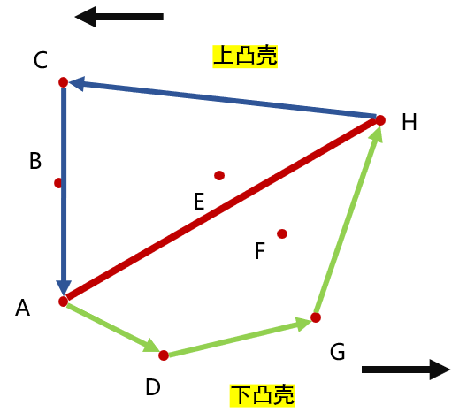
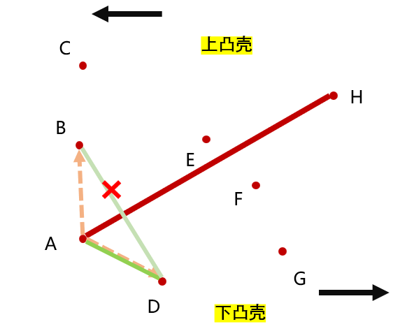

# 二维凸包问题详解

这是我在做软件构造实验时遇到的问题，同时，它也是 LeetCode 4 月 23 日的每日一题。我之前没有系统刷过算法，既然遇到了就索性学习并总结一下。题目链接：

[MIT 6.031-Problem Set 0](http://web.mit.edu/6.031/www/fa18/psets/ps0/)

[LeetCode-581. 安装栅栏](https://leetcode-cn.com/problems/erect-the-fence/)

## 什么是凸包？

简单来说，可以想象在平面中有一些点，这些点的集合为 $X$，我们拿一个橡皮圈撑到最大，尝试套住所有的点，待橡皮圈绷紧后，它会成为一个多边形，这个多边形所有顶点组成的集合便为集合 $X$ 的**凸包**。如图：


凸包计算有很多办法，我在本文讲解三个做法

## Gift wrapping 算法

这是我在做 MIT 6.031-Problem Set 0 时，实验指导建议的做法。由于这门课教授的是软件构造，不太注重时间复杂度，所以这个算法时间性能并不好，使用者寥寥，但是它很直观且很有趣，从它开始入门凸包问题不失为一个好的选择

所谓 Gift wrapping，顾名思义，就是模拟包装礼品盒的过程。要拿包装带给一个礼品盒包装，首先肯定是从凸包中的一个点开始，沿着某一条边后到达下一个顶点，然后从包装带原来的方向开始，逐步向内旋转，直到接触到下一个点，那么下一条边就包装完成了。文字描述有些困难，可以看图：


先包装 AB 边，随后包装带从 AB 方向向内旋转，直到遇到 C 点，则凸包的下一个点就是 C

算法：

1. 找到一个一定在凸包中的初始点，比如最左下的点
2. 计算剩下的所有点与初始点正向下方向之间的角度，取最小的角度的点加入闭包
3. 对于最新加入凸包的点，取前一个点指向该点的方向作为初始方向，遍历剩下的点，取剩下的点和该点的连线与初始方向夹角最小的点加入凸包
4. 重复 3，直到找到的下一个点是初始点

最终结果如图：


### 计算角度

为了达到目的，先实现一个计算角度的函数，根据初始角度，当前点的坐标，以及目标点的坐标，计算初始角度与当前点和目标点连线的夹角

```java
public static double calculateBearingToPoint(double currentBearing, int currentX, int currentY,
                                                 int targetX, int targetY) {
    double angle = 180*Math.atan2(targetY - currentY, targetX - currentX)/Math.PI;
	double bearing;
   	bearing = 90 - angle - currentBearing;
   	if(bearing < 0) bearing += 360;
  	return bearing;
}
```

这里的角度指的都是从该点正上方逆时针旋转的角度

### 考虑距离



我们先明确一点：对于上图，A、B、C、D 四点共线，由凸包的定义， A、D 应该在凸包中，B，C 不应该在凸包中

从 A 点开始计算角度，角度最小的有 B，C，D 点，那么显然接下来要选择距 A 点最远的 D 点。所有我们的算法在扩充凸包时，应该计算一下距离，如果有多个点需要旋转的角度均最小且相同，则应选择距离最远的点

### 完整代码

```java
public static Set<Point> convexHull(Set<Point> points) {
	if (points.size() <= 3) return points;

	Set<Point> convexHull = new HashSet<>();


	Point first = points.iterator().next();
	/* 找到最左下边的点，否则如果与起始点同横坐标的点大于等于三，则距离更新的时候，最后永远无法回到起始点 */
	for (Point iter : points) {
		if (iter.x() < first.x() || (iter.x() == first.x() && iter.y() < first.y()))
			first = iter;
	}
	Point p = first;        //当前的最新点
	/* pre这样设置的目的是使初始角度为0 */
	Point pre = new Point(first.x(), first.y() - 1);      //保存前一个点
	Point endpoint = p;     //待加入集合的点
	do {
		double minAngle = 360;
		double maxDis = 0;
		convexHull.add(p);
		//System.out.println(p.x() + " " + p.y());
		double curBearing = 180 * Math.atan2(p.y() - pre.y(), p.x() - pre.x()) / Math.PI;
		//System.out.println((p.y() - pre.y())+ " " + (p.x() - pre.x()) + ":" + curBearing);
		/* 计算当前角度 */
		if (p.x() >= pre.x()) curBearing = 90 - curBearing;
		else if (p.y() > pre.y()) curBearing = 450 - curBearing;
		else if (p.y() < pre.y()) curBearing = 90 - curBearing;
		//System.out.println(curBearing);
		for (Point next : points) {
			double curAngle = calculateBearingToPoint(curBearing, (int) p.x(), (int) p.y(), (int) next.x(), (int) next.y());
			double curDis = Math.pow(next.x() - p.x(), 2) + Math.pow(next.y() - p.y(), 2);

			/* 要确保这个点与之前的点不同，否则可能会死循环
			   但也要注意可以与第一个点相同，否则循环无法退出 */
			if (curAngle < minAngle && next != p) {
				endpoint = next;
				minAngle = curAngle;
				maxDis = curDis;
			}
			/* 如果有角度相同即共线的，则取最远的点 */
			if (curAngle == minAngle && curDis > maxDis && next != p) {
				maxDis = curDis;
				endpoint = next;
			}
		}
		//System.out.println(minAngle);
		pre = p;
		p = endpoint;
	} while (p != first);
	return convexHull;
}
```

### 复杂度分析

对于凸包中的每一个点，都要遍历其它所有点，所以该算法的时间复杂度为$O(nh)$，其中$h$为凸包中的点数，最坏情况下，所有的点都在凸包中，所以时间复杂度也可以写为 $O(n^2)$

由于我这个是按照实验要求写的代码，其中用到了`atan`，所以时间性能可能会更差。事实上我们不需要精确计算角度，只需要比较角度的大小关系就可以了，可以用点乘来代替角度的计算

## Graham 扫描法

先给出算法：

1. 找到一个一定在凸包中的初始点，比如最左下的点
2. 按逆时针逐个加入可能在凸包中的点。做法就是先把剩下的点集按照相对初始点的极角排序，如果极角相同，则按距离排序，近的在前（原因后面解释）
3. 从初始点开始，按顺序不断加入凸包，对于加入的每一个点，判断加入该点后，会不会使凸包呈现一种前一个点往内凹陷的形状，如果是这样的，则从凸包中删除前一个点，继续往前判断（怎么判断形状呢？利用叉乘）

下面我来详细解释一下算法实现

### 利用叉乘

对于平面中两个向量 $\vec{a}=(x_a, y_a)$，$\vec{b}=(x_b,y_b)$，它们的叉乘也是一个向量，定义为
$$
\vec{c} = \vec{a}\times\vec{b} = (0,0,x_ay_b-x_by_a)
$$
$\vec{c}$ 垂直于这个平面，符合右手定则。即

- $x_ay_b-x_by_a>0$，则 $\vec{b}$ 相对于 $\vec{a}$ 为顺时针
- $x_ay_b-x_by_a<0$，则 $\vec{b}$ 相对于 $\vec{a}$ 为逆时针
- $x_ay_b-x_by_a=0$，则 $\vec{b}$ 和 $\vec{a}$ 共线

首先，我们可以利用这个办法来实现算法的第 2 步，排序。所谓按极角顺序排序，就是将剩下点集与初始点组成的向量按逆时针排列，对其中两个向量做叉乘，如果结果为负，说明前一个向量对应的点的极角更小，于是把它排在前面，很容易完成。如果两向量共线，则按距离由小到大排，代码如下：

```java
list.sort((a, b) -> {
    /* 按叉乘逆时针 */
	int diff = cross(list.get(0), a, b);
    if (diff == 0) {
    /* 按距离由近到远 */
    	return (distance(list.get(0), a) - distance(list.get(0), b));
    } else {
        return -diff;
    }
});
```

怎么利用叉乘的性质来判断删除哪些点呢？举如下例子：


初始点显然是A点，剩下的点按照上述算法描述的排序顺序标号，从 B 点开始不断加入凸包，如图：



 当加入 F 点后，我们要找前两个加入的点来做叉乘，如果 $\overrightarrow{DF}$ 相对于 $\overrightarrow{DE}$ 是顺时针的，那么 E 点就会往内凹陷，应该从凸包中删除 E 点



删除这一个点就够了吗？从图中看出，并不够。我们还要找凸包中 E 点之前的两个点 C 点和 D 点， $\overrightarrow{CF}$ 相对于 $\overrightarrow{CD}$ 是顺时针的，于是再把 D 点删除，接下来找凸包中 D 点之前的两个点 B 点和 C 点，发现$\overrightarrow{BF}$ 相对于 $\overrightarrow{BC}$ 是逆时针的，于是 C 点满足凸包性质，则 C 点之前的点也一定满足凸包性质，就不需要在做叉乘判断了，继续往后加点，重复这个判断即可。



对于加入的每个点，都要与凸包中最近加入的两个点做叉乘运算，很显然，这里可以用栈结构来保存凸包中的点，代码如下：

```java
Deque<Integer> stack = new ArrayDeque<Integer>();
stack.push(0);
stack.push(1);
int n = list.size();
for (int i = 2; i < n; i++) {
    int top = stack.pop();
    /* 如果当前元素与栈顶的两个元素构成的向量顺时针旋转或共线，则弹出栈顶元素 */
    while (!stack.isEmpty() && cross(list.get(stack.peek()), list.get(top), list.get(i)) <= 0) {
        top = stack.pop();
    }
    stack.push(top);
    stack.push(i);
}
```

### 细节：距离判断

为什么对于共线的点，要按它们与初始点的距离从小到大排序呢？

考虑如下例子：



A、B、C、D 四点共线，算法会先加入 A、B 两点，当加入 C 时，$\overrightarrow{AB}$ 与 $\overrightarrow{AC}$ 共线，则会踢掉 B 点，以此类推，最后只会保留 D 点。


反之，如果不按距离由小到大排序，假如先加入 D 点，则下一步加入 C 点时，算法判断$\overrightarrow{AC}$ 与 $\overrightarrow{AD}$ 共线，则会踢掉 D 点，那么就会得到错误的答案。

### 完整代码

```java
public static Set<Point> convexHull(Set<Point> points) {
    if(points.size() <= 3) return points;
    ArrayList<Point> list = new ArrayList<>(points);
    int first = 0;
    /* 找到最左下的点 */
    for(int i = 0; i < list.size(); i++){
        if(list.get(i).x() < list.get(first).x() || (list.get(i).x() == list.get(first).x() && list.get(i).y() < list.get(first).y()))
            first = i;
    }
    swap(list, first, 0);
    /* 按距离和极角排序 */
    list.sort((a, b) -> {
        int diff = cross(list.get(0), a, b);
        if (diff == 0) {
            return (distance(list.get(0), a) - distance(list.get(0), b));
        } else {
            return -diff;
        }
    });
    Deque<Integer> stack = new ArrayDeque<Integer>();
    /* 将前两个点压入栈中 */
    stack.push(0);
    stack.push(1);
    int n = list.size();
    for (int i = 2; i < n; i++) {
        int top = stack.pop();
        /* 如果当前元素与栈顶的两个元素构成的向量顺时针旋转或共线，则弹出栈顶元素 */
        while (!stack.isEmpty() && cross(list.get(stack.peek()), list.get(top), list.get(i)) <= 0) {
            top = stack.pop();
        }
        stack.push(top);
        stack.push(i);
    }
    Set<Point> ans = new HashSet<>();
    while(!stack.isEmpty()){
        ans.add(list.get(stack.pop()));
    }
    return ans;
}

/* 叉乘 */
public static int cross(Point p, Point q, Point r) {
    return (int)((q.x() - p.x()) * (r.y() - q.y()) - (q.y() - p.y()) * (r.x() - q.x()));
}

/* 求距离 */
public static int distance(Point p, Point q) {
    return (int)((p.x()-q.x())*(p.x()-q.x())+(p.y()-q.y())*(p.y()- q.y()));
}

public static void swap(ArrayList<Point> list, int i, int j) {
    Point temp = list.get(i);
    list.set(i, list.get(j));
    list.set(j, temp);
}
```

### 复杂度分析

时间复杂度为$O(nlogn)$

最开始排序的部分：时间复杂度为$O(nlogn)$

核心算法的部分：对于点集中的每一个点，都会入栈一次，在后面加点判断时，最多可能会出栈一次，时间复杂度为$O(2n)$

故总的时间复杂度为$O(nlogn)$

## Andrew 算法

Andrew 算法是 Graham 算法的改进，改进的地方在排序部分。 Graham 算法据极角和距离来进行排序，可能引起较高的时间复杂度，而 Andrew 算法是先对 x 坐标由小到大进行排序，然后对于 x 坐标相等的点再按 y 坐标由小到大排序，对排序时的复杂度有所优化

那么按照什么顺序来更新点呢？Graham 算法的巧妙之处在于通过极角和距离，能让所有点按照逆时针顺序排好序，而 Andrew 算法中按坐标的排序做法就显得有些凌乱了

为了解决这个做法，只好把凸包的产生分为两部分。排序以后，最左下的点与最右上的点一定在凸包上，并且它们能把凸包分为上凸壳和下凸壳



那么对于下凸壳的部分，凸包的点按逆时针是以横坐标从小到大排列的；到达 H 点后，对于上凸壳的部分，凸包的点按逆时针又以横坐标从大到小排序



所以排完序后，我们要遍历更新两次，第一轮从正向遍历，得到下凸包部分；第二轮从逆向遍历，得到上凸包部分，更新的做法与 Graham 算法逻辑完全相同

### 实现细节

讲到这，可能还会有点疑惑，为什么一定要遍历两次呢？

举例：在第一轮从正向遍历的时候，先把 A、B 两点两点入栈，接下来遍历到 D 点，$\overrightarrow{AB}$ 与 $\overrightarrow{AD}$ 为顺时针，所以会踢掉 B 点，如图



也就是说，按坐标这种特殊的排序方式，对于正向遍历一定只能得到下凸壳，逆向遍历一定只能得到上凸壳

### 完整代码

更新部分代码与 Graham 逻辑相同，只有两点特殊：

- 要分别正向、逆向遍历两次
- 设置一个哈希表，存放已经确定加入下凸壳部分的点，避免在逆向遍历时加入下凸壳的点，增加出栈操作

```java
public static Set<Point> convexHull(Set<Point> points) {
    if(points.size() <= 3) return points;
    ArrayList<Point> list = new ArrayList<>(points);
    list.sort((a, b) -> {
        if((int)a.x()==(int)b.x()) return (int)(a.y() - b.y());
        return (int)(a.x() - b.x());
    });
    Deque<Integer> stack = new ArrayDeque<Integer>();
    Set<Integer> visited = new HashSet<>();
    stack.push(0);
    stack.push(1);
    visited.add(0);
    visited.add(1);
    int n = list.size();
    for (int i = 2; i < n; i++) {
        int top = stack.pop();
        visited.remove(top);
        /* 如果当前元素与栈顶的两个元素构成的向量顺时针旋转或共线，则弹出栈顶元素 */
        while (!stack.isEmpty() && cross(list.get(stack.peek()), list.get(top), list.get(i)) <= 0) {
            top = stack.pop();
            visited.remove(top);
        }
        stack.push(top);
        visited.add(top);
        stack.push(i);
        visited.remove(i);
    }
    int m = stack.size();
	for(int i = n-2; i >= 0; i--) {
		if(!visited.contains(i)) {
			int top = stack.pop();
			visited.remove(top);
	/* 如果当前元素与栈顶的两个元素构成的向量顺时针旋转或共线，则弹出栈顶元素 */
	/* 不需要判断下凸壳的部分 */
       		while (stack.size() > m && cross(list.get(stack.peek()), list.get(top), list.get(i)) <= 0) {
            	top = stack.pop();
            	visited.remove(top);
        	}
        	stack.push(top);
        	visited.add(top);
        	stack.push(i);
        	visited.remove(i);
    	}
    }
    stack.pop();
    Set<Point> ans = new HashSet<>();
    while(!stack.isEmpty()){
        ans.add(list.get(stack.pop()));
    }
    return ans;
}
```

### 复杂度分析

由于增加了哈希表，所以每个元素还是最多入栈出栈各一次，总时间复杂度仍为$O(nlogn)$

因为这个算法优化了排序的性能，耗时往往比 Graham 要短


## 参考资料

- https://en.wikipedia.org/wiki/Gift_wrapping_algorithm
- https://en.wikipedia.org/wiki/Convex_hull_algorithms
- https://leetcode-cn.com/problems/erect-the-fence/solution/an-zhuang-zha-lan-by-leetcode-solution-75s3/
