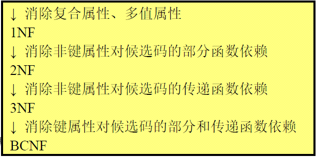
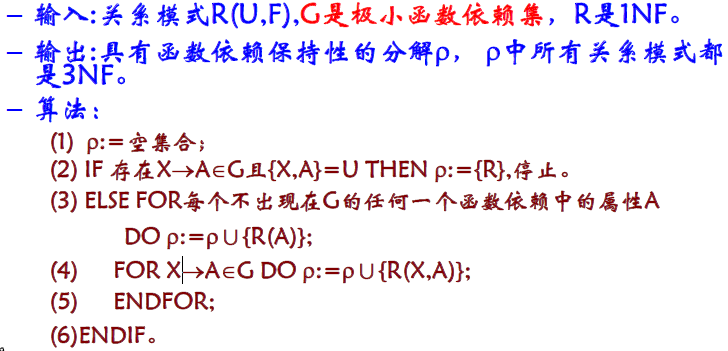
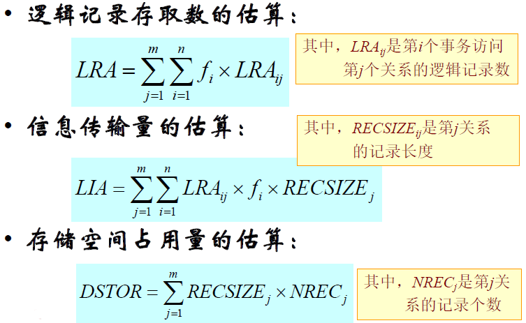

# Note04-关系数据库设计

关系数据库设计的任务就是把概念数据库设计阶段产生的概念数据库模式变换为关系数据库模式

## 由E-R模型到关系模型

### 实体和属性的变换

- 普通实体集
  - 为概念数据库模式中的每个普通实体集$E$建立一个关系$S$
  - $S$包含$E$的所有简单属性和$E$的符合属性的简单子属性
  - $E$的**码**是$S$的**主码**
- 弱实体的变换。设$W$为实体集$E$的弱实体
  - 建立一个与$W$对应的关系$R$
  - $W$的所有简单属性和复合属性的简单子属性映射为$R$的属性
  - $E$的码也是$R$的属性
  - $R$的主码由$E$的**码**和$W$的**部分码**组合而成
  - $E$对应的关系的码是$R$的外码
- 多值属性的变换。设实体集$E$具有多值属性，$S$是$E$对应的关系
  - 为$E$的每个多值属性$A$建立一个关系$T$，用$T$表示$A$
  - 如果$A$是简单属性，$T$的属性为$A$与$S$的主码
  - 如果$A$是复合属性，$T$包含$A$的简单子属性和$S$主码
  - $S$关系中忽略属性$A$

### 实体间联系的变换

- 1:1 联系
  - 方法一：在$S$或$T$中增加有关信息来表示联系$R$
  - 方法二：建立一个单独的关系$W$，把$T$和$S$的主码作为主码加入$W$，$R$的简单属性和符合属性的简单子属性作为简单属性加入$W$
- 1:n 联系。设$R$是从实体集$E_1$到实体集$E_2$的 1:N 联系，$S$和$T$是$E_1$和$E_2$对应的关系
  - 方法一：由于$T$的每个实体至多与$S$的一个实体对应，因此用$T$表示$R$。将$S$的主码作为外码加入$T$，$R$的简单属性和复合属性的简单子属性作为简单属性加入$T$
  - 方法二：同 1: 1 的方法二
- m:n 联系。设$R$是从实体集$E_1$到实体集$E_2$的 M:N 联系，$S$和$T$是$E_1$和$E_2$对应的关系
  - 只能用 1:1 联系的方法二

## 关系模式规范化

初始关系模式不是逻辑设计的最终结果，其中某些关系模式可能存在由属性间的函数依赖引起的冗余问题、插入问题、更新问题和删除问题。

### 函数依赖

:::tip 定义

设$R$是一个关系模式，$U$是$R$的属性集合，$X$和$Y$是$U$的子集。对于$R$的任意实例$r$，$r$中任意两个元组$t_1$和$t_2$，如果$t_1[X]=t_2[X]$，则$t_1[Y]=t_2[Y]$，我们称$X$函数地确定$Y$，或$Y$函数**依赖于**$X$，记作$X\rightarrow Y$。

如果$X\rightarrow Y$而且$Y$不是$X$的子集，则称$X\rightarrow Y$是**非平凡函数依赖**。若不特别声明，我们总是讨论非平凡函数依赖。

如果$X\rightarrow Y$，我们称$X$为这个函数依赖的**决定属性集**

:::

我们还可以定义出**完全依赖**：

:::tip 定义

设$R$是一个具有属性集合$U$的关系模式，如果$X\rightarrow Y$，并且对于$X$的任何一个真子集$Z$，$Z\rightarrow Y$都不成立，则称$Y$**完全函数依赖**于$X$。若$X\rightarrow Y$，但$Y$不完全函数依赖于$X$，则称$Y$**部分函数依赖**于$X$。

:::

传递依赖：

:::tip 定义

设$R$是一个具有属性集合$U$的关系模式，$X\subseteq U,Y\subseteq U,Z\subseteq U,Y\rightarrow X$不成立，$Z-X$、$Z-Y$、$Y-X$不空。如果$X\rightarrow Y$，$Y \rightarrow Z$，则称$Z$**传递地函数依赖于**$X$。

:::

超码、候选码和主码：

:::tip 定义

设$R$是一个具有属性集合$U$的关系模式, $K\subseteq U$。若$K\rightarrow U$，则称$K$是$R$的一个**超码**，如果不存在$K$的真子集$Z$，使得$Z\rightarrow U$，则称$K$是$R$的一个**候选码**。

:::

### 函数的依赖的公理系统

:::tip 定义

设$R$是一个具有属性集合$U$的关系模式，$F$是$R$上的函数依赖集合。如果对于$R$的任意一个使$F$成立的关系实例$r$，函数依赖$X\rightarrow Y$都成立，则称$F$逻辑地**蕴含**$X\rightarrow Y$。

:::

包含三条推理规则：

- 自反律。若$Y\subseteq X\subseteq U$，则$X\rightarrow Y$为$F$所蕴含
- 增广律。若$X\rightarrow Y$为$F$所蕴含，且$Z\subseteq U$，则$XZ\rightarrow YZ$为$F$所蕴含
- 传递律。若$X\rightarrow Y$及$Y\rightarrow Z$为$F$所蕴含，则$X\rightarrow Z$为$F$所蕴含

由此又可导出三条规则：

- 合并规则。由$X\rightarrow Y,Y\rightarrow Z$，有$X\rightarrow YZ$
- 伪传递规则。由$X\rightarrow Y,WY\rightarrow Z$，有$XW\rightarrow Z$
- 分解规则。由$X\rightarrow Y,Z\subseteq Y$，由$X\rightarrow Z$

由合并规则和分解规则可得引理：

:::info 引理

$X\rightarrow A_1A_2\cdots A_k$成立的充分必要条件为$X\rightarrow A_i$均成立

:::

### 闭包

给出闭包的定义

:::tip 定义

在关系模式$R<U,F>$中为$F$所逻辑蕴含的函数依赖的全体叫作$F$的**闭包**，记为$F^+$。设$X\subseteq U$， $X_{F^+}=\{A|X\rightarrow A\}$，$X_{F^+}$称为属性集$X$关于函数依赖集$F$的闭包。

:::

如果$X$的闭包与$U$相等，那么说明$X$是$R$的超码

求闭包流程：

1. 把$X$加入闭包中。
2. 逐一扫描$F$的各个函数依赖，如果函数依赖的左部是当前闭包的子集，则把右部加入闭包
3. 判断闭包是否为$U$，或者是否找不到未用过的函数依赖，如果是则停止，否则回到第 2 步

### 求解候选码

将属性分为四类：

- L 类：仅出现在F 的函数依赖左部的属性
- R 类：仅出现在 F 的函数依赖右部的属性
- N 类：在 F 的函数依赖左右两边均未出现的属性
- LR 类：在 F 的函数依赖左右两边均出现的属性

显然，$L$类属性和$N$类属性一定在$R$的任一候选码中，$R$类属性一定不在任一候选码中。我们只需要得到$L$类属性和$N$类属性，放到一个集合，判断它们的闭包是否为$U$，若是，则一定为候选码，且为唯一的候选码

### 求解极小函数依赖集

:::tip 定义

如果函数依赖集$F$满足下列条件，则称$F$为一个极小函数依赖集。亦称为极小覆盖：

- $F$中任一函数依赖的右部仅含有一个属性
- $F$中不存在这样的函数依赖$X→A$，使得$F$与$F-\{X\rightarrow A\}$等价
- $F$中不存在这样的函数依赖$X→A$， $X$有真子集$Z$使得$F-\{X\rightarrow A\}\cup \{Z\rightarrow A\}$与$F$等价

:::

算法：

1. 逐一检查$F$中各函数依赖$X\rightarrow Y$，若$Y=A_1A_2\cdots A_k$，$k\ge 2$，则用${X\rightarrow A_j|j=1,2,\cdots,k}$来取代$X\rightarrow Y$
2. 循环地检查$F$中各函数依赖$X\rightarrow A$，令$G=F-\{X\rightarrow A\}$，若$X\rightarrow A\in X_{G^+}$， 则从$F$中去掉此函数依赖
3. 循环地取出$F$中各函数依赖$X→A$，设$X= B_1B_2\cdots B_m$，逐一考查$B_i(i=l,2,\cdots, m)$，若$A \in(X-B_i)_{F^+}$，则以$X-B_i\rightarrow A$取代$X\rightarrow A$ 。

### 范式

第一范式：

:::tip 定义

设$R$是一个关系模式。如$R$的每个属性的值域都是不可分的简单数据项的集合，则称这个关系模式为第一范式关系模式，记作 1NF。

:::

在任何一个关系数据库系统中，第一范式都是一个最起码的要求。

第二范式：

:::tip 定义

设$R$是 1NF。而且每一个**非键属性**都完全函数依赖于$R$的候选码，则$R$称为第二范式关系模式，记作2NF。

:::

第三范式：

:::tip 定义

设$R$是 2NF, 而且它的任何一个非键属性都**不传递地**依赖于任何候选码，则$R$称为第三范式关系模式，记作 3NF。

:::

将一个 2NF 关系分解为多个 3NF 的关系后，并不能完全消除关系模式中的各种异常情况和数据冗余。

BC范式：

:::tip 定义

设关系模式$R$是 1NF。如果对于$R$的每个函数依赖$X\rightarrow Y$，则$X$必为候选码，则$R$是 BCNF 范式。

:::

如果一个关系数据库中的所有关系模式都属于 BCNF，那么在函数依赖范畴内，它已实现了模式的彻底分解，达到了最高的规范化程度，消除了插入异常和删除异常。

一旦数据已加载，不再进行插入、删除和更新的**静态关系**只需具有第一范式，否则称为动态范式，应该具有第三范式

### 规范化

基本步骤：

### 关系模式的分解

关系模式的分解必须满足：

- 分解的无损连接性
- 函数依赖保持性

将一个关系模式$R<U,F>$分解为若干个关系模式$R_1<U_1,F_1>,R_2<U_2,F_2>,\cdots ,R_n<U_n,F_n>$（其中$U=U_1\cup U_2\cup \cdots \cup U_n$，且不存在$U_i \subseteq U_j$，$F_i$为$F$在$U_i$上的投影），若$R$与$R_1,R_2,\dots,R_n$自然连接的结果相等，则称关系模式$R$的这个分解具有**无损连接性**。

### 无损连接性的判定

判断无损连接性，用表格法：

用这个例子：$R<U，F>$，$U=\{A,B,C,D,E\}$，  $F=\{AB\rightarrow C,C\rightarrow D,D\rightarrow E\}$，$R$的一个分解为$R_1(A,B,C)$，$R_2(C,D)$，$R_3(D,E)$

1. 构造初始表。第一行是所有属性，第一列是所有模式的属性集合。若属性属于模式中的属性，则填$a_j$，否则填$b_{ij}$

   |      | A    | B    | C    | D    | E    |
   | ---- | ---- | ---- | ---- | ---- | ---- |
   | ABC  | a1   | a2   | a3   | b14  | b15  |
   | CD   | b21  | b22  | a3   | a4   | b25  |
   | DE   | b31  | b32  | b33  | a4   | a5   |

2. 对于$F$的每一个左部，看它在表中这一列有无相同的分量，如果有，就把右部对应的位置改为$a_j$

   |      | A    | B    | C    | D    | E    |
   | ---- | ---- | ---- | ---- | ---- | ---- |
   | ABC  | a1   | a2   | a3   | a4   | a5   |
   | CD   | b21  | b22  | a3   | a4   | a5   |
   | DE   | b31  | b32  | b33  | a4   | a5   |

3. 观察判定表，是否有一行全为a，若是则得出分解具有无损连接性

如果分解为两个子模式，可以用如下定理简单判定无损连接性：

:::info 定理

设$\rho={R_1,R_2}$是关系模式$R$的一个分解，$U_1,U_2,U$分别是$R_1,R_2,R$的属性集合，$F$是$R$的函数依赖集合。$\rho$具有无损连接性的充分必要条件是：$U_1\cap U_2\rightarrow U_1-U_2\in F^+$ 或 $U_1\cap U_2\rightarrow U_2-U_1\in F^+$

:::

### 保持函数依赖性的判定

若$F$所逻辑蕴含的函数依赖一定也由分解得到的某个关系模式中的函数依赖$F_i$所逻辑蕴含，则称关系模式$R$的这个分解是保持函数依赖的

### 分解算法

3NF 分解算法1（达到 3NF 且保持函数依赖的分解）

3NF 分解算法2（达到 3NF 且具有无损连接和保持函数依赖的分解）

## 关系模式优化

关系模式的优化是根据需求分析和概念设计中定义的事务的特点，对初始关系进行分解，提高数据操作的效率和存储空间的利用率。

- 水平分解
  - 把（基本）关系的元组分为若干子集合，定义每个子集合为一个子关系，以提高系统的效率。
- 垂直分解

## 性能估计

使用逻辑记录存取数、信息传输量和存储空间占用量等三个测度来估计逻辑数据库的性能

