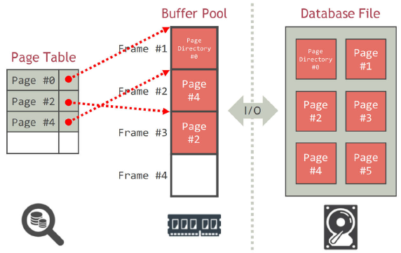
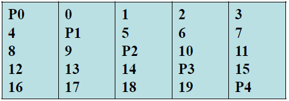
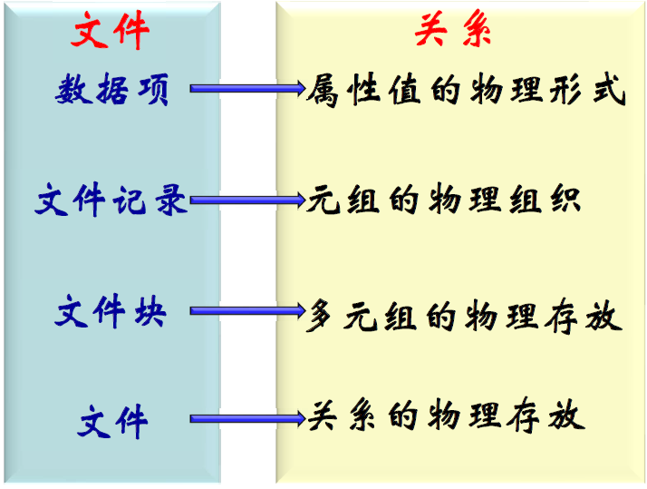

# Note05-存储和文件结构

## Buffer Pool 设计

数据库文件的大小经常超过 DBMS 的可用内存容量，而 CPU 无法直接读/写磁盘中的数据，必须先将文件中的页从磁盘读入内存，Buffer Pool 就是负责再磁盘和内存之间复制文件页。

Buffer Pool 中的页称为**页框(frame)**。同时，它还维护一个页表，记录 Buffer Pool 中当前有哪些页以及这些页在内存中的地址，页表将页号映射为该页所在页框的地址。

对于每个 frame，可以维护下列属性：

- pin-count：页框中的页当前被请求但未释放的次数，即引用计数
- dirty：自从页框中的页被读入缓冲池后，该页是否被修改过

### 请求页

- 搜索页表，检查缓冲池中是否存在被请求的页 P，如果 P 在缓冲池中，则钉住 P， 即将包含 P 的页框的 pin_count 加 1
- 如果请求的页 P 不在缓冲池中,则执行下列步骤：
  - 选替换页：使用缓冲池的页**替换策略**，从缓冲池中选择一个 pin_count = 0 的页框，将该页框的pin_count 加 1
  - 写回脏页：如果该页框的 dirty 值为真，则将该页框中的页写回磁盘文件
  - 读请求页：将请求的页 P 读入该页框，返回该页框的地址
- 如果缓冲池中没有 pin-count = 0 的页框，则请求开始等待，直至 DBMS 释放了缓冲池中的页面

### 释放页

Unpin 被释放的页，即将包含该页的页框的 pin_count 减 1

### 修改页

将被修改的页所在的页框的 dirty 值置为真

### 替换策略

- LRU：把最近不经常使用的缓冲区中数据释放
- 立即丢弃：一旦缓冲区中的数据被使用结束，立即释放
- MRU：把最近最常使用的缓冲区中释

:::caution 注意

释放缓冲区时，需要考虑该缓冲区数据是否需要写回磁盘存储器。

:::

## RAID

磁盘故障将导致数据丢失，这个问题怎么解决呢？

- 用一或多磁盘（数据磁盘）保存数据，用附加磁盘（冗余磁盘）保存故障恢复信息
- 当数据磁盘发生故障时，冗余磁盘的信息可以用来实现故障磁盘的恢复
- 当冗余磁盘发生故障时，数据磁盘或其他冗余磁盘用来实现故障磁盘的恢复

基于磁盘冗余技术的策略便被称为 RAID

### RAID1：块级拆分的磁盘镜像

正常运行时，两盘数据始终保持一致。如果有其中一个盘故障就把另一个盘复制过去即可。这种策略无法解决两盘同时故障的问题。

### RAID4：块交叉的奇偶校验

- 仅适用一个冗盘完成 n 个数据盘的奇偶校验
- 冗余盘的第 i 块存储所有 n 个数据盘第 i 块数据的奇偶校验位
- 如果所有 n 个数据磁盘的第 i 块的第 j 位上 1 的个数是偶数，则冗余磁盘的第 i 块第 j 位为0，否则为1

例：假定系统具有三个相同数据磁盘（盘1、盘2、盘3）和一个冗余盘（盘4），每个磁盘块存储八位数据。如三个数据磁盘的第 i 块分别存储如下数据：

磁盘1：11110000
磁盘2：10101010
磁盘3：00111000

则冗余盘的第 i 块存储如下的奇偶校验位：01100010

如果系统具有 n 个磁盘和一个冗余磁盘，可以通过读这 n+1 个磁盘中的任何 n 个磁盘的数据推导出另一个磁盘的数据

### RAID5：块交叉的分布奇偶校验

RAID5 解决的痛点是 RAID4 的冗余盘读写次数太多，于是做出了改进：将数据和奇偶校验分布到所有的 N+1 张磁盘。

例：在 5 张磁盘组成的阵列中，逻辑块 4k，4k+1，4k+2，4k+3 对应的奇偶检验块$P_k$，存储在第 k mod 5 张磁盘中，余下的 4 张磁盘中对应的块存储 4k - 4k+3 这四个数据块。

RAID5 部分解决了 RAID4 的瓶颈问题

## 文件和关系

- 数据项
  - 表示关系数据库中元组的属性值
- 文件记录
  - 数据项的集合, 对应于一个关系元组
- 文件记录的种类
  - 定长记录：记录长度固定
  - 非定长记录：记录长度可变
- 文件记录的存储方法
  - 跨块存储：一个记录存储在多个文件块
  - 非跨块存储
- 文件块
  - 记录集合，一个磁盘块文件块的种类
- 文件
  - 文件块的集合, 对应于一个关系
- 文件种类
  - 无序文件
  - 有序文件
  - 索引文件
  - Hash文件
- 文件的存储方法
  - 连续存储方法
    - 按照文件中文件块的顺序把文件存储到连续磁盘块上
  - 链接存储方法
    - 在每个文件块中增加一个指向下一个文件块所在的磁盘块的地址指针
  - 索引存储方法
    - 在磁盘上存储一个或多个索引块.每个索引块包含指向文件块的指针

## 索引文件

索引也是一个文件，称为索引文件，索引文件的记录称为索引记录或索引项，索引记录包括两个域：

- 搜索码：存储数据文件索引域的值
- 存储指针，指向记录所在地址

### 稠密索引与稀疏索引

- 稠密索引：对于主文件中每一个记录，都有一个索引项与之对应，指明该记录所在位置
  - 非候选键属性索引，有三种处理办法
    - 索引文件中索引字段值不重复，主文件按索引字段排序，那么找到第一个后顺序检索即可
    - 可以让索引文件中索引字段值有重复
    - 引入指针桶处理
- 稀疏索引：只是部分记录有索引项对应
  - 定位索引字段值为 K 的记录，需要
    - 首先找相邻的小于 K 的最大索引字段值所对应的索引项
    - 从该索引项所对应的记录开始顺序检索
  - 稀疏索引要求主文件必须按照对应索引字段属性排序存储

### 主索引与辅助索引

- 主索引：对每一存储块有一索引项，索引项的总数和存储表所占的存储块数目相同，存储表的每一存储块的第一条记录又称为**块锚**
  - 主索引的索引字段值为块锚的索引字段值，而指针指向其所在的存储块
  - 显然，主索引是稀疏索引
- 辅助索引：定义在主文件的任一或多个非排序字段上的辅助存储结构
  - 引入指针桶处理的稠密索引

### 其他索引

- 多级索引：当索引项比较多，可以对索引再索引。如 B+树索引
- 散列索引

接下来介绍 B+ 树索引和散列索引：

- [B+树索引详解](note7)
- [Hash索引详解](note6)
