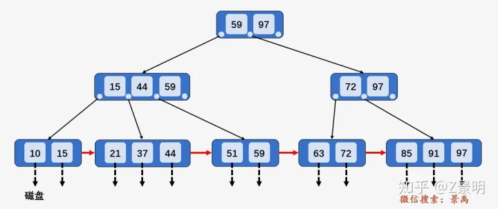
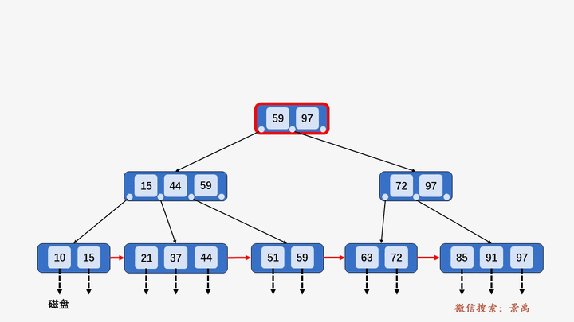
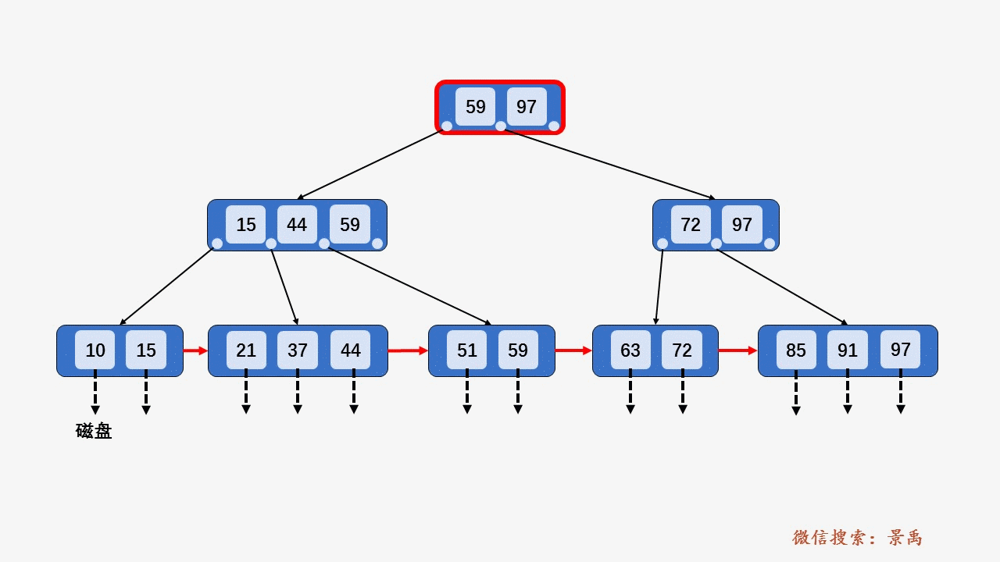
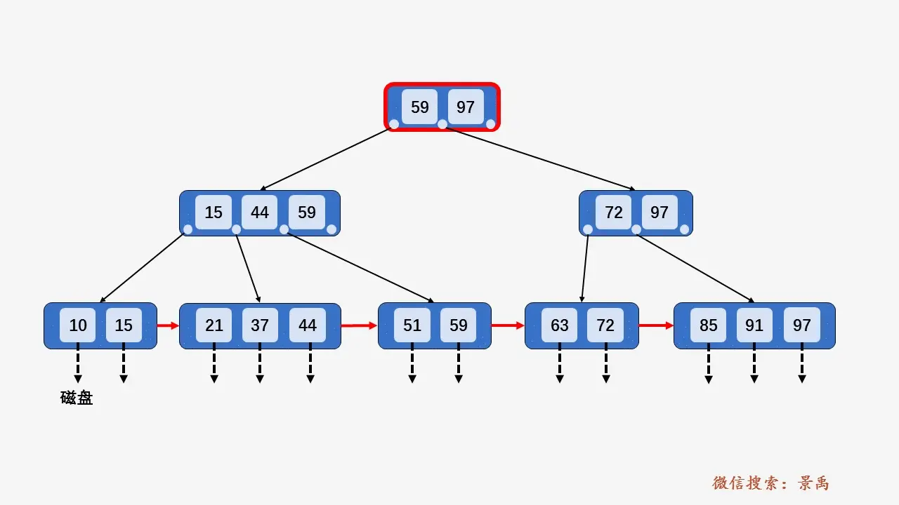
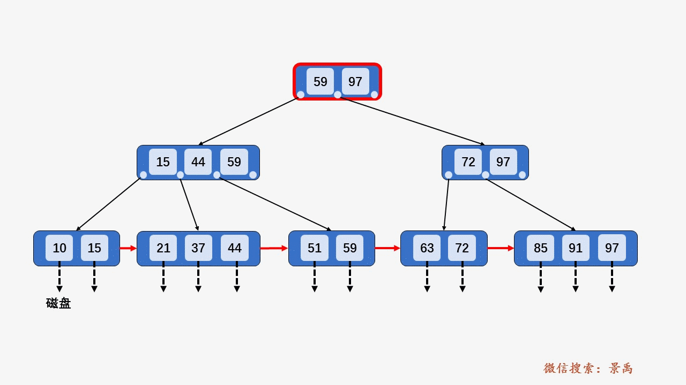
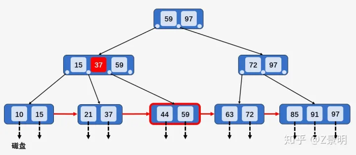
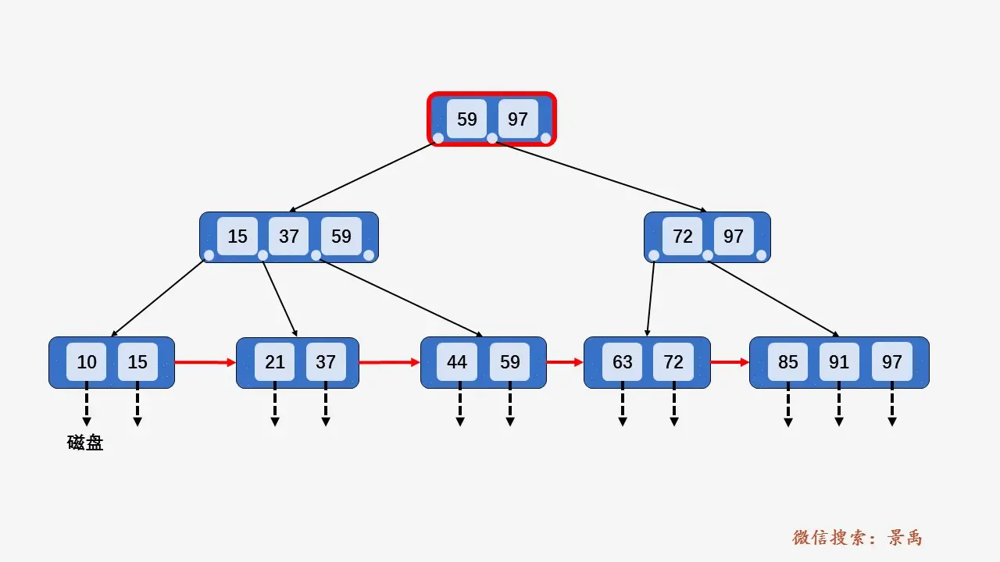

# Note07-B+树索引详解

这是一种以树型结构来组织索引项的**多级索引**。非叶结点指针指向索引块，叶结点指针指向主文件的数据块或数据记录，叶结点的最后一个指针始终指向下一个叶结点。

B+树查找、插入、删除等操作，见文章：[B+树看这一篇就够了（B+树查找、插入、删除全上）](https://zhuanlan.zhihu.com/p/149287061)

:::caution 注意

接下来的内容均从此文复制而来，如有侵权，请联系我

:::

## 插入操作

在B+树中插入关键字时，需要注意以下几点：

- 插入的操作全部都在叶子结点上进行，且不能破坏关键字自小而大的顺序；
- 由于 B+树中各结点中存储的关键字的个数有明确的范围，做插入操作可能会出现结点中关键字个数超过阶数的情况，此时需要将该结点进行 “分裂”；

我们依旧以之前介绍查找操作时使用的图对插入操作进行说明，需要注意的是，B+树的阶数 `M = 3` ，且 `⌈M/2⌉ = 2（取上限）` 、`⌊M/2⌋ = 1（取下限）` ：

B+树中做插入关键字的操作，有以下 3 种情况：

1、 若被插入关键字所在的结点，其含有关键字数目小于阶数 M，则直接插入；

比如插入关键字 `12` ，插入关键字所在的结点的 `[10，15]` 包含两个关键字，小于 `M` ，则直接插入关键字 `12` 。

2、 若被插入关键字所在的结点，其含有关键字数目等于阶数 M，则需要将该结点分裂为两个结点，一个结点包含 `⌊M/2⌋` ，另一个结点包含 `⌈M/2⌉` 。同时，将`⌈M/2⌉`的关键字上移至其双亲结点。假设其双亲结点中包含的关键字个数小于 M，则插入操作完成。

插入关键字 `95` ，插入关键字所在结点 `[85、91、97]` 包含 3 个关键字，等于阶数 `M` ，则将 `[85、91、97]` 分裂为两个结点 `[85、91]` 和结点 `[97]` , 关键字 `95` 插入到结点 `[95、97]` 中，并将关键字 `91` 上移至其双亲结点中，发现其双亲结点 `[72、97]` 中包含的关键字的个数 2 小于阶数 `M` ，插入操作完成。

3、在第 2 情况中，如果上移操作导致其双亲结点中关键字个数大于 M，则应继续分裂其双亲结点。

插入关键字 `40` ，按照第 2 种情况将结点分裂，并将关键字 `37` 上移到父结点，发现父结点 `[15、37、44、59]` 包含的关键字的个数大于 `M` ，所以将结点 `[15、37、44、59]` 分裂为两个结点 `[15、37]` 和结点 `[44、59]` ，并将关键字 `37` 上移到父结点中 `[37、59、97]` . 父结点包含关键字个数没有超过 `M` ，插入结束。

4、若插入的关键字比当前结点中的最大值还大，破坏了B+树中从根结点到当前结点的所有索引值，此时需要及时修正后，再做其他操作。

插入关键字 `100`，由于其值比最大值 `97` 还大，插入之后，从根结点到该结点经过的所有结点中的所有值都要由 `97` 改为 `100`。改完之后再做分裂操作。

## 删除操作

在 B+树中删除关键字时，有以下几种情况：

1、 找到存储有该关键字所在的结点时，由于该结点中关键字个数大于`⌈M/2⌉`，做删除操作不会破坏 B+树，则可以直接删除。

删除关键字 `91`，包含关键字 `91` 的结点 `[85、91、97]` 中关键字的个数 3 大于 `⌈M/2⌉ = 2` ，做删除操作不会破坏 B+树的特性，直接删除。

2、 当删除某结点中最大或者最小的关键字，就会涉及到更改其双亲结点一直到根结点中所有索引值的更改。

以删除整颗 B+树中最大的关键字 `97` 为例，查找并删除关键字 `97` ， 然后向上回溯，将所有关键字 `97` 替换为次最大的关键字 `91` :

3、 当删除该关键字，导致当前结点中关键字个数小于 `⌈M/2⌉`，若其兄弟结点中含有多余的关键字，可以从兄弟结点中借关键字完成删除操作。

当删除某个关键字之后，结点中关键字个数小于 `⌈M/2⌉` ，则不符合 B+树的特性，则需要按照 3 和 4 两种情况分别处理。以删除关键字 `51` 为例，由于其兄弟结点 `[21、37、44]` 中含有 3 个关键字，所以可以选择借一个关键字 `44`，同时将双亲结点中的索引值 `44` 修改 `37` ，删除过程如下图所示：

4、 第 3 种情况中，如果其兄弟结点没有多余的关键字，则需要同其兄弟结点进行合并。

为了说明这种情况，我们在第 3 种情况最终得到的 B+树之上进行删除操作。第 3 种情况删除关键字 `51` 之后得到如下所示 B+树：

我们以删除上面这个 B+树中的关键字 `59` 说明第 4 种情况，首先查找到关键 `59` 所在结点 `[44、59]` ，发现该结点的兄弟结点 `[21、37]` 包含的关键字的个数 2 等于 `⌈M/2⌉`， 所以删除关键字 `59` ，并将结点 `[21、37]` 和 `[44]` 进行合并 `[21、37、44]` ，然后向上回溯，将所有关键字 `59` 替换为次最大的关键字 `44` :

5、 当进行合并时，可能会产生因合并使其双亲结点破坏 B+树的结构，需要依照以上规律处理其双亲结点。

删除关键字 `63`，当删除关键字后，该结点中只剩关键字 `72`，且其兄弟结点 `[85、91]` 中只有 2 个关键字，所以将 `[72]` 和 `[85、91]` 进行合并，向上回溯，删除结点 `[72、91]` 当中的关键字 `72` ，此时结点中只有关键 `91` ，不满足 B+树中结点关键字个数要求，但其兄弟结点 `[15、44、59]` 中包含的 3 个关键字，所以从其兄弟结点当中借一个关键字 `59` , 再对其兄弟结点的父结点中的关键字进行调整，将关键字 `59` 替换为 `44` .

总之，在 B+树中做删除关键字的操作，采取如下的步骤：

1. 删除该关键字，如果不破坏 B+树本身的性质，直接完成删除操作（情况 1）；
2. 如果删除操作导致其该结点中最大（或最小）值改变，则应相应改动其父结点中的索引值（情况 2）；
3. 在删除关键字后，如果导致其结点中关键字个数不足，有两种方法：一种是向兄弟结点去借，另外一种是同兄弟结点合并（情况 3、4 和 5）。（注意这两种方式有时需要更改其父结点中的索引值。）

**感谢此文作者！写得太好了！**