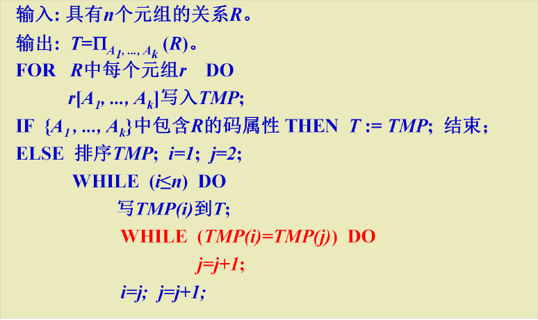
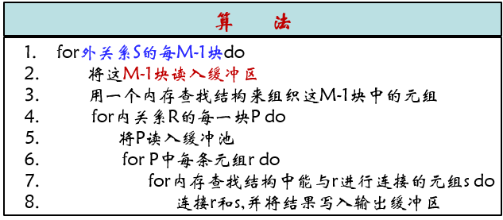
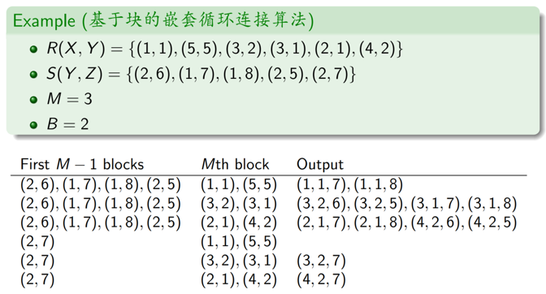
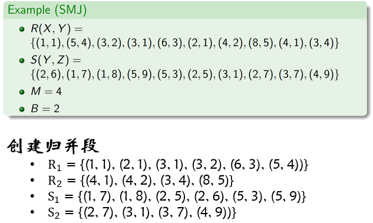

# Note08-查询处理

查询处理是指从数据库中提取数据时涉及的一系列活动。这些活动包括：将用高层数据库语言表示的查询语句翻译为能在文件系统的物理层上使用的表达式，为优化查询而进行各种转换，以及查询的实际执行。

## 基本概念

先介绍三种树的概念：

- Parser Tree。由 select、from、where 组成的语法树
- Logical Query Plan Tree。由基本关系操作符组成的查询树（如：选择、投影、连接等）
- Physical Query Plan Tree。由物理操作符组成的查询树，包括顺序扫描、索引扫描、Hash-join、sort-merge-join等

## 选择操作

```sql
SELECT *
FROM R
WHERE C1 AND C2 OR C3
```

简单选择操作：仅包含关系 R 的一个属性的条件

复杂选择操作：由简单条件经 AND, OR, NOT 等逻辑运算符连接而成的条件

算法：

- 线性搜索算法
  - 顺序地读取被操作关系的每个元组
  - 测试该元组是否满足选择条件
  - 如果满足，则作为一个结果元组输出
- 二元搜索算法
  - 条件：某属性相等比较且关系按该属性排序
  - 即二分查找，时间复杂度为$O(log(N))$
- 主索引或 Hash 搜索算法
  - 条件：主索引属性或 Hash 属性上的相等比较
- 使用主索引查找满足条件的元组
  - 条件：主索引属性上的非相等比较
- 使用聚集索引查找满足条件的元组
  - 条件：具有聚集索引的非键属性上相等比较
- B+ 树索引搜索算法
  - 条件：B+ 树索引属性上相等或非相等比较
- 合取选择算法
  - 合取条件中存在简单条件 C
  - C 涉及的属性上定义有某种存取方法
  - 存取方法适应于上述六个算法之一
  - 用相应算法搜索关系，选择满足 C 的元组，并检验是否满足其他条件
- 使用复合索引的合取选择算法
  - 如果合取条件定义在一组属性上的相等比较
  - 而且存在一个由这组属性构成的复合索引
  - 使用这个复合索引完成选择操作

## 投影操作

设$\Pi_{A_1,\cdots A_k}(R)$是$R$上的投影操作，则就看投影属性中有无$R$的码，如果有直接取即可，如果没有则需要去重，采用排序去重



## 连接操作

以$\text{R(X,Y)}\Join \text{S(Y,Z)}$为例，令

- $\text{T(R)}$：关系 R 的元组数
- $\text{B(R)}$：关系 R 的块数

- $\text{M}$：缓存区可用的内存页数
- $\text{V(R,A)}$：关系 R 的属性集 A 的不同值的个数

### 一趟连接算法

假设：$\text{B(S)}<\text{B(R)}$


**举例**：


**算法分析**：

- I/O 代价：$\text{B(R)+B(S)}$
  - 构建阶段，$S$的每块只读 1 次
  - 探测阶段，$R$的每块只读 1 次
- 可用内存页数要求：$\text{B(S)}\le \text{M-1}$
  - 因为要构建内存查找结构

### 基于元组的嵌套连接循环连接

- S 称为外关系
- R 称为内关系


**算法分析**：

- I/O 代价：$\text{T(S)(T(R)+1)}$
  - 外关系每个元组只读 1 次
  - 内关系每个元组读 $\text{T(S)T(R)}$次
- 可用内存页数要求：$\text{M}\ge2$

### 基于块的嵌套循环连接

假设：$\text{B(S)}<\text{B(R)}$



**举例**：



**算法分析**：

- I/O 代价：$\text{B(S)}+\frac{\text{B(R)B(S)}}{\text{M-1}}$
  - 内关系的每个元组都要扫描$\text{B(S)}/\text{M-1}$次
- 可用内存页数要求：$\text{M}\ge2$

### 排序归并连接


**举例**：



**算法分析**：

- I/O 代价：$\text{3B(R)}+3\text{B(S)}$
  - 对 R 创建归并段时，每块只读一次，$\text{B(R)}$
  - 将 R 的归并段写入文件，$\text{B(R)}$
  - 在归并阶段，扫描一次，$\text{B(R)}$
- 可用内存页数要求：$\text{B(R)+B(S)}<M^2$

### 哈希连接


**算法分析**：

- I/O 代价：$\text{3B(R)}+3\text{B(S)}$
  - 对 R 哈希分桶时，每块只读一次，$\text{B(R)}$
  - 将 R 的桶写入文件，$\text{B(R)}$
  - 使用一趟连接算法，扫描一次，$\text{B(R)}$
- 可用内存页数要求：$\text{B(S)}\le (M-1)^2$

### 基于索引的连接

假设：关系 S 上建有属性 Y 的索引


**算法分析**：

- I/O 代价
  - 非聚集索引：$\text{B(R)}+\frac{\text{T(R)T(S)}}{\text{V(S,Y)}}$
    - R 的每块只读一次
    - 对于 R 每个元组，S 中平均有$T(S)/V(S,Y)$个原组能与其连接
    - 因为是非聚集索引，读每个元组都要产生一次，$T(R)$
  - 聚集索引：$\text{B(R)}+\text{T(R)}\lceil\frac{\text{B(S)}}{\text{V(S,Y)}}\rceil$
- 可用内存页数要求：$\text{M}\ge 2$
  - 1 页作为读 R 的缓冲区
  - 1 页作为读索引节点缓冲区

### 集合操作算法

算法：首先利用排序算法在相同的键属性上排序两个关系，然后扫描，完成相应操作。

