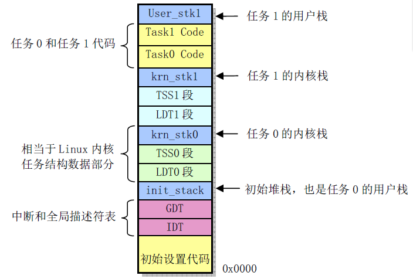
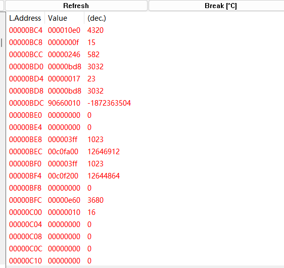
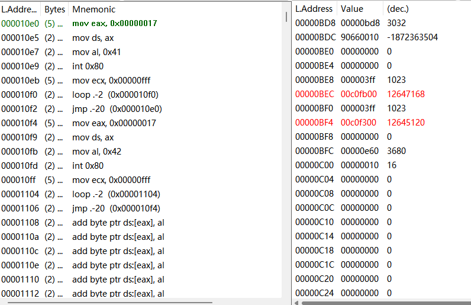
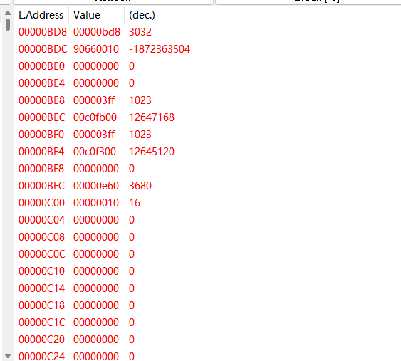
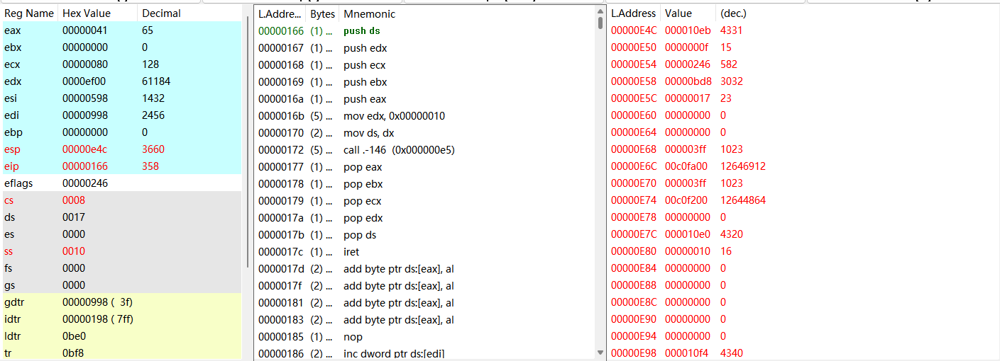

# Lab1-调试分析 Linux 0.00 引导程序

在计算机上电复位后，ROM BIOS 中的程序会把启动盘上第一个扇区加载到物理内存 0x7c00 处，这便是 boot.s 代码。这段代码的功能主要是先利用 int 0x13 磁盘中断将 head.s 代码读入到内存 0x10000 处，然后将这段代码移动到内存 0 处。最后设置控制寄存器 CR0 进入保护模式，用一句远转移`jmpi 0,8`，便跳转到了 head.s 执行。

## head.s 工作原理

head.s 主要做了下面这些事：

1. 初始化 GDT/IDT
2. 设置系统定时器芯片 8253
3. 初始化 TSS
4. 跳转到task0 的用户态程序
5. task0 或 task1 的用户态程序在运行时，通过系统调用 int 0x80 向屏幕上打印字符A 或B
6. 时钟中断发生时，内核的中断处理程序实现task0 和task1 的任务切换

### 初始化 GDT/IDT

设置 GDT/IDT 代码如下，调用了两个子程序`setup_gdt`和`setup_idt`：

```c
# setup base fields of descriptors.
    call setup_idt
    call setup_gdt
    movl $0x10,%eax		# reload all the segment registers
    mov %ax,%ds		# after changing gdt.
    mov %ax,%es
    mov %ax,%fs
    mov %ax,%gs
    lss init_stack,%esp
    
/****************************************/
setup_gdt:
	lgdt lgdt_opcode
	ret

setup_idt:
	lea ignore_int,%edx
	movl $0x00080000,%eax
	movw %dx,%ax		/* selector = 0x0008 = cs */
	movw $0x8E00,%dx	/* interrupt gate - dpl=0, present */
	lea idt,%edi
	mov $256,%ecx
```

### 设置系统定时器芯片

```c
	movb $0x36, %al
	movl $0x43, %edx		# 写端口
	outb %al, %dx
	movl $11930, %eax       # timer frequency 100 HZ
	movl $0x40, %edx		# 通道0的端口
	outb %al, %dx			# 分两次把初始计数值写入通道0
	movb %ah, %al
	outb %al, %dx
```

### 跳转到 task 0

这段代码便是 head.s 的核心，它的作用是设置任务0 的TSS 和LDT，然后在任务 0 下跳转到用户态程序。

```c
# Move to user mode (task 0)
	pushfl					 # 将EFLAGS压栈
	andl $0xffffbfff, (%esp) # EFLAGS 的NT 标志位（第14 位）置0
	popfl
	movl $TSS0_SEL, %eax	 # 把任务0的TSS段选择符加载到TR
	ltr %ax
	movl $LDT0_SEL, %eax	# 把任务0的LDT加载到LDTR
	lldt %ax
	movl $0, current		# 任务号
	sti
	pushl $0x17				# 数据段选择符
	pushl $init_stack		# 栈指针
	pushfl					# EFLAGS
	pushl $0x0f				# 代码段选择符
	pushl $task0			# task0程序入口
	iret
```

最后执行 iret 时，iret 会把栈顶弹出，更新CS 和 IP，然后把下一个栈顶弹出，更新EFLAGS，然后把下两个栈顶弹出，更新 SS 和ESP，此时便跳转到 task0 下执行。

### task0 代码

```c
task0:
	movl $0x17, %eax
	movw %ax, %ds
	movb $65, %al              /* print 'A' */
	int $0x80
	movl $0xfff, %ecx
1:	loop 1b
	jmp task0
```

task0 和 task1 代码唯一区别就是传入的字符不同。它们都使用 int 80 系统调用打印字符，然后进行 4095 次的空循环。

## head.s 内存分布

内存分布如图：



段长均为 0x03ff

## 57-62行

```c
	pushl $0x17				# 数据段选择符
	pushl $init_stack		# 栈指针
	pushfl					# EFLAGS
	pushl $0x0f				# 代码段选择符
	pushl $task0			# task0程序入口
	iret
```

其实就是为了跳转到 task0。

构造一个栈顶。iret 会把栈顶弹出，更新 CS 和 IP，然后把下一个栈顶弹出，更新 EFLAGS，然后把下两个栈顶弹出，更新
SS 和 ESP。

## 简述 `iret` 执行后， `pc` 如何找到下一条指令

当使用 iret 指令返回到相同保护级别的任务时，iret 会从堆栈弹出代码段选择子及指令指针分别到 CS 与 IP 寄存器，并弹出标志寄存器内容到 EFLAGS 寄存器。

当使用 iret 指令返回到一个不同的保护级别时，iret 不仅会从堆栈弹出以上内容，还会弹出堆栈段选择子及堆栈指针分别到SS与SP寄存器。

由于设置了 CS 和 IP 寄存器，PC 便找到了下一条指令。

## 记录 `iret` 执行前后，栈是如何变化的

之前：



栈顶 SS:ESP 指向 0x10:0x0BC4，之前往栈顶里压入的跳转目标地址 0x0F:0x10E0 和用户栈栈顶地址 0x17:0x0BD8。

之后：



SS:ESP 果然自动切换为了我们之前指定的用户栈栈顶 0x17:0x0BD8，而且现在 CS:EIP 跳转到了 0x0F:0x10E0 执行

## `int 0x80` 时，记录栈的变化情况

之前：



栈顶 SS:ESP 还是指向 0x17:0x0BD8，此时 CS:EIP=0x0F:0x10E9

之后：



SS:ESP 自动切换到了任务 0 内核栈 0x10:0x0E4C 处，并且 CS:EIP 跳转到了系统调用中断处理程序入口（标号system_interrupt）地址0x08:0x0166 处。并且原来的用户栈栈顶地址 0x17:0x0BD8 和中断返回地址 0x0F:0x10EB 被压到了内核栈栈顶。