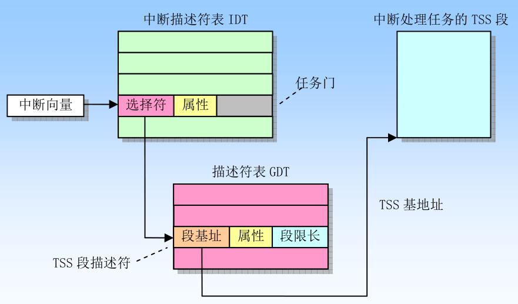

# Intel 白皮书阅读笔记

Intel白皮书指：[英特尔® 64 位和 IA-32 架构开发人员手册：卷 3A-英特尔® 官网](https://www.intel.cn/content/www/cn/zh/architecture-and-technology/64-ia-32-architectures-software-developer-vol-3a-part-1-manual.html)

## 一、x86系统架构概览

### 1. 系统级体系结构概览

IA-32 系统级架构是由寄存器、数据结构、指令组成的，这些指令支持系统级别的操作，比如内存管理、中断处理和任务管理等。如图是 IA-32 系统级架构的寄存器和相关数据结构的逻辑关系图：

这张图是本文的核心，我将逐一介绍图中的各部分。

#### 1.1 内存管理简介

虽然我们会在后文详细介绍保护模式的内存管理，但是为了理解上图，还是要了解一些基本概念。在保护模式下，80x86 使用**分段**和**分页**两种机制来进行内存管理。分段机制是把虚拟地址空间中的虚拟内存组织成一些长度可变的称为**段**的内存单元，完成虚拟地址到线性地址的转换，对应图中上半部分；而分页机制是把线性地址空间划分成页面，然后把这些线性地址空间页面映射到物理地址空间的页面上，完成线性地址到物理地址的转换，对应图中下半部分。地址转换过程如图：

#### 1.2 GDT、LDT、IDT、Gate

Global Descriptor Table 和 Local Descriptor Table 是上图的中心，这两者似乎是图左半部分和右半部分的枢纽，左半边所有的虚线（逻辑地址）均指向它们，他们又用实线（线性地址）指向右半边，那么它们的作用到底是什么呢？

先说说什么是逻辑地址，线性空间中的每个段都由三个参数定义：

1. 段基地址。段在线性地址空间中的开始地址
2. 段限长。即段的长度，虚拟地址空间中段内最大可用偏移位置
3. 段属性。指定段的特性，例如该段是否可读、可写、可作为一个程序执行、特权级。

段的这三个参数都存储在称为**段描述符**的结构项中。每个**逻辑地址**由 [段选择符，段偏移] 组成，为了将逻辑地址转换到线性地址，显然首先要用段选择符找到相应的段描述符，然后根据段描述符和段偏移得到线性地址。

而图中的 GDT 和 LDT 就是段描述符表。由此，我们便清晰明白了 GDT 和 LDT 的作用：实现**逻辑地址到线性地址的转换**。

那么，为什么要用两种段描述符呢？什么时候用 GDT，什么时候用 LDT 呢？

操作系统将虚拟地址空间分割为大小相等的两半，一半由 GDT 表来映射，另一半由 LDT 来映射。LDT 描述局部每个程序的段，包括其代码、数据、堆栈等；GDT 描述系统段，包括操作系统本身。当发生任务切换时，LDT 会更新为新任务的 LDT，而 GDT 并不会改变。

仔细查看上图，我们发现 GDT 和 LDT 之间的关系并不是平等的：GDT 中包含 LDT 的段描述符，这里就可以引出这两者的实现区别。整个系统中，GDT 显然只能有一张，所以我们只需要使用 GDTR 寄存器指向 GDT 的基地址，需要地址转换时根据 GDTR 中的地址和段选择符就可以定位 GDT 中的段描述符，GDT 表并不是一个段。

而每个任务的 LDT 是不同的， 所以 LDT 显然不应该只有一张，那么 LDT 的基地址怎么得到呢？做法是将 LDT 作为段来管理，并将 LDT 段的段描述符就存储在 GDT 中，LDTR 中保存段选择符。根据 GDT 表中的段描述符和 LDTR 中的段选择符就能定位到 LDT 中的段描述符。

这里可能有些绕，我们分别总结一下根据段选择符访问 GDT 和 LDT 得到对应段的段描述符过程。

访问 GDT：

1. 从 GDTR 中获得 GDT 基址
2. 根据段选择符得到 GDT 中的段描述符

访问 LDT：

1. 从 GDTR 中获得 GDT 基址
2. 从 LDTR 中获得 LDT 所在段的段选择符
3. 根据这个段选择符在 GDT 中的得到 LDT 所在段的段描述符，再根据 LDTR 得到 LDT 的基址
4. 根据段选择符得到 LDT 中的段描述符

如图所示：

我们再看系统概览图的左侧，发现有一个叫 Interrupt Descriptor Table 的东西，它将每个中断向量映射到对应的处理过程。和 GDT 类似，整个系统也只有一张，可以直接使用 IDTR 来定位 IDT 的位置，它也不是一个段。IDT 中的段描述符被称作**门描述符**，有三种类型：

- 中断门
- 陷阱门
- 任务门

当中断发生时，处理器得到响应的中断向量，根据中断向量和 IDTR 得到门描述符，再根据中断描述符查找 GDT 或 LDT，如果这是中断门或陷阱门，则会得到处理相应中断的**代码段**。

如果是任务门，则会得到指向一个一个中断处理任务的 TSS 的段描述符，进行任务切换，使用单独的任务来处理中断。如图：

TSS 段我们在下面介绍。

#### 1.3 TSS

TSS 的全称是 Task-state segment，是指在操作系统进程管理的过程中，任务（进程/线程）切换时保存任务线程信息的段。

软件或处理器可以使用以下方法之一来调度执行一个任务：

- 使用 CALL 指令明确调用一个任务
- 使用 JMP 指令明确跳转到一个任务
- 中断或异常

当调度一个任务执行时，指令中的选择符就是任务的 TSS 或者存放有 TSS 选择符的任务门，然后自动进行任务切换操作：将当前运行任务的上下文被保存到它的 TSS 中，并暂停该任务的执行；将新调度任务的上下文加载进处理器，处理器从加载的 IP 指向的指令处开始执行新任务。

### 2. 实模式和保护模式的转换

我以上讲解的内容都是保护模式下的机制。而 CPU复位（reset）或加电（power on）的时候都是以实模式启动的。什么是实模式呢？

早期 8086 CPU 有 20 位地址线，以及 8 个 16 位的通用寄存器和 4 个 16 位的段寄存器。为了能够通过这些 16 位的寄存器去构成 20 位的主存地址，它就采用内存分段方式来访存。当某个指令想要访问某个内存地址时，需要用（段基址：段偏移量）来表示，其中第一个字段是段基址，它的值是由**段寄存器**提供，第二字段是段内偏移量，代表要访问的这个内存地址距离这个段基址的偏移，它的值由通用寄存器提供，所以也是 16 位。最后的物理地址为：段基址 << 4 + 段偏移量，这样就实现了 20 位的访存。这些地址都是实实在在的物理地址。

在这个模式下，操作系统和用户程序属于同一特权级，没有区别对待，用户程序可以自由修改段基址，访问所有内存，这非常不安全，而且可访问内存也无法满足需求。再后来，处理器厂商为了满足不断增长的内存需求，研发出了 32 位的寄存器，于是就搞出了保护模式。

操作系统在加载后，会先把保护模式下使用的 IDT、GDT、TSS、LDT、页表等在内存中设置好，然后进行实模式到保护模式的切换。

切换的主要流程如下：

1. 屏蔽中断。在实模式下，中断由 BIOS 处理，进入保护模式后，中断将交给中断描述符表 IDT 里规定的代码处理，在刚进入保护模式时 IDTR 寄存器的初始值为0，一旦发生中断就将导致 CPU 发生异常，所以需要首先屏蔽中断
2. 初始化 GDT
3. 设置 CR0 寄存器的 PE 标志进入保护模式
4. 执行远跳转`jmp`指令，重置 CS 寄存器
5. 加载 LDTR 寄存器和 IDTR 寄存器
6. 开中断

### 3. 80x86系统指令寄存器

为了协助处理器执行初始化和控制系统操作，80x86 提供了一个标志寄存器 EFLAGS 和一些系统寄存器。

#### 3.1 标志寄存器

| 寄存器 | 作用                                                         |
| :----- | :----------------------------------------------------------- |
| TF     | 设置启用单步执行方式，在单步执行方式下，处理器会在每个指令执行之后产生一个调试异常。 |
| IOPL   | 指明当前运行程序或任务的 I/O 特权级。当前 CPL 必须小于等于这个 IOPL 才能访问 I/O 地址空间。 |
| NT     | 控制中断和调用的嵌套关系                                     |
| RF     | 控制处理器对断点指令的相应                                   |
| VM     | 设置该标志时，开启虚拟-8086方式；复位时则回到保护模式        |

#### 3.2 内存管理控制器

就是上文提到的 GDTR、LDTR、IDTR、TR，格式如下：

它们的作用不再赘述。

#### 3.3 控制寄存器

控制寄存器包括 CR0、CR1、CR2、CR3，用于控制和确定处理器的操作模式以及当前执行任务的特性。

CR0 部分重要的控制位：

| 标志位 | 作用                                                         |
| ------ | ------------------------------------------------------------ |
| PE     | 设置该位即开启保护模式                                       |
| PG     | 设置该位即开启分页机制                                       |
| WP     | 设置该位，则处理器金汁超级用户程序向用户级只读页面执行写操作 |
| NE     | 协处理器错误标志                                             |

CR3 含有存放页目录页面的物理地址，CR2 用于出现页异常时报告出错信息。

### 4. 系统指令

系统指令用于处理系统级功能，例如加载系统寄存器、管理中断等。部分常用系统指令：

## 二、保护模式的内存管理

本节详细讲解保护模式下的内存管理各项机制

### 1. 内存管理概览

如图展示保护模式下了逻辑地址、线性地址、物理地址之间的关系：

- 物理地址。保护模式中 80x86 提供了 4GB 的物理地址空间，这个从 0 到 0xFFFFFFFF 的连续的地址便是物理地址
- 线性地址。如果没有分页机制，那么线性地址就是物理地址，否则，线性地址根据页表得到物理地址
- 逻辑地址。为了多任务，分时调度，给程序独占内存的假象，这就有了逻辑地址。逻辑地址通过查段描述符表得到线性地址。

三者之间的转换可以概括为下图：

### 2. 分段机制

介绍三种分段模型

#### 2.1 Basic Flat Model

最简单的内存模型。建立两个段描述符：一个指向代码段，一个指向数据段。这两个段都被映射到整个线性地址空间。段限长直接设置为 4 GB，即使所访问的地址处并没有物理内存（如图中 Not Present 部分），处理器也不会产生“超出内存范围”异常

#### 2.2 Protected Flat Model

与 Basic Flat Model 类似，只不过段限长被设定为在实际物理内存范围内。如果试图访问实际内存范围外的地址，会产生一个通用保护异常

#### 2.3 Muti-Segment Model

充分利用了分段机制，提供了对代码段，数据段等硬件级的强制保护。每个进程都被分配了自己的段描述符和自己的段。进程可以完全独自拥有这些分配到的段，也可以与其他进程共享这些段。程序对段的访问由硬件控制。这种模型，不仅可以避免对段限长之外的地址进行寻址，还可以对不同的段进行分级保护。

### 3. 逻辑地址和线性地址的转换

#### 3.1 段选择符

段选择符是用来索引段描述符表中的段描述符，它有三个字段：

- 请求特权级 RPL，提供段保护信息
- 表请示标志 TI，指出包含指定段描述符的段描述符表 GDT 或 LDT
- 索引值，用来指出段描述表中的索引项号

另外，处理器不使用 GDT 表的第 1 项，即索引值为 0，TI 标志位 0 的选择符作为“空选择符”，当把空选择符加载到一个段寄存器中时，处理器并不产生异常。但是当使用空选择符去访问内存的时候，则会产生一个异常。空选择符可以用来初始化未使用的段寄存器。

#### 3.2 段寄存器

为减少地址转换时间和编程复杂性，处理器提供可存放最多 6 个段选择符的寄存器，即段寄存器。如图：

CS: 代码段，DS: 数据段，SS: 堆栈段，ES、FS、GS 为辅助数据段寄存器，可被用于让当前执行程序访问其他几个数据段。

为了避免每次访问内存都去引用描述符表，每个段寄存器都有 visible 部分和 hidden 部分。当一个段选择符被加载到 visible 部分时，处理器也同时把段选择符指向的段描述符中的段地址、段限长以及访问控制信息加载到 hidden 部分，这使得处理器可以在进行地址转换时不再花费时间从段描述符中读取基地址和长度。

加载段寄存器的指令：

- MOV、POP、LDS、LES、LSS、LGS、LFS，这些指令显式地直接引用段寄存器
- 如使用长指针地 CALL、JMP、RET指令，这些指令在操作过程中回改变 CS 寄存器的内容。

#### 3.3 段描述符

各字段意义：

| 字段  | 意义                                          |
| ----- | --------------------------------------------- |
| LIMIT | 段的长度                                      |
| BASE  | 段字节 0 在线性空间中的位置                   |
| TYPE  | 指定段或门的类型                              |
| S     | 指明是系统段描述符还是代码或数据段描述符      |
| DPL   | 指明描述符的特权级，从 0 到 3，0 级特权级最高 |
| P     | 指出段是否在内存中                            |
| D/B   | 用于指示一些操作数、地址的长度                |
| G     | 确定段限长字段 LIMIT 的长度                   |
| AVL   | 位 20 供系统软件使用，位 21 为保留位          |

### 4. 描述符的分类

描述符可分为两大类：系统段描述符和门描述符。

- 系统段描述符指向系统段，如 LDT，TSS 段
- 门描述符就是“门”，对于调用、中断或陷阱门，其中含有代码段的选择符和段中程序入口点的指针；对于任务门，其中含有 TSS 的段选择符。

类型由 TYPE 字段指定，如图：

## 三、中断和异常处理

本节详细讲解 x86 架构的中断和异常处理

### 1. 中断和异常处理概述

中断和异常是指明系统、处理器或当前执行程序的某处出现一个事件，该事件需要处理器进行处理。通常，这种事件会导致执行控制被强迫从当前运行程序转移到中断处理程序或异常处理程序中。处理器响应这种中断或异常所采取的行动被称为中断/异常服务。

当收到一个中断或检测到一个异常时，处理器会自动地把当前正在执行的程序或任务挂起，并开始运行中断或异常处理程序。当处理程序执行完毕，处理器就会恢复并继续执行被中断的程序或任务。

#### 1.1 中断向量

中断向量就是用来标识对应异常和中断条件的标识号。这个标识号是中断描述符表 IDT 中的一个索引号，定位一个异常或中断处理程序的入口点。

向量号范围是 0 到 255。其中 0 到 31 保留用作处理器定义的异常和中断，其它用于用户定义的中断。用户定义的中断通常用于外部 I/O 设备。

各向量号说明及产生源如下表所示：

#### 1.2 中断源和异常源

中断源：

- 外部硬件产生的中断
- 软件产生的中断

外部中断通过处理器芯片上的两个引脚（INTR 和 NMI）接收。当引脚 INTR 接收到外部发生的中断信号时，处理器就会从系统总线上读取外部中断控制器提供的中断向量号。当引脚 NMI 接收到信号时，会产生一个非屏蔽中断（使用固定的中断向量号 2）。

INT n 指令用于从软件中产生中断。例如，INT 0x80 指令会执行 Linux 系统调用中断。

异常源：

- 处理器检测到的程序错误异常
- 软件产生的异常

#### 1.3 异常的分类：故障、陷阱、中止

- 故障。当出现故障时，处理器会把机器状态恢复到产生故障的指令之前的状态。此时异常处理程序的返回地址会指向产生故障的指令。在返回后，产生故障的指令将被重新执行。
- 陷阱。陷阱处理程序的返回地址指向引起陷阱指令的随后一条指令，返回后会执行下一条指令。
- 中止。不允许导致该异常的程序重新继续执行。用于报告严重错误，例如硬件错误以及系统表中存在不一致性或非法值。

#### 1.4 开启和禁止中断

标志寄存器 EFLAGS 的中断允许标志 IF 能够禁止为处理器 INTR 引脚上收到的可屏蔽硬件中断提供服务。当 IF=0 时，处理器禁止发送到 INTR 引脚的中断；当 IF=1 时，则发送到 INTR 引脚的中断信号会被处理器进行处理。

#### 1.5 异常和中断的优先级

如果由多个异常或中断等待处理，处理器会按规定的次序对它们进行处理。优先级如图所示：

### 2. 中断描述符

中断描述符表 IDT 的结构如图所示：

IDT 不是一个段，可以驻留在线性地址空间的任何地方，用 IDTR 寄存器来定位 IDT 表的位置，然后根据中断向量定位到具体的门。

指令 LIDT 和 SIDT 分别用于保存和加载 IDTR 寄存器的内容。

- LIDT 指令把在内存中的限长值和基地址操作数加载到 IDTR 寄存器中。该指令仅能由当前特权级 CPL 是 0 的代码执行，通常在操作系统初始化代码中执行
- SIDT 指令将 IDTR 中的基地址和限长内容复制到内存中

IDT 表中有三种类型的门描述符：

- 中断门
- 陷阱门
- 任务门

如图所示：

中断门和陷阱门中含有段选择符和偏移，它指向一个代码段，处理器会把程序执行权转移到代码段中异常或中断的处理过程中。任务门中含有一个任务 TSS 段的选择符，该任务用于处理异常和中断。

### 3. 总结

> 中断过程调用的流程是怎样的？

处理器使用中断的向量作为 IDT 表中的索引，如果索引值指向中断门，则调用异常或中断处理程序，如果指向任务门，则进行任务切换，执行中断的处理任务

> 如果发生堆栈切换，处理器会做哪些操作？如果没切换，又会做哪些操作？

- 如果处理过程将在高特权级上执行就会发生堆栈切换。过程如下：

  - 处理器从当前执行任务的 TSS 段中得到中断或异常处理过程使用的堆栈的段选择符和栈指针。然后把它们压入新栈中

  - 把 EFLAGS，CS 和 EIP 寄存器的当前值也压入新栈中

  - 如果异常会产生一个错误号，那么该错误号也会被最后压入新栈中

- 如果处理过程将在被中断任务同一个特权级运行，则不发生堆栈切换

  - 把 EFLAGS，CS 和 EIP 寄存器的当前值保存在当前堆栈上
  - 如果异常会产生一个错误号，那么该错误号也会被最后压入新栈中

过程如图所示：

> 中断处理过程后，如何返回，处理器做了哪些操作？

使用 IRET 指令返回，IRET 指令与 RET 指令类似，还做了如下操作：

- 把保存的寄存器内容恢复到 EFLAGS 中，不过，只有当 CPL 是 0 时才会恢复 EFLAGS 中的 IOPL 字段，并且只有当 CPL <= IOPL 时，IF 标志才会被改变
- 如果调用时发生了堆栈切换，则返回时将堆栈切换回去

> 异常和中断处理过程的保护

处理不允许把控制转移到比 CPL 更低特权级代码段的处理过程中

> 异常和中断处理过程的标志使用方式

通过中断门访问一个异常或中断处理过程时，处理器会将 EFLAGS 寄存器的内容保存到堆栈上之后清除 EFLAGS 中的 TF 标志，来防止指令跟踪影响中断响应，IRET 指令再用堆栈上的内容恢复 TF 标志

> 中断门与陷阱门的唯一区别是什么？

唯一区别就是 TF 标志的处理，通过陷阱门访问处理程序不会影响 TF 标志

## 四、任务管理

### 1. 任务管理概述

任务是处理器可以分派、执行和暂停的工作单元。任务可以用于执行程序、任务或进程、操作系统服务实例程序、中断或异常处理程序，和内核或执行实例程序。

IA-32 架构提供了一种机制，该机制用于保存任务状态、分派任务执行以及从一个任务切换到另一个任务。在保护模式下运行时，处理器的所有执行动作都在任务中进行。即使是简单的系统，也必须至少定义一项任务。更复杂的系统可以使用处理器的任务管理工具来支持多任务应用程序的运行。

#### 1.1 任务的结构

一个任务由两部分构成：任务执行空间和任务状态段（Task-state segment）。任务执行空间包括代码段、堆栈段和一个或多个数据段。如果操作系统或执行程序使用了处理器的特权级别保护机制，那么任务执行空间还将为每个特权级别提供单独的堆栈。如图所示：

TSS 指定组成任务执行空间的段，并为任务状态信息提供存储的位置。在多任务系统中，TSS 还提供了一种链接任务的机制。

任务由其 TSS 的段选择器标识。当任务加载到处理器中执行时，TSS 的段选择器、基地址、限制和段描述符属性被加载到任务寄存器 TR 中。如果任务实现了分页，那么处理器将任务使用的页目录的基地址加载到控制寄存器CR3中。

#### 1.2 任务的状态

当前任务的状态由处理器中的以下所有内容组成：

- 所有通用寄存器和段寄存器信息
- 标志寄存器 EFLAGS、程序指针 EIP、控制寄存器 CR3、任务寄存器和 LDTR 寄存器
- 段寄存器指定的任务当前执行空间
- I/O 映射基地址和I/O 映射（在 TSS 中）
- 特权级 0、1 和 2 的堆栈的堆栈指针（在TSS 中）
- 链接至前一个任务的链指针（在TSS 中）

#### 1.3 任务的执行

软件或处理器可以通过以下方式之一来调度执行一个任务：

- 使用 CALL 指令明确地调用任务
- 使用 JMP 指令明确地显式跳转至任务。
- 处理器隐含地调用一个中断句柄处理任务
- 隐含地调用一个异常句柄处理任务

所有这些方法都使用指向任务门或 TSS 的段选择器来确定一个任务。当使用 CALL 或 JMP 指令调度任务时，指令中的选择器可以直接选用 TSS ，也可以选用保存 TSS 选择器的任务门。当处理器调度任务来处理中断或异常时，中断或异常的 IDT 表项必须包含一个任务门，该门用于保存中断或异常处理程序 TSS 的选择器。

当调度一个任务执行时，当前运行的任务和被分派的任务之间会发生任务切换。在任务切换期间，当前执行任务的执行环境（称为任务的状态或上下文）保存在其 TSS 中，该任务的执行被暂停。分派任务的上下文被加载到处理器中，然后处理器从新加载的 EIP 寄存器指向的指令开始执行被分派任务。如果自系统上次初始化以来，任务还没有被运行过，那么 EIP 将指向任务代码的第一条指令；否则，EIP 将指向任务上次激活时执行的最后一条指令之后的下一条指令。

如果当前执行的任务（调用者）调用正在被分派的任务（被调用者），那么调用者的 TSS 段选择器存储在被调用者的 TSS 中，以提供返回调用任务的链接。

中断或异常可以通过任务切换到中断或异常处理程序任务来处理。处理器执行任务切换以处理中断或异常，并在从中断处理程序任务或异常处理程序任务返回时自动切换回被中断的任务。该机制还可以处理中断任务期间发生的中断。

作为任务切换的一部分，处理器还可以切换到另一个 LDT，并允许每个任务对基于 LDT 的段具有不同的逻辑到物理地址映射。页目录基址寄存器 CR3 也会在任务切换时被重新加载，从而允许每个任务都有自己的一组页表。这些保护措施有助于隔离任务，并防止它们相互干扰。

### 2. 任务的数据结构

处理器定义了以下寄存器和数据结构来处理与任务相关的活动：

- 任务状态段 TSS
- TSS 描述符
- 任务寄存器 TR
- 任务门描述符
- EFLAGS 寄存器中的 NT 标志

在保护模式下运行时，必须为至少一个任务创建 TSS 和 TSS 描述符，并且必须使用 LTR 指令将 TSS 的段选择器加载到任务寄存器中。

#### 2.1 TSS

用于恢复一个任务执行的处理器状态信息被保存在 TSS 段中。各字段如图所示：

这些字段可以被分为两大类：

- 动态字段。当任务在任务切换期间挂起时，处理器更新动态字段的内容
  - 通用寄存器字段。用于保存 EAX、ECX、EDX、EBX、ESP、EBP、ESI 和 EDI 寄存器的内容
  - 段选择器字段。保存 ES、CS、SS、DS、FS 和 GS 寄存器的内容
  - EFLAGS 寄存器域。EFLAGS 寄存器在任务切换之前的状态
  - 指令指针 EIP 字段。任务切换之前 EIP 寄存器的状态
  - 先前任务链接字段。包含前一个任务 TSS 段选择器（在调用、中断或异常启动的任务切换时更新）。该字段允许使用 IRET 指令将任务切换回先前的任务
- 静态字段。在创建任务时设置，处理器在读取静态字段时通常不会修改它们
  - LDT 段选择器字段。包含任务的 LDT 的段选择器。
  - CR3 控制寄存器字段。包含任务要使用的页面目录的物理基地址。控制寄存器 CR3 也称为页目录基址寄存器 PDBR
  - 特权级为 0、1 和 2 的堆栈指针字段。这些堆栈指针由一个逻辑地址组成，该逻辑地址由堆栈段（SS0、SS1 和 SS2）的段选择器和堆栈中的偏移量（ESP0 、ESP1 和 ESP2）组成。请注意，这些字段中的值对于特定任务是静态的，但如果任务中发生了堆栈切换，SS 和 ESP 值将发生变化
  - 调试陷阱 T 标志字段。当设置该位时，T 标志会导致处理器在从其他任务切换到此任务时引发调试异常
  - I/O 映射基址字段。该字段包含从 TSS 基址到 I/O 许可位图和中断重定向位图的 16 位偏移量。如果存在，这些映射将存储在 TSS 中的更高地址处。 I/O 映射基地址指向 I/O 权限位图的开始和中断重定向位图的结束位置

#### 2.2 TSS 描述符

TSS 描述符只能放在 GDT 中，而不能放在 LDT 或 IDT 中。各字段如图：

- TYPE 中的忙标志 B 指示任务是否忙：一个忙的任务是指该任务当前正在运行或者被挂起。B的值如果为 1001B ，则表示该任务是一个非活动任务；B的值 1011B 则表示任务是忙的。由于任务不是递归的，处理器使用B标志来程序检测调用已被中断执行的任务的操作。为了确保只有一个B标志与任务相关联，每个 TSS 都应该只有一个指向它的 TSS 描述符。
- base、limit 和 DPL 字段以及 granularity 和 present 标志的功能类似于它们在数据段描述符中的作用。当 32 位 TSS 的 TSS 描述符中的 G 标志为 0 时，限制字段的值必须等于或大于 0x67H，这比 TSS 的规定最小尺寸小一个字节。如果尝试切换到 TSS 描述符限制小于 0x67H 的任务，则会生成无效 TSS 异常 (invalid-TSS exception, #TS)。如果包含 I/O 权限位图或操作系统存储额外数据，那么需要更大的限制。处理器不会在任务切换时检查大于 0x67H 的限制，但它会在访问 I/O 权限位图或中断重定向位图时检查该值。
- 任何可以访问 TSS 描述符的程序或过程（即，其 CPL 在数值上等于或小于 TSS 描述符的 DPL）都可以通过调用或跳转来分派任务。
- 在大多数系统中，TSS 描述符的 DPL 被设置为小于 3 的值。因此，只有特权级软件（privileged software）才能执行任务切换。但是，在多任务应用程序中，某些 TSS 描述符的 DPL 可能会设置为 3，以允许在应用程序（或用户）特权级别进行任务切换操作。

#### 2.3 任务寄存器

任务寄存器 TR 中存放着 16 位的段选择符以及当前任务 TSS 段的整个描述符。这些信息是从 GDT 中当前任务的 TSS 描述符中复制过来的。

#### 2.4 任务门描述符

任务门描述符提供对任务的间接、受保护的引用，可以放在 GDT、LDT 或 ID 中。任务门描述符中的 TSS 段选择器字段指向 GDT 中的 TSS 描述符。在这种段选择器中并没有使用 RPL。任务门描述符的 DPL 在任务切换期间控制对 TSS 描述符的访问。当程序或过程通过任务门调用或跳转到任务时，指向任务门的门选择器的 CPL 和 RPL 字段必须小于或等于任务门描述符的 DPL。值得注意的是，当使用任务门时，不会使用目标 TSS 描述符的 DPL。

### 3. 任务切换

处理器可使用以下 4 种方式之一执行任务切换：

- 当前任务对 GDT 中的 TSS 描述符执行 JMP 或 CALL 指令
- 当前任务对 GDT 或当前 LDT 中的任务门描述符执行 JMP 或 CALL 指令
- 中断或异常向量指向 IDT 中的任务门描述符
- 当前任务在设置 EFLAGS 寄存器中的 NT 标志时执行IRET。

JMP、CALL 和 IRET 指令以及中断和异常都是重定向程序的机制。 TSS 描述符或任务门的引用（调用或跳转到任务时）或 NT 标志的状态（执行 IRET 指令时）决定是否发生任务切换。

处理器在切换到新任务时，执行以下操作：

1. 从任务门或先前的任务链接字段（对于使用 IRET 指令启动的任务切换），获取新任务的 TSS 段选择器作为 JMP 或 CALL 指令的操作数。
2. 检查是否允许当前任务切换到新任务。数据访问权限规则适用于 JMP 和 CALL 指令。当前任务的 CPL 和新任务的段选择器的 RPL 必须小于或等于被引用的 TSS 描述符或任务门的 DPL。异常、中断（由 INT n 指令生成的中断除外）和 IRET 指令允许切换任务，而不管目标任务门或 TSS 描述符的 DPL。对于 INT n 指令产生的中断，需要检查 DPL。
3. 检查新任务的 TSS 描述符是否标记为存在（present）并且具有有效限制值（大于或等于 67H）。
4. 如果任务切换产生自 JMP 或 IRET 指令，处理器就会把当前任务 TSS 描述符中的忙标志 B 复位。
5. 如果任务切换自 IRET，则会把临时保存的 EFLAGS 中的 NT 复位。
6. 在当前任务的 TSS 中保存当前任务的状态。处理器在任务寄存器中找到当前 TSS 的基地址，然后将以下寄存器的状态复制到当前 TSS 中：所有通用寄存器，来自段寄存器的段选择器，EFLAGS 寄存器的临时保存映像和指令指针寄存器 EIP。
7. 如果任务切换是通过 CALL 指令、JMP 指令、异常或中断启动的，则处理器会在新任务的 TSS 描述符中设置 B 标志；如果使用 IRET 指令启动，则 B 标志保持设置状态。
8. 如果任务切换由CALL、JMP 指令或者异常或中断产生，处理器就会设置新任务 TSS 描述符中的忙标志B。如果任务切换由 IRET 产生，则不去改动 B 标志。
9. 将新任务的 TSS 的段选择器和描述符加载到任务寄存器中。设置 CR0 寄存器的 TS 标志。
10. 加载新任务的 TSS 状态。这包括 LDTR 寄存器、PDBR（控制寄存器 CR3）、EFLAGS 寄存器、EIP 寄存器、通用寄存器和段选择器。加载此状态期间的故障可能会破坏体系结构状态。
11. 开始执行新任务

### 4. 任务链

TSS 的前一个任务链接字段和 EFLAGS 寄存器中的 NT 标志用于将处理器的执行返回到前一个任务。 EFLAGS.NT = 1 表示当前执行的任务嵌套在另一个任务的执行中。

当 CALL 指令、中断或异常导致任务切换时：处理器将当前 TSS 的段选择符复制到新任务的 TSS 的前一个任务链接字段；然后设置 EFLAGS.NT = 1。如果软件使用 IRET 指令暂停新任务，处理器检查 EFLAGS.NT = 1；然后它使用上一个任务链接字段中的值返回到上一个任务。

当 JMP 指令导致任务切换时，新任务不会嵌套，也就是不会使用先前的任务链接字段且 EFLAGS.NT = 0。因此，当任务不需要嵌套时，使用 JMP 指令分派新任务。

此过程见下图：

下表总结了忙标志 B、NT 标志、前一任务链字段和 TS 标志的用法：

### 5. 任务地址空间

任务的地址空间由任务可以访问的段组成。这些段包括 TSS 中引用的代码、数据、堆栈和系统段以及任务代码访问的任何其他段。这些段被映射到处理器的线性地址空间，而线性地址空间又被映射到处理器的物理地址空间（直接或通过分页）。

TSS 中的 LDT 段字段可用于为每个任务提供其自己的 LDT。通过将与任务关联的所有段的段描述符放置在任务的 LDT 中，为任务提供自己的 LDT ，可以允许任务地址空间与其他任务隔离。

多个任务也可以使用相同的 LDT。这是一种内存高效的方式，允许特定任务相互通信或控制，而不会降低整个系统的保护屏障。

因为所有任务都可以访问 GDT，所以也可以创建可以通过 GDT 中的段描述符访问的共享段。

如果启用分页，则 TSS 中的 CR3 寄存器 PDBR 字段允许每个任务拥有自己的一组页表，用于将线性地址映射到物理地址。或者，多个任务可以共享同一组页表。

#### 5.1 把任务映射到线性和物理地址空间

可以通过以下两种方式之一将任务映射到线性地址空间和物理地址空间：

- 所有任务共享一个线性到物理地址空间映射。 未启用分页时，这是唯一的选择。在没有分页的情况下，所有线性地址都映射到相同的物理地址。当启用分页时，这种形式的线性到物理地址空间映射是通过对所有任务使用一个页面目录来获得的。如果支持请求分页的虚拟内存，那么线性地址空间可能会超过可用的物理空间。
- 每个任务都有自己的线性地址空间。 这种形式的映射是通过为每个任务使用不同的页面目录来完成的。因为PDBR（控制寄存器CR3）加载在任务开关上，每个任务可能有不同的页目录。

不同任务的线性地址空间可能映射到完全不同的物理地址。如果不同页目录的条目指向不同的页表，而页表又指向物理内存的不同页，那么任务不共享物理地址。

无论使用哪种映射任务线性地址空间的方法，所有任务的 TSS 都必须位于物理空间的共享区域中，所有任务都可以访问该区域。此映射是必需的，以便在任务切换期间，处理器在读取和更新 TSS 时，TSS 地址的映射不会更改。 GDT 映射的线性地址空间也应该映射到物理空间的共享区域；否则，GDT 的目的就落空了。下图展示了两个任务的线性地址空间如何通过共享页表在物理空间中重叠。

#### 5.2 任务逻辑地址空间

为了在任务之间共享数据，可使用下列方法之一来为数据段建立共享的逻辑到物理地址空间的映射：

- 通过使用 GDT 中的段描述符。所有任务都必须能够访问 GDT 中的段描述符。如果 GDT 中的某些段描述符指向线性地址空间中的段，这些段映射到所有任务共有的物理地址空间区域，那么所有任务都可以共享这些段中的数据和代码。
- 通过共享的 LDT。如果两个或多个任务的TSS 中的 LDT 字段指向同一个LDT，那么两个或多个任务可以使用同一个 LDT。如果共享 LDT 中的某些段描述符指向映射到物理地址空间公共区域的段，则这些段中的数据和代码可以在共享 LDT 的任务之间共享。这种共享方法比通过 GDT 共享更加值得选择，因为共享可以限于特定任务。系统中的其他任务可能有不同的 LDT，而这些 LDT 不允许它们访问共享段。
- 通过映射到线性地址空间公共地址区域的不同 LDT 中的段描述符。如果线性地址空间的这个公共区域映射到每个任务的物理地址空间的相同区域，这些段描述符允许任务共享段。这样的段描述符通常称为别名。这种共享方法比上面列出的方法更加值得选择，因为 LDT 中的其他段描述符可能指向不共享的独立线性地址。

## 五、参考

- [Linux plinux - Early Linux Kernel Analysis and Comments](http://oldlinux.org/)
