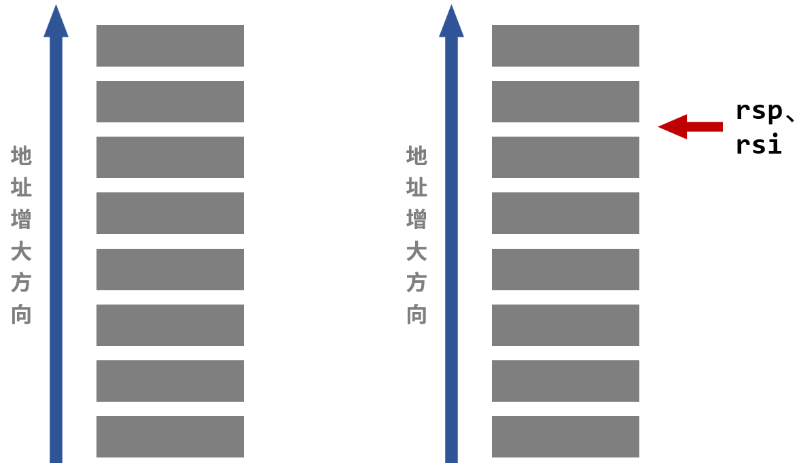
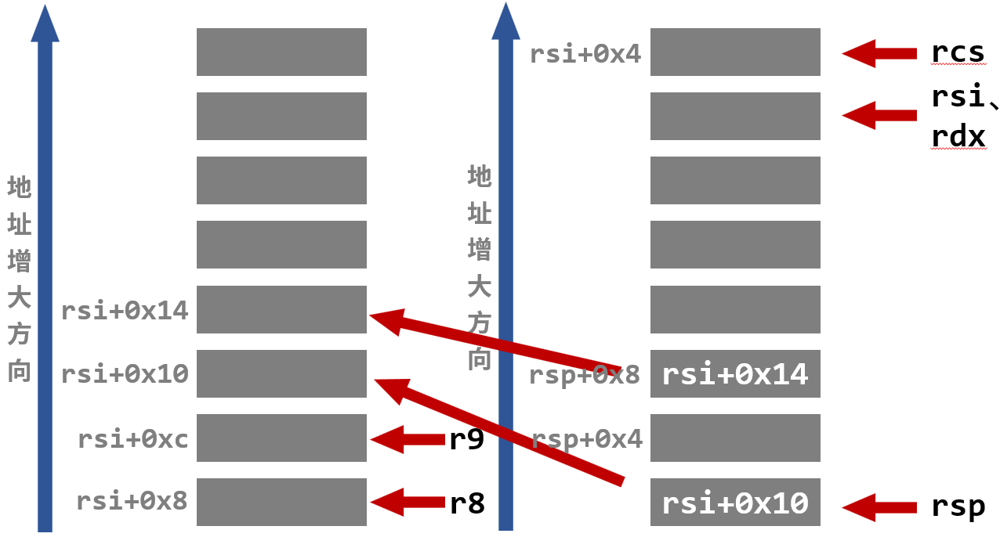
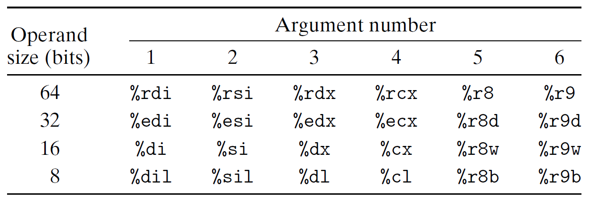
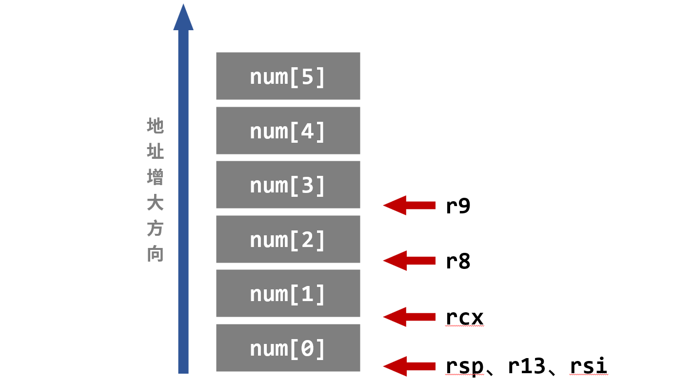
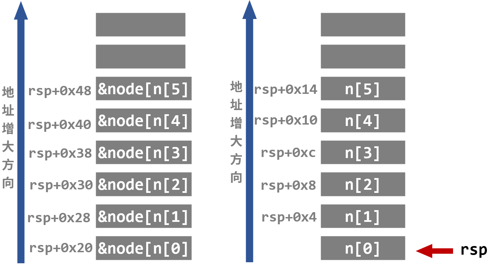
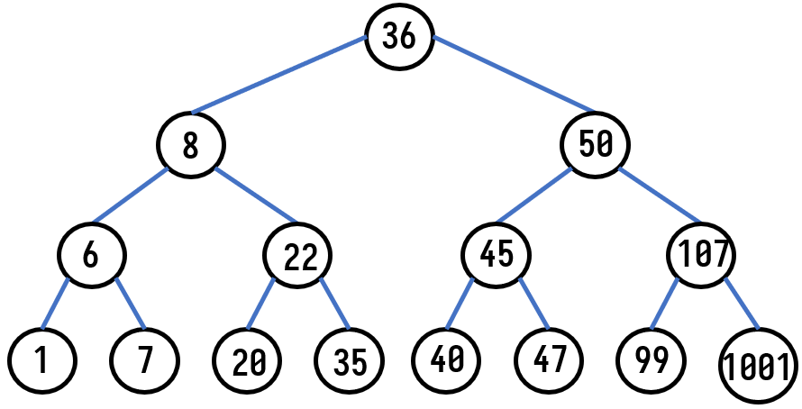

> GDB的全称是：GNU symbolic debugger。在做实验之前，了解常见的GDB命令是必不可少的。常见GDB命令请参见第一篇文章

# 实验概览

`BombLab`提供给我们的文件非常简单，只有一个编译不了的C文件`bomb.c`，和一个目标代码文件`bomb`。当运行`bomb`文件时，它会要求输入6个字符串，如果其中的任何一句是错的，炸弹就会“爆炸”。我们必须利用反汇编工具逆向分析这个文件，并找到这6个字符串，从而“拆除”炸弹。

**这个实验看起来就非常有趣！**

运行一下`bomb`文件：<!--more-->


提示我们输入内容，先随便输入试试！


**BOOM!** ，炸弹果然爆炸了！接下来就要进行紧张刺激的拆弹环节了。

# 实验过程

## `bomb.c`代码分析


每一个`phase`的结构都是相同的，这里仅以`phase_1`为例。

前两行将我们的输入传入`phase_1`函数中，如果函数能成功返回，则接下来调用`phase_defused`函数，从字面意思理解，此时炸弹就拆除成功了。

那么炸弹什么时候爆炸呢，当然就是函数无法返回的时候了，猜测`phase_1`会调用一个中断程序，直接退出了程序。

所以我们的任务就是分析每一个`phase_x`函数，使用正确的输入，使得函数能够成功返回。

## phase_1

### 反汇编 phase_1

使用`gdb`的`disassemble`命令反汇编`phase_1`

```assembly
Dump of assembler code for function phase_1:
   0x0000000000400ee0 <+0>:     sub    $0x8,%rsp
   0x0000000000400ee4 <+4>:     mov    $0x402400,%esi
   0x0000000000400ee9 <+9>:     callq  0x401338 <strings_not_equal>
   0x0000000000400eee <+14>:    test   %eax,%eax
   0x0000000000400ef0 <+16>:    je     0x400ef7 <phase_1+23>
   0x0000000000400ef2 <+18>:    callq  0x40143a <explode_bomb>
   0x0000000000400ef7 <+23>:    add    $0x8,%rsp
   0x0000000000400efb <+27>:    retq
End of assembler dump.
```

- 第2行，为函数分配栈帧
- 第3行，设置函数`strings_not_equal`传入参数
- 第4行，调用函数`strings_not_equal`，从字面意思理解，猜想如果传入字符串不同，则返回0
- 第5、6行，函数`strings_not_equal`的返回值储存在`%eax`中，判断其是否为0，若为0，则跳至第8行，函数返回，炸弹拆除成功；若不为0，则跳至第7行
- 第7行，调用`explode_bomb`函数，从字面意思理解，炸弹爆炸了。

于是，只需利用`x/s`指令查看`0x402400`位置对应内存存的字符串即可：


这句话就是`phase_1`了

### key

**Border relations with Canada have never been better.**


成功!

## phase_2

剩下部分的`phase`调用与`phase_1`都十分类似，直接反汇编即可

### 反汇编phase_2

全部代码暂不放出，后面分析时再贴上，方便查看

先看前几行

```assembly
   0x0000000000400efc <+0>:     push   %rbp
   0x0000000000400efd <+1>:     push   %rbx
   0x0000000000400efe <+2>:     sub    $0x28,%rsp
```

- 第1，2行，将**被调用者保存寄存器**的值入栈
- 第3行，分配栈帧

```assembly
   0x0000000000400f02 <+6>:     mov    %rsp,%rsi
   0x0000000000400f05 <+9>:     callq  0x40145c <read_six_numbers>
```

- 第5，6行，将栈顶指针`%rsp`传给`%rsi`，并作为参数调用函数`read_six_numbers`。从字面意思理解，本题是要我们输入6个数字。这里`mov    %rsp,%rsi`的目的是保存`caller`中栈顶的位置，方便在`read_six_numbers`中进行改值。我们不妨反汇编`read_six_numbers`

此时，栈的情况为：



#### 反汇编read_six_numbers

```assembly
Dump of assembler code for function read_six_numbers:
   0x000000000040145c <+0>:     sub    $0x18,%rsp
   0x0000000000401460 <+4>:     mov    %rsi,%rdx
   0x0000000000401463 <+7>:     lea    0x4(%rsi),%rcx
   0x0000000000401467 <+11>:    lea    0x14(%rsi),%rax
   0x000000000040146b <+15>:    mov    %rax,0x8(%rsp)
   0x0000000000401470 <+20>:    lea    0x10(%rsi),%rax
   0x0000000000401474 <+24>:    mov    %rax,(%rsp)
   0x0000000000401478 <+28>:    lea    0xc(%rsi),%r9
   0x000000000040147c <+32>:    lea    0x8(%rsi),%r8
   0x0000000000401480 <+36>:    mov    $0x4025c3,%esi
   0x0000000000401485 <+41>:    mov    $0x0,%eax
   0x000000000040148a <+46>:    callq  0x400bf0 <__isoc99_sscanf@plt>
   0x000000000040148f <+51>:    cmp    $0x5,%eax
   0x0000000000401492 <+54>:    jg     0x401499 <read_six_numbers+61>
   0x0000000000401494 <+56>:    callq  0x40143a <explode_bomb>
   0x0000000000401499 <+61>:    add    $0x18,%rsp
   0x000000000040149d <+65>:    retq
End of assembler dump.
```

截至第10行，寄存器及栈存储内容的指向如图所示：



在这个函数中，要做到传6个参数，用来存储6个输入的数字。很明显，这里传入了6个指针，其中4个存在寄存器上，另外2个存在栈上。由于`phase_2`函数中的栈指针`rsp`与这个函数中的`rsi`相等，所以把所有参数存在`rsi`之前的位置的目的是在返回`phase_2`函数后，能够直接利用`phase_2`函数的栈指针来连续地访问这6个数字。

>注意到`M[%rsp+0x4]`没有用来传参数，这是为什么呢？
>
>因为通过栈传递参数时，所有的数据大小都向8的倍数对齐。

下面的问题就是如何确定这6个数字的先后位置，传递参数的寄存器使用顺序如下：



所以，我们应该输入的6个数字所在的位置就分别是：`R[%rsp]` `R[%rsp+0x8]` `%rsi`  `%rsi+0x4` `%rsi+0x8` `%rsi+0xc` 

返回`phase_2`函数后，利用栈顶指针调用就是： `%rsp`  `%rsp+0x4` `%rsp+0x8` `%rsp+0xc`  `%rsp+0x10` `%rsp+0x14`

#### 回到 phase_2

```assembly
Dump of assembler code for function phase_2:
   0x0000000000400efc <+0>:     push   %rbp
   0x0000000000400efd <+1>:     push   %rbx
   0x0000000000400efe <+2>:     sub    $0x28,%rsp
   0x0000000000400f02 <+6>:     mov    %rsp,%rsi
   0x0000000000400f05 <+9>:     callq  0x40145c <read_six_numbers>
   0x0000000000400f0a <+14>:    cmpl   $0x1,(%rsp)
   0x0000000000400f0e <+18>:    je     0x400f30 <phase_2+52>
   0x0000000000400f10 <+20>:    callq  0x40143a <explode_bomb>
   0x0000000000400f15 <+25>:    jmp    0x400f30 <phase_2+52>
   0x0000000000400f17 <+27>:    mov    -0x4(%rbx),%eax
   0x0000000000400f1a <+30>:    add    %eax,%eax
   0x0000000000400f1c <+32>:    cmp    %eax,(%rbx)
   0x0000000000400f1e <+34>:    je     0x400f25 <phase_2+41>
   0x0000000000400f20 <+36>:    callq  0x40143a <explode_bomb>
   0x0000000000400f25 <+41>:    add    $0x4,%rbx
   0x0000000000400f29 <+45>:    cmp    %rbp,%rbx
   0x0000000000400f2c <+48>:    jne    0x400f17 <phase_2+27>
   0x0000000000400f2e <+50>:    jmp    0x400f3c <phase_2+64>
   0x0000000000400f30 <+52>:    lea    0x4(%rsp),%rbx
   0x0000000000400f35 <+57>:    lea    0x18(%rsp),%rbp
   0x0000000000400f3a <+62>:    jmp    0x400f17 <phase_2+27>
   0x0000000000400f3c <+64>:    add    $0x28,%rsp
   0x0000000000400f40 <+68>:    pop    %rbx
   0x0000000000400f41 <+69>:    pop    %rbp
   0x0000000000400f42 <+70>:    retq
End of assembler dump.
```

- 第7，8，9行，比较`(%rsp)`与1是否相等，不相等则引爆。可知第一个数为 1
- 看第20行，第2个数存在`0x(%rsp)`中，设为`num_2`，则`(%rbx)=num_2`。跳到第11行，这一行将第一个数赋值给`%eax`，12，13行是将其翻倍再进行同样的比较。可知第二个数为2
- 跳到第16行，得到了第三个数的地址，第17行把我迷惑了很久，`rbp`和`rbx`肯定是不相等的，不知道这样设置的意义。继续跳到第17行，进入循环。
- 这里循环的规律是，每个数都要与上一个数的2倍相等，从而可以得到剩下的4个数分别为：4，8，16，32

### key

**1 2 4 8 16 32**


成功！

## phase_3

### 反汇编 phase_3

```assembly
Dump of assembler code for function phase_3:
   0x0000000000400f43 <+0>:     sub    $0x18,%rsp
   0x0000000000400f47 <+4>:     lea    0xc(%rsp),%rcx
   0x0000000000400f4c <+9>:     lea    0x8(%rsp),%rdx
   0x0000000000400f51 <+14>:    mov    $0x4025cf,%esi
   0x0000000000400f56 <+19>:    mov    $0x0,%eax
   0x0000000000400f5b <+24>:    callq  0x400bf0 <__isoc99_sscanf@plt>
   0x0000000000400f60 <+29>:    cmp    $0x1,%eax
   0x0000000000400f63 <+32>:    jg     0x400f6a <phase_3+39>
   0x0000000000400f65 <+34>:    callq  0x40143a <explode_bomb>
   0x0000000000400f6a <+39>:    cmpl   $0x7,0x8(%rsp)
   0x0000000000400f6f <+44>:    ja     0x400fad <phase_3+106>
   0x0000000000400f71 <+46>:    mov    0x8(%rsp),%eax
   0x0000000000400f75 <+50>:    jmpq   *0x402470(,%rax,8)
   0x0000000000400f7c <+57>:    mov    $0xcf,%eax
   0x0000000000400f81 <+62>:    jmp    0x400fbe <phase_3+123>
   0x0000000000400f83 <+64>:    mov    $0x2c3,%eax
   0x0000000000400f88 <+69>:    jmp    0x400fbe <phase_3+123>
   0x0000000000400f8a <+71>:    mov    $0x100,%eax
   0x0000000000400f8f <+76>:    jmp    0x400fbe <phase_3+123>
   0x0000000000400f91 <+78>:    mov    $0x185,%eax
   0x0000000000400f96 <+83>:    jmp    0x400fbe <phase_3+123>
   0x0000000000400f98 <+85>:    mov    $0xce,%eax
   0x0000000000400f9d <+90>:    jmp    0x400fbe <phase_3+123>
   0x0000000000400f9f <+92>:    mov    $0x2aa,%eax
   0x0000000000400fa4 <+97>:    jmp    0x400fbe <phase_3+123>
   0x0000000000400fa6 <+99>:    mov    $0x147,%eax
   0x0000000000400fab <+104>:   jmp    0x400fbe <phase_3+123>
   0x0000000000400fad <+106>:   callq  0x40143a <explode_bomb>
   0x0000000000400fb2 <+111>:   mov    $0x0,%eax
   0x0000000000400fb7 <+116>:   jmp    0x400fbe <phase_3+123>
   0x0000000000400fb9 <+118>:   mov    $0x137,%eax
   0x0000000000400fbe <+123>:   cmp    0xc(%rsp),%eax
   0x0000000000400fc2 <+127>:   je     0x400fc9 <phase_3+134>
   0x0000000000400fc4 <+129>:   callq  0x40143a <explode_bomb>
   0x0000000000400fc9 <+134>:   add    $0x18,%rsp
   0x0000000000400fcd <+138>:   retq
End of assembler dump.
```

这道题与上道题非常类似。

- 首先看第5行，查看`0x4025cf`位置的内容。可以知道，要求传入2个数字


- 由上道题的启法，第2，3，4行就指明了两个数字的位置分别在栈空间`%rsp+0x8`和`%rsp+0xc`。
- 第8，9，10行属于程序健壮性的考虑，判断是否输入了两个数字，否则直接引爆
- 第11，12行，说明了第一个数字应该小于等于7
- 第14行，要求跳到内存`0x402470(,%rax,8)`里面存的位置。`rax`指向的内存此时存的就是第1个数，我们只知道这个数时小于等于7的，这里随便假设其为 1 试试！那么接下来就要跳到内存`0x402478`中的地址
- 查看内存`0x402478`中的内容：


- 所以，下面就跳到`0x0000000000400fb9`对应代码，也就是第32行，结合第33行知，第二个数字为$7+3\times 16+1\times 16^2=311$，于是得到**key**: 1 311


发现成功了！

- 再试试设第1个数为2，则接下来跳转到`0x0000000000400f83`，即第17行，则第2个数为707。于是得到**key**: 2 707, 同样成功了！

### key

`phase_3`的含金量远远不如不如`phase_2`，可能是为了让我们在拆弹中途轻松一下。

这道题的亮点在于其开放性，第一个数可以取0到7中的任意一个，根据第一个数的情况来确定第二个数，所以最后能够通过的答案有8组，不一一列举了。

## phase_4

### 反汇编 phase_4

```assembly
Dump of assembler code for function phase_4:
   0x000000000040100c <+0>:     sub    $0x18,%rsp
   0x0000000000401010 <+4>:     lea    0xc(%rsp),%rcx
   0x0000000000401015 <+9>:     lea    0x8(%rsp),%rdx
   0x000000000040101a <+14>:    mov    $0x4025cf,%esi
   0x000000000040101f <+19>:    mov    $0x0,%eax
   0x0000000000401024 <+24>:    callq  0x400bf0 <__isoc99_sscanf@plt>
   0x0000000000401029 <+29>:    cmp    $0x2,%eax
   0x000000000040102c <+32>:    jne    0x401035 <phase_4+41>
   0x000000000040102e <+34>:    cmpl   $0xe,0x8(%rsp)
   0x0000000000401033 <+39>:    jbe    0x40103a <phase_4+46>
   0x0000000000401035 <+41>:    callq  0x40143a <explode_bomb>
   0x000000000040103a <+46>:    mov    $0xe,%edx
   0x000000000040103f <+51>:    mov    $0x0,%esi
   0x0000000000401044 <+56>:    mov    0x8(%rsp),%edi
   0x0000000000401048 <+60>:    callq  0x400fce <func4>
   0x000000000040104d <+65>:    test   %eax,%eax
   0x000000000040104f <+67>:    jne    0x401058 <phase_4+76>
   0x0000000000401051 <+69>:    cmpl   $0x0,0xc(%rsp)
   0x0000000000401056 <+74>:    je     0x40105d <phase_4+81>
   0x0000000000401058 <+76>:    callq  0x40143a <explode_bomb>
   0x000000000040105d <+81>:    add    $0x18,%rsp
   0x0000000000401061 <+85>:    retq
End of assembler dump.
```

- 这道题代码风格与前两题也非常相似，查看第5行知，依旧是读入两个数字，设第一个数字为`num1`，第二个数字为`num2`。其中`num1`存在`(%rsp+0x8)`中，`num2`存在`(%rsp+0xc)`中。
- 第10，11行，若$num1 \leq 14$，则继续，否则爆炸
- 第13，14，15，16行，分别设置参数`(%edx) = 0xe`，`(%esi) = 0x0`，`(%edi) = num1`之后调用函数`func4`
- 第17行，要看到调用完`func4`函数后，`func4`的返回值存在`%eax`中，只有`(%eax)=0`也就是`func4`的返回值为0，才能拆除炸弹。
- 第19行，只有`(%rsp+0xc)=0`才能拆除炸弹，因此`num2 = 0`

#### 反汇编func4

```assembly
Dump of assembler code for function func4:
   0x0000000000400fce <+0>:     sub    $0x8,%rsp
   0x0000000000400fd2 <+4>:     mov    %edx,%eax
   0x0000000000400fd4 <+6>:     sub    %esi,%eax
   0x0000000000400fd6 <+8>:     mov    %eax,%ecx
   0x0000000000400fd8 <+10>:    shr    $0x1f,%ecx
   0x0000000000400fdb <+13>:    add    %ecx,%eax
   0x0000000000400fdd <+15>:    sar    %eax
   0x0000000000400fdf <+17>:    lea    (%rax,%rsi,1),%ecx
   0x0000000000400fe2 <+20>:    cmp    %edi,%ecx
   0x0000000000400fe4 <+22>:    jle    0x400ff2 <func4+36>
   0x0000000000400fe6 <+24>:    lea    -0x1(%rcx),%edx
   0x0000000000400fe9 <+27>:    callq  0x400fce <func4>
   0x0000000000400fee <+32>:    add    %eax,%eax
   0x0000000000400ff0 <+34>:    jmp    0x401007 <func4+57>
   0x0000000000400ff2 <+36>:    mov    $0x0,%eax
   0x0000000000400ff7 <+41>:    cmp    %edi,%ecx
   0x0000000000400ff9 <+43>:    jge    0x401007 <func4+57>
   0x0000000000400ffb <+45>:    lea    0x1(%rcx),%esi
   0x0000000000400ffe <+48>:    callq  0x400fce <func4>
   0x0000000000401003 <+53>:    lea    0x1(%rax,%rax,1),%eax
   0x0000000000401007 <+57>:    add    $0x8,%rsp
   0x000000000040100b <+61>:    retq
End of assembler dump.
```

这是一个递归调用的函数，我们写出它的C语言代码：

```c
int func4 ( int edi, int esi, int edx )//初始值:edi=num1,esi=0x0,edx=0xe
{// 返回值为eax
	eax = edx - esi;  //3、4行
    eax = (eax + (eax >> 31)) >> 1;  //5-8行
    ecx = eax + exi;  //9行
	if(edi < ecx) 
		return 	2 * func4(edi, esi, edx - 1); //14行
	else if (edi > ecx)
		return 	2 * func4(edi, esi + 1, edx) + 1; //21行
	else
		return	0;
}
```

根据3，4，5行，容易求得`eax=0x7`，要进入返回0的分区，则`edi=eax=0x7`，所以`num1=7`

### key

7 0


成功！

## phase_5

### 反汇编phase_5

这里不将全部代码放出，我们分块分析

#### Part 1

```assembly
   0x0000000000401062 <+0>:     push   %rbx
   0x0000000000401063 <+1>:     sub    $0x20,%rsp
   0x0000000000401067 <+5>:     mov    %rdi,%rbx
   0x000000000040106a <+8>:     mov    %fs:0x28,%rax
   0x0000000000401073 <+17>:    mov    %rax,0x18(%rsp)
   0x0000000000401078 <+22>:    xor    %eax,%eax
   0x000000000040107a <+24>:    callq  0x40131b <string_length>
   0x000000000040107f <+29>:    cmp    $0x6,%eax
   0x0000000000401082 <+32>:    je     0x4010d2 <phase_5+112>
   0x0000000000401084 <+34>:    callq  0x40143a <explode_bomb>
```

- 第3行，`%rdi`是用来传递参数的第一个寄存器，猜测此时我们输入的字符串就存在`(%rdi)`中，该行将其值赋给了`%rbx`
- 第4，5行，把`fs`段偏移`0x28`的一个数据储存到`%rsp+0x18`处，这是为了防止缓存区溢出。
- 第6行，自己与自己异或，清零。
- 第7-10行，比较我们输入的字符串长度是否为6，否则爆炸。说明此题要求输入一个长度为6的字符串。接下来跳到`0x4010d2`处的代码

```assembly
   0x00000000004010d2 <+112>:   mov    $0x0,%eax
   0x00000000004010d7 <+117>:   jmp    0x40108b <phase_5+41>
```

- 清空`(%eax)`后跳至`d7`处，接下来作为`part2`部分讲解

#### Part 2

```assembly
   0x000000000040108b <+41>:    movzbl (%rbx,%rax,1),%ecx
   0x000000000040108f <+45>:    mov    %cl,(%rsp)
   0x0000000000401092 <+48>:    mov    (%rsp),%rdx
   0x0000000000401096 <+52>:    and    $0xf,%edx
   0x0000000000401099 <+55>:    movzbl 0x4024b0(%rdx),%edx
   0x00000000004010a0 <+62>:    mov    %dl,0x10(%rsp,%rax,1)
   0x00000000004010a4 <+66>:    add    $0x1,%rax
   0x00000000004010a8 <+70>:    cmp    $0x6,%rax
   0x00000000004010ac <+74>:    jne    0x40108b <phase_5+41>
```

这段代码是一个循环

- `(%eax)`在跳转前已经被清空了，从第7，8两行可以看出，`(%rax)`是计数变量，在每次循环后+1，直到等于6时跳出循环。
- 先看第一轮循环。第1行，`%rbx`中存放着我们输入的字符串的地址，此时`(%rax)=0x0`，因此`%ecx`就存放着字符串的第一个字符，设六个字符分别为`ch[0]`,`ch[1]`,`ch[2]`,`ch[3]`,`ch[4]`,`ch[5]`，则每轮循环到这里，`(%ecx)=ch[(%rax)]`
- 第3-4行，`%cl`是`%ecx`的低八位，一直到第4行，与操作的目的就是只取`(%ecx)`的最低四位
- 第5行，这里给了一个内存地址，我们先查看一下：


得到字符串：

`maduiersnfotvbylSo you think you can stop the bomb with ctrl-c, do you?`

- 第5行是将`%edx`的值修改为`0x4024b0(%rdx)`位置的字符。换句话说，`(%rdx)`在这里起到了索引的作用，比如`(%rdx)=0x1`，就是将`a`字符传给`%edx`

- 后面是将上一句的得到的字符传入栈中保存，`(%rax)`同样作为栈的索引，第一个字符就储存在`(%rsp+0x10)`

我尝试写出这段循环的伪代码：

```c
string s = "maduiersnfotvbyl"
for(int rax = 0; rax < 6; rax++)
{
	ecx = ch[rax];     //取输入字符串的第rax个字符
    edx = ecx & 0xf;   //取第rax个字符ASCII码的最低四位
    edx = s[edx];	   //取给定内存中字符串的第edx个字符
	rsp[16+rax] = edx; //edx -> 栈
}
```

- 退出循环时，栈上从`(%rsp+0x10)`开始按顺序存储着6个索引到的字符

- 循环结束后的代码作为`Part 3`讲解

#### Part 3

```assembly
   0x00000000004010ae <+76>:    movb   $0x0,0x16(%rsp)
   0x00000000004010b3 <+81>:    mov    $0x40245e,%esi
   0x00000000004010b8 <+86>:    lea    0x10(%rsp),%rdi
   0x00000000004010bd <+91>:    callq  0x401338 <strings_not_equal>
   0x00000000004010c2 <+96>:    test   %eax,%eax
   0x00000000004010c4 <+98>:    je     0x4010d9 <phase_5+119>
   0x00000000004010c6 <+100>:   callq  0x40143a <explode_bomb>
   0x00000000004010cb <+105>:   nopl   0x0(%rax,%rax,1)
   0x00000000004010d0 <+110>:   jmp    0x4010d9 <phase_5+119>
   0x00000000004010d2 <+112>:   mov    $0x0,%eax
   0x00000000004010d7 <+117>:   jmp    0x40108b <phase_5+41>
   0x00000000004010d9 <+119>:   mov    0x18(%rsp),%rax
   0x00000000004010de <+124>:   xor    %fs:0x28,%rax
   0x00000000004010e7 <+133>:   je     0x4010ee <phase_5+140>
   0x00000000004010e9 <+135>:   callq  0x400b30 <__stack_chk_fail@plt>
   0x00000000004010ee <+140>:   add    $0x20,%rsp
   0x00000000004010f2 <+144>:   pop    %rbx
   0x00000000004010f3 <+145>:   retq
```

- 第2行，查看`0x40245e`位置内存的内容


- 接下来就是调用`strings_not_equal`函数，判断栈上的六个字符与这6个字符是否相等。操作与`phase_1`相同。
- 做到这里，离胜利只差一步之遥。

### key

**先捋一捋思路：**由`part3`可知，最后返回的字符应该是`flyers`。而这6个字符是怎么得来的呢？由`part2`，是通过取我们输入六个字符的`ASCII`码的低四位作为索引值，查找`maduiersnfotvbyl`里的字符组成的。

`maduiersnfotvbyl`中`f`为第9位，`l`为第15位，`y`第14位，`e`第5位，`r`第6位，`s`第7位

也就是说，我们需要输入6个字符，使它们`ASCII`码低四位分别是：`1001`, `1111`, `1110`, `0101`, `0110`, `0111`

由`a`的`ASCII`码为`01100001`，即可定位到6个字符分别为：ionuvw


成功！

由于只限制了`ASCII`的低4位，所以本题的答案也不止一个，不再一一列举了。

## phase_6

### 反汇编phase_6

`phase_6`的代码非常长，这里将代码分成6块分别分析

#### Part 1

```assembly
   0x00000000004010f4 <+0>:     push   %r14
   0x00000000004010f6 <+2>:     push   %r13
   0x00000000004010f8 <+4>:     push   %r12
   0x00000000004010fa <+6>:     push   %rbp
   0x00000000004010fb <+7>:     push   %rbx
   0x00000000004010fc <+8>:     sub    $0x50,%rsp
   0x0000000000401100 <+12>:    mov    %rsp,%r13
   0x0000000000401103 <+15>:    mov    %rsp,%rsi
   0x0000000000401106 <+18>:    callq  0x40145c <read_six_numbers>
```

- 前几行是保存参数，分配栈帧
- 看到`read_six_numbers`，有没有很眼熟的感觉？我们在`phase_2`中已经详细分析并画了图。这个函数调用的结果是调用者的栈上按顺序存储输入的6个数

返回后，栈及指针情况为：



#### Part 2

```assembly
   0x000000000040110b <+23>:    mov    %rsp,%r14
   0x000000000040110e <+26>:    mov    $0x0,%r12d
   0x0000000000401114 <+32>:    mov    %r13,%rbp
   0x0000000000401117 <+35>:    mov    0x0(%r13),%eax
   0x000000000040111b <+39>:    sub    $0x1,%eax
   0x000000000040111e <+42>:    cmp    $0x5,%eax
   0x0000000000401121 <+45>:    jbe    0x401128 <phase_6+52>
   0x0000000000401123 <+47>:    callq  0x40143a <explode_bomb>
   0x0000000000401128 <+52>:    add    $0x1,%r12d
   0x000000000040112c <+56>:    cmp    $0x6,%r12d
   0x0000000000401130 <+60>:    je     0x401153 <phase_6+95>
   0x0000000000401132 <+62>:    mov    %r12d,%ebx
   0x0000000000401135 <+65>:    movslq %ebx,%rax
   0x0000000000401138 <+68>:    mov    (%rsp,%rax,4),%eax
   0x000000000040113b <+71>:    cmp    %eax,0x0(%rbp)
   0x000000000040113e <+74>:    jne    0x401145 <phase_6+81>
   0x0000000000401140 <+76>:    callq  0x40143a <explode_bomb>
   0x0000000000401145 <+81>:    add    $0x1,%ebx
   0x0000000000401148 <+84>:    cmp    $0x5,%ebx
   0x000000000040114b <+87>:    jle    0x401135 <phase_6+65>
   0x000000000040114d <+89>:    add    $0x4,%r13
   0x0000000000401151 <+93>:    jmp    0x401114 <phase_6+32>
```

- 第5，6，7行，`(%eax)=num[0]`，由$num[0]-1\le 5$ 知`num[0]`不大于6
- 先看21，22行，意识到这里有一个大循环，每次将`(%r13)`加4，之后回到第3行，`(%r13)`赋给了`(%eax)`，这时，`(%eax)=num[1]`；再有后面的判断知，对任意`i`，都有`num[i]`不大于6
- 9，10，11，12行给出了退出大循环的条件，就是6个数字全部遍历到
- 注意18，19，20行，这里又有一个循环，是为了判断数组元素是否相等

写出`Part 2`的C语言代码如下

```c
//为了简化代码，将指针转化为数组索引
r14 = 0;
r13 = 0;
r12d = 0;
while(1){			//第3行
	rbp = r13;
	if(num[r13] - 1 > 5)	//第4,5,6行
		goto bomb;
	r12d++;			
	if(r12d == 6)	//第10行
		break;
	for(ebx = r12d; ebx <= 5; ebx++){	//第14行
		if(num[ebx] == num[rbp])		//第13,14,15行
			goto bomb;
	}
	r13++;
}
```

- 可见，这部分代码给输入数字提了两个要求：
  - 每个数字不大于6
  - 数字互不相同

#### Part 3

```assembly
   0x0000000000401153 <+95>:    lea    0x18(%rsp),%rsi
   0x0000000000401158 <+100>:   mov    %r14,%rax
   0x000000000040115b <+103>:   mov    $0x7,%ecx
   0x0000000000401160 <+108>:   mov    %ecx,%edx
   0x0000000000401162 <+110>:   sub    (%rax),%edx
   0x0000000000401164 <+112>:   mov    %edx,(%rax)
   0x0000000000401166 <+114>:   add    $0x4,%rax
   0x000000000040116a <+118>:   cmp    %rsi,%rax
   0x000000000040116d <+121>:   jne    0x401160 <phase_6+108>
```

这又是一段循环，但是比`Part 2`简单得多。话不多说，直接写出C语言代码

```c
rsi = 7;
for(rax = 0; rax != rsi; rax++)
{
	num[rax] = 7 - num[rax];
}
```

也就是对输入的数字进行了一波简单变换。为了方便描述，假设变换后的数字为`n[i]`。易知，`n[0]`-`n[5]`是数字1-6的一个组合。

#### Part 4

```assembly
   0x000000000040116f <+123>:   mov    $0x0,%esi
   0x0000000000401174 <+128>:   jmp    0x401197 <phase_6+163>
   0x0000000000401176 <+130>:   mov    0x8(%rdx),%rdx
   0x000000000040117a <+134>:   add    $0x1,%eax
   0x000000000040117d <+137>:   cmp    %ecx,%eax
   0x000000000040117f <+139>:   jne    0x401176 <phase_6+130>
   0x0000000000401181 <+141>:   jmp    0x401188 <phase_6+148>
   0x0000000000401183 <+143>:   mov    $0x6032d0,%edx
   0x0000000000401188 <+148>:   mov    %rdx,0x20(%rsp,%rsi,2)
   0x000000000040118d <+153>:   add    $0x4,%rsi
   0x0000000000401191 <+157>:   cmp    $0x18,%rsi
   0x0000000000401195 <+161>:   je     0x4011ab <phase_6+183>
   0x0000000000401197 <+163>:   mov    (%rsp,%rsi,1),%ecx
   0x000000000040119a <+166>:   cmp    $0x1,%ecx
   0x000000000040119d <+169>:   jle    0x401183 <phase_6+143>
   0x000000000040119f <+171>:   mov    $0x1,%eax
   0x00000000004011a4 <+176>:   mov    $0x6032d0,%edx
   0x00000000004011a9 <+181>:   jmp    0x401176 <phase_6+130>
```

- 第13行，`%ecx=n[0]`，接着判断其与1大小关系，由于`n[0]`不小于1，所以这步判断相当于：若`n[0]`等于1，跳到第8行
- 第8行这里，给了一个地址，我们查看一下：


这实际上是一个链表，每个结点的结构如下：

```c
struct node{
    int val;
    int number;
    node* next;
}
// node[1]->next = node[2],...以此类推
```

- 第9行，此时`(%rdx)`指向的就是第一个节点，把它放到`(%rsp+0x20)`的位置

- 返回上一步，如果`n[0]`不等于1，在3-6行有一个循环。我们写出它的C语言代码

```c
//ecx = n[i]
*rdx = node[1];	//17行
for(eax = 1; eax != ecx; eax ++){
    rdx = rdx -> next;	//第3行
}
```

- 可见这一步的目的是移动指针，找到对应的结点，移动多少位呢？显然是移动`n[i]-1`位，换句话说，这一步找到`node[n[i]]`位置的结点

- 第8行，将结点压栈，继续循环，对另外5个数字进行同样操作。到了这里我们就可以理解`Part 4`的操作了，它是通过我们输入的六个数字分别作为索引对链表进行重排。

该步完成后，栈的情况如下：



#### Part 5

```assembly
   0x00000000004011ab <+183>:   mov    0x20(%rsp),%rbx
   0x00000000004011b0 <+188>:   lea    0x28(%rsp),%rax
   0x00000000004011b5 <+193>:   lea    0x50(%rsp),%rsi
   0x00000000004011ba <+198>:   mov    %rbx,%rcx
   0x00000000004011bd <+201>:   mov    (%rax),%rdx
   0x00000000004011c0 <+204>:   mov    %rdx,0x8(%rcx)
   0x00000000004011c4 <+208>:   add    $0x8,%rax
   0x00000000004011c8 <+212>:   cmp    %rsi,%rax
   0x00000000004011cb <+215>:   je     0x4011d2 <phase_6+222>
   0x00000000004011cd <+217>:   mov    %rdx,%rcx
   0x00000000004011d0 <+220>:   jmp    0x4011bd <phase_6+201>
```

这是一个循环，由于指针关系过于繁琐，我在这里重构了一个与它同功能的C语言代码

```c
for(int i = 0, j = 1; j <= 5; i++, j++){
    node[n[i]].next = node[n[j]];
}
```

这段代码的意图很明显，按栈内链表结点的位置顺序重排单链表

#### Part 6

胜利已经近在咫尺啦！

```assembly
   0x00000000004011d2 <+222>:   movq   $0x0,0x8(%rdx)
   0x00000000004011da <+230>:   mov    $0x5,%ebp
   0x00000000004011df <+235>:   mov    0x8(%rbx),%rax
   0x00000000004011e3 <+239>:   mov    (%rax),%eax
   0x00000000004011e5 <+241>:   cmp    %eax,(%rbx)
   0x00000000004011e7 <+243>:   jge    0x4011ee <phase_6+250>
   0x00000000004011e9 <+245>:   callq  0x40143a <explode_bomb>
   0x00000000004011ee <+250>:   mov    0x8(%rbx),%rbx
   0x00000000004011f2 <+254>:   sub    $0x1,%ebp
   0x00000000004011f5 <+257>:   jne    0x4011df <phase_6+235>
   0x00000000004011f7 <+259>:   add    $0x50,%rsp
   0x00000000004011fb <+263>:   pop    %rbx
   0x00000000004011fc <+264>:   pop    %rbp
   0x00000000004011fd <+265>:   pop    %r12
   0x00000000004011ff <+267>:   pop    %r13
   0x0000000000401201 <+269>:   pop    %r14
   0x0000000000401203 <+271>:   retq
```

- 第4-10行是一个循环，首先`(%rbx)`指向`node[n[0]]`，第5行，`(%eax)`存`node[n[1]]`，如果`node[n[0]]`小于`node[n[1]]`则爆炸，这样遍历一遍。
- 由此可知，`node[i]`的值在栈中应该是递减的。
- 先将`node[i].value`排下序：`node[3]>node[4]>node[5]>node[6]>node[1]>node[2]`
- 因此：`n[0]=3,n[1]=4,n[2]=5,n[3]=6,n[4]=1,n[5]=2`

### key

由于我们输入的是`num[i]`，而`num[i]=7-n[i]`，因此输入的六个数字分别是：**4 3 2 1 6 5**


成功了！

## secret_phase

**本实验就这样完结了么？事情并没有那么简单~**

我是参考他人的解析才发现隐藏关的存在。

在`bomb.c`的末尾有这样一行注释：

```c
    /* Wow, they got it!  But isn't something... missing?  Perhaps
     * something they overlooked?  Mua ha ha ha ha! */
```

刚刚完成最后一关成就感满满的我心生疑惑，我忽略了什么？

### 反汇编`phase_defused`

```assembly
   0x00000000004015c4 <+0>:     sub    $0x78,%rsp
   0x00000000004015c8 <+4>:     mov    %fs:0x28,%rax
   0x00000000004015d1 <+13>:    mov    %rax,0x68(%rsp)
   0x00000000004015d6 <+18>:    xor    %eax,%eax
   0x00000000004015d8 <+20>:    cmpl   $0x6,0x202181(%rip)        # 0x603760 <num_input_strings>
   0x00000000004015df <+27>:    jne    0x40163f <phase_defused+123>
   0x00000000004015e1 <+29>:    lea    0x10(%rsp),%r8
   0x00000000004015e6 <+34>:    lea    0xc(%rsp),%rcx
   0x00000000004015eb <+39>:    lea    0x8(%rsp),%rdx
   0x00000000004015f0 <+44>:    mov    $0x402619,%esi
   0x00000000004015f5 <+49>:    mov    $0x603870,%edi
   0x00000000004015fa <+54>:    callq  0x400bf0 <__isoc99_sscanf@plt>
   0x00000000004015ff <+59>:    cmp    $0x3,%eax
   0x0000000000401602 <+62>:    jne    0x401635 <phase_defused+113>
   0x0000000000401604 <+64>:    mov    $0x402622,%esi
   0x0000000000401609 <+69>:    lea    0x10(%rsp),%rdi
   0x000000000040160e <+74>:    callq  0x401338 <strings_not_equal>
   0x0000000000401613 <+79>:    test   %eax,%eax
   0x0000000000401615 <+81>:    jne    0x401635 <phase_defused+113>
   0x0000000000401617 <+83>:    mov    $0x4024f8,%edi
   0x000000000040161c <+88>:    callq  0x400b10 <puts@plt>
   0x0000000000401621 <+93>:    mov    $0x402520,%edi
   0x0000000000401626 <+98>:    callq  0x400b10 <puts@plt>
   0x000000000040162b <+103>:   mov    $0x0,%eax
   0x0000000000401630 <+108>:   callq  0x401242 <secret_phase>
   0x0000000000401635 <+113>:   mov    $0x402558,%edi
   0x000000000040163a <+118>:   callq  0x400b10 <puts@plt>
   0x000000000040163f <+123>:   mov    0x68(%rsp),%rax
   0x0000000000401644 <+128>:   xor    %fs:0x28,%rax
   0x000000000040164d <+137>:   je     0x401654 <phase_defused+144>
   0x000000000040164f <+139>:   callq  0x400b30 <__stack_chk_fail@plt>
   0x0000000000401654 <+144>:   add    $0x78,%rsp
   0x0000000000401658 <+148>:   retq
```

- 查看第10行给的内存地址：


- 第11行，很奇怪，这里给的地址对应的内存是空的。
- 第12，13，14行，`(%eax)`储存着输入字符的数量，将其与3比较。在前几关中，并没有哪一关要输入3个字符。由此判断，这里就是进入隐藏关卡的关键。
- 假设输入了3个字符，则会执行15-25行。15行给了一个内存地址，查看一下：


- 接下来就是常规的判断字符串是否相等，一直到第19行，是说明如果字符串不相等依旧进不了隐藏关。

根据以上判断，进入隐藏关的条件是，在某一个只需要输入两个数字的关卡中后面加上“DrEvil”。但是，`phase_3`和`phase_4`的答案均为两个数字，我们无法判断。

- 突破口为第11行位置对应的内存，隐藏关入口的那一关输入的答案一定会存在这个内存中，否则后续无法比较判断。我们打断点看一下：


这不正是`phase_4`的答案吗！**隐藏关我来了！**

### 反汇编`secret_phase`

```assembly
Dump of assembler code for function secret_phase:
   0x0000000000401242 <+0>:     push   %rbx
   0x0000000000401243 <+1>:     callq  0x40149e <read_line>
   0x0000000000401248 <+6>:     mov    $0xa,%edx
   0x000000000040124d <+11>:    mov    $0x0,%esi
   0x0000000000401252 <+16>:    mov    %rax,%rdi
   0x0000000000401255 <+19>:    callq  0x400bd0 <strtol@plt>
   0x000000000040125a <+24>:    mov    %rax,%rbx
   0x000000000040125d <+27>:    lea    -0x1(%rax),%eax
   0x0000000000401260 <+30>:    cmp    $0x3e8,%eax
   0x0000000000401265 <+35>:    jbe    0x40126c <secret_phase+42>
   0x0000000000401267 <+37>:    callq  0x40143a <explode_bomb>
   0x000000000040126c <+42>:    mov    %ebx,%esi
   0x000000000040126e <+44>:    mov    $0x6030f0,%edi
   0x0000000000401273 <+49>:    callq  0x401204 <fun7>
   0x0000000000401278 <+54>:    cmp    $0x2,%eax
   0x000000000040127b <+57>:    je     0x401282 <secret_phase+64>
   0x000000000040127d <+59>:    callq  0x40143a <explode_bomb>
   0x0000000000401282 <+64>:    mov    $0x402438,%edi
   0x0000000000401287 <+69>:    callq  0x400b10 <puts@plt>
   0x000000000040128c <+74>:    callq  0x4015c4 <phase_defused>
   0x0000000000401291 <+79>:    pop    %rbx
   0x0000000000401292 <+80>:    retq
End of assembler dump.
```

- 关注13，14行，这里要调用函数`fun7`，输入了两个参数，`%esi`存的是我们输入的数，`%edi`存了一个内存地址，等会再看
- 第16行，比较`fun7`返回值与2的关系，若相等，则成功返回。
- 读到这，就明确了我们的任务：使`fun7`返回2

#### 反汇编`fun7`

```assembly
Dump of assembler code for function fun7:
   0x0000000000401204 <+0>:     sub    $0x8,%rsp
   0x0000000000401208 <+4>:     test   %rdi,%rdi
   0x000000000040120b <+7>:     je     0x401238 <fun7+52>
   0x000000000040120d <+9>:     mov    (%rdi),%edx
   0x000000000040120f <+11>:    cmp    %esi,%edx
   0x0000000000401211 <+13>:    jle    0x401220 <fun7+28>
   0x0000000000401213 <+15>:    mov    0x8(%rdi),%rdi
   0x0000000000401217 <+19>:    callq  0x401204 <fun7>
   0x000000000040121c <+24>:    add    %eax,%eax
   0x000000000040121e <+26>:    jmp    0x40123d <fun7+57>
   0x0000000000401220 <+28>:    mov    $0x0,%eax
   0x0000000000401225 <+33>:    cmp    %esi,%edx
   0x0000000000401227 <+35>:    je     0x40123d <fun7+57>
   0x0000000000401229 <+37>:    mov    0x10(%rdi),%rdi
   0x000000000040122d <+41>:    callq  0x401204 <fun7>
   0x0000000000401232 <+46>:    lea    0x1(%rax,%rax,1),%eax
   0x0000000000401236 <+50>:    jmp    0x40123d <fun7+57>
   0x0000000000401238 <+52>:    mov    $0xffffffff,%eax
   0x000000000040123d <+57>:    add    $0x8,%rsp
   0x0000000000401241 <+61>:    retq
End of assembler dump.
```

- 第6行，比较我们的数与传入内存地址中存的数，

- 查看该地址存的内容：


这类似树结构，结构定义如下：

```c
struct tree{
    int val;
    struct tree* left;
    struct tree* right;
}
```

根据节点关系，画出树：



根据其大小关系，猜测是一个二叉排序树。接下来返回原函数查看

- 这是一个递归调用的函数，写出它的C语言代码如下：

```c
int fun7(Tree* rdi, int esi) {
	if (!rdi)	//第3，4行
		return -1;	//19
	if (rdi->val == esi)	//13
		return 0;		//20
	else if (rdi->val < esi)		//7
		return 2 * fun7(rdi -> right, esi) + 1;	//15,16
	else
		return 2 * fun7(rdi -> left, esi);	//8,9
}
```

- 是一个类查找的过程，最后结果应该返回2
- 我们逆推找到这个数：
- 要想返回2，则上一次返回值一定为1，并且从左子树返回
- 要想返回1，则上一次返回值一定为0，并且从右子树返回
- 返回值为0，则当前结点的值就是输入的值
- 所以我们从36开始，先到左子树8，再到右子树22。最终结果就是22。

### key

22


成功！

至此，该实验的全部关卡包括隐藏关卡就都通过啦！

# 总结

- CMU 的 Bomblab 果然名不虚传，我做完之后顿觉浑身通透，酣畅淋漓。
- `phase_1`和`phase_2`都是对基本功的考察，很容易就能做出来；从`phase_3`开始，代码量一下子就上去了，各种循环，函数嵌套，以及递归调用，令人脑容量爆炸，做这种题必须先将其转化为C语言代码；`part_5`的逻辑设定最令我惊艳，它通过输入的字符的`ASCII`来定位原本存在的字符，层层破解，快感十足；`phase_6`和`secret_phase`耗时最长，逻辑繁复，但对我的提升也是最大的，它们让我了解到各种数据结构的机器级实现方式，让我面对一大堆狰狞的代码依旧能静下心来慢慢揣摩。

- 本实验耗时4天，约18小时。

