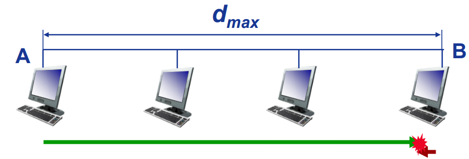
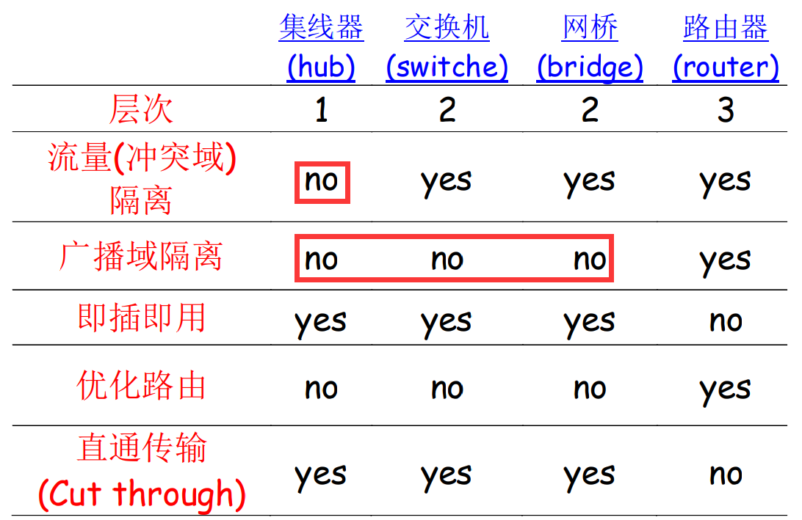
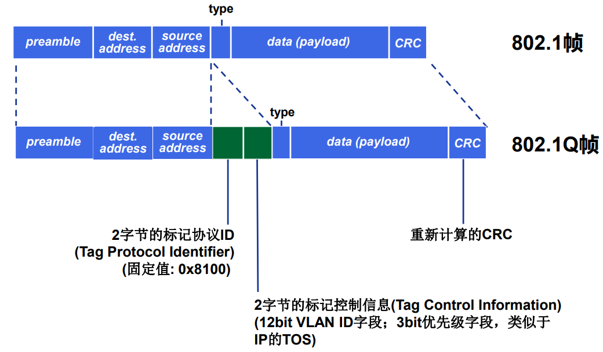
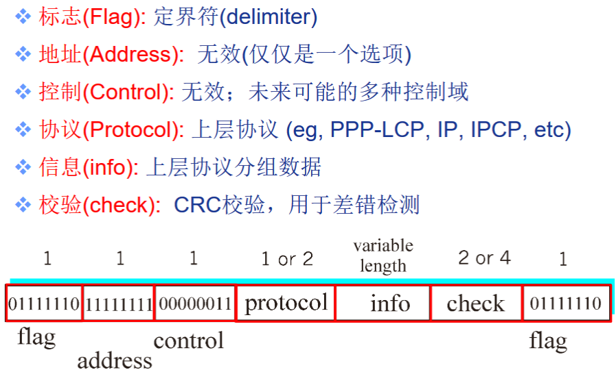
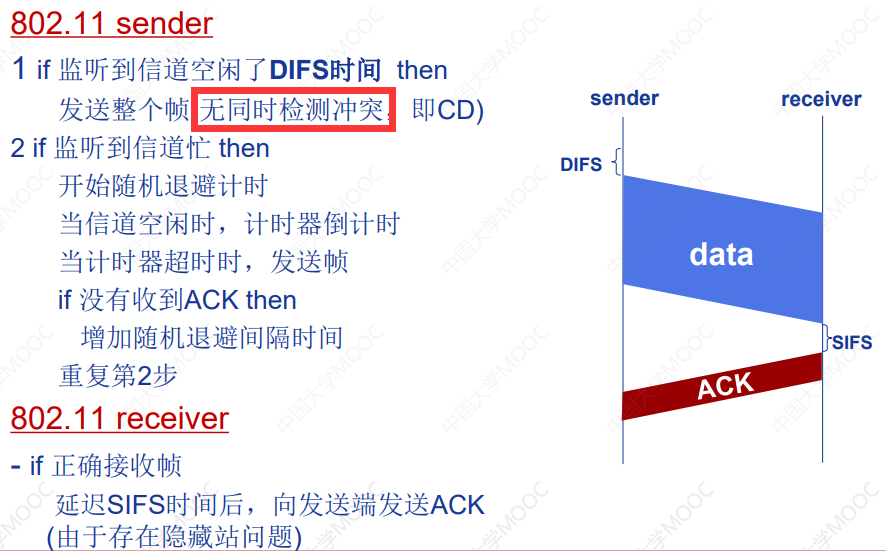
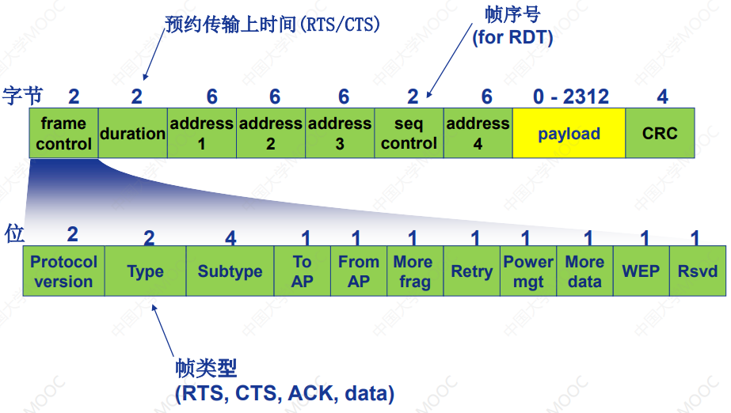
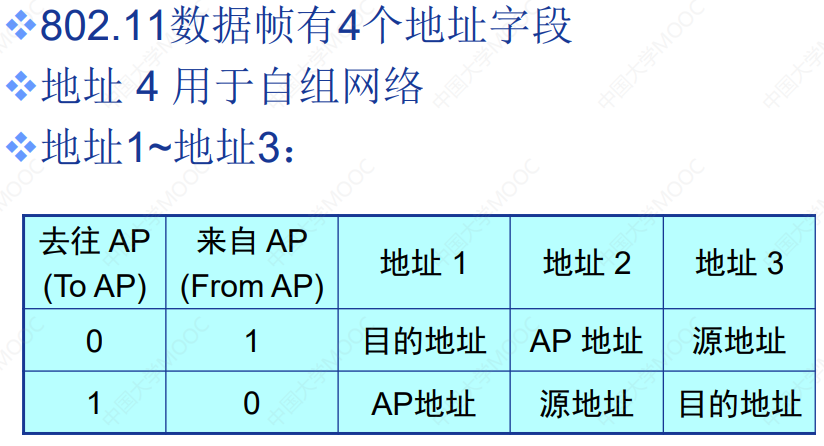

#! https://zhuanlan.zhihu.com/p/598792861
TARGET DECK
计算机网络::5-数据链路层

# 《自顶向下方法》知识总结与习题解答（六）数据链路层

## 知识点

#### 链路层有哪些功能？
- 组帧
	- 封装数据报构成数据帧，加首部和尾部
	- 帧同步
- 链路接入
	- 如果是共享介质，需要解决信道接入
	- 帧首部中的MAC地址，用于标识帧和源的目的
- 相邻结点间可靠交付
	- 在低误码率的有线链路上很少使用
	- 无线链路：误码率高，需要可靠交付
- 流量控制
	- 协调相邻的发送结点和接收
- 差错检测
- 差错纠正
- 全双工和半双工通信控制
<!--ID: 1673574151975-->

#### 为了检测/纠错$r$位差错，编码集的海明距分别应为多少？
编码集的汉明距离为$d$表示编码中任意两个码字至少有$d$位不同。对于检错码，如果编码集的汉明距离$d_s=r+1$，则该差错编码可以检测$r$位的差错，对于纠错码，如果编码集的汉明距离$d_s=2r+1$，则该差错编码可以纠正$r$位的差错。
<!--ID: 1673577300860-->

#### 循环冗余码的编码过程？
确定一个 r+1 位的多项式 G，待发送数据比特 D，计算过程：
- 发送方在 D 后补 r 个 0($D\times2^r$)
- $R=D*2^r \, \text{mod} \, G$（模2下，加法不进位，减法不借位）即为冗余码
- 接收方用 n+r 位的 (D,R) 除以 G，能整除说明正确
<!--ID: 1673577300871-->

#### MAC协议分类
-   信道(channel partitioning)划分MAC协议
	-   多路复用技术
	-   TDMA、FDMA、CDMA、WDMA等
-   随机访问(random access)MAC协议
	-   信道不划分，允许冲突
	-   采用冲突“恢复”机制
-   轮转(taking turns)MAC协议
	-   结点轮流使用信道
<!--ID: 1673577300878-->

#### CDMA的基本过程？
码分多路复用(CDMA)将每个比特视为1和-1
- 每个发送方有一个长度为 M 的由+1和-1构成的向量$\vec{A}$（码片序列），并且不同用户的码片序列相互正交。发送方将要发送的比特$b$都与$\vec{A}$乘积得到码片序列$b\vec{A}$再发送
- 接收方通过$\frac{(b\vec{A})\vec{A}}{M}$来还原对应用户原来的比特。
<!--ID: 1673590492738-->

#### 随机访问MAC协议有哪些？基本原理？
- 时隙ALOHA协议
	- 时间被划分为等长的时隙（发送一帧），每个结点在时隙的初始才能发送帧
	- 冲突：如果2个或2个以上结点在同一时隙发送帧，结点即检测到冲突
	- 如果冲突，结点在下一时隙以概率 p 重传该帧，直至成功
	- 效率：任意结点成功发送帧的概率为$Np(1-p)^{N-1}$，得最大效率为$1/e=0.37$
- ALOHA协议
	- 不划分时隙，结点当有新的帧生成时立即发送
	- 效率：$1/(2e)=0.18$，刚好为时隙ALOHA协议的一半
- CSMA（载波监听多路访问）协议
	- 发送帧之前，监听信道，如果信道空闲则发送完整帧，信道忙则推迟发送
	- 由于信号传播延迟，冲突仍可能发生
- CSMA/CD(Collision Detection)协议
	- 在发送过程中检测是否冲突，如果冲突即传输终止，减少信道浪费
	- 设网络带宽$R$，数据帧最小长度$L_{\text{min}}$，信号传播速度$V$，则应满足$L_{\text{min}}/R=2d_{\text{max}}/V$
	- 效率：设$t_{\text{prop}}$为LAN种2个结点间的最大传播延迟，$t_{\text{trans}}$为最长帧传输延迟，则效率为$1/(1+5t_{\text{prop}}/t_{\text{trans}})$
<!--ID: 1673578878306-->

#### 轮转访问MAC协议有哪些？基本原理？
- 轮询(polling)
	- 主结点轮流邀请从属结点发送数据
	- 问题：轮询开销，等待延迟，单点故障
- 令牌传递(token passing)
	- 控制令牌依次从一个结点传递到下一个结点
	- 当结点获取到控制令牌时才可以发送数据
	- 问题：令牌开销，等待延迟，单点故障
<!--ID: 1673579195623-->

#### 什么是ARP协议，它有什么作用？
ARP：地址解析协议。用于转换IP地址和MAC地址。
- LAN中的每个IP结点维护一个ARP表，存储子网内其它结点IP/MAC地址映射关系：<IP地址，MAC地址，TTL>，TTL表示经过这个时间以后该映射关系会被遗弃。
- 若结点 A 的 ARP 表中没有 B 的MAC地址，则需要在子网内**广播**目的 MAC 地址为 FF-FF-FF-FF-FF-FF （广播地址）的 ARP 查询分组，当 B 接收到记录有自己 IP 地址的 ARP 分组后，会利用**单播**帧回复 ARP 响应报文，A 就更新自己ARP表，进行数据报发送。
<!--ID: 1673582433993-->

#### 什么是以太网？
以太网是目前使用范围最广的有线局域网技术，提供不可靠、无连接服务。以太网逻辑上采用总线形拓扑结构，物理拓扑是星形（每个结点一个单独冲突域）或扩展星形结构，以太网中的所有计算机共享一条总线，信息以广播方式发送。以太网的MAC协议采用二进制指数退避算法的CSMA/CD。
<!--ID: 1673583024974-->

#### 以太网CSMA/CD算法的基本过程？
1. NIC从网络层接收数据报，创建数据帧
2. 监听信道：如果NIC监听到信道空闲，则开始发送帧；如果NIC监听到信道忙，则一直等待到信道空闲，然后发送帧
3. NIC发送完整个帧，而没有检测到怕其他结点的数据发送，则NIC确认帧发送成功
4. 如果NIC检测到其它结点传输数据，则中止发送，并发送堵塞信号
5. 终止发送后，NIC进入二进制指数退避：第$m$次连续冲突后，取$n=\text{min}(m,10)$，NIC从$\{0,1,2, \cdots, 2^n-1\}$中随机选择一个数$K$，NIC等待$K\times 512$比特的传输延迟时间，再返回第2步
<!--ID: 1673583390680-->

#### 以太网帧的结构及各字段功能？
发送端网卡将IP数据报封装到以太网帧中
- 前导码(Preamble)。8B，7个字节的10101010，第8个字节为10101011，用于发送端与接收端的时钟同步
- 类型(Type)。2B，指示帧中封装的是那种高层协议的分组
- 数据(Data)。46-1500B，指上层协议载荷
<!--ID: 1673583752663-->

#### 以太网交换机的作用？
- 对于子网中主机和路由器是透明的，能够根据MAC地址存储-转发链路层帧。交换机的每个接口都连接一个链路，交换机在每段链路上利用CSMA/CD收发帧，但无冲突，且可以全双工
- 每个交换机维护一个交换表，(主机的MAC地址，到达主机的接口，时间戳)
- 交换机通过自学习维护交换表，当收到帧时，交换机学习到发送帧的主机（通过帧的源MAC地址）位于收到该帧的接口所连接的LAN网段，将发送主机MAC地址/接口信息记录到交换表中
<!--ID: 1673586644599-->

#### 各网络设备对比

<!--ID: 1673586644608-->

#### 如何跨越多个交换机实现同一个VLAN？
通过中继接口(trunk port)连接交换机，使用干线链路连接，同一个 VLAN 的跨交换机的以太网帧在干线链路上使用 802.1Q 格式。
<!--ID: 1673587184406-->

#### 什么是PPP协议？
是一种点对点数据链路控制协议。仅一个发送端和一个接收端，无需介质访问控制，无需明确的MAC寻址，无需差错纠正，无需流量控制，不存在乱序交付，无需支持多点链路
<!--ID: 1673587989074-->

#### PPP数据帧格式及各字段功能？

- PPP帧以标志字节 01111110 开始和结束。若有效数据中存在 01111110 则需要对其转义。发送端在 01111110 和 01111101 前填充转义字节 01111101，接收端收到 011111101 表示填充字节，收到连续两个 011111101 则丢弃第1个，将第2个作为数据接收，单个 01111110 是标志字节从而实现比特透明传输。
<!--ID: 1673587989081-->

#### 802.11无线局域网基本组成？
802.11使用星形拓扑，中心点称为接入点 AP(基站)，每个无线设备称为站点(主机)，每个主机必须与一个 AP 相关联，一个 AP 构成一个基本服务集(BSS)，多个通过有线链路相连的 AP 构成一个局域网。
802.11b将2.4GHz-2.485GHz频谱划分为11个不同频率的信道，每个AP分配一个信道
<!--ID: 1673589598605-->

#### 802.11中，主机如何与AP关联？
- 被动扫描
	- 各AP发送信标帧，主机向选择的AP发送关联请求帧，AP向主机发送关联响应帧
- 主动扫描
	- 主机主动广播探测请求帧，多个AP发送探测响应帧，主机向选择的AP发送关联请求帧，AP向主机发送关联响应帧
<!--ID: 1673589598614-->

#### CSMA/CA协议基本过程？

为了减少冲突，允许发送端预约信道，首先利用CSMA向BS发送一个很短的RTS帧，BS广播一个CTS帧作为对RTS的响应，CTS帧可以被所有结点接收从而消除隐藏站影响
<!--ID: 1673589598621-->

#### 802.11的MAC帧各字段功能？

<!--ID: 1673589733061-->

## 课后习题
> R2. 如果在因特网中的所有链路都提供可靠的交付服务，TCP可靠传输服务将是多余的吗？为什么？

不是。每条链路都可靠，并不意味着端到端可靠。IP 可能由于路由循环或设备故障而丢失数据包。此外，不能保证 IP 数据报将按正确的顺序到达最终目的地，仍然需要 TCP 以正确的顺序向应用程序的接收端提供字节流。

> R6. 在 CSMA/CD 中，在第 5 次碰撞后，节点选择 K=4 的概率有多大？结果 K=4 在 10 Mbps 以太网上对应于多少秒的时延？

第 5 次连续冲突后，NIC从$\{0,1,2, \cdots, 32\}$中随机选择一个数$K$，故 $K=4$ 的概率为 1/32，对应$K\times 512$ 比特的传输延迟时间，为 $4\times \frac{512}{10^7}=204.8 \, \text{s}$

> R11. ARP查询为什么要在广播帧中发送呢？ARP响应为什么要在一个具有特定目的MAC地址的帧中发送呢？

查询时还不知道IP地址对应的MAC地址，所以只能通过广播帧，而响应时，结点已经根据报文知道了源MAC地址，所以就不需要广播了。

## MOOC习题
> 假设CRC编码的生成比特模式G=10011。请回答下列问题：
> 1. 如果数据D=1010101010，则CRC编码后<D,R>=？
> 2. 如果数据D=1010100000，则CRC编码后<D,R>=？
> 3. 如果接收端收到码字01011010101001，则该码字在传输过程中是否发生差错？ 
> 4. 如果接收端收到码字10010101010000, 则该码字在传输过程中是否发生差错？

1. R=0100，故<D,R>=10101010100100
2. R=1001，故<D,R>=10101000001001
3. 01011010101001除以G=10011余0110，余式不为全0，有错
4. 10010101010000除以G=10011余0000，无错

> 假设在采用广播链路的10Mbps以太网中，回答下列问题：
> 1. 某结点连续第5次冲突后，按二进制指数退避算法，选择K=4的概率是多少？相应地延迟多久再次重新尝试发送帧？
> 2. 如果连续第12次冲突，该结点最多延迟多久再次重新尝试发送帧？

1. 同R6题，概率为 1/32，时间为204.8 us
2. 则$n=\text{min}(12,10)=10$，所以$K_{\text{min}}=2^{10}-1=1023$，时间为52377.6 us