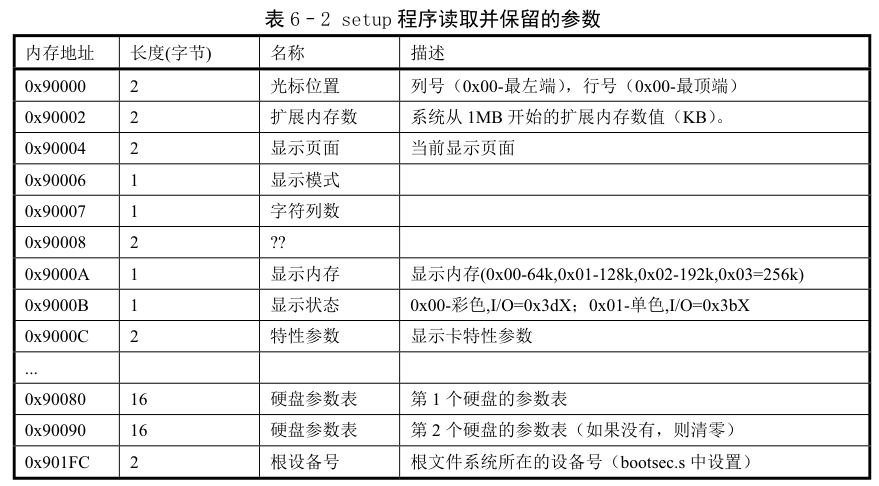
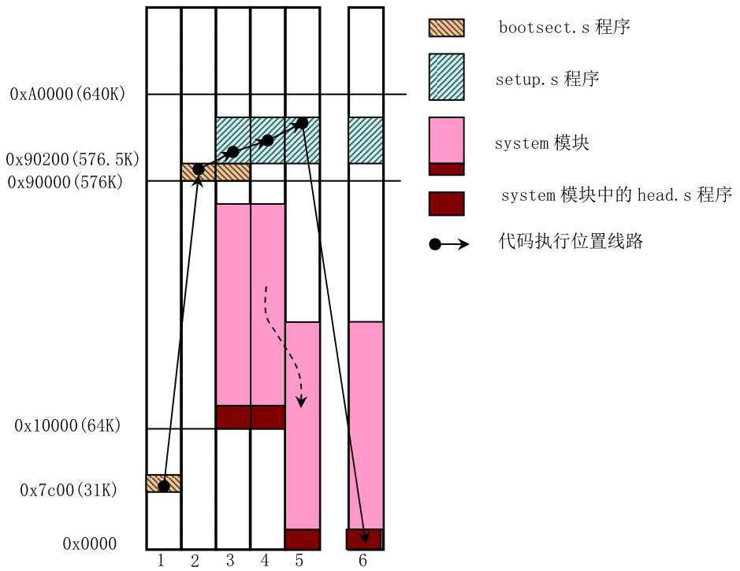

# Linux0.11 源码剖析 | 操作系统的启动

操作系统启动时，主要会有如下流程：

1. 当 PC 的电源打开后，x86 结构的 CPU 自动进入**实模式**
2. 开机时，CS=0xFFFF，IP=0x0000
3. 寻址 0xFFFF0(CS:IP)，这是 ROM-BIOS 的地址，BIOS 来执行某些检测：RAM，键盘，显示器，软硬磁盘
4. 启动设备的第一个扇区（磁盘 0，磁道 0，512B）读入内存 0x7C00 处
5. 设置 CS=0x07C0，IP=0x0000，即跳转到上述写入的扇区读入内存中的内容，因此，上述扇区便是引导扇区，操作系统的故事从此开始

## 先解释一个问题：什么是实模式？

通常，CPU复位（reset）或加电（power on）的时候就是以实模式启动的，在这个时候处理器以实模式工作，不能实现权限分级，也不能访问20位以上的地址线，也就是只能访问1M内存。之后一般就加载操作系统模块，进入保护模式。

早期 8086 CPU 有 20 位地址线，以及 8 个 16 位的通用寄存器和 4 个 16 位的段寄存器。为了能够通过这些 16 位的寄存器去构成 20 位的主存地址，它就采用内存分段方式来访存。当某个指令想要访问某个内存地址时，需要用（段基址：段偏移量）来表示，其中第一个字段是段基址，它的值是由**段寄存器**提供，第二字段是段内偏移量，代表要访问的这个内存地址距离这个段基址的偏移，它的值由通用寄存器提供，所以也是 16 位。最后的物理地址为：段基址 << 4 + 段偏移量，这样就实现了20位的访存。

而后来，随着CPU的发展，32条地址线有效，可寻址高达4G字节的物理地址空间

在 Linux0.11 中，bootsect.s 便是上述被加载到第一个扇区的引导扇区代码，我们分功能分析：

第一部分：实现将自己这部分代码移动到 0x90000 开始处并执行

```assembly
SETUPLEN = 4				! nr of setup-sectors
BOOTSEG  = 0x07c0			! original address of boot-sector
INITSEG  = 0x9000			! we move boot here - out of the way
SETUPSEG = 0x9020			! setup starts here
SYSSEG   = 0x1000			! system loaded at 0x10000 (65536).
ENDSEG   = SYSSEG + SYSSIZE		! where to stop loading

! ROOT_DEV:	0x000 - same type of floppy as boot.
!		0x301 - first partition on first drive etc
ROOT_DEV = 0x306

entry _start ! 关键字entry告诉链接器程序入口
_start:
	mov	ax,#BOOTSEG
	mov	ds,ax
	mov	ax,#INITSEG
	mov	es,ax	! ds=0x07c0, es=0x9000
	mov	cx,#256
	sub	si,si	! ds:si=0x7c00
	sub	di,di	! es:di=0x90000
	rep
	movw		! 把ds:si处的256个字移动到es:di处
	jmpi	go,INITSEG	! 段间跳转，INITSEG为段地址，由于程序已经移动到INISEG段起始处，因此这句话就是顺序执行
go:	mov	ax,cs	! cs=0x9000
	mov	ds,ax
	mov	es,ax	! es=0x9000
! put stack at 0x9ff00.
	mov	ss,ax
	mov	sp,#0xFF00		! arbitrary value >>512
```

第二部分：把第 2 个扇区开始的 4 个扇区的 setup 加载到 0x90200 处

```assembly
load_setup:
	mov	dx,#0x0000		! drive 0, head 0
	mov	cx,#0x0002		! ch=柱面号，cl=开始扇区
	mov	bx,#0x0200		! address = 512, in INITSEG
	mov	ax,#0x0200+SETUPLEN	! ah=0x02-读磁盘，al=4-扇区数量
	int	0x13			! read it, BIOS读磁盘的中断，es:bx=0x90200
	jnc	ok_load_setup		! ok - continue
	mov	dx,#0x0000
	mov	ax,#0x0000		! reset the diskette
	int	0x13
	j	load_setup		! 重读
```

第三部分：得到当前启动引导盘的参数，接着在屏幕上显示"Loading system..."，然后把磁盘上 system 模块加载到 0x10000 处

```assembly
ok_load_setup:

! Get disk drive parameters, specifically nr of sectors/track

	mov	dl,#0x00
	mov	ax,#0x0800		! AH=8 is get drive parameters
	int	0x13
	mov	ch,#0x00
	seg cs
	mov	sectors,cx
	mov	ax,#INITSEG
	mov	es,ax

! Print some inane message

	mov	ah,#0x03		! read cursor pos
	xor	bh,bh
	int	0x10

	mov	cx,#24			! 24个字符
	mov	bx,#0x0007		! page 0, attribute 7 (normal)
	mov	bp,#msg1
	mov	ax,#0x1301		! write string, move cursor
	int	0x10			! 显示字符，"Loading system ..."

! ok, we've written the message, now
! we want to load the system (at 0x10000)

	mov	ax,#SYSSEG
	mov	es,ax		! segment of 0x010000
	call	read_it	! 读磁盘上system模块
	call	kill_motor

! After that we check which root-device to use. If the device is
! defined (!= 0), nothing is done and the given device is used.
! Otherwise, either /dev/PS0 (2,28) or /dev/at0 (2,8), depending
! on the number of sectors that the BIOS reports currently.

	seg cs
	mov	ax,root_dev
	cmp	ax,#0
	jne	root_defined
	seg cs
	mov	bx,sectors
	mov	ax,#0x0208		! /dev/ps0 - 1.2Mb
	cmp	bx,#15
	je	root_defined
	mov	ax,#0x021c		! /dev/PS0 - 1.44Mb
	cmp	bx,#18
	je	root_defined
undef_root:
	jmp undef_root
root_defined:
	seg cs
	mov	root_dev,ax

! after that (everyting loaded), we jump to
! the setup-routine loaded directly after
! the bootblock:

	jmpi	0,SETUPSEG
```

其中`msg1`为：

```assembly
msg1:
	.byte 13,10
	.ascii "Loading system ..."
	.byte 13,10,13,10
```

最后，跳转到 0x90200 处执行 setup 程序：

```assembly
! after that (everyting loaded), we jump to
! the setup-routine loaded directly after
! the bootblock:
	jmpi	0,SETUPSEG	! SETUPSEG=0x9020
```

setup 是一个操作系统加载程序，顾名思义，它就是完成 OS 启动前的设置。

首先，利用中断读取机器系统数据，并将这些数据保存到 0x90000 开始的位置（将 bootsect 覆盖掉），保存的参数及内存位置如图：



这部分代码不做分析

接下来，分析 setup 做的一件很重要的事：将 system 模块移动到 0x0 处，由上文讲到 system 开始的位置为 0x10000，当时假设 system 长度不会超过 0x80000(512KB)，这就是 bootsect.s 将自己移动到 0x90000，且将 setup 加载到自己后面的原因

```python
do_move:
	mov	es,ax		! destination segment
	add	ax,#0x1000
	cmp	ax,#0x9000	! 从0x10000到0x90000为止的内容
	jz	end_move
	mov	ds,ax		! ds:si:从0x9000
	sub	di,di
	sub	si,si
	mov 	cx,#0x8000	! 移动64KB
	rep
	movsw
	jmp	do_move
```

那么为什么 bootsect 不直接把 system 模块加载到 0x0 处，而是要在后面的 setup 中再开始移动呢？这是因为 setup 开始需要利用中断读取机器系统数据，BIOS 初始化时会在 0x0 处放置一个大小为 0x400 字节的**中断向量表**，因此，在使用中断调用完之前是不能将这个区域覆盖掉的。

从 bootsect 执行开始，到 setup 执行结束，各模块在内存中的位置变化如图：



那么完成这部分工作后，setup 是不是就可以交给 system 运行了呢？在这之前，还有一项重要的工作，就是从实模式切换到保护模式。
