# 软件构造 | 笔记6-面向复用(reuse)的软件构造技术

前几章介绍了软件构造的核心理论——ADT，核心技术——OOP，其核心是保证代码质量、提高代码安全性

本章面向一个重要的外部指标：可复用性——如何构造出可在不同应用中重复使用的软件模块/API

## 为什么复用？

软件复用有两个视角：

- **面向**复用编程：开发出可复用的软件
- **基于**复用编程：利用已有的可复用软件搭建应用系统

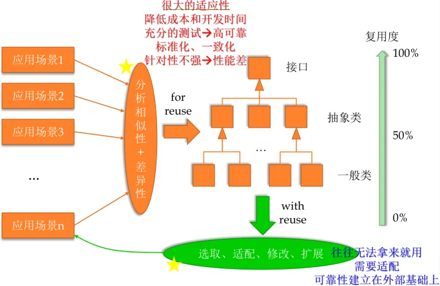

三点好处：

- 降低成本和开发时间
- 经过充分测试，可靠、稳定
- 标准化，在不同的应用中保持一致

但是，代价也不低：

- 可复用组件的设计需要定义明确、开放、接口规范简洁、易懂，并着眼于未来的使用
- 它涉及组织、技术和流程变更，以及支持这些变更的工具成本


开发可复用的软件一般流程如下：


使用已有软件进行开发的一般流程：


## 怎么复用？

### 源码层面的复用

说白了就是搜索相应的代码。复制过来为自己所用

### 模块层面的复用：类/接口

使用**继承**和**委托**

### Library 层面的复用：API/包

Library: 提供可复用功能的类和方法的集合


### 系统层面的复用：框架(Framework)

所谓框架，就是一组具体类、抽象类、及其之间的连接关系

开发者根据框架的规约，填充自己的代码进去，形成完整系统

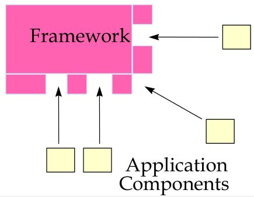

框架分为两种：

* 白盒框架：通过代码层面的**继承**进行框架扩展
* 黑盒框架：通过实现特定**接口**进行框架扩展

## 设计可复用的类

### LSP 原则(Liskov Substitution Principle)

子类型多态：使用者可以用统一的方式处理不同类型的对象

看如下代码：

```java
Animal a = new Animal();
Animal c1 = new Cat();
Cat c2 = new Cat();
```

要保持这样一种原则：

在任何可以使用 a 的场景，都可以用 c1 和 c2 替换而不会有任何问题

总结来说，就是以下七点：

1. 子类必须**完全**的实现父类的方法（子类型需要实现抽象类中的所有未实现的方法）
2. 子类可以有自己的个性（子类型可以增加方法）
3. 子类型方法参数：**逆变**，返回值：**协变**
4. 子类型中重写的方法不能抛出额外的异常：**协变**
5. 重写和实现父类的方法时输入参数可以被放大（**前置条件**不能强化/逆变）
6. 重写和实现父类的方法时输出参数可以被缩小（**后置条件**不能弱化/协变）
7. 更强/保持不变量

### 协变(Covariance)

所谓协变就是无论是父类型到子类型还是方法的返回值类型还是异常的类型都越来越具体

比如：

```java
class T {
    Object a() {...}
}

class S extends T {
    @Override
    String a() {...}
}

class T {
    void b() throws Throwable {...}
}
class S extends T {
    @Override
    void b() throws IOException {...}
}
```

### 反协变(Contravariance)

反协变是指从父类型到子类型越来越具体，方法的参数类型**相反**，要不变或越来越抽象

比如：

```java
class T {
    void c(String s) {...}
}
class S extends T {
    @Override
    void c(Object s)
}
```

在 Java 中，这种情况被看作 Overload

总结如图：

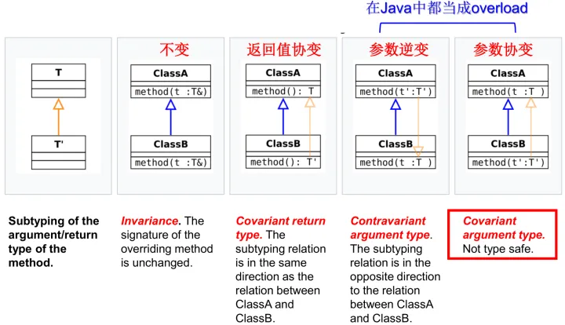

### 泛型中的 LSP

先说说**类型擦除**(type erasure)

- 虚拟机中没有泛型类型对象，所有对象都属于普通类
- 泛型信息只存在于编译阶段，在运行时会被擦除
- 擦除时，类型变量会被替换为限定类型，如果没有限定类型则替换为`Object`类型

举例，类型参数没有限定时：

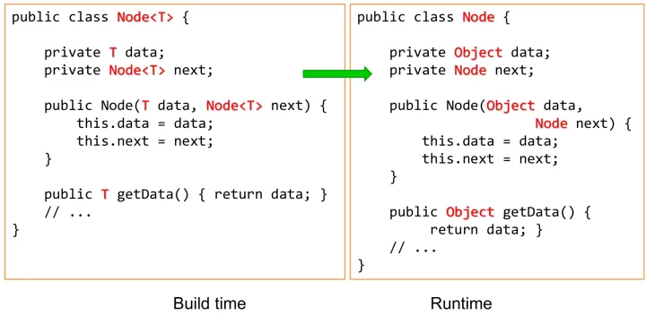

类型参数有限定时：


由此明确一点：

- `ArrayList<String>`是`List<String>`的子类型
- `List<String>`不是`List<Object>`的子类型，尽管`String`是`Object`的子类型

类似的，`Box<Integer>`不是`Box<Number>`的子类型：

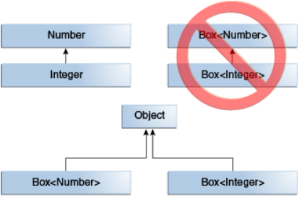

那么两个泛型类的协变如何实现呢？

### 通配符(Wildcards)

可以采用**通配符**(Wildcards)

**无限定通配符**用`?`表示，在以下情况使用

- 方法的实现不依赖于类型参数
- 方法的实现只依赖于`Object`类中的功能

比如，我们想设计一个方法，打印任意类型`List`中所有内容

```java
public static void printList(List<Object> list) {
    for (Object elem : list)
	System.out.println(elem + " ");
	System.out.println();
}
```

由于泛型不协变，这个时候只能打印`List<Object>`

但是有了通配符就好办了：

```java
public static void printList(List<?> list) {
    for (Object elem : list)
	System.out.println(elem + " ");
	System.out.println();
}
```

除此以外，还有**下限通配符**：`<? super A>`

指只能接受类型 A 以及 A 的父类作为类型参数

**上限通配符**：`<? extends A>`

指只能接受类型 A 以及 A 的子类作为类型参数，这里的`extends`既可以代表类的`extends`，也可以代表接口的`implements`

比如，可以写出对存放数的`List`的求和方法：

```java
public static double sumofList(List<? extends Number> list) {
    double s = 0.0;
    for (Number n : list)
        s += n.doubleValue();
    return s;
}
```

也可以有多种限定的写法：

`<T extends B1 & B2 & B3>`表示接受的类型参数要是后面所有类的子类型，由于 Java 不能多继承，所以`B1`,`B2`,`B3`中最多只能有一个类，剩下的都是接口，要把类写在最前面

总结如图：


### PECS

PECS就是`producer-extends, consumer-super`

- 带有子类型限定的**上限通配符**可以从泛型对象**读取**
- 带有超类型限定的**下限通配符**可以向泛型对象**写入**

举例：

`producer-extends`

```java
class Animal{}
class Cat extends Animal{}
class whiteCat extends Cat{}
class BlackCat extends Cat{}

List<? extends Cat> animals= new ArrayList<Cat>();
animals.add(new whiteCat()); //compile error
animals.add(new Cat()); //compile error
animals.add(new Animal()); //compile error
animals.add(new Object()); //compile error
animals.add(null); //succeed, but it is meaningless.
//不能放入任何类型，因为编译器只知道animals中应该放入Cat的某种子类型，但具体放哪种子类型它无法确定
animals= new ArrayList<WhiteCat>();
…
animals= new ArrayList<BlackCat>();
//假如允许放入WhiteCat后，animals可能指向BlackCat集合；反之亦然。
Cat s1 = animals.get(0); //类型上界为Cat，Cat及其父类都能接收返回值
Animal s2 = animals.get(0); //Cat类型可以用Animal接收
WhiteCat s3 = animals.get(0); //error:子类型对象不能接收父类型返回值
```

`consumer-super`: 

```java
class Animal{}
class Cat extends Animal{}
class whiteCat extends Cat{}
class BlackCat extends Cat{}

List<? super Cat> b = new ArrayList<>(); //参数类型下界是Cat
b.add(new Cat()); //ok
b.add(new WhiteCat()); //ok 子类型也可以
b.add(new Animal()); //error 超类不可以
b.add(null); //ok

Object o1 = b.get(0);//返回类型是未知的，只能用Object类型接收
```

## 委托(delegation)

举个排序的例子：

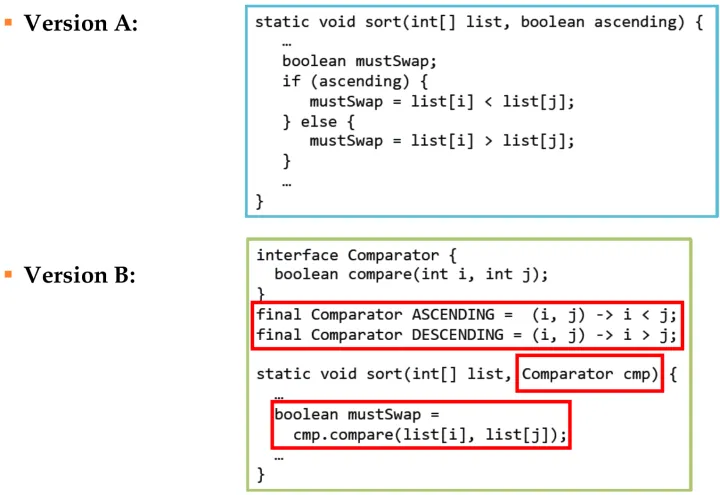

这个例子可以看到 ADT 中比较大小的一种方式，可以实现`Comparator`接口，并且重写`compare()`函数

所谓**委托**(delegation)就是一个对象请求另一个对象的功能

委托是复用的一种常见形式，它可以描述为一种低级的代码与数据的共享机制

- 显式委托：发送对象直接传递给接收对象
- 隐式委托：语言的一些特定规则

再举个简单的例子：

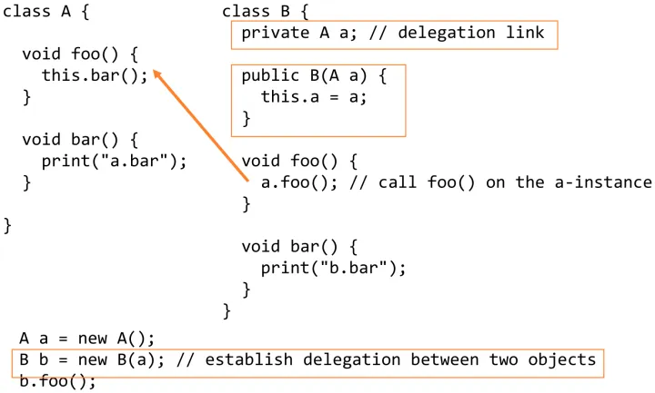

`B`通过一个`A`的成员变量，构建起两个类之间的委托，这时显式的

再比如，我们要实现一个能在添加或删除时打印信息的`List`，使用委托机制代码就很简洁了

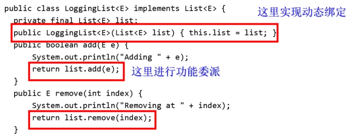

### 委托(delegation)与继承(inheritance)

写到这里，谈谈委托与继承的区别

- 继承：继承一个基类，添加新的方法或者重写原来的方法来实现某个功能
- 委托：将某个功能的一部分直接委托给其它对象

委托能办到的，继承似乎都能办到，那么为什么不直接使用继承呢？

譬如，如果子类只需要复用父类的一小部分方法，完全可以不需要继承，而是通过委托机制来实现，从而避免继承大量无用的方法

### 合成复用原则(CRP)

内容：

- 类应该通过它们的组合（通过包含实现所需功能的其他类的实例）而不是从基类或父类继承来实现多态的行为和代码重用
- 组合一个对象可以做什么(has_a 或 use_a)比扩展它是什么(is_a)更好

也就是说，组合要优先于继承（组合式委托的一种形式）

**注意**：委托发生在对象的层面，而继承发生在类的层面

那么为什么在对象层面更好呢？举个例子：

`Employee`类有一个方法用于计算奖金：

```java
class Employee {
    Money computeBonus() {... // default computation}
}
```

它会有很多不同的子类，例如`Manager`,`Programmer`,`Secretary`，那么计算它们的奖金的时候肯定要重写方法：

```java
class Manager extends Employee {
    @Override
    Money computeBonus() {... // special computation}
}
```

如果不同类型的`manager`需要不同的计算方式，那么就有需要引入子类：

```java
class SeniorManager extends Manager {
    @Override
    Money computeBonus(){... // more special computation}
}
```

如果要将某个人从`Manager`提升为`SeniorManager`，那么该怎么处理呢？

核心问题在于：每个`Employee`对象的奖金计算方法都不同，这在**对象**层面而不是**类**层面

显然，委托机制要更好，使用 CRP 原则的一种实现可以是：

```java
class Manager {
    ManagerBonusCalculator mbc = new ManagerBonusCalculator();
    Money computeBonus() {
        return mbc.computeBonus();
    }
}

class ManagerBonusCalculator {
    Maney computeBonus {... // special computation}
}
```

设计如图：


### 举例

再举个例子，能够清晰地展现出从继承到委托的变化

假设要开发一套动物 ADT

- 各种不同种类的动物，每类动物有自己的独特行为，某些行为可能在不同类型的动物之间复用
- 考虑到生物学和AI的进展，动物的“行为”可能会发生变化

例如：

- 行为：飞、叫、…
- 动物：既会飞又会叫的鸭子、天鹅；不会飞但会叫的猫、狗；…
- 有10余种“飞”的方式、有10余种“叫”的方式；而且持续增加

**第一种实现方式**：可以直接为每一种动物都设置一个类：


**缺陷**很明显，很多动物的飞法其实是一样的，会存在大量重复

**第二种实现方式**：利用**继承**，比如先定义一个能飞的动物的抽象类，实现通用的的飞法，每种能飞的动物类都继承这个类，如果有不同的飞法重写即可


 这样做实现了对某些通用行为的复用，但是也有**缺陷**：

- 需要针对飞法设计复杂的继承关系树
- 由于不能多继承，那么就不能同时支持针对叫法的继承
- 动物行为发生变化时，继承树也要随之变化

**第三种实现方式**：利用**组合**

思路：

- 使用接口定义系统必须对外展示的不同侧面的行为
- 接口之间通过`extends`实现行为的扩展（接口组合）
- 类直接`implements`组合之后的接口

这样就能规避复杂的继承关系

比如分别设计抽象行为**飞**和**叫**的接口：

```java
interface Flyable {
    public void fly();
}
interface Quackable {
    public void quack();
}
```

然后将接口组合，也就是行为的组合，比如：

```java
interface Ducklike extends Flyable, Quackable{}
```

然后再在具体的类中实现这个接口

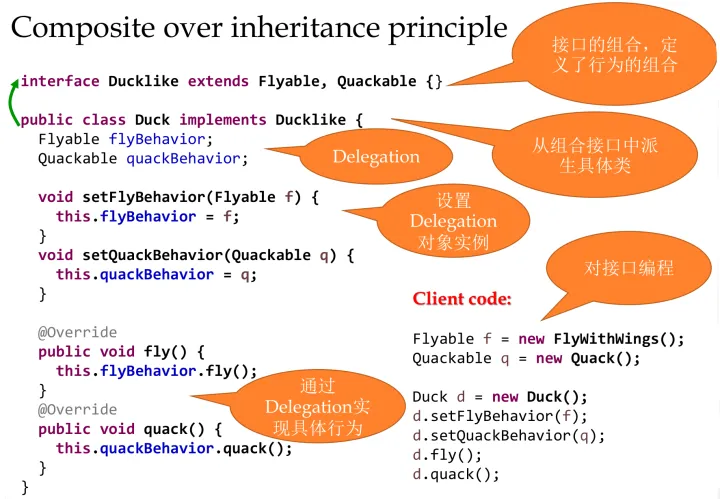

一种实现如图：

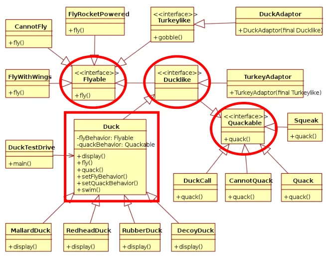

### 委托的类型

三种形态：

- Dependency (A use B)
- Association (A has B)
- Composition/aggregation (A owns B)

使用者调用某个功能也就呈现出这样的结构：


接下来，我们逐一分析：

### Dependency: 临时性的委托

Dependency: a **temporary** relationship that an object requires other objects (suppliers) for their implementation.

- 使用某个类最简单的办法就是直接调用它的方法，通过方法的参数或者在方法的局部中使用发生联系
- 也就说这种联系是对象的某个行为带来的

**举例**：


### Association: 永久的委托

Association: a **persistent** relationship between classes of objects that allows one object instance to cause another to perform an action on its behalf.

- has_a: 一个类将另一个类作为变量
- 这种关系时结构化的，因为它只定义了着一种类型的对象与另一个对象的关系，这种关系**不是**对象的**行为**带来的

**举例**：


### Composition: 更强的联系

**Composition** is a way to combine simple objects or data types into more complex ones.

- is_part _of: has_a: 一个类将另一个类作为变量
- 最后的实现可以看作一个对象包含了另一个对象

但是这种实现难以变化

**举例**：


### Aggregation: 更弱的联系

Aggregation: the object exists outside the other, is created outside, so it is passed as an **argument** to the **construtor**.

- has_a

这种实现可以动态变化

**举例**：

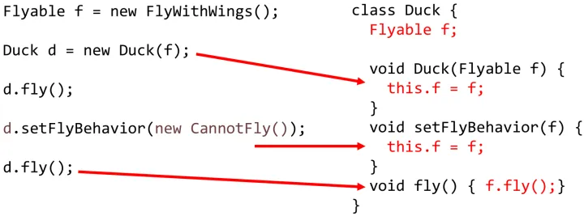

## 设计系统层面的 API 库与框架(frameworks)

可以说，API 是一个程序员最重要的资产和荣耀

- 好的代码都是模块化的——它们都有 API
- 要始终以开发 API 的标准面对任何开发任务，面向“复用”编程，而不是面向“应用”编程

### 白盒(Whitebox)框架与黑盒(Blackbox)框架

**白盒框架**：

- 通过编写**子类**和重写方法进行扩展
- 常见的设计模式：Template Method
- 子类有`main`方法，但是控制权在框架

**黑盒框架**：

- 通过实现插件接口(plugin interface)进行扩展
- 常见的设计模式：Strategy, Observer
- 框架中的框架加载机制加载插件

### 举例

举一个计算器的例子：

**不用框架**：

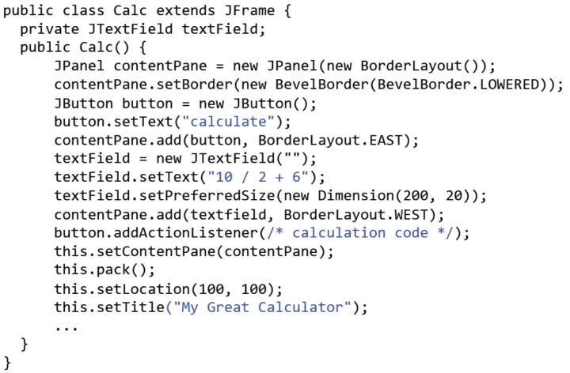

使用**白盒框架**：


使用**黑盒框架**：

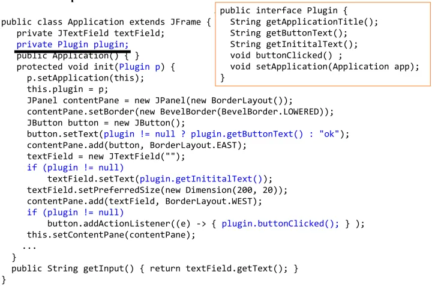


### Whitebox vs. Blackbox Frameworks

- 白盒框架使用子类**继承**
  - 允许对所有非私有的方法扩展
  - 需要理解父类的实现
  - 同时只能实现一种扩展
  - 所有代码在一起编译
  - 也被叫做**开发人员**(developer)框架
- 黑盒框架使用**委托**
  - 允许扩展**接口**中的功能
  - 只需要理解接口
  - 有多种插件
  - 提供更多的模块化
  - 可以从开发环境中分离出来(.jar, .dll, ...)
  - 也被叫做**最终用户**(end-user)框架，**平台**(platforms)


## 总结

本文从四个层面（源码级别，模块级别，库级别，系统级别）分别讲解了如何设计复用

尤其分析了设计可复用的**类**的方法，从中导出著名的 **LSP** 原则和 **CRP** 原则
