# 软件构造 | 笔记7-面向可维护性的软件构造技术

本文面向另一个质量指标：可维护性——软件发生变化时，是否可以以很小的代价适应变化

## 什么是软件维护

所谓**软件维护**就是修改已经发布的软件，来更正其中的错误或者改善它的性能

软件开发周期图：


## 可维护性如何度量

### 什么是可维护性？

- 可维护性(Maintainability): 一个软件可以很容易地修改错误，提升性能，或者适应环境的改变
- 可扩展性(Extensibility): 设计软件时考虑到了未来的的扩展
- 灵活性(Flexibility): 根据用户需求的变化或者环境的变化，软件可以轻易地修改
- 可适应性(Adaptability): 交互系统的能力，软件可以根据用户的信息改变它的行为
- 可管理性(Manageability): 如何高效、方便地监控和维护软件系统，以保持系统的性能、安全性和平稳运行
- 支持性(Supportability): 软件在部署后保持运行的有效性，包括文档，诊断信息和技术人员

可维护性就是要考虑如下问题：

- 设计结构是否简单？
- 模块之间是否松散**耦合**(loosely coupled)？
- 模块内部是否高度**聚合**(closely related)？
- 是否使用了非常深的**继承树**(inheritance hierarchies)？是否用**委托**(composition)替代继承？
- 代码的**圈/环复杂度**(cycolmatic complexity)是否太高？
- 是否存在重复代码？

以下部分都是可维护性的度量指数

## 可维护性指数(Maintainability Index)

通过公式计算的一个 0 到 100 之间的值，它表示维护代码的相对难易程度

更高的值表示更好维护，基于以下指标计算：

- **代码容量** Halstead Volume (HV)
- **圈/环复杂度** Cyclomatic Complexity (CC)
- **代码行数** The average number of lines of code per module (LOC)
- **注释的占比** The percentage of comment lines per module (COM)

先介绍这几个概念：

### 圈/环复杂度(Cyclomatic Complexity)

该指数测量代码的**结构**复杂度

- 它计算程序流中不同代码路径的数量
- 具有复杂控制流的程序需要更多的测试来实现良好的代码覆盖率，并且维护性较差

**计算方法：**

如果在控制流图中增加了一条从终点到起点的路径，整个流图形成了一个闭环。圈复杂度其实就是在这个闭环中**线性独立回路**的个数

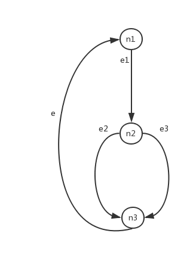

如图，线性独立回路有：

- e1→ e2 → e
- e1 → e3 → e

所以复杂度为 2
对于简单的图，我们还可以数一数，但是对于复杂的图，这种方法就不是明智的选择了

也可以使用计算公式：

```apache
V(G) = e – n + 2 * p
```

- e：控制流图中边的数量（对应代码中顺序结构的部分）
- n：代表在控制流图中的判定节点数量，包括起点和终点（对应代码中的分支语句）
  - ps：所有终点只计算一次，即使有多个`return`或者`throw`
- p：独立组件的个数

### 代码行数(LOC)

- 代码行数太高，可能表示某个类或方法做了太多的工作，应该进行拆分

### 代码容量(HV)

代码容量关注的是代码的词汇数，有以下几个基本概念

| 参数       | 含义                                                         |
| ---------- | ------------------------------------------------------------ |
| n1         | Number of unique operators，不同的操作元（运算子）的数量     |
| n2         | Number of unique operands，不同的操作数（算子）的数量        |
| N1         | Number of total occurrence of operators，为所有操作元（运算子）合计出现的次数 |
| N2         | Number of total occurrence of operands，为所有操作数（算子）合计出现的次数 |
| Vocabulary | n1 + n2，词汇数                                              |
| length     | N1 + N2，长度                                                |
| Volume     | length * Log2 Vocabulary，容量                               |

最后，就能得到计算公式：
$$
171-5.2 \ln(HV)-0.23cc-16.2 \ln(LOC)+50.0sin \sqrt{2.46 * COM} \\
$$

### 继承(inheritance)的层次数

- 指示延伸到类层次结构根的类定义的数量。 层次结构越深，就越难理解特定方法在哪里定义或重新定义

### 类之间的耦合度(coupling)

- 通过参数、局部变量、返回类型、方法调用、泛型或模板实例化、基类、接口实现、在外部类型上定义的字段和属性修饰来衡量与唯一类的耦合程度
  - 好的软件设计应该**高内聚**和**低耦合**
  - **高耦合**表示由于与其他类型的许多相互依赖而难以重用和维护的设计

### 单元测试的覆盖度(coverage)

- 指示代码库的哪一部分被单元测试覆盖

此外，还有很多其它的可维护性指标：

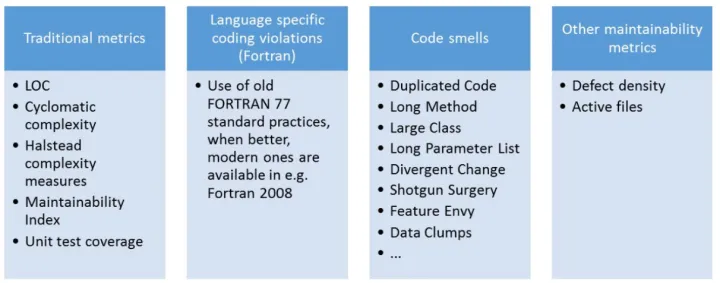

## 实现高可维护性的设计原则

软件设计的目标就是将系统划分成不同的**模块**，并在不同的模块之间分配规则：

- 模块内要**高内聚**
- 模块间要**低耦合**

模块化降低了程序员在任何时候必须处理的总复杂性

- **分离关注点**(Separation of concerns)，将功能分配给相似功能组合在一起的模块
- **信息隐藏**(Information hiding)，模块之间有小型、简单、定义良好的接口

### 评估模块化的五个标准·

- 可分解性(Decomposability)
  - 较大的组件是否替换为了较小的组件？
- 可组合性(Composability)
  - 较大的组件是由较小的组件组成的吗？
- 可理解性(Understandability)
  - 组件分开了吗？
- 可持续性(Continuity)
  - 组件发生**变化**后，影响范围足够小吗？
- 出现异常后的保护(Protection)
  - 运行时**异常**的影响是否仅限于少数相关的组件？

### 可分解性(Decomposability)

可分解性就是将问题分解为各个可独立解决的子问题，使模块之间的依赖关系显式化和最小化

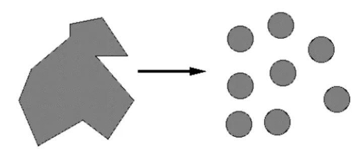

比如，**自顶向下**(top-down)的结构设计


### 可组合性(Composability)

可组合性就是模块可以很容易的组合起来形成新的系统，使模块可在不同的环境下复用

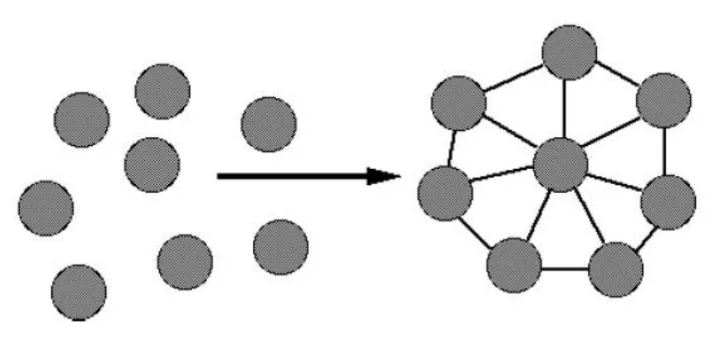

比如，数学计算库，`UNIX`命令、管道

### 可理解性(Understandability)

可理解性就是每个子模块都很容易理解

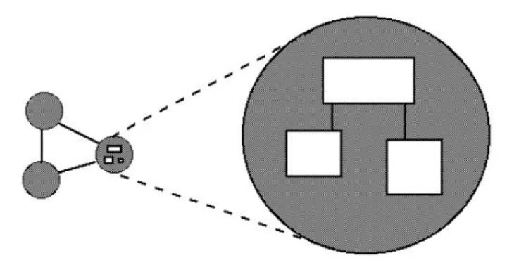

比如：`Unix`的`shell`命令`Program1 | Program2 | Program3`

### 可持续性(Continuity)

规约的变化只会影响一小部分模块而不会影响整个体系结构


### 异常保护(Protection)

运行时出现的不正常情况只会局限于小范围的模块内

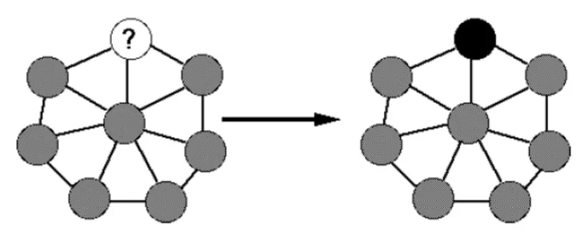

## 模块设计的五条原则

- 直接映射(Direct Mapping)
- 尽可能少的接口(Few Interfaces)
- 尽可能小的接口(Small Interfaces)
- 显式接口(Explicit Interfaces)
- 信息隐藏(Information Hiding)

### 直接映射(Direct Mapping)

即模块的结构与现实世界中问题领域的结构保持一致

对以下评价标准产生影响：

- Continuity
  - 更容易评估变化的影响
- Decomposability
  - 将现实问题模型中的分解作为软件模块的分解

### 尽可能少的接口(Few Interfaces)

模块应尽可能少的与其它模块通讯


对以下评价标准产生影响：

- Continuity
- Protection
- Understandability
- Composability

### 尽可能小的接口(Small Interfaces)

如果两个模块通讯，那么它们应交换尽可能少的信息


对以下评价标准产生影响：

- Continuity
- Protection

### 显式接口(Explicit Interfaces)

两个模块的通讯应该很明显

反例：

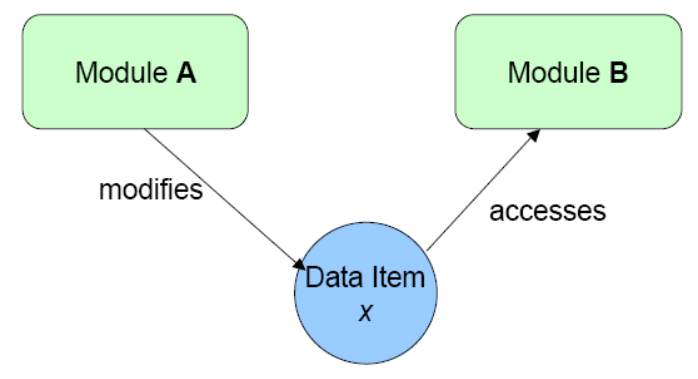

对以下评价标准产生影响：

- Decomposability
- Composability
- Continuity
- Understandability

### 信息隐藏(Information Hiding)

经常可能发生变化的设计决策应尽可能隐藏在抽象接口后面

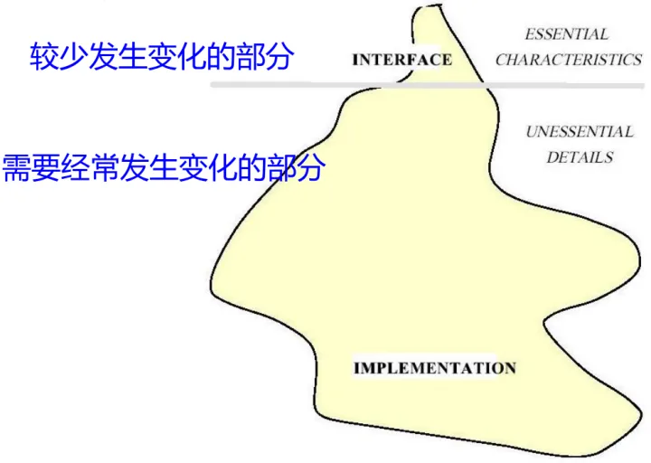

对以下评价标准产生影响：

- Continuity

## 耦合(Couping)与内聚(Cohesion)

### 什么是耦合？

**耦合**是模块之间**依赖关系**的度量。 如果一个模块的更改可能需要另一个模块的更改，则两个模块之间存在依赖关系。

两个模块直接的耦合由下面的参数决定：

- 模块接口的数量
- 每个模块接口的复杂度


### 举例：HTML, CSS, JavaScript 之间的耦合

一个好的的**网络应用**(web app)程序模块：

- **HTML** 文件：指定数据和语义
- **CSS** 规则：指定 HTML 的格式
- **JavaScript**：定义页面的行为和交互

如下图所示：

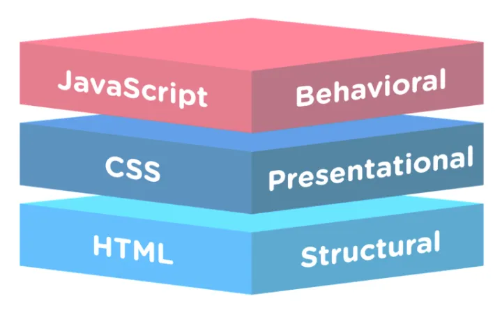

### 什么是内聚？

**内聚**衡量模块的功能之间的关联程度
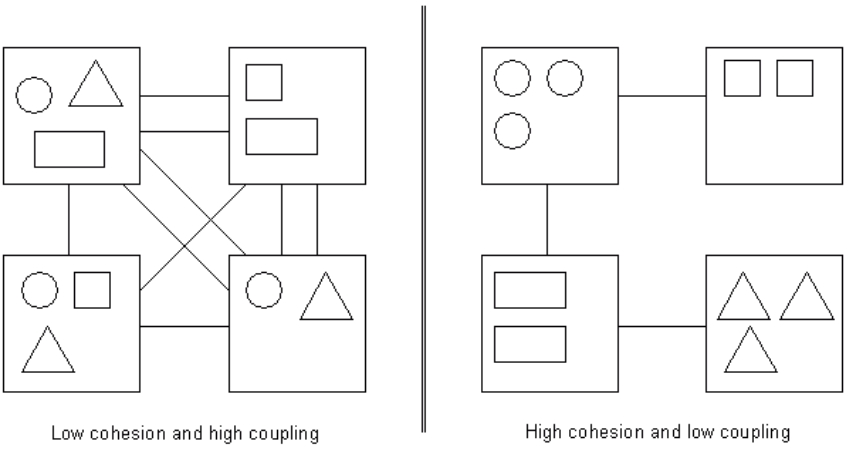

好的设计应该是高内聚低耦合的

## OO 设计原则：SOLD

SOLD 表示五个设计原则：

- 单一责任原则(The Single Responsibility Principle)
- 开放-封闭原则(The Open-Closed Principle)
- Liskov 替换原则(The Liskov Substitution Principle)
- 依赖转置原则(The Dependency Inversion Principle)
- 接口聚合原则(The Interface Segregation Principle)

接下来逐一说明

### 单一责任原则(SRP)

指 ADT 中不应该由多于 1 个原因使其发生变化，否则就拆分开

如果一个类包含了多个责任，那么将引起不良后果：

- 引入额外的包，占据资源
- 导致频繁的重新配置、部署

举例：

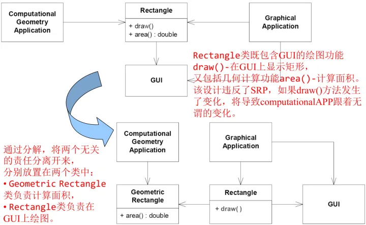

### 开放/封闭原则(OCP)

类应该对**扩展**开放

- 模块的行为应是可扩展的，从而该模块可表现出新的行为以满足需求的变化

但是应该对**修改**封闭

- 模块自身的代码不应该被修改
- 扩展模块行为的一般途径是修改模块的内部实现

解决这个问题的办法就是：**抽象**

举例：

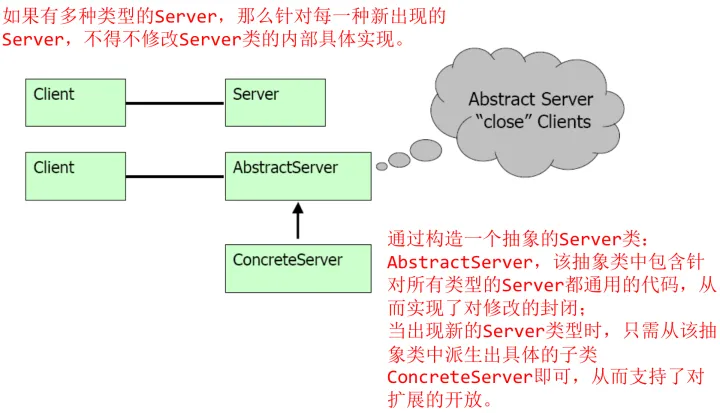

再比如，设计画不同图形的代码：

```java
// Open-Close Principle - Bad example
class GraphicEditor {
public void drawShape(Shape s) {
    if (s.m_type==1)
        drawRectangle(s);
    else if (s.m_type==2)
        drawCircle(s);
}
public void drawCircle(Circle r)
    {....}
public void drawRectangle(Rectangle r)
    {....}
}

class Shape {
    int m_type;
}
class Rectangle extends Shape {
	Rectangle() {
		super.m_type=1;
	}
}
class Circle extends Shape {
	Circle() {
		super.m_type=2;
	}
}
```

这样设计会有一大堆复杂的`if-else`，很难维护，后续想要画别的图案也很难修改

下面的设计就好了很多：

```java
// open-Close principle - Good example
class GraphicEditor {
    public void drawShape(Shape s) {
        s.draw();
    }
}
class Shape {
    abstract void draw();
}
class Rectangle extends Shape {
    public void draw(){
        // draw the rectangle
    }
}
```

### Liskov替换原则(LSP)

这个在前一讲中已经讲过了

https://zhuanlan.zhihu.com/p/524625004

### 接口隔离原则(ISP)

所谓接口隔离就是不能强迫客户端依赖于它们不需要的接口，只提供必需的接口

说白了，就是防止某个接口功能过多

- 将接口的功能分解，分解为多个小接口
- 每个小接口向不同的使用者提供服务
- 使用者只需要实现自己需要的接口

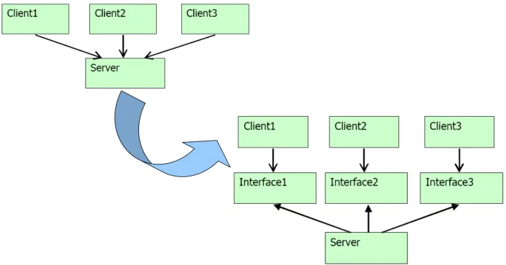

举例：

```java
//bad example (polluted interface)
interface Worker {
    void work();
    void eat();
}
ManWorker implements Worker {
    void work() {…};
    void eat() {…};
}
RobotWorker implements Worker {
    void work() {…};
    void eat() {//Not Appliciable for a RobotWorker};
}
```

这个接口就显得太大了，可以分解一下：

```java
interface Workable {
    public void work();
}
interface Feedable{
    public void eat();
}
ManWorker implements Workable, Feedable {
    void work() {…};
    void eat() {…};
}
RobotWorker implements Workable {
    void work() {…};
}
```

### 依赖转置原则(DIP)

- 高层模块不应该依赖于底层模块，二者都应该依赖于**抽象**
- 抽象不应该依赖于实现细节，实现细节应该依赖于抽象


举例，设计一个从某个位置读，然后写到某个位置的程序：

可以这样设计：

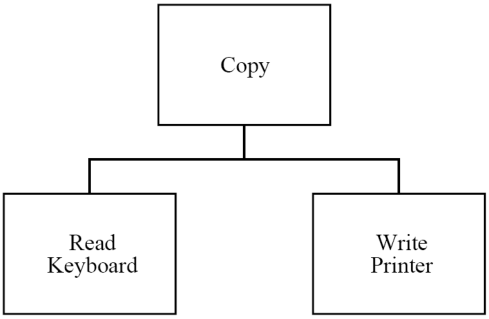

```java
void Copy(OutputStream dev) {
    int c;
    while ((c = ReadKeyboard()) != EOF)
    if (dev == printer)
        writeToPrinter(c);
    else
        writeToDisk(c);
}
```

这样的设计显然不符合要求，后续的扩展将会很麻烦

应该将**读**和**写**先分别抽象出来，再实现

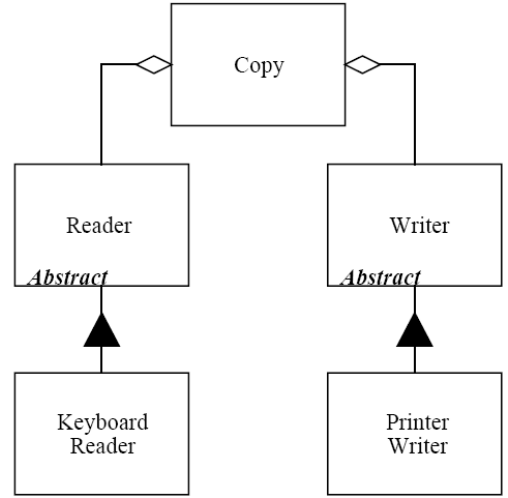

```java
interface Reader {
    public int read();
}
interface Writer {
    public int write(c);
}
class Copy {
    void Copy(Reader r, Writer w) {
    int c;
    while (c=r.read() != EOF)
        w.write(c);
    }
}
```

### 总结：OO设计的两大武器

**抽象**(abstraction)：模块之间通过抽象隔离开，将稳定部分和容易变化的部分分开

- LSP: 在外界看来，父类和子类是“一样”的
- DIP: 对**接口**编程，而不是对实现编程，通过抽象接口隔离变化
- OCP: 当需要变化时，通过**扩展**隐藏在接口之后的子类加以完成，而不要修改接口本身

分离(separation)：Keep It Simple, Stupid (KISS)

- SRP: 按责任将大类拆分为多选个小类，每个类完成单一职责，规避变化，提高复用度
- ISP: 将接口拆分为多个小接口，规避不必要的**耦合**

## 基于语法的构造技术

一些应用要从外部读取文本数据，然后在应用中做进一步处理，显然要考虑这些

- 文件有特定格式，程序需读取文件并从中抽取正确内容
- 从网络上传输过来的信息，遵循特定的协议
- 用户在命令行输入的指令，遵循特定的格式
- 内存中存储的字符串也有格式的需要

显然要为这些数据设计特定的**文法**(grammar)

根据文法，开发一个它的解析器，用于后续的解析

### 文法(grammar)

为了描述一串**符号**，无论它们是字节、字符还是从固定集合中提取的某种其他类型的符号，我们使用一种紧凑的表示，这种表示称为**语法**

例如，URL 的语法将指定 HTTP 协议中合法 URL 的字符串集

下面我们来描述**正则表达式**：

文法中特定的字符，我们称为**终止节点**(terminals)

例如，图中语法解析树的蓝色部分：

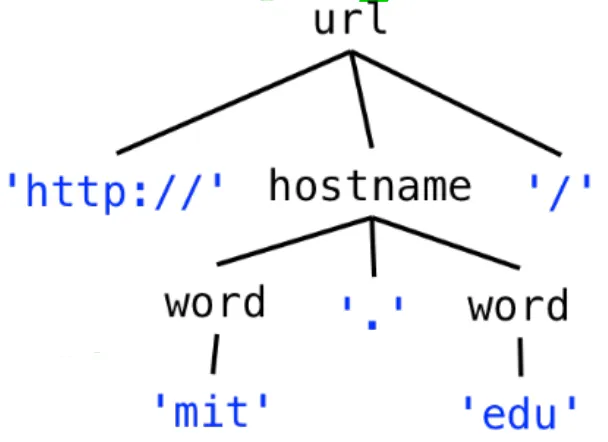

文法由**产生式**(productions)描述

利用操作符、终止节点、非终止节点，我们就能递归地构造出字符串

每一个产生式格式如下：

```java
nonterminal ::= expression of terminals, nonterminals, and operators
```

其中一个非终止结点将作为根节点，比如：

```java
url ::= 'http://' hostname '/'
hostname ::= 'mit.edu' | 'stanford.edu' | 'google.com'
```

`url`,`hostname`都是非终止节点，其中`url`为根节点

### 文法中的操作符

三种主要的：

- 连接(Concatenation), represented not by a symbol, but just a **space**: 
  - `x ::= y z`  x matches y followed by z
- 重复(Repetition), represented by `*`:
  - `x ::= y*`  x matches zero or more y
- 或(Union), also called alternation, represented by `|`:
  - `x ::= y | z`  x matches either y or z 

还有一些其他的：

- `x ::= y?`  an x is a y or is the empty string
- `x ::= y+`  an x is one or more y
- `x ::= [a-c]` is equivalent to `x ::= 'a' | 'b' | 'c'`
- `x ::= [^a-c]` is equivalent to `x ::= 'd' | 'e' | 'f' | ...`

### 解析树(Parse Tree)

比如，下面的文法：

```java
url ::= 'http://' hostname (':' port)? '/'
hostname ::= word '.' hostname | word '.' word
port ::= [0-9]+
word ::= [a-z]+
```

构造串`http://didit.csail.mit.edu:4949/`的解析树为：


树的叶子节点从左到右连接起来，就是最终的生成串

### 正则语言与正则表达式(regex)

正则语言：简化之后可以表达为一个产生式而不包含任何**非终止节点**

正则表达式中的一些特殊操作符

```java
.   // matches any single character (but sometimes excluding newline, depending on the regex library)

\d  // matches any digit, same as [0-9]
\s  // matches any whitespace character, including space, tab, newline
\w  // matches any word character including underscore, same as [a-zA-Z_0-9]
```

考虑如下正则表达式：

```java
[A-G]+(b|#)?
```

他就能表示如下字符串：

```java
Ab
C#
GFE
```

### Java 中的正则语法解析器

`java.util.regex`主要由三个类组成：

- `Pattern`对象是对正则表达式编译后得到的结果
- `Matcher`对象利用`Pattern`对输入字符串进行解析
- `PatternSyntaxException`是一个异常，它表示正则表达式中有语法错误

具体规则可见：

https://docs.oracle.com/javase/tutorial/essential/regex/index.html

这里讨论一下匹配模式：

| Greedy  | Reluctant | Possessive | Meaning                                 |
| ------- | --------- | ---------- | --------------------------------------- |
| X?      | X??       | X?+        | X, once or not at all                   |
| X*      | X*?       | X*+        | X, zero or more times                   |
| X+      | X+?       | X++        | X, one or more times                    |
| X{n}    | X{n}?     | X{n}+      | X, exactly n times                      |
| X{n, }  | X{n, }?   | X{n, }+    | X, at least n times                     |
| X{n, m} | X{n, m}?  | X{n, m}+   | X, at least n but not more than m times |

这三种匹配模式是完全不一样的：

- Greedy：匹配器强制要求第一次尝试匹配时读入整个输入串，如果第一次匹配失败，则从后往前逐个字符回退并尝试再次匹配，知道匹配成功或没有字符可以回退
- Reluctant：从输入串的首字符位置开始，再一次尝试匹配查找中指勉强地读一个字符，直到尝试读完整个字符串
- Possessive：直接匹配整个字符串，如果完全匹配就匹配成功，否则失败

**举例**：

正则语法：`.*foo`

输入字符串：`xfooxxxxxxfoo`

匹配结果：

- **Greedy**
  - I found the text "xfooxxxxxxfoo" starting at index 0 and ending at index 13.
- **Reluctant**
  - I found the text "xfoo" starting at index 0 and ending at index 4.
  - I found the text "xxxxxxfoo" starting at index 4 and ending at index 13.
- **Possessive**
  - No match found.

## 总结

本章面向软件的可维护性，从**可维护性的评价指标**开始，介绍了**实现高可维护性**的五个标准、**模块设计**的五条原则、以及**OO设计**的五大原则，并在讲解每一个原则时都附上了例子说明。最后，面对可扩展性，讲解了文法尤其是 Java 中正则语言解析器的使用

## 参考资料

- [函数复杂度检测和优化-学习](https://segmentfault.com/a/1190000039417685) 
